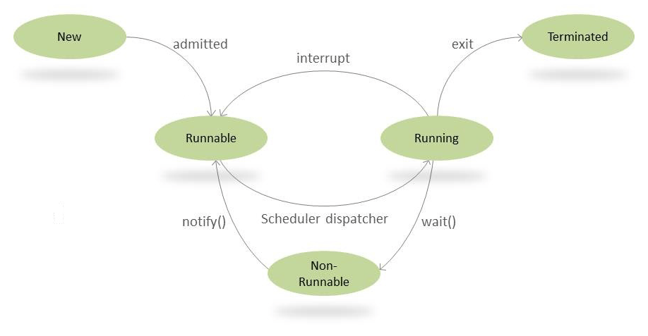

由于《Java并发编程实战》一书主要针对并发，反而对线程的基本操作和生命周期没有说明。这一篇文章中会列出Thread的基本操作，以及一些示例代码。

# wait() 和 notify() 方法

首先，这两个方法是做什么的：

- *Object.wait()* – 挂起一个线程
- *Object.notify() –* 唤醒一个线程

它们和生命周期的关联如下图：



wait()使当前线程阻塞，前提是 必须先获得锁，所以通常在synchronized 同步代码块里使用 wait()、notify/notifyAll() 方法。

当线程执行wait()方法时候，会释放当前的锁，然后让出CPU，进入等待状态。

当 notify/notifyAll() 被执行时候，才会唤醒一个或多个正处于等待状态的线程，然后继续往下执行，直到执行完synchronized 代码块的代码。如果中途遇到wait() ，将再次释放锁。也就是说，notify/notifyAll() 的执行只是唤醒沉睡的线程，而不会立即释放锁，锁的释放要看代码块的具体执行情况。所以在编程中，尽量在使用了notify/notifyAll() 后立即退出临界区，以唤醒其他线程 。

wait() 需要被try catch包围，中断也可以使wait等待的线程唤醒。

notify 和 notifyAll的区别 ： notify方法只唤醒一个等待（对象的）线程并使该线程开始执行。所以如果有多个线程等待一个对象，这个方法只会唤醒其中一个线程，选择哪个线程取决于操作系统对多线程管理的实现。notifyAll 会唤醒所有等待(对象的)线程，尽管哪一个线程将会第一个处理取决于操作系统的实现。如果当前情况下有多个线程需要被唤醒，推荐使用notifyAll 方法。

## 示例：发送者 - 接收者同步问题

假如有这样的需求：

- 发送者会向接收者发送数据包
- 在发送者完成发送之前，接收者无法处理数据包
- 同样，发送者不得尝试发送另一个数据包，直到接收者已处理完上一个数据包

创建一个Data类来实现这些数据包的操作

```java
public class Data {
    private String packet;
     
    // True if receiver should wait
    // False if sender should wait
    private boolean transfer = true;
  
    public synchronized void send(String packet) {
        while (!transfer) {
            try { 
                wait();
            } catch (InterruptedException e)  {
                Thread.currentThread().interrupt(); 
                Log.error("Thread interrupted", e); 
            }
        }
        transfer = false;
         
        this.packet = packet;
        notifyAll();
    }
  
    public synchronized String receive() {
        while (transfer) {
            try {
                wait();
            } catch (InterruptedException e)  {
                Thread.currentThread().interrupt(); 
                Log.error("Thread interrupted", e); 
            }
        }
        transfer = true;
 
        notifyAll();
        return packet;
    }
}
```


那么为什么要用while而不是if包住wait()？

因为这里的notifyAll()唤醒的是所有处于等待状态的线程，也就是说被唤醒的线程可能并不符合条件判断，所以应该用while循环再次进行判断，如果不满足将继续调用wait。

下面是Sender类和Receiver类，它们将对Data类进行同步操作：

Sender:

```java
public class Sender implements Runnable {
    private Data data;
  
    // standard constructors
  
    public void run() {
        String packets[] = {
          "First packet",
          "Second packet",
          "Third packet",
          "Fourth packet",
          "End"
        };
  
        for (String packet : packets) {
            data.send(packet);
 
            // Thread.sleep() to mimic heavy server-side processing
            try {
                Thread.sleep(ThreadLocalRandom.current().nextInt(1000, 5000));
            } catch (InterruptedException e)  {
                Thread.currentThread().interrupt(); 
                Log.error("Thread interrupted", e); 
            }
        }
    }
}

```

Receiver:

```java
public class Receiver implements Runnable {
    private Data load;
  
    // standard constructors
  
    public void run() {
        for(String receivedMessage = load.receive();
          !"End".equals(receivedMessage);
          receivedMessage = load.receive()) {
             
            System.out.println(receivedMessage);
 
            // ...
            try {
                Thread.sleep(ThreadLocalRandom.current().nextInt(1000, 5000));
            } catch (InterruptedException e) {
                Thread.currentThread().interrupt(); 
                Log.error("Thread interrupted", e); 
            }
        }
    }
}
```

写一个客户端程序来启动Sender和Receiver

```java
public static void main(String[] args) {
    Data data = new Data();
    Thread sender = new Thread(new Sender(data));
    Thread receiver = new Thread(new Receiver(data));
     
    sender.start();
    receiver.start();
}
-------------------------------------------------
输出：
First packet
Second packet
Third packet
Fourth packet
```

# wait()和Sleep()的区别

我们首先要知道该方法是属于Thread类中的。而wait()方法，则是属于Object类中的。

sleep()方法导致了程序暂停执行指定的时间，让出cpu该其他线程，但是他的监控状态依然保持着，当指定的时间到了又会自动恢复运行状态。也就是说，在调用sleep()方法的过程中，线程不会释放对象锁。

而当调用wait()方法的时候，线程会放弃对象锁，进入等待此对象的等待锁定池，只有针对此对象调用notify()方法后本线程才进入对象锁定池准备获取对象锁进入运行状态。

示例代码：

```java
public class Test {

    public static void main(String[] args) throws InterruptedException {
        
        //测试Wait会释放锁
        new Thread(new WaitTread()).start();
        Thread.sleep(1000);
        new Thread(new SleepThread()).start();

		//测试sleep不会释放锁
//        new Thread(new SleepThread()).start();
//        Thread.sleep(1000);
//        new Thread(new WaitTread()).start();

    }
}

class WaitTread implements Runnable {

    @Override
    public void run() {
        synchronized (Test.class) {
            System.out.println("进入WaitTread 当前时间 ： " + LocalTime.now());
            //调用wait()方法，线程会放弃对象锁，进入等待此对象的等待锁定池
            try {
                Test.class.wait(5000);
            } catch (InterruptedException e) {
                e.printStackTrace();
            }

            System.out.println("WaitTread结束了 当前时间 ： " + LocalTime.now());
        }
    }
}

class SleepThread implements Runnable {

    @Override
    public void run() {
        synchronized (Test.class) {
            System.out.println("进入SleepThread 当前时间 ： " + LocalTime.now());


            //在调用sleep()方法的过程中，线程不会释放对象锁。
            try {
                Thread.sleep(5000);
            } catch (InterruptedException e) {
                e.printStackTrace();
            }
            System.out.println("SleepThread结束了 当前时间 ： " + LocalTime.now());
        }
    }
}
```

上面的例子中，sleep和wait会分别暂停5秒，线程启动之间间隔1秒。

修改WaitTread和SleepThread的启动顺序，输出结果会截然不同：

```java
        //测试sleep不会释放锁
        new Thread(new SleepThread()).start();
        Thread.sleep(1000);
        new Thread(new WaitTread()).start();
-------------------------------------------------
输出
进入SleepThread 当前时间 ： 21:59:49.747
SleepThread结束了 当前时间 ： 21:59:54.747
进入WaitTread 当前时间 ： 21:59:54.748
WaitTread结束了 当前时间 ： 21:59:59.748
```

很显然，由于sleep不释放锁，所以直到sleep线程执行结束后wait线程才获取到锁。wait线程在被启动的4秒后才开始执行。

如果把调用顺序反过来会如何：

```java
        //测试wait会释放锁
        new Thread(new WaitTread()).start();
        Thread.sleep(1000);
        new Thread(new SleepThread()).start();
-------------------------------------------------
输出
进入WaitTread 当前时间 ： 21:53:56.563
进入SleepThread 当前时间 ： 21:53:57.492
SleepThread结束了 当前时间 ： 21:54:02.492
WaitTread结束了 当前时间 ： 21:54:02.493
```

在WaitTread调用wait()之后SleepThread获取到了锁，说明wait过程中会释放锁。值得注意的是，WaitTread从开始到结束花了整整6秒时间，而我们设置的wait的时限是5秒，是和SleepThread几乎同时结束的。原因也很简单，wait经过5秒后唤醒，此时该线程处于等待锁定池，而此时的锁还在sleep线程手中，因此直到sleep线程执行完毕释放锁之后，wait线程才能继续执行。


[Java多线程学习之wait、notify/notifyAll 详解](https://www.cnblogs.com/moongeek/p/7631447.html)

[java中的sleep()和wait()的区别](https://www.cnblogs.com/hongten/p/hongten_java_sleep_wait.html)

