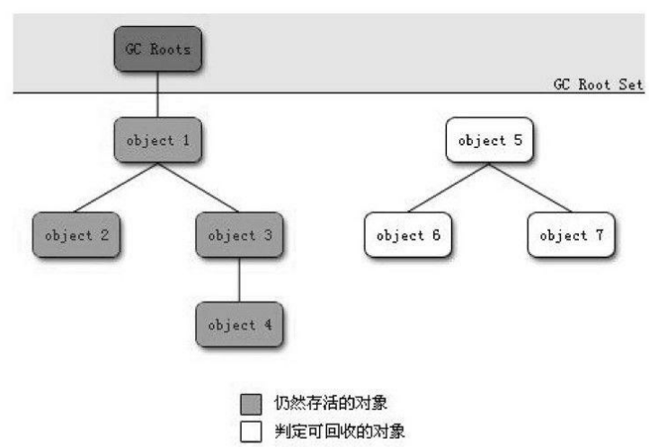

# 对象已死吗

怎样知道某个对象是活着还是死了（不会再被引用）

## 引用计数算法

> 给对象中添加一个引用计数器,每当有一个地方引用它时,计数器值就加1;当引用失效时,计数器值就减1;任何时刻计数器为0的对象就是不可能再被使用的。

很简单，但Java虚拟机里面没有选用引用计数算法来管理内存，主要的原因是它很难解决对象之间相互循环引用的问题。

```java
/**
 * 代码清单3-1引用计数算法的缺陷
 * <p>
 * testGC()方法执行后,objA和objB会不会被GC呢?
 */
public class ReferenceCountingGC {
    public Object instance = null;
    private static final int _1MB = 1024 * 1024;
    /**
     * 这个成员属性的唯一意义就是占点内存,以便能在GC日志中看清楚是否被回收过
     */
    private byte[] bigSize = new byte[2 * _1MB];

    public static void testGC() {
        ReferenceCountingGC objA = new ReferenceCountingGC();
        ReferenceCountingGC objB = new ReferenceCountingGC();
        objA.instance = objB;
        objB.instance = objA;
        objA = null;
        objB = null;
        //假设在这行发生GC,objA和objB是否能被回收?
        System.gc();
    }
}
```

从GC日志可以看出，虚拟机并没有因为这两个对象互相引用就不回收它们，也就说明虚拟机不是通过引用计数法来判
断对象是否存活的

## 可达性分析算法

Java、C#,Lisp，都是称通过`可达性分析`来判定对象是否存活的。

> 通过一系列的称为“GC Roots”的对象作为起始点,从这些节点开始向下搜索,搜索所走过的路径称为`引用链`,当一个对象到GC Roots没有任何引用链相连(用图论的话来说,就是从GC Roots到这个对象不可达)时,则证明此对象是不可用的。



可作为GC Roots的对象包括下面几种:

- 虚拟机栈(栈帧中的本地变量表)中引用的对象。
- 方法区中类静态属性引用的对象。
- 方法区中常量引用的对象。
- 本地方法栈中JNI(即一般说的Native方法)引用的对象。

## 再谈引用

JDK1.2以前:

> 如果reference类型的数据中存储的数值代表的是另外一块内存的起始地址,就称这块内存代表着一个引用。

现在的JDK：

> 当内存空间还足够时,则能保留在内存之中;如果内存空间在进行垃圾收集后还是非常紧张,则可以抛弃这些对象。
>
> 将引用分为`强引用`(Strong Reference)、`软引用`(Soft Reference)、`弱引用`(Weak Reference)、`虚引用`(Phantom Reference)4种,这4种引用强度依次逐渐减弱.

强软弱虚：

- **强引用**
  类似“Object obj=new Object()”这类的引用
  只要强引用还存在,垃圾收集器永远不会回收掉被引用的对象。

- **软引用**
  还有用但并非必需的对象。

  对于软引用关联着的对象,在系统将要发生内存溢出异常之前,将会把这些对象列进回收范围之中进行第二次回收。如果这次回收还没有足够的内存,才会抛出内存溢出异常。

  SoftReference类实现软引用

- **弱引用**
  强度比软引用更弱一些被弱引用关联的
  对象只能生存到下一次垃圾收集发生之前。当垃圾收集器工作时,无论当前内存是否足够,都会回收掉只被弱引用关联的对象。
  WeakReference类实现弱引用

- **虚引用**
  最弱的一种引用关系
  一个对象是否有虚引用的存在,完全不会对其生存时间构成影响,也无法通过虚引用来取得一个对象实例。

  为一个对象设置虚引用关联的唯一目的就是能在这个对象被收集器回收时收到一个系统通知

  PhantomReference类实现虚引用

## 生存还是死亡

即使在可达性分析算法中不可达的对象,也并非是“非死不可”的,这时候它们暂时处于“缓刑”阶段。

要真正宣告一个对象死亡,至少要经历两次标记过程。

1. 发现没有与GC Roots相连接的引用链,那它将会被第一次标记并且进行一次筛选,筛选的条件是此对象是否有必要执行finalize()方法。
   - 当对象没有覆盖finalize()方法,或者finalize()方法已经被虚拟机调用过,虚拟机将这两种情况都视为“没有必要执行”。
   - 如果有必要执行finalize()方法,那么这个对象将会放置在一个叫做`F-Queue`的队列之中，,并在稍后由一个由虚拟机自动建立的、低优先级的Finalizer线程去执行它。
     “执行”是指虚拟机会触发这个方法,但并不承诺会等待它运行结束。因为可能这个finalize()很耗时，或存在死循环
2. 如果对象要在finalize()中成功拯救自己——只要重新与引用链上的任何一个对象建立关联即可,譬如把自己(this关键字)赋值给某个类变量或者对象的成员变量,那在第二次标记时它将被移除出“即将回收”的集合。

```java
/**
 * 代码清单3-2
 * 一次对象自我拯救的演示
 * <p>
 * 此代码演示了两点:
 * 1.对象可以在被GC时自我拯救。
 * 2.这种自救的机会只有一次,因为一个对象的finalize()方法最多只会被系统自动调用一次
 *
 * @author zzm
 */
public class FinalizeEscapeGC {
    public static FinalizeEscapeGC SAVE_HOOK = null;

    public void isAlive() {
        System.out.println("yes,i am still alive:)");
    }

    @Override
    protected void finalize() throws Throwable {
        super.finalize();
        System.out.println("finalize mehtod executed!");
        FinalizeEscapeGC.SAVE_HOOK = this;
    }

    public static void main(String[] args) throws Throwable {
        SAVE_HOOK = new FinalizeEscapeGC();
        //对象第一次成功拯救自己
        SAVE_HOOK = null;
        System.gc();
        //因为finalize方法优先级很低,所以暂停0.5秒以等待它
        Thread.sleep(500);
        if (SAVE_HOOK != null) {
            SAVE_HOOK.isAlive();
        } else {
            System.out.println("no,i am dead:(");
        }
        //下面这段代码与上面的完全相同,但是这次自救却失败了
        SAVE_HOOK = null;
        System.gc();
        //因为finalize方法优先级很低,所以暂停0.5秒以等待它
        Thread.sleep(500);
        if (SAVE_HOOK != null) {
            SAVE_HOOK.isAlive();
        } else {
            System.out.println("no,i am dead:(");
        }
    }
}
------------------------------
输出
finalize mehtod executed!
yes,i am still alive:)
no,i am dead:(
```

任何一个对象的finalize()方法都只会被系统自动调用一次,如果对象面临下一次回收,它的finalize()方法不会被再次执行

**不推荐用这种finalize()的方式去拯救对象。运行代价高昂,不确定性大,无法保证各个对象的调用顺序。**

## 回收方法区

方法区(~~HotSpot虚拟机中的永久代~~）中进行垃圾收集的“性价比”一般比较低。

永久代的垃圾收集主要回收两部分内容:废弃常量和无用的类。

**废弃常量**

假如一个字符串“abc”已经进入了常量池中，没有任何String对象引用常量池中的“abc”常量,也没有其他地方引用了这个字面量,如果这时发生内存回收,而且必要的话,这个“abc”常量就会被系统清理出常量池。

常量池中的其他类(接口)、方法、字段的符号引用也与此类似。

**无用的类**

类需要同时满足下面3个条件才能算是“无用的类”:

- 该类所有的实例都已经被回收,也就是Java堆中不存在该类的任何实例。
- 加载该类的ClassLoader已经被回收。
- 该类对应的java.lang.Class对象没有在任何地方被引用,无法在任何地方通过反射访问该类的方法。

可以对满足上述3个条件的无用类进行回收,这里说的仅仅是**“可以”**,而并不是和对象一样,不使用了就必然会回收。

HotSpot虚拟机参数

- -Xnoclassgc： 是否对类进行回收
- -verbose:class ， -XX:+TraceClassLoading ，-XX:+TraceClassUnLoading ： 查看类加载和卸载信息

# 垃圾收集算法

## 标记-清除算法

算法分为“标记”和“清除”两个阶段

> 首先标记出所有需要回收的对象,在标记完成后统一回收所有被标记的对象。也就是之前说筛选的finalize()方法的方式。

缺点：

- 标记和清除两个过程的效率都不高
- 标记清除之后会产生大量不连续的内存碎片,空间碎片太多可能会导致以后在程序运行过程中需要分配较大对象时,无法找到足够的连续内存而不得不提前触发另一次垃圾收集动作。


## 复制算法

> 将可用内存按容量划分为大小相等的两块,每次只使用其中的一块。当这一块的内存用完了,就将还存活着
> 的对象复制到另外一块上面,然后再把已使用过的内存空间一次清理掉。

每次都是对整个半区进行内存回收,内存分配时也就不用考虑内存碎片等复杂情况,实现简单,运行高效。


98%是“朝生夕死”的,所以并不需要按照1:1的比例来划分内存空间,而是将内存分为一块较大的Eden空间和两块较小的Survivor空间,每次使用Eden和其中一块Survivor 。
当回收时,将Eden和Survivor中还存活着的对象一次性地复制到另外一块Survivor空间上,最后清理掉Eden和刚才用过的Survivor空间。也就是说一个Eden，两个Surviver空间。

HotSpot虚拟机默认Eden和Survivor的大小比例是8:1。当Survivor空间不够用时,需要依赖其他内存(这里指老年代)进行`分配担保`。

`分配担保`：另外一块Survivor空间没有足够空间存放上一次新生代收集下来的存活对象时,这些对象将直接通过分配担保机制进入老年代。就像去银行贷款，当你不能还款时，会从担保人的账户中扣款。

## 标记-整理算法

老年代对象存活率高、没有额外空间对它进行分配担保

根据老年代的特点,有人提出了另外一种“标记-整理”(Mark-Compact)算法

>  标记过程仍然与“标记-清除”算法一样。但后续步骤不是直接对可回收对象进行清理,而是让所有存活的对象都向一端移动,然后直接清理掉端边界以外的内存。


## 分代收集算法

当前商业虚拟机的垃圾收集都采用“分代收集”(Generational Collection)算法

> 根据对象存活周期的不同将内存划分为几块。
> 一般是把Java堆分为新生代和老年代,这样就可以根据各个年代的特点采用最适当的收集算法。
>
> - 新生代选用复制算法
> - 老年代使用“标记—清理”或者“标记—整理”算法

# HotSpot的算法实现

## 枚举根节点

枚举根节点时的问题：

- GC Roots的节点主要是方法区和本地变量表。如果要逐个检查这里面的引用,那么必然会消耗很多时间。

- 分析工作必须在一个能确保一致性的快照中进行，导致GC进行时枚举根节点的过程必须停顿所有Java执行线程。

**准确式GC**：当执行系统停顿下来后,并不需要一个不漏地检查完所有执行上下文和全局的引用位置,虚拟机应当是有办法直接得知哪些地方存放着对象引用，从而特定哪里存在GC Roots

> HotSpot的实现中,是使用一组称为OopMap的数据结构来达到这个目的的。
> 在类加载完成的时候,HotSpot就把对象内什么偏移量上是什么类型的数据计算出来,在JIT编译过程中,也会在特定的位置记录下栈和寄存器中哪些位置是引用。
> 这样,GC在扫描时就可以直接得知这些信息了。

## 安全点

在OopMap的协助下,HotSpot可以快速且准确地完成GC Roots枚举。

但问题在于：引用关系变化时OopMap也应该变换。此时如果为每一条指令都生成对应的OopMap,那将会需要大量的额外空间,这样GC的空间成本将会变得很高

HotSpot也的确没有为每条指令都生成OopMap,只是在“特定的位置”记录了这些信息（*每次对象引用发生变化时都会同一时间改每个安全点中维护的OopMap？*）,这些位置称为安全点(Safepoint),即程序执行时并非在所有地方都能停顿下来开始GC,只有在到达安全点时才能暂停。

被选为安全点的条件--“是否具有让程序长时间执行的特征”
 “长时间执行”的最明显特征就是指令序列复用,例如方法调用、循环跳转、异常跳转等,所以具有这些功能的指令才会产生Safepoint。

如何在GC发生时让所有线程都“跑”到最近的安全点上再停顿下来？

- 抢先式中断
  在GC发生时,首先把所有线程全部中断,如果发现有线程中断的地方不在安全点上,就恢复线程,让它“跑”到安全点上。
  几乎没有虚拟机采用这种
- **主动式中断**
  GC需要中断线程的时候,不直接对线程操作,仅仅简单地设置一个标志,各个线程执行时主动去轮询这个标志,发现中断标志为真时就自己中断挂起。
  轮询标志的地方和安全点是重合的

## 安全区域

程序“不执行”的时候，也就是说没有分配CPU时间的时候，如Sleep状态等。这时候线程无法响应JVM的中断请求,“走”到安全的地方去中断挂起。`安全区域`(Safe Region)来解决这个问题。

安全区域是指在一段代码片段之中,引用关系不会发生变化。在这个区域中的任意地方开始GC都是安全的。

在线程执行到Safe Region中的代码时,首先标识自己已经进入了Safe Region,那样,当在这段时间里JVM要发起GC时,就不用管标识自己为Safe Region状态的线程了。在线程要离开Safe Region时,它要检查系统是否已经完成了根节点枚举(或者是整个GC过程),如果完成了,那线程就继续执行,否则它就必须等待直到收到可以安全离开SafeRegion的信号为止。

*（？）这个跟线程中断挂起有什么关系*