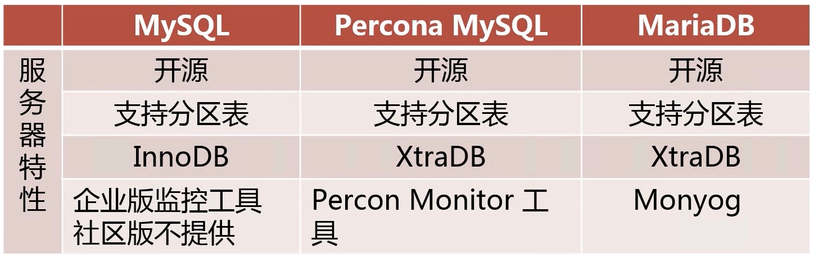
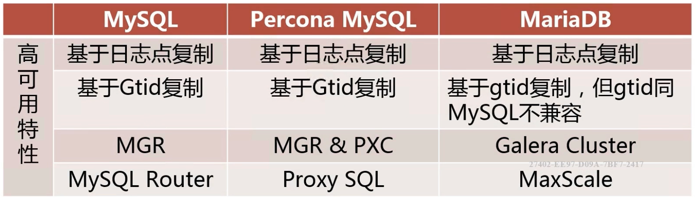
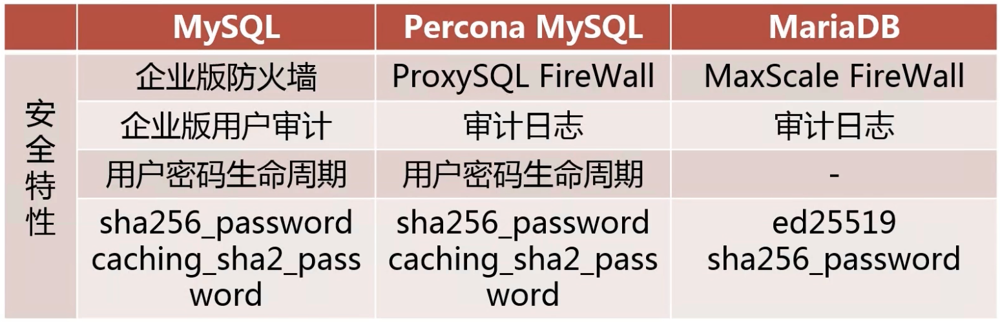
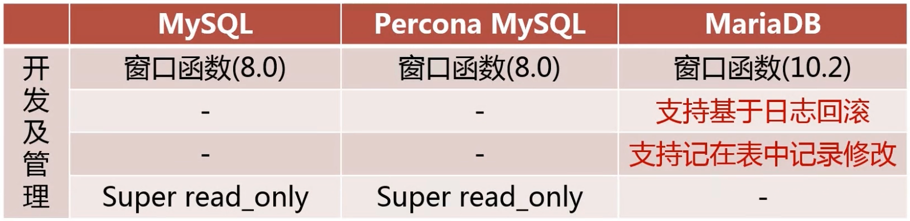

- 你之前工作中使用的是什么版本的MySQL？为什么选择这个版本？（是否了解MySQL的各个版本）
- 如何决定是够要对MySQL进行升级？如何进行升级？（是否有升级的经验）
- 最新的MySQL版本是什么？它有什么特性比较吸引你？ （对MySQL的关注度，学习能力）

# 为什么选择某一MySQL版本？

知识点

- MySQL常见的发行版
- 各个发行版本之间的区别以及优缺点

## MySQL常见的发行版

- MySQL官方版本： 社区版，企业版

- Percona MySQL
  - MySQL最初的开发者组成的社区
  - 对官方的社区版进行了优化，性能更优
  - 由于是二次开发，版本比官方的要落后
- MariaDB
  - MySQL创始人在被Oracle收购之后建立
  - 已5.5版本为基础开发迭代
  - 简单能从MySQL迁移到MariaDB

## 各个发行版之间的区别以及优缺点

- 都是开源，有各自的开源社区
- MySQL发行版本最新，Percona和Maria通常会晚2,3个月发布相应版本
- InnoDB不开源，其他两家使用Percona开发的XtraDB。性能相同
- 监控工具，其他两家的监控工具也能用于官方的

？？？

- 密码暴力破解。MySQL和Percona更加安全

- MariaDB原本就支持日志回滚
- 官方和Percona的read only能避免 失误操作

## 下面的问题如何回答？

MariaDB可以作为官方和Percona的从来使用，反过来则不行，因为MySQL迁移至MariaDB简单，反向则不行。

- 你之前工作中使用的是什么版本的MySQL？
  - 先问面试官现在公司用的是什么 
- 为什么选择这个版本
  - 把特点说一遍

# 如何对MySQL进行升级

知识点

- 对MySQL进行升级前要考虑什么
- MySQL升级的步骤

高版本的数据库可以作为低版本的数据库的从来使用，反过来则不行。 

## 在对MySQL进行升级前要考虑什么？

- 升级可以给业务带来的好处
  - 是否可以解决业务上某一方面的痛点。
    比如5.6升级到5.7时，5.7增强了多线程复制，减少延迟
    8之前的版本，Json类型二进制负值时是对Json整体进行复制。8支持只复制Json中被修改了的部分
  - 是否可以解决运维上某一方面的痛点
- 升级可能对业务带来的影响
  - 对原业务程序的支持是否有影响
    需要做成分的测试
  - 对原业务程序的性能是否有影响
- 数据库升级方案的定制
  - 
- 升级失败的回滚方法

### 

## 