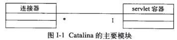

## Servlet容器是如何工作的？

对于每个请求，servlet容器会为其完成以下3个操作

- 创建一个`Request`对象，用可能会在`Servlet`中使用的信息填充该`Request`对象;如参数，头，cookie等。
- 创建一个调用`Servlet`的`response`对象，用来向WEB客户端发送响应；
- 调用`Servlet`的`service()`方法,将`Request`对象和`Response`对象作为参数传入。Servlet会从request中读取信息，并通过response发送响应信息。

>**复习Servlet的生命周期**
>
>- Servlet 通过调用 init () 方法进行初始化。
>- Servlet 调用 service() 方法来处理客户端的请求。
>- Servlet 通过调用 destroy() 方法终止（结束）。
>- 最后，Servlet 是由 JVM 的垃圾回收器进行垃圾回收的。

## Catalina

Catalina是最受欢迎的servlet容器之一。基于上章节说到的Servlet容器的3个任务，可以将Catalina划分为两个模块

- `连接器` :负责将请求和容器相关联，为每个接收到的HTTP请求创建一个`request`对象和一个`response`，然后将处理过程交给容器。
- `容器`：从连接器中接受到`request`和`response`对象，并调用相应的`Servlet`的`service()`方法。