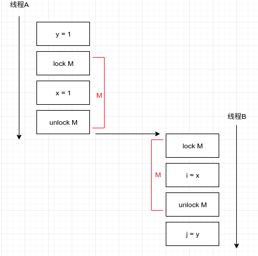

在上一章中介绍了如何通过同步来避免多个线程在同一时间访问相同数据，在这一章中将介绍如何共享和发布对象，从而能安全地被多个线程同时访问。

# 可见性

什么是`内存可见性`？可见性就是值一个线程修改了对象状态之后，其他线程能够看到发生的状态变化。然而，通常无法确定读操作的线程能适时地看见其他线程写入的值，所以需要同步。

:anguished: 在没有同步情况下的共享变量

```java
public class NoVisibility {
    private static boolean ready;
    private static int number;

    private static class ReaderThread extends Thread {
        public void run() {
            while (!ready)
                Thread.yield();
            System.out.println(number);
        }
    }

    public static void main(String[] args) {
        new ReaderThread().start();
        number = 42;
        ready = true;
    }
}
```

在上面的代码中，看起来会输出42，但很可能会输出0，甚至无法终止。因为无法保证main写入的值对于读线程来说是可见的。输出0的状况被称为`重排序`，可能在读程序眼中，number和ready的写入程序甚至可能是相反的。因为在没有同步的情况下，编译器等会对执行顺序进行调整。

## 失效数据

失效数据是指，当读线程去读某个数据的时候，可能读到的是一个已经过期的旧值。在糟糕的情况下，可能读到的两个值中，一个是新的值但另一个是过期的值。

:confused: 非线程安全的getter,setter

```java
@NotThreadSafe
public class MutableInteger {
    private int value;
    public int get() {return value;}
    public void set(int value) {this.value = value;}
}
```

上面程序中的getter，setter方法实际上就是线程不安全的。`get()`得到的很可能就是失效数据。

:blush: 修改后的getter,setter

```java
@ThreadSafe
public class SynchronizedInteger {
    @GuardedBy("this") private int value;
    public synchronized int get() {return value;}
    public synchronized void set(int value) {this.value = value;}
}
```

线程安全的getter,setter。值得注意的是`get()`方法也同样需要`synchronized`，否则仍会读到失效值。

## 非原子的64位操作

在多线程环境中，即使没有上面所述的失效的问题，64位的数（long，double）也是不安全的。因为JVM中允许把64位的读写操作分解成两个32位。必须用`volatile`来声明，或者用锁保护起来。

## 加锁与可见性

就如上面修改的getter，setter那样，内置锁可以确保之后的操作能看到当前执行结束后的结果。



图中线程B看到的绝对是线程A执行后的结果，所以是`可见的`。

> 加锁不仅限于互斥行为，还包括内存可见性，换句话说就是确保共享变量永远都是最新值。

## Volatile变量

`volatile`变量：Java提供的一种同步机制。把变量声明为volatile之后，编译器会注意到这个变量必须是共享的，并不会进行重排序。所以volatile变量一直是正确的新值。和上面的线程安全getter，setter程序在行为上是相同的，但不会进行加锁时的线程阻塞，所以更轻量级。

> 不建议使用volatile，比锁能脆弱，也能难理解。如果在验证正确性时需要对可见性进行复杂的判断，就不要使用。
>
> 使用场景：确保自身状态的可见性，标识一些事件。

下面是`volatile`的典型用法。相当于一个flag。这种情况下用锁就显得太复杂了。

```java
volatile boolean asleep;
...
    while(!asleep) count();
```

**加锁机制可以确保可见性和原子性，而volatile只能确保可见性。**像cnt++这种就不适合用volatile。

# 发布与溢出

- `发布`一个对象： 使对象能在当前作用域之外的代码中使用。比如，作为参数传出去，作为返回值传出去，赋值给公有的静态变量。
- `逸出`：当某个不该发布的对象被发布

发布一个对象

```java
class Secrets {
    public static Set<Secret> knownSecrets;
    public void initialize() {
        knownSecrets = new HashSet<Secret>();
    }
}
```

:anguished: 使内部的可变状态逸出

```java
class UnsafeStates {
    private String[] states = new String[]{
        "AK", "AL" /*...*/
    };
    
    public String[] getStates() {
        return states;
    }
}
```

上面的程序中`getStates()`把应该为私有的数组发布出去了。也就是逸出。任何调用者都可以修改states的内容。

:anguished: 隐式地使this引用逸出

```java
public class ThisEscape {
    public ThisEscape(EventSource source) {
        source.registerListener(new EventListener() {
            public void onEvent(Event e) {
                this.doSomething(e);
            }
        });
    }
}
```

当ThisEscape发布EvenListener时，就隐式的发布了ThisEscape实例本身，因为在这个内部类的示例中包含了对ThisEscape的this引用。

### 安全构造对象的过程

为什么说上面那种情况也算是逸出呢？因为当`EventListener`被`registerListener()`发布时，`ThisEscape`的构造方法还在执行的过程中，并没有返回。也就是说，此时`ThisEscape`并没有被构造完成，而他的this已在`EventListener`的内部类中被使用了，而被使用的this仍是不完整的。

在构造方法中通过（Runnable等）创建一个线程也是如此，this引用会被新创建的线程共享，而在构造函数返回之前，新建的线程就能看见它。构造本身是没错的，但不能立即启动，要在返回之后通过`start()`再去启动它。

:blush: 使用工厂方法来防止this引用在构造过程中逸出

```java
public class SafeListener {
    private final EventListener listener;

    private SafeListener() {
        listener = new EventListener() {
            public void onEvent(Event e) {
                doSomething(e);
            }
        };
    }

    public static SafeListener newInstance(EventSource source) {
        SafeListener safe = new SafeListener();
        source.registerListener(safe.listener);
        return safe;
    }
}

```

通过工厂方法，延迟`EventListener`的发布。

# 线程封闭

什么是线程封闭？也就是指在单线程中访问一个数据，不同步但线程安全。如JDBC，从连接池获取Connection对象，使用完再还回去,过程都是单线程。下面介绍三种线程封闭。

## Ad-hoc线程封闭

一种脆弱的线程封闭， 完全靠实现者控制的线程封闭，他的线程封闭完全靠实现者实现。

## 栈封闭

也就是指只有通过局部变量才能访问对象

```java
    public int loadTheArk(Collection<Animal> candidates) {
        SortedSet<Animal> animals;
        int numPairs = 0;
        Animal candidate = null;

        // animals confined to method, don't let them escape!
        animals = new TreeSet<Animal>(new SpeciesGenderComparator());
        animals.addAll(candidates);
        for (Animal a : animals) {
            if (candidate == null || !candidate.isPotentialMate(a))
                candidate = a;
            else {
                ark.load(new AnimalPair(candidate, a));
                ++numPairs;
                candidate = null;
            }
        }
        return numPairs;
    }
```

在上面的程序中，animals被封闭在方法中，其他线程无法访问。

## ThreadLocal类

大概是线程封闭的最规范的方法，这个类能使线程中的某个值与保存值的对象关联起来。它提供了get/set等方法,这些方法使每个使用该变量的线程都有一份独立的副本。换句话说，get的值是上次当前线程自己set的值。

`ThreadLocal`通常用于防止对可变的单例变量或全局变量进行共享。比如，把jdbc的连接保存到`ThreadLocal`对象中，每个线程都会拥有自己的连接。好处在于不用一直用参数去传递上下文信息，直接从全局的`ThreadLocal`中读取就行了。

```java
    private ThreadLocal<Connection> connectionHolder
            = new ThreadLocal<Connection>() {
                public Connection initialValue() {
                        return DriverManager.getConnection(DB_URL);
                    }
                };
            };
}
```

当某个线程初次调用`ThreadLocal.get（）`时，就会调用initialvalue来获取初始值，从概念上来讲就是`Map<Thread,T>`，但不同的是在这些线程结束时这些值会被作为垃圾回收。

[知乎：ThreadLocal和synchronized的区别?](https://www.zhihu.com/question/23089780)

# 不变性

也就是常量，既然不可改变，那么必然是线程安全的。要注意的是即使对象本身是final，它包含的属性不是final，那么它依然是会变的。

> 不变性条件：
>
> - 对象创建后状态就不能修改
> - 所有属性都是final
> - 对象是正确创建的（构造方法中没有this逸出）

# 安全发布

## 不正确的发布：正确的对象被破坏

```java
public class Holder {
    private int n;

    public Holder(int n) {this.n = n;}
    
    public void assertSanity() {
        if (n != n)
            throw new AssertionError("This statement is false.");
    }
}
```

在上面的代码中，除了进行发布的线程外，其他线程看到的Holder属性是一个失效值。也有可能Holder引用是最新的,但Holder状态的值是失效的。甚至第一次读取属性时得到失效值,再次读时是新值，因此会引发`AssertionError`。

## 不可变对象与初始化安全性

状态不可修改，所有属性都是final类型，正确的构造过程。满足这三点就能不需要额外的同步就能去访问。但如果final对象中包含了非final的属性，同样需要同步。

## 安全发布的常用模式

可以通过以下方式实现安全发布

- 在静态构造方法中初始化一个对象引用
- 将对象的引用保存到`volatile`或`Atomic`中
- 将对象的引用保存到能正确构造的final属性中。
- 将对象的引用保存到有锁保护的属性中。

通过线程安全库中的类进行完全发布

- 通过将一个键或值放入`Hashtable`，`synchronizedMap`或者`ConcurrentMap`中，可以安全地将它发布给任何从这些容器中访问它的线程（无论是直接访问还是迭代器访问） 

- 通过将某个元素放入`Vector`，`CopyOnWriteArrayList`，`CopyOnWriteArraySet`，`synchronizedList`或`synchronizedSet`中，可以将该元素安全地发布到任何从这些容器中访问该元素的线程 

- 通过将某个元素放入`BlockingQueue`或`ConcurrentLinkedQueue`，可以将该元素安全地发布到任何从这些容器中访问该元素的线程


## 事实不可变对象

`事实不可变对象`：从技术上来看是可变，但在程序中状态不会变。事实就是不可变对象。只需确保"发布时"的可见性

## 可变对象

必须正确发布,并且是线程安全,或者用锁保护。

> 发布的需求取决于可变性：
>
> - 不可变对象 ：可通过任意机制发布
>
> - 事实不可变对象：安全方式发布
> - 可变对象：通过安全方式发布，冰却必须是线程安全的或者有锁保护

## 安全地共享对象

正确使用共享对象的策略：

- `线程封闭`：线程封闭的对象只能由一个线程拥有，只能由这个线程修改（栈封闭，ThreadLocal）
- `只读共享`：不需要同步，可以由多个线程并发访问 （final，事实不可变对象）
- `线程安全共享`：在对象内部实现了同步机制，因此多个线程可以通过该对象提供的公用接口来访问 (工厂方法，volatile，Atomic)
- `保护对象`：只能通过特定的锁来访问对象。指在线程安全对象中的对象，或由锁来保护的已发布对象。
