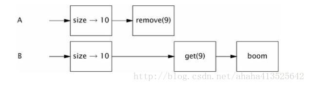
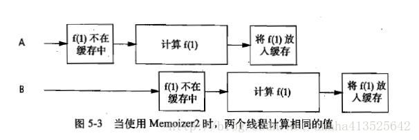
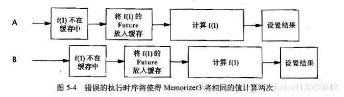

本章中讲介绍在Java5和6中引入的一些构建并发模块，以及如何用这些模块来进行开发。

# 同步容器类

同步容器类包括`Vector`和`Hashtable`、这些类实现线程安全的方式是：将它们的状态封装起来，并对每个公有方法都进行同步，使得每次只有一个线程能访问容器的状态。

## 同步容器类的问题

常见的复合操作包括：

- 迭代（反复访问元素，知道遍历容器中所有元素）
- 跳转（根据指定顺序找到当前元素的下个元素）
- 条件运算：例如“若没有则添加”。在同步容器类中，这些复合操作在没有客户端加锁的情况下仍然是线程安全的，但当其他线程并发地修改容器时，它们可能会表现出意料之外的行为。

:confused:

```java
//           5-1    Vector上可能导致混乱结果的复合操作
public static Object getLast(Vector list) {
    int lastIndex = list.size() - 1;
    return list.get(lastIndex);
}
public static void deleteLast(Vector list) {
     int lastIndex = list.size() - 1;
     list.remove(lastIndex);
}
```

上面是Vector中定义的两个方法，它们都会执行“先检查再运行”操作，每个方法首先都获得数组的大小，然后通过结果来获取或删除最后一个元素。

如果线程A在包含10个元素的Vector上调用`removeLast`，同时线程B调用`getLast`，这个时候就会出现下面的情况，并抛出`ArrayIndexOutOfBoundsException`。



:blush: 把上面的程序改成`客户端加锁`，通过list自身的锁来保护他，使`getLast`和`deleteLast`成为原子操作

```java
//              5-2    在使用客户端加锁的Vector上的复合操作
public static Object getLast(Vector list) {
        synchronized (list) {         //获得容器类的锁，从客户端得到
        int lastIndex = list.size() - 1;
        return list.get(lastIndex);
}
}
public static void deleteLast(Vector list) {
        synchronized (list) {
        int lastIndex = list.size() - 1;
        list.remove(lastIndex);
}
}
```

下面是带有客户端加锁的迭代的例子

```java
//        5-4    带有客户端加锁的迭代
synchronized (vector) {
    for (int i = 0; i < vector.size(); i++)
        doSomething(vector.get(i));
}
```

## 迭代器与`ConcurrentModificationException`

不管是foreach还是iterator，迭代器没有考虑到并发修改的问题，它们表现出的行为是**“及时失败（fail-fast）”**，这意味着当它们发现容器在迭代过程中被修改时，就会抛出一个`Concurrentmodificationexception`（并发修改异常）。从而起到一个警告的作用。

但许多场合我们都不希望像5-4那样通过上锁来保护迭代。因为迭代的时间可能会很长，会降低整体的吞吐量。如果不希望在迭代期间对容器加锁，一种替代方法就是**“克隆”容器，并在副本上进行迭代。** 

## 隐藏迭代器

在某些情况下，迭代器会隐藏起来。如下面的程序所示

:anguished:

```java
//       5-6   隐藏在字符串连接中的迭代操作（不要这么做）
public class HiddenIterator {
    @GuardedBy("this") private final Set<Integer> set = new HashSet<Integer>();

    public synchronized void add(Integer i) {
        set.add(i);
    }

    public synchronized void remove(Integer i) {
        set.remove(i);
    }

    public void addTenThings() {
        Random r = new Random();
        for (int i = 0; i < 10; i++)
            add(r.nextInt());
        System.out.println("DEBUG: added ten elements to " + set);//执行隐藏的迭代操作
    }
}
```

上面的代码中，那个部分存在隐藏迭代呢？`"DEBUG: added ten elements to " + set`的字符串拼接就是隐藏迭代。编译器将字符串的连接操作转换为调用`StringBuilder.append（Object）`，而这个方法又会调用容器的`toString`方法，标准容器的`toString`方法将迭代容器，并在每个元素上调用`toString`来生成容器内容的格式化表示。

之所以说是不安全的，是由于在调用`toString`的途中，list可能会发生变化，此时就会出现`ConcurrentModificationException`的异常了。所有有必要在`System.out.println()`时用锁保护。此外，容器类的`hashCode`和`equals`，以及`containsAll`，`removeAll`和`retainAll`等方法，以及把容器作为参数的构造函数，都会对容器进行迭代。

# 并发容器

Java5.0提供了多种并发容器来改进同步容器的性能。

之前的`同步容器`是将所有的容器状态的访问都串行化（各个任务按顺序执行，完成一个之后才能进行下一个），以实现它们的线程安全性。这种方法的代价是严重降低并发性，当多个线程竞争容器的锁时，吞吐量将严重减低。

相比之下`并发容器`是针对多个线程并发访问设计的。Java5.0中新增的有

- `ConcurrentHashMap`，代替`HashTable`，`synchronizedMap`。

- `CopyOnWriteArrayList`，用在遍历操作为主要操作的情况下代替`Vector`，`synchronizedList`。

- `Queue` : 也就是FIFO容器，通常用`LinkedList`实现。它另外提供了几种实现，包括 ：

  - `ConcurrentLinkedQueue` : 传统的先进先出队列 
  - `PriorityQueue` ：一个（非并发）优先队列 

- `BlockingQueue`: `Queue`的扩展。增加了可阻塞的插入和获取等操作。

  如果队列为空，那么获取元素的操作将一直阻塞，直到队列中出现一个可用的元素。 
  如果队列已满（对于有界队列），插入元素操作将阻塞，直到队列中出现可用的空间。 
  在“生产者-消费者”这种设计模式中，阻塞队列是十分有用的。

## ConcurrentHashMap

`HashMap`是基于散列的链表。当我们使用`HashMap.get`或`set`时，会通过散列值特定一个链表，并在该链表的许多元素上调用`equals`。当散列值的分布不均匀时，这种遍历调用`euqals`开销是很大的。如果是同步容器的`HashTable`，这段时间内而其他线程在期间不能访问该容器，会严重影响性能。

`ConcurrentHashMap`也是几个基于散列的Map，但它使用了一种完全不同的加锁策略来提供更高的并发性和伸缩性。这种机制被称为`分段锁`，一种粒度更细（finer-grained）的加锁机制。在这种机制中，任意数量的线程可以并发地访问Map，执行读取操作的线程和执行写入操作的线程可以并发地访问Map，并且一定数量的写入线程可以并发地修改Map。 因此并发访问环境下将实现更高的吞吐量。

另外，`ConcurrentHashMap`等并发容器提供的迭代器不会抛出`ConcurrentModificationException`，因此不需要在迭代过程中对容器加锁。实现原理是，让返回的迭代器具有`弱一致性`，而非`及时失败`。弱一致性的迭代器可以容忍并发的修改，当创建迭代器时会遍历已有额元素，并可以（但不保证）在迭代器被构造后将修改操作反映给容器。

考虑到并发环境下的使用，`ConcurrentHashMap`中的`size`，`isEmpty`返回的并不是精确值，只是一个估值。因为这个值在并发环境下很可能已经是过期的。但也因此提升了其他操作的性能，包括`get`，`put`，`containKey`和`remove`等。

在`ConcurrentHashMap`中没有实现对Map加锁以提供独占访问。

## 额外的原子Map操作

上一章中，我们了解了`Vector`的“若没有则添加”，而 `ConcurrentHashMap`本身就提供了“若没有则添加”，“若相等则移除”，“若相等则替换”等，能原子操作的接口：

```java
//       5-7    ConcurrentMap接口
public interface ConcurrentMap<K,V> extends Map<K,V> {
      // 仅当K没有相应的映射值时才插入
      V putIfAbsent(K key, V value);

     // 仅当K被映射到V时才移除
     boolean remove(K key, V value);

     // 仅当K被映射到oldValue时才替换为newValue
     boolean replace(K key, V oldValue, V newValue);

    // 仅当K被映射到某个值时才替换为newValue
    V replace(K key, V newValue);
}
```

## CopyOnWriteArrayList

`CopyOnWriteArrayList`用于替代同步List，在某些情况下它提供了更好的并发性能，并且在迭代期间不需要对容器进行加锁或复制（`CopyOnWriteArraySet`的作用是替代同步`Set`）。

**“写入时复制（Copy-On-Write）”**容器的线程安全性在于，只要正确发布一个**事实不可变**的对象，那么在访问该对象时就不再需要进一步的同步。 什么意思呢？换句话说，就是他在每次修改时，会创建并重新发布一个**新的容器副本**，从而实现可变性。 “写入时复刻”容器的迭代器保留一个指向底层基础数组的引用，这个数组当前位于迭代器的起始位置，由于它不会被修改，因此只需确保数组内容的可见性。

所以，多个线程可以同时这个容器进行迭代，而不会彼此干扰或与修改容器的线程互相干扰。也因此不会抛出`ConcurrentModificationException`。

这么做的缺点也很明显，每当修改容器时都会复制底层数组，这需要一定开销，特别是容器规模较大时。仅当迭代操作远远多于修改操作时，才应该使用“写入时复制”容器。

# 阻塞队列和生产者-消费者模式

阻塞队列提供了可阻塞的`put`和`take`方法，以及支持定时的`offer`和`poll`方法。如果队列已经满了，`put`方法将阻塞直到空间可用；如果队列为空，那么`take`方法将会阻塞直到有元素可用。队列可以有界也可以无界，无界队列put永远不会阻塞。阻塞队列还提供了一个offer方法，如果数据项不能被添加到队列中，那么将返回一个失败状态。

`BlockingQueue`中支持任意数量的生产者和消费者，常见的使用方法是线程池与工作队列的组合。

在类库中还包含了BlockingQueue的多种实现，其中： 

- `LinkedBlockingQueue` ：　FIFO。与LinkedList类似
- `ArrayBlockingQueue`：FIFO。与ArrayList类似

- `PriorityBlockingQueue` ： 一个按优先级排序的队列。想按照某种顺序而不是FIFO来处理元素时使用。
- `SynchronousQueue` ： 特殊，它并不是一个真正的队列，因为它不会为队列中元素维护存储空间。它维护的是一组线程，这些线程在等待着把元素加入或移出队列。 
  如果以洗盘子为比喻，就相当于没有盘架来暂时存放洗好的盘子，而是将洗好的盘子直接放入下一个空闲的烘干机中。这种实现队列由于可以**直接交付**工作，从而降低了将数据从生产者移动到消费者的延迟。
  因为`SynchronousQueue`没有存储功能，因此put和take会一直阻塞，知道有另一个线程已经准备好参与到交付过程中。仅当有足够的消费者，并且总是有一个消费者准备好获取交付的工作时，才适合使用同步队列。

## 示例：桌面搜索

下面来看一个用`BlockingQueue`实现的生产者-消费者问题的示例。假如我们有这样一个需求，扫描本地驱动上的文件并建立索引以便随后进行搜索。

下面的FileCrawler中给出了一个生产者任务，即在某个文件层次结构中搜索符合索引标准的文件，并将它们的名称放入工作队列。 其中的crawl扫描文件并将符合fileFilter条件的文件放入数组中。

```java
// 5-8 桌面搜索应用程序中的生产者任务
public class FileCrawler implements Runnable{
//mplement Runnable是面向接口，扩展性等方面比extends Thread好，因为java只能单继承，而可以实现多接口
    private final BlockingQueue<File> fileQueue; //省去初始化过程
    private final FileFilter fileFilter;
    private final File root;
    //... 
    @Override
    public void run() {        //重写run方法
        try{
            crawl(root);      
        }catch (InterruptedException e) { //如果队列满则阻塞
          // 恢复被中断的状态，终结被阻塞状态。 
            Thread.currentThread().interrupt(); 
        }

    }
    private void crawl(File root) throws InterruptedException{
        File[] entries=root.listFiles(fileFilter);  //列出符合过滤器的文件列表
        if(entries!=null){
            for(File entry:entries)
                if(entry.isDirectory())         //判断是否是文件夹，是则递归继续扫描
                    crawl(entry);
                else if (!alreadyIndexed(entry))    //判断是否已在队列中,这方法理解就好，这里没列出
                    fileQueue.put(entry);
        }
    }

}
```

Indexer中还给出了一个消费者任务，即从队列中取出文件名并对它们建立索引。

```java
//       5-8      桌面搜索应用中消费者任务
public class Indexer implements Runnable{
        private final BlockingQueue<File> queue;   //阻塞队列

        public Indexer(BlockingQueue<File> queue){   //获得阻塞队列
            this.queue=queue; 
        }

        public void run(){              //重写run方法
            try{
                while(true)            //一直循环，取出文件名并对它们建立索引，这里省去建立索引的函数
                   indexFile(queue.take());
            }catch(InterruptedException e){   //如果queue为空则阻塞
              // 恢复被中断的状态，终结被阻塞状态。 
                Thread.currentThread().interrupt();
            }
        }
}
```

客户端调用

```java
//              5-9    启动桌面搜索
 public static void startIndexing(File[] roots){
     BlockingQueue<File> queue=new LinkedBlockingQueue<File>(BOUND); //新建一个共享的队列
     FileFilter filter=new FileFilter() {     //创建一个文件过滤器        
         @Override
         public boolean accept(File pathname) {      
             return true;
         }
     }; 
     for(File root:roots)      //启动多个爬虫程序
         new Thread(new FileCrawler(queue,filter,root)).start();
     for(int i=0;i<N_CONSUMERS;i++)  //启动多个索引建立程序
         new Thread(new Indexer(queue)).start();
 }
```

上面的代码启动了多个爬虫程序和索引建立程序，每个程序都在各自的线程中运行。 但这个消费者线程永远不会退出，因而程序无法停止，这将在后面的课程解决这个问题。

## 串行线程封闭

生产者-消费者模式就是通过阻塞队列实现的串行线程封闭。线程封闭对象只能由单个线程拥有，但可以通过安全地发布该对象来“转移”所有权。在转移所有权后，也只有另一个线程能获得这个对象的访问权限，并且发布对象的线程不会再访问它。

对象池也是利用了串行线程封闭，将对象“租借”给一个请求线程。安全地发布池中的对象，并且只要客户代码本身不会发布池中的对象，或者在将对象返回给对象池后就不再使用它，那么就可以安全地在线程之间传递所有权。

## 双端队列与工作密取

Java6中新增的两种容器类型`Deque`和`BlockingDeque`，分别对`Queue`和`BlockingQueue`进行了扩展。`Deque`是一个双端队列，实现了在队列头和队列尾的高效插入和移除。具体实现包括`ArrayDeque`和`LinkedBlockingDeque`。

阻塞队列适用与生产者-消费者模式，而双端队列适用与**工作密取**。什么是工作密取？在生产者-消费者模式中，所有消费者有一个**共享的工作队列**，而在工作密取设计中，每个消费者都有**各自的双端队列**。如果一个消费者完成了自己双端队列中的全部工作，那么它可以从其他消费者双端队列末尾秘密地获取工作。

密取工作模式比传统的生产者-消费者模式具有更高的可伸缩性，这是因为工作者线程不会在单个共享的任务队列上发生竞争。因为在大多数情况下，它们都只是访问自己的双端队列。当工作者线程需要访问另一个队列时，它会从队列的尾部而不是头部获取工作，因此进一步降低了队列上的竞争程度。并且能确保每个线程都处于忙碌状态。

# 阻塞方法与中断方法

线程可能会阻塞或暂停执行，原因有多种：等待I/O操作结束，等待获得一个锁，等待从Thread.sleep方法中醒来，或是等待另一个线程的计算结果。

当线程阻塞时，它通常被挂起，并处于某个阻塞状态（BLOCKED,WAITING,或TIMED_WAITING）。被阻塞的线程必须等待某个不受它控制的事件发生后才能继续执行，例如等到I/O操作，等待某个锁变成可用，或者等待外部计算的结束。当某个外部事件发生时，线程被置回RUNNABLE状态，并可以再次被调度执行。

`BlockingQueue`的`put`和`take`等方法会抛出受检查异常`InterruptedException`。`InterruptedException`代表什么？如果某个方法会抛出`InterruptedException`，它是在告诉你，如果执行该方法的线程被中断，它将尝试停止它正在做的事情而提前返回，并通过抛出 `InterruptedException` 表明它提前返回。

`Thread`提供了`interrupt`方法，用于中断线程或者查询线程是否已经被中断，每个线程都有一个布尔类型的属性，表示线程的中断状态，当中断线程时将设置这个标志。什么是中断？中断并不是强制另一个线程停下来，只是请求它在适当的地方停下来，就如linux中的`kill`指令，和`kill 9`。

当像`BlockingQueue`的方法抛出了`InterruptedException`时，你就必须对中断做出响应。此时有两种策略：

- 传递`InterruptedException`。
- 恢复中断。当代码是`Runnable`的一部分时，肯定就不能继续抛异常了。必须捕获它，并且通过调用`interrupt`来恢复中断状态。这样在调用栈中更高层的代码将看到引发了一个中断。

在出现`InterruptedException`时不应该捕获它却不做出任何响应。这将使调用栈上更高层代码无法对中断采取处理措施，因为线程被中断的证据已经丢失。

# 同步工具类

同步工具类可以是任何一个对象，只要它根据自身的状态来协调线程的控制流。阻塞队列可以作为同步工具类，其他类型的同步工具类还包括`信号量`，`栅栏`，以及`闭锁`。

所有的同步工具类都包含一些特定的结构化属性：

- 一些状态，决定是继续执行还是等待。
- 对这些状态进行操作的方法
- 用于高效地等待同步工具类进入到预期状态的方法

## 闭锁

闭锁是一种同步工具类，可以延迟线程的进度直到其达到终止状态。什么意思呢？闭锁的作用相当于一扇门：在闭锁到达结束状态之前，这扇门一直是关闭的，并且没有任何线程能通过，当到达结束状态时，这扇门会打开并允许所有的线程通过。

闭锁用来确保一些活动直到其他活动都完成后继续执行。例如：

- 确保某个计算在其需要的所有资源都被初始化之后才继续执行。
- 确保某个服务在其依赖的所有其他服务都已经启动之后才启动。
- 等到直到某个操作的所有参与者（例如所有玩家）都就绪再继续执行。

`CountDownLatch`可以用于上面的各种情况。可以使一个或多个线程在等待一组事件发生。其中包含

- 计数器属性。该计数器被初始化为一个正数，表示需要等待的事件数量。 
- `countDown`方法。递减计数器，表示有一个事件已经发生了
- `await`方法。等待计数器达到零，这表示所有需要等待的事件都已经发生。

我们来看一下闭锁的两种常见用法。通过两个闭锁来测`nThreads`个线程执行任务的时间。

```java
//            5-11    在计时测试中使用CountDownLatch来启动和停止线程
public class TestHarness {
    public long timeTasks(int nThreads, final Runnable task)
            throws InterruptedException {
        //有两个闭锁
        final CountDownLatch startGate = new CountDownLatch(1);    //startGate计数器初始值为1     
        final CountDownLatch endGate = new CountDownLatch(nThreads); //endGate计数器初始值为工作线程的数量

        for (int i = 0; i < nThreads; i++) {
            Thread t = new Thread() { //创建一定数量的线程
                public void run() {
                    try {
                        startGate.await();//每个线程首先要做的就是在启动门上等待，从而确保所有线程都就绪后才开始执行，等待startGate值为0才能执行，之前一直阻塞
                        try {
                            task.run();  //允许任务
                        } finally {
                            endGate.countDown(); //每个线程要做的最后一件事就是讲调用结束门的countDown方法减1，这能使主线程高效地等到所有工作都执行完成，因此可以统计所消耗的时间
                        }
                    } catch (InterruptedException ignored) {
                    }
                }
            };
            t.start();
        }
        //计算执行任务的时间
        long start = System.nanoTime();
        startGate.countDown();  //countDown方法递减计数器，在这一条之后startGate才变为0，此时所有线程才开始跑
        // 在这一段一直停顿，直到完成所有，task.run();
        endGate.await();      //等待工作都执行完，endGate为0才能执行，之前一直阻塞
        long end = System.nanoTime();
        return end - start;
    }
}
```

在同一时刻开启多个线程，随后进行阻塞当前线程直到所有线程执行结束。

## Future Task

`FutureTask`也可以用作闭锁，本身就是异步执行。`FutureTask`是通过`Callable`来实现的，相当于一种可生成结果的`Runnable`。`FutureTask`是`Future`接口的一个唯一实现类。

可以处理以下3种状态：

- 等待状态（Waiting to run）
- 正在运行(Running)
- 运行完成(Completed)

当`FutureTask`进入完成状态后，它会永远停止在“执行完成”的状态上。这个状态有可能是正常结束，由于取消而结束和由于异常而结束等。

`Future.get`的行为取决于任务的状态，如果任务已经完成，那么get会立即返回结果，否则get将阻塞直到任务进入完成状态，然后返回结果或者抛出异常。`FutrueTask`会将计算结果从执行计算的线程传递到获取这个结果的线程。

常用的方式是在使用结果之前，提前进行调用，从而及时拿到异步调用返回的结果。

```java
//        5-12   使用FutureTask来提前加载稍后需要的数据
public class Preloader {
   //新建了一个FutureTask，其中包含从数据库加载产品信息的任务，以及一个执行运算的线程
    private final FutureTask<ProductInfo> future =
        new FutureTask<ProductInfo>(new Callable<ProductInfo>() {  //Callable表示的任务可以抛出受检查或未受检查的异常，并且任何代码都可能抛出一个Error
            public ProductInfo call() throws DataLoadException {  //Callable可能抛出受检查异常
                return loadProductInfo();
            }
        });
    private final Thread thread = new Thread(future);  //创建private，final线程

    public void start() { thread.start(); }//由于在构造函数或者静态初始化方法中启动线程并不是一种好方法，因此提供了start方法来启动线程

    public ProductInfo get()                     
            throws DataLoadException, InterruptedException {   //当线程需要ProductInfo时，调用get，如果数据已经加载，返回数据，否则将等待加载完成后再返回
        try {
            return future.get();
        } catch (ExecutionException e) { //当get方法抛出ExecutionException（执行异常），可能是下面三种情况之一：Callable抛出的受检查异常，RuntimeException以及Error。
            Throwable cause = e.getCause();
            //getCause来获得被封装的初始异常
            //在调用LaunderThrowable之前，Preloader会首先检查已知的受检查异常，并重新抛出它们。
            if (cause instanceof DataLoadException) 
                throw (DataLoadException) cause;
            else
                throw LaunderThrowable.launderThrowable(cause);
        }
    }
```

## 信号量

`计数信号量（Counting Semaphore）`是用来控制同时访问某个特定资源的操作数量，或者同时执行某个执行操作的数量。

Semaphore中管理着一组虚拟的许可（`permit`），许可的初始数量可通过构造函数来指定。在执行操作时可以首先获得许可（只要还有剩余的许可），并且使用以后释放许可。如果没有许可，那么`acquire`方法将阻塞直到有许可（或者直到被中断或请求超时）。`release`方法将返回一个许可给信号量。

Semaphore可以用于实现资源池，获取资源时使用`acquire`方法获取`permit`，使用完毕后用`release`释放`permit`。

另外，你还可以使用Semaphore将任何一种容器变成有界阻塞容器。 如下所示：

```java
//               5-14   使用Semaphore为容器设置边界
public class BoundedHashSet<T>{
       private final Set<T> set;
       private final Semaphore sem;
       public BoundedHashSet(int bound){
           this.set=Collections.synchronizedSet(new HashSet<T>());
           sem=new Semaphore(bound);  //创建一个信号量，大小为bound，信号量的计数值会初始化为容器容量的最大值
       }
       public boolean add(T o) throws InterruptedException{
           sem.acquire();       //获得许可
           boolean wasAdded=false;
           try{                     //因为已经抛出了异常，所以不用catch做处理
               wasAdded=set.add(o);
               return wasAdded;
           }
           finally{
               if(!wasAdded)
                   sem.release();       //如果没有添加任何元素，释放许可
           }
       }
       public boolean remove(Object o){
           boolean wasRemoved=set.remove(o);
           if(wasRemoved){
               sem.release();   //释放一个许可，使更多元素能添加到容器中
           }
           return wasRemoved;
       }

}
```

## 栅栏

之前介绍的闭锁是一次性对象，一旦进入终止状态，就不能被重置。

栅栏类似于闭锁，它能阻塞一组线程直到某个事件发生。 栅栏与闭锁的区别在于，所有线程必须同事到达栅栏位置，才能继续执行，另外，闭锁是一次性的，而栅栏可以反复使用。闭锁用于等待事件，而栅栏用于等待其他线程。栅栏用于实现一些协议，例如几个家庭决定在某个地方集合：“所有人6：00在麦当劳碰头，到了以后要等其他人，之后再讨论下一步做的事情”。

`CyclicBarrier`可以使一定数量的参与方反复地在栅栏位置汇集，它在并行迭代算法中非常有用：这种算法通常将一个问题拆分成一系列相互独立的子问题。当线程到达栅栏位置时将调用`await`方法，这个方法将阻塞直到所有线程都到达栅栏位置。如果所有线程都到达了栅栏位置，那么栅栏将打开，此时所有线程都将释放，而栅栏**将被重置**、以便下次使用。

- 如果对`await`的调用超时，或者`await`阻塞的线程被中断，那么栅栏就被认为是打破了，所有阻塞的`await`调用都将终止并抛出`BrokenBarrierException`。

- 如果成功地通过栅栏，那么`await`将为每个线程返回一个唯一的达到索引号，我们可以利用这些索引来“选举”产生一个领导线程，并在下一次迭代中由该领导线程执行一些特殊的工作。 

`CyclicBarrier`还可以使你将一个栅栏操作传递给构造函数，这是一个`Runnable`，当成功通过栅栏时会（在一个子任务线程中）执行它，但在阻塞线程被释放之前是不能执行的。

下面的程序中通过栅栏来计算细胞的自动化模拟。将问题分解成多个子问题，为每个子问题分配一个线程求解，之后再将所有的结果合并起来。

```java
//     5-15 通过CyclicBarrier协调细胞自动衍生系统中的计算
public class CellularAutomata {
      private final Board mainBoard;
      private final CyclicBarrier barrier;
      private final Worker[] workers;

      public CellularAutomata(Board board){  
          this.mainBoard=board; 
          int count=Runtime.getRuntime().availableProcessors(); //获得可用的处理器个数
          //有count数量的线程，并在线程全部到达栅栏处执行Runnable
          this.barrier=new CyclicBarrier(count,new Runnable(){
              public void run(){
                  mainBoard.commitNewValues(); 
              }
          });
          this.workers=new Worker[count];
          //
          for(int i=0;i<count;i++)       //将问题分为count个子问题
              workers[i]=new Worker(mainBoard.getSubBoard(count, i));
      }
      public class Worker implements Runnable{
          private final Board board;
          public Worker(Board board){
              this.board=board;
          }
          public void run(){         //工作线程为各自自问中的所有细胞计算新值
              while(!board.hasConverged()){  
                  for(int x =0;x<board.getMaxX();x++)
                      for(int y=0;y<board.getMaxY();y++)
                          board.setNewValue(x, y, computeValue(x,y));
                  try{
                      barrier.await();//等待所有工作线程都到达栅栏处
                  }catch (InterruptedException e) {
                    // TODO: handle exception
                      return ;
                }catch (BrokenBarrierException e) {
                    // TODO: handle exception
                    return ;
                }
              }
          }
          private int computeValue(int x, int y) {
              // 计算在 (x,y)中的新值
              return 0;
          }
      }
      public void start(){
          for(int i=0;i<workers.length;i++)
              new Thread(workers[i]).start(); //为每个子问题分配一个线程
          mainBoard.waitForConvergence();//进行下一步
      }
}
```

另一种形式的栅栏是`Exchanger`，它是一种两方（Two-Party）栅栏，各方在栅栏位置上交换数据。当两方执行不对称的操作时，`Exchanger`会非常有用，例如当一个线程向缓冲区写入数据，而另一个线程从缓冲区中读取数据。这些线程可以使用`Exchanger`来汇合，并将满的缓冲区与空的缓冲区交换。当两个线程通过Exchanger交换对象时，这种交换就把这两个对象安全地发布给另一方。🤔

🤔数据交换的时机取决与应用程序的响应需求 : 

- 最简单的方案:当缓冲区被填满时，由填充任务进行交换 。当缓冲区为空时，由清空任务进行交换。
  这样会把需要交换的次数降至最低。但如果新数据的到达率不可预测，那么一些数据的处理过程就将延迟。
- 另一个方法 : 不仅当缓冲被填满时进行交换，并且当缓冲被填充到一定程度并保持一定时间后，也进行交换。

# 构建高效且可伸缩的结果缓存

本节我们尝试开发一个高效且可伸缩的缓存，用于改进一个高计算开销的函数。我们首先从简单的HashMap开始，然后分析它的并发性缺陷，并讨论如何修复它们。

:confused:使用HashMap和同步机制

```java
//          5-16 使用HashMap和同步机制来初始化缓冲（并不好，需改进）
public class Memoizer1<A,V> implements Computable<A,V>{
    private final Map<A,V> cache=new HashMap<A,V>();
    private final Computable<A,V> c;

    public Memoizer1(Computable<A,V> c){
        this.c=c;
    }

    public synchronized V compute(A arg) throws InterruptedException{
        V result=cache.get(arg);     //得到缓存
        if(result==null){            //缓存为空，则缓存计算后的结果
            result=c.compute(arg);
            cache.put(arg, result);
        }
        return result;      //返回结果
    }

}

interface Computable<A,V>{         //输入类型为A,输出类型为V
    V compute(A rag) throws InterruptedException;
}

class ExpensiveFunction implements Computable<String,BigInteger>{
    public BigInteger compute(String arg){
        //在长时间的计算后
        return new BigInteger(arg);
    }
}
```

在上面的程序中，我们创建一个了Computable的包装器，使用HashMap来帮助记住之前的计算结果，并将缓存过程封装起来。

但这种情况下，可能会比没有缓存操作所花的时间还要长，因为这个缓存为了实现线程安全，把缓存操作都用`synchronized`锁了起来，可能会导致阻塞时间很长。


:confused: 利用ConcurrentHashMap代替HashMap来对上面的程序进行改进

```java
//        5-17    用ConcurrentHashMap替换HashMap（还是不好）
public class Memoizer2<A,V> implements Computable<A, V>{
    private final Map<A,V> cache=new ConcurrentHashMap<A,V>();
    private final Computable<A, V> c;   //创建接口实例
    public Memoizer2(Computable<A,V> c){
        this.c=c;
    }
    public V compute(A arg) throws InterruptedException{
        V result=cache.get(arg);
        if(result==null){
            result=c.compute(arg);
            result=cache.put(arg, result);
        }
        return result;
    }
}
```

由于使用的是ConcurrentHashMap，所以就不需要显示的进行同步，性能也比上面的程序更高。

但是仍存在漏洞，当两个线程同时调用compute时，可能会导致计算得到两个相同的值（而我们只需要缓存一个）。这就不满足缓存的设计理念了。 为什么会这样？因为如果某个线程启动了一个开销很大的计算，而其他线程并不知道这个计算正在计算，就会重复这个计算。



:confused: 用`ConcurrentHashMap<A,Future<V>>` 来代替原来的`ConcurrentHashMap<A,V>`

```java
//     5-18   基于FutureTask的Memoizing封装器（还不够好）
public class Memoizer3 <A, V> implements Computable<A, V> {
    private final Map<A, Future<V>> cache
            = new ConcurrentHashMap<A, Future<V>>();
    private final Computable<A, V> c;

    public Memoizer3(Computable<A, V> c) {
        this.c = c;
    }

    public V compute(final A arg) throws InterruptedException { 
        Future<V> f = cache.get(arg);
        if (f == null) {
            Callable<V> eval = new Callable<V>() {
                public V call() throws InterruptedException {
                    return c.compute(arg);
                }
            };
            FutureTask<V> ft = new FutureTask<V>(eval);
            f = ft;
            cache.put(arg, ft);//注册到Map中
            ft.run(); // 调用call启动计算
        }
        try {
            return f.get();  //若结果已经计算出来，那么将立刻返回。如果其他线程正在计算该结果，那么信道的线程将一直等待这个结果被计算出来。
        } catch (ExecutionException e) {//当get方法抛出ExecutionException（执行异常）及Error。
            throw LaunderThrowable.launderThrowable(e.getCause());//e.getCasue获得被封装的初始异常
        }
    }
}
```

之前的程序中都是首先判断计算是否已完成，而上面的程序是判断计算是否已开始。若结果已经计算出来，那么将立刻返回。如果其他线程正在计算该结果，那么信道的线程将一直等待这个结果被计算出来。

但仍然存在两个线程计算出相同值的漏洞，这个概率比Memoizer2要小。原因在于conpute方法中的if代码块是非原子的的“先检查在执行”操作，因此仍有可能在同一时间调用compute来计算相同的值。




:blush: 最终实现。使用ConcurrentMap中的原子方法putIfAbsent，来避免Memoizer3的漏洞。

```java
//          5-19       最终实现
public class Memoizer <A, V> implements Computable<A, V> {//继承Computable，其中有compute方法
    private final ConcurrentMap<A, Future<V>> cache
            = new ConcurrentHashMap<A, Future<V>>();
    private final Computable<A, V> c;

    public Memoizer(Computable<A, V> c) {
        this.c = c;
    }

    public V compute(final A arg) throws InterruptedException {//尽量将域声明为final类型，除非需要它们是可变的。不可变对象一定是线程安全的。
        while (true) {      //一直操作直到被停止
            Future<V> f = cache.get(arg);
            if (f == null) {
                Callable<V> eval = new Callable<V>() {
                    public V call() throws InterruptedException {
                        return c.compute(arg);
                    }
                };
                FutureTask<V> ft = new FutureTask<V>(eval);
                //putIfAbsent操作：仅当K没有相应的映射值时才插入，absent（不在场的）
                f = cache.putIfAbsent(arg, ft);//底层的Map中的put是复合操作（“若没有则添加”），属于非原子性的“先检查再执行”操作
                /*putIfAbsent相当于
                 * if (!map.containsKey(key))
                      return map.put(key, value);
                   else
                       return map.get(key);
                 */
                if (f == null) { //所以要对f进行判断
                    f = ft;
                    ft.run();
                }
            }
            try {
                return f.get();//若结果已经计算出来，那么将立刻返回。如果其他线程正在计算该结果，那么信道的线程将一直等待这个结果被计算出来。
            } catch (CancellationException e) {
                cache.remove(arg, f);  //如果发现计算被取消或失败，将Future从缓存中移出
            } catch (ExecutionException e) {
            //getCause来获得被封装的初始异常
                throw LaunderThrowable.launderThrowable(e.getCause());
            }
        }
    }
}
```

值得注意的是，当缓存的是Future而不是值时，将导致缓存污染（Cache Pollution）问题：如果某个计算被取消或失败，那么future在计算这个结果时将指明计算过程被取消或失败。为了避免这种情况，如果Memoizer发现计算被取消，那么将Future从缓存中移除。如果检查到`RuntimeException`，也会移除Future，这样将来的计算才可能成功。

# Reference

[Java并发编程实战](https://book.douban.com/subject/10484692/)

[源代码](http://jcip.net/listings.html)

[Java并发编程实战（学习笔记四 第五章 基础构建模块 上）](https://blog.csdn.net/ahaha413525642/article/details/76683937)

[Java并发编程实战（学习笔记四 第五章 基础构建模块 下）](https://blog.csdn.net/ahaha413525642/article/details/76709483)

