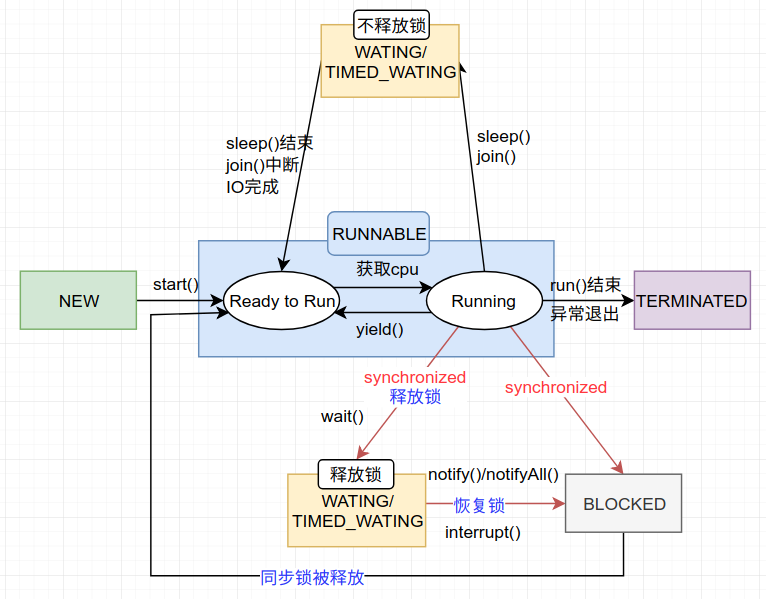

> [🍕 并发操作合集系列 源代码](https://github.com/nnkwrik/learn-java-concurrency)

这是一个关于并发的系列。以实战为驱动，了解并发编程中的那些骚操作。文中的示例代码都是从网上找来的，如果你对并发编程还不了解，希望你能和我一样敲一敲示例中的代码。如果你对并发操作足够熟悉，也可以把这个系列当做一本工具书，想不起来的时候来看一看，顺便star一下GitHub也是可以的。

对于并发，我目前也在摸索的过程中，写这个系列的目的主要是为了巩固知识。如果有不对的地方还望指正！

# 线程的生命周期

下图是Java中线程的生命周期，以及切换状态的常用方法。java.lang.Thread类包含的状态枚举定义了这6个状态。



不管在任何时候，线程会是以下状态的其中一个：

- **New**（新建状态)
  当线程对象对创建后，即进入了新建状态，如：Thread t = new MyThread();
- **Runnable**（可运行状态)
  可运行状态中分为就绪状态和运行状态。
  - 就绪（Ready to Run）
    当调用线程对象的start()方法（t.start();），线程即进入已就绪的状态。处于此状态的线程，只是说明此线程已经做好了准备，随时等待CPU调度执行，并不是说执行了t.start()此线程立即就会执行；

  - 运行（Running）
    当CPU开始调度处于就绪的线程时，此时线程才得以真正执行，即进入到此状态。注意，就绪状态是进入到运行状态的唯一入口，也就是说，线程要想进入运行状态执行，首先必须处于就绪状态中；
- **Wating** / **Timed Wating**（等待状态 / 限时等待状态）
  等待状态分为释放锁的等待和不释放锁的等待。
  - 释放锁
    运行状态中的线程执行wait()方法和join()方法，使线程进入到此状态。过程会释放锁
  - 不释放锁
     通过调用线程的sleep()方法，使线程进入到此状态。过程不会释放锁。
- **Blocked**（阻塞状态）
  阻塞状态是指在对象的等待锁定池中，等待该对象的锁时的状态。当一个对象尝试访问synchronized块时会处于此状态。
- **Terminated**（终止状态）
  线程执行完了或者因异常退出了run()方法，该线程结束生命周期。

下面通过代码来模拟这些状态

## New

可以用start()方法去启动一个状态为NEW的线程

```java
Runnable runnable = new NewState();
Thread t = new Thread(runnable);
Log.info(t.getState());	//输出 NEW
```

## Runnable

当我们对一个状态为NEW的线程调用start()方法，他就会变成RUNNABLE状态。在这个状态中，运行中或已经处于已做好准备，一旦获得资源就能运行。

在多线程环境中，线程调度器为每个线程分配固定的时间。所以一个处于RUNNABLE状态的线程很可能只会持续运行一小会，之后调度器会把资源分配给别的处于RUNNABLE状态的线程。

```java
Runnable runnable = new NewState();
Thread t = new Thread(runnable);
t.start();
Log.info(t.getState());//输出 RUNNABLE，但也可能不是
```

上面程序中，如果创建的线程t立即被调度并且运行结束，那么t.getState()就不会输出RUNNABLE而是TERMINATED。

## Blocked

当一个线程处于BLOCKED状态时，表示他当前没有锁所以无法执行需要同步的代码块。这个状态会持续直到线程获取到对象的锁。

我们来模拟这个过程

```java
public class BlockedState {
    public static void main(String[] args) throws InterruptedException {
        Thread t1 = new Thread(new DemoThreadB());
        Thread t2 = new Thread(new DemoThreadB());
         
        t1.start();
        t2.start();
         
        Thread.sleep(1000);
         
        Log.info(t2.getState()); //BLOCKED
        System.exit(0);
    }
}
 
class DemoThreadB implements Runnable {
    @Override
    public void run() {
        commonResource();
    }
     
    public static synchronized void commonResource() {
        while(true) {
			//写一个死循环
            //此时t1不会返回，t2因为没锁所以必须等待，因此t2处于BLOCKED状态
        }
    }
}
```

## Waiting

在WAITING状态中的线程会等待另外的某些线程执行特定操作，如notify()。过程没有时限。有三种方法能让线程变成WAITING状态：

1. *object.wait()*
2. *thread.join()* 
3. *LockSupport.park()*

让线程变成WAITING状态状态的示例程序：

```java
public class WaitingState implements Runnable {
    public static Thread t1;
 
    public static void main(String[] args) {
        t1 = new Thread(new WaitingState());
        t1.start();
    }
 
    public void run() {
        Thread t2 = new Thread(new DemoThreadWS());
        t2.start();
 
        try {
            t2.join();	//等t2线程执行完再继续执行当前线程
        } catch (InterruptedException e) {
            Thread.currentThread().interrupt();
            Log.error("Thread interrupted", e);
        }
    }
}
 
class DemoThreadWS implements Runnable {
    public void run() {
        try {
            Thread.sleep(1000);
        } catch (InterruptedException e) {
            Thread.currentThread().interrupt();
            Log.error("Thread interrupted", e);
        }
         
        Log.info(WaitingState.t1.getState());	//t1此时在等待当前线程执行完毕，所以这里输出WAITING
    }
}
```

## Timed Waiting

Timed Waiting状态中，待另外的某些线程在指定时间内执行特定操作，如notify()。下面的方法可以让一个线程成为Timed Waiting状态:

1. *thread.sleep(long millis)*
2. *wait(int timeout)* or *wait(int timeout, int nanos)*
3. *thread.join(long* millis*)*
4. *LockSupport.parkNanos*
5. *LockSupport.parkUntil*

示例程序：

```java
public class TimedWaitingState {
    public static void main(String[] args) throws InterruptedException {
        DemoThread obj1 = new DemoThread();
        Thread t1 = new Thread(obj1);
        t1.start();
         
        // The following sleep will give enough time for ThreadScheduler
        // to start processing of thread t1
        Thread.sleep(1000);
        Log.info(t1.getState());	//此时t1在等待5秒过去，所以这里输出TIMED_WAITING
    }
}
 
class DemoThread implements Runnable {
    @Override
    public void run() {
        try {
            Thread.sleep(5000);		//等待5秒
        } catch (InterruptedException e) {
            Thread.currentThread().interrupt();
            Log.error("Thread interrupted", e);
        }
    }
}
```

## Terminated

当一个线程执行完毕时，他会变为TERMINATED状态。

示例程序：

```java
ublic class TerminatedState implements Runnable {
    public static void main(String[] args) throws InterruptedException {
        Thread t1 = new Thread(new TerminatedState());
        t1.start();
        // 等1秒钟，让线程调度器能调度t1
        Thread.sleep(1000);
        Log.info(t1.getState());	//TERMINATED
    }
     
    @Override
    public void run() {
        // 什么都不做
    }
}
```

# Reference

[Life Cycle of a Thread in Java](http://www.baeldung.com/java-thread-lifecycle)

[线程的生命周期及五种基本状态](https://blog.csdn.net/houbin0912/article/details/77969563)