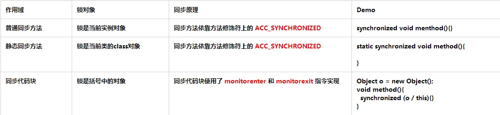

> 🍤 [并发操作合集系列 目录]()
>
> 🍕 [并发操作合集系列 源代码](https://github.com/nnkwrik/learn-java-concurrency)

这篇文章将告诉你如何正确的使用*synchronized*关键字。通过示例代码彻底了解*synchronized*关键字的使用规则和一些隐患。

## 1.Java的锁

## 1.1 锁的内存语义

- 锁可以让临界区互斥执行，还可以让释放锁的线程向同一个锁的线程发送消息
- 锁的释放要遵循Happens-before原则（`锁规则：解锁必然发生在随后的加锁之前`）
- 锁在Java中的具体表现是 `Synchronized` 和 `Lock`

## 2.Synchronized的综述

- **同步机制：** synchronized是Java同步机制的一种实现，即互斥锁机制，它所获得的锁叫做互斥锁
- **互斥锁：** 指的是每个对象的锁一次只能分配给一个线程，同一时间只能由一个线程占用
- **作用：** synchronized用于保证同一时刻只能由一个线程进入到临界区，同时保证共享变量的可见性、原子性和有序性
- **使用：** 当一个线程试图访问同步代码方法(块)时，它首先必须得到锁，退出或抛出异常时必须释放锁

## 3.Synchronized的使用

## 3.1 Synchronized的三种应用方式



> **补充：** 使用同步代码块的好处在于其他线程仍可以访问非synchronized(this)的同步代码块

## 3.2 Synchronized的使用规则

```java
/**
  * 先定义一个测试模板类
  *     这里补充一个知识点：Thread.sleep(long)不会释放锁
  *     读者可参见笔者的`并发番@Thread一文通`
  */ 
public class SynchronizedDemo {
    public static synchronized void staticMethod(){
        System.out.println(Thread.currentThread().getName() + "访问了静态同步方法staticMethod");
        try {
            Thread.sleep(1000);
        } catch (InterruptedException e) {
            e.printStackTrace();
        }
        System.out.println(Thread.currentThread().getName() + "结束访问静态同步方法staticMethod");
    }
    public static void staticMethod2(){
        System.out.println(Thread.currentThread().getName() + "访问了静态同步方法staticMethod2");
        synchronized (SynchronizedDemo.class){
            System.out.println(Thread.currentThread().getName() + "在staticMethod2方法中获取了SynchronizedDemo.class");
            try {
                Thread.sleep(1000);
            } catch (InterruptedException e) {
                e.printStackTrace();
            }
        }
    }
    public synchronized void synMethod(){
        System.out.println(Thread.currentThread().getName() + "访问了同步方法synMethod");
        try {
            Thread.sleep(1000);
        } catch (InterruptedException e) {
            e.printStackTrace();
        }
        System.out.println(Thread.currentThread().getName() + "结束访问同步方法synMethod");
    }
    public synchronized void synMethod2(){
        System.out.println(Thread.currentThread().getName() + "访问了同步方法synMethod2");
        try {
            Thread.sleep(1000);
        } catch (InterruptedException e) {
            e.printStackTrace();
        }
        System.out.println(Thread.currentThread().getName() + "结束访问同步方法synMethod2");
    }
    public void method(){
        System.out.println(Thread.currentThread().getName() + "访问了普通方法method");
        try {
            Thread.sleep(1000);
        } catch (InterruptedException e) {
            e.printStackTrace();
        }
        System.out.println(Thread.currentThread().getName() + "结束访问普通方法method");
    }
    private Object lock = new Object();
    public void chunkMethod(){
        System.out.println(Thread.currentThread().getName() + "访问了chunkMethod方法");
        synchronized (lock){
            System.out.println(Thread.currentThread().getName() + "在chunkMethod方法中获取了lock");
            try {
                Thread.sleep(1000);
            } catch (InterruptedException e) {
                e.printStackTrace();
            }
        }
    }
    public void chunkMethod2(){
        System.out.println(Thread.currentThread().getName() + "访问了chunkMethod2方法");
        synchronized (lock){
            System.out.println(Thread.currentThread().getName() + "在chunkMethod2方法中获取了lock");
            try {
                Thread.sleep(1000);
            } catch (InterruptedException e) {
                e.printStackTrace();
            }
        }
    }
    public void chunkMethod3(){
        System.out.println(Thread.currentThread().getName() + "访问了chunkMethod3方法");
        //同步代码块
        synchronized (this){
            System.out.println(Thread.currentThread().getName() + "在chunkMethod3方法中获取了this");
            try {
                Thread.sleep(1000);
            } catch (InterruptedException e) {
                e.printStackTrace();
            }
        }
    }
    public void stringMethod(String lock){
        synchronized (lock){
            while (true){
                System.out.println(Thread.currentThread().getName());
                try {
                    Thread.sleep(1000);
                } catch (InterruptedException e) {
                    e.printStackTrace();
                }
            }
        }
    }
}
```

## 3.2.1 普通方法与同步方法调用互不关联

> **当一个线程进入同步方法时，其他线程可以正常访问其他非同步方法**

```java
public static void main(String[] args) {
    SynchronizedDemo synDemo = new SynchronizedDemo();
    Thread thread1 = new Thread(() -> {
        //调用普通方法
        synDemo.method();
    });
    Thread thread2 = new Thread(() -> {
        //调用同步方法
        synDemo.synMethod();
    });
    thread1.start();
    thread2.start();
}
---------------------
//输出：
Thread-1访问了同步方法synMethod
Thread-0访问了普通方法method
Thread-0结束访问普通方法method
Thread-1结束访问同步方法synMethod
//分析：通过结果可知，普通方法和同步方法是非阻塞执行的
```

## 3.2.2 所有同步方法只能被一个线程访问

> **当一个线程执行同步方法时，其他线程不能访问任何同步方法**

```java
public static void main(String[] args) {
    SynchronizedDemo synDemo = new SynchronizedDemo();
    Thread thread1 = new Thread(() -> {
        synDemo.synMethod();
        synDemo.synMethod2();
    });
    Thread thread2 = new Thread(() -> {
        synDemo.synMethod2();
        synDemo.synMethod();
    });
    thread1.start();
    thread2.start();
}
---------------------
//输出：
Thread-0访问了同步方法synMethod
Thread-0结束访问同步方法synMethod
Thread-0访问了同步方法synMethod2
Thread-0结束访问同步方法synMethod2
Thread-1访问了同步方法synMethod2
Thread-1结束访问同步方法synMethod2
Thread-1访问了同步方法synMethod
Thread-1结束访问同步方法synMethod
//分析：通过结果可知，任务的执行是阻塞的，显然Thread-1必须等待Thread-0执行完毕之后才能继续执行
```

## 3.2.3 同一个锁的同步代码块同一时刻只能被一个线程访问

> **当同步代码块都是同一个锁时，方法可以被所有线程访问，但同一个锁的同步代码块同一时刻只能被一个线程访问**

```java
public static void main(String[] args) {
    SynchronizedDemo synDemo = new SynchronizedDemo();
    Thread thread1 = new Thread(() -> {
        //调用同步块方法
        synDemo.chunkMethod();
        synDemo.chunkMethod2();
    });
    Thread thread2 = new Thread(() -> {
        //调用同步块方法
        synDemo.chunkMethod();
        synDemo.chunkMethod2();
    });
    thread1.start();
    thread2.start();
}
---------------------
//输出：
Thread-0访问了chunkMethod方法
Thread-1访问了chunkMethod方法
Thread-0在chunkMethod方法中获取了lock  
...停顿等待...
Thread-1在chunkMethod方法中获取了lock
...停顿等待...
Thread-0访问了chunkMethod2方法
Thread-0在chunkMethod2方法中获取了lock
...停顿等待...
Thread-1访问了chunkMethod2方法
Thread-1在chunkMethod2方法中获取了lock
//分析可知：
//1.对比18行和19行可知，即使普通方法有同步代码块，但方法的访问是非阻塞的，任何线程都可以自由进入
//2.对比20行、22行以及25行和27行可知，对于同一个锁的同步代码块的访问一定是阻塞的
```

## 3.2.4 线程间同时访问同一个锁的多个同步代码的执行顺序不定

- 线程间同时访问同一个锁多个同步代码的执行顺序不定，即使是使用同一个对象锁，这点跟同步方法有很大差异
- ？？读者可以先思考为什么会出现这样的问题？？

```java
public static void main(String[] args) {
    SynchronizedDemo synDemo = new SynchronizedDemo();
    Thread thread1 = new Thread(() -> {
        //调用同步块方法
        synDemo.chunkMethod();
        synDemo.chunkMethod2();
    });
    Thread thread2 = new Thread(() -> {
        //调用同步块方法
        synDemo.chunkMethod2();
        synDemo.chunkMethod();
    });
    thread1.start();
    thread2.start();
}
---------------------
//输出：
Thread-0访问了chunkMethod方法
Thread-1访问了chunkMethod2方法
Thread-0在chunkMethod方法中获取了lock
...停顿等待...
Thread-0访问了chunkMethod2方法
Thread-1在chunkMethod2方法中获取了lock
...停顿等待...
Thread-1访问了chunkMethod方法
Thread-0在chunkMethod2方法中获取了lock
...停顿等待...
Thread-1在chunkMethod方法中获取了lock

//分析可知：
//现象：对比20行、22行和24行、25行可知，虽然是同一个lock对象，但其不同代码块的访问是非阻塞的
//原因：根源在于锁的释放和重新竞争，当Thread-0访问完chunkMethod方法后会先释放锁，这时Thread-1就有机会能获取到锁从而优先执行，依次类推到24行、25行时，Thread-0又重新获取到锁优先执行了
//注意：但有一点是必须的，对于同一个锁的同步代码块的访问一定是阻塞的
//补充：同步方法之所有会被全部阻塞，是因为synDemo对象一直被线程在内部把持住就没释放过，论把持住的重要性！
```

## 3.2.5 不同锁之间访问非阻塞

- 由于三种使用方式的锁对象都不一样，因此相互之间不会有任何影响

- 但有两种情况除外：

- - 1.当同步代码块使用的Class对象和类对象一致时属于同一个锁，遵循上面的`3.2.3`原则
  - 2.当同步代码块使用的是this，即与同步方法使用锁属于同一个锁，遵循上面的`3.2.2`和`3.2.3`原则

```java
public static void main(String[] args) {
    SynchronizedDemo synDemo = new SynchronizedDemo();
    Thread thread1 = new Thread(() -> synDemo.chunkMethod());   //同步块，锁是一个object
    Thread thread2 = new Thread(() -> synDemo.chunkMethod3());  //同步块，锁是this
    Thread thread3 = new Thread(() -> synDemo.staticMethod());  //静态同步方法,(隐视锁是SynchronizedDemo.class)
    Thread thread4 = new Thread(() -> synDemo.staticMethod2()); //静态方法 + 同步块,锁是SynchronizedDemo.class

    thread1.start();
    thread2.start();
    thread3.start();
    thread4.start();
}
---------------------
//输出：
Thread-1访问了chunkMethod3方法
Thread-1在chunkMethod3方法中获取了this
Thread-2访问了静态同步方法staticMethod
Thread-0访问了chunkMethod方法
Thread-0在chunkMethod方法中获取了lock
Thread-3访问了静态同步方法staticMethod2
...停顿等待...
Thread-2结束访问静态同步方法staticMethod
Thread-3在staticMethod2方法中获取了SynchronizedDemo.class
//分析可知：
//现象：对比16行、18行和24行、25行可知，虽然是同一个lock对象，但其不同代码块的访问是非阻塞的
//原因：根源在于锁的释放和重新竞争，当Thread-0访问完chunkMethod方法后会先释放锁，这时Thread-1就有机会能获取到锁从而优先执行，依次类推到24行、25行时，Thread-0又重新获取到锁优先执行了
```

- ## 3.3 Synchronized的可重入性

  - **重入锁：**当一个线程再次请求自己持有对象锁的临界资源时，这种情况属于重入锁，请求将会成功
  - **实现：**一个线程得到一个对象锁后再次请求该对象锁，是允许的，每重入一次，monitor进入次数+1

  ```java
  public static void main(String[] args) {
      SynchronizedDemo synDemo = new SynchronizedDemo();
      Thread thread1 = new Thread(() -> {
          synDemo.synMethod();
          synDemo.synMethod2();
      });
      Thread thread2 = new Thread(() -> {
          synDemo.synMethod2();
          synDemo.synMethod();
      });
      thread1.start();
      thread2.start();
  }
  ---------------------
  //输出：
  Thread-0访问了同步方法synMethod
  Thread-0结束访问同步方法synMethod
  Thread-0访问了同步方法synMethod2
  Thread-0结束访问同步方法synMethod2
  Thread-1访问了同步方法synMethod2
  Thread-1结束访问同步方法synMethod2
  Thread-1访问了同步方法synMethod
  Thread-1结束访问同步方法synMethod
  //分析：对比16行和18行可知，在代码块中继续调用了当前实例对象的另外一个同步方法，再次请求当前实例锁时，将被允许，进而执行方法体代码，这就是重入锁最直接的体现
  ```

  ## 3.4 Synchronized与String锁

  - **隐患：**由于在JVM中具有String常量池缓存的功能，因此**相同字面量是同一个锁！！！**
  - **注意：**严重不推荐将String作为锁对象，而应该改用其他非缓存对象
  - **提示：**对字面量有疑问的话请先回顾一下String的基础，这里不加以解释

  ```java
  public static void main(String[] args) {
      SynchronizedDemo synDemo = new SynchronizedDemo();
      Thread thread1 = new Thread(() -> synDemo.stringMethod("sally"));
      Thread thread2 = new Thread(() -> synDemo.stringMethod("sally"));
      thread1.start();
      thread2.start();
  }
  ---------------------
  //输出：
  Thread-0
  Thread-0
  Thread-0
  Thread-0
  ...死循环...
  //分析：输出结果永远都是Thread-0的死循环，也就是说另一个线程，即Thread-1线程根本不会运行
  //原因：同步块中的锁是同一个字面量
  ```

  ## 3.5 Synchronized与不可变锁

  - **隐患：**当使用不可变类对象(final Class)作为对象锁时，使用synchronized同样会有并发问题
  - **原因：**由于不可变特性，当作为锁但同步块内部仍然有计算操作，会生成一个新的锁对象
  - **注意：**严重不推荐将final Class作为锁对象时仍对其有计算操作
  - **补充：**虽然String也是final Class，但它的原因却是字面量常量池

```java
public class SynchronizedDemo {
    static Integer i = 0;   //Integer是final Class
    public static void main(String[] args) throws InterruptedException {
        Runnable runnable = new Runnable() {
            @Override
            public void run() {
                for (int j = 0;j<10000;j++){
                    synchronized (i){
                        i++;
                    }
                }
            }
        };
        Thread thread1 = new Thread(runnable);
        Thread thread2 = new Thread(runnable);
        thread1.start();
        thread2.start();
        thread1.join();
        thread2.join();
        System.out.println(i);
    }
}
---------------------
//输出：
14134
//分析：跟预想中的20000不一致，当使用Integer作为对象锁时但还有计算操作就会出现并发问题
```

## 3.6 Synchronized与死锁

- **死锁：**当线程间需要**相互等待对方已持有的锁**时，就形成死锁，进而产生死循环
- **注意：****代码中严禁出现死锁！！！**

```java
public static void main(String[] args) {
    Object lock = new Object();
    Object lock2 = new Object();
    Thread thread1 = new Thread(() -> {
        synchronized (lock){
            System.out.println(Thread.currentThread().getName() + "获取到lock锁");
            try {
                Thread.sleep(2000);
            } catch (InterruptedException e) {
                e.printStackTrace();
            }
            synchronized (lock2){
                System.out.println(Thread.currentThread().getName() + "获取到lock2锁");
            }
        }
    });
    Thread thread2 = new Thread(() -> {
        synchronized (lock2){
            System.out.println(Thread.currentThread().getName() + "获取到lock2锁");
            try {
                Thread.sleep(2000);
            } catch (InterruptedException e) {
                e.printStackTrace();
            }
            synchronized (lock){
                System.out.println(Thread.currentThread().getName() + "获取到lock锁");
            }
        }
    });
    thread1.start();
    thread2.start();
}
---------------------
//输出：
Thread-1获取到lock2锁
Thread-0获取到lock锁
.....
//分析：线程0获得lock锁，线程1获得lock2锁，但之后由于两个线程还要获取对方已持有的锁，但已持有的锁都不会被双方释放，线程"假死"，无法往下执行，从而形成死循环，即死锁，之后一直在做无用的死循环，严重浪费系统资源
```

# Reference

[Java 8 并发篇 - 冷静分析 Synchronized（上）](https://zhuanlan.zhihu.com/p/34537635)

[并发番@Synchronized一文通（1.8版）](https://www.zybuluo.com/kiraSally/note/857726)