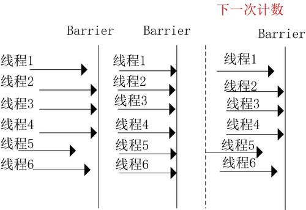

这篇文章会介绍3中非常实用的并发工具，Semaphore，CountDownLatch，CyclicBarrier。

# Semaphore

Semaphore可以理解为**信号量**，用于控制资源能够被并发访问的线程数量，以保证多个线程能够合理的使用特定资源。Semaphore就相当于一个许可证，线程需要先通过acquire方法获取该许可证，该线程才能继续往下执行，否则只能在该方法出阻塞等待。当执行完业务功能后，需要通过`release()`方法将许可证归还，以便其他线程能够获得许可证继续执行。

Semaphore可以用于做流量控制，特别是公共资源有限的应用场景，比如数据库连接。假如有多个线程读取数据后，需要将数据保存在数据库中，而可用的最大数据库连接只有3个，这时候就需要使用Semaphore来控制能够并发访问到数据库连接资源的线程个数最多只有3个。在限制资源使用的应用场景下，Semaphore是特别合适的。

下面来看下Semaphore的主要方法：

- acquire() ： 获取许可，如果无法获取到，则阻塞等待直至能够获取为止

- tryAcquire()： 获取许可，如果许可立即可用则返回true并获取否则返回false
- release() ： 释放许可
- availablePermits() : 返回当前可用的许可证个数
- hasQueuedThreads() : 是否有线程正在等待获取许可证
- getQueuedThreads() : 获取所有正在等待许可的线程集合

另外，在Semaphore的构造方法中还支持指定是够具有公平性，默认的是非公平性，这样也是为了保证吞吐量。

## 示例程序

看一个示例：

```java
Runnable runnable = () -> {
    try {
        semaphore.acquire();
        System.out.println(Thread.currentThread().getName() + " =====> 获取许可");
        System.out.println(Thread.currentThread().getName() + "        执行中");
        TimeUnit.SECONDS.sleep(3);
        System.out.println(Thread.currentThread().getName() + " <===== 释放许可");
        semaphore.release();
    } catch (InterruptedException e) {
        e.printStackTrace();
    }

};
for (int i = 0; i < 5; i++) {
    new Thread(runnable).start();
}
--------------------------------
输出
Thread-0 =====> 获取许可
Thread-0        执行中
Thread-1 =====> 获取许可
Thread-1        执行中
Thread-2 =====> 获取许可
Thread-2        执行中
Thread-0 <===== 释放许可
Thread-2 <===== 释放许可
Thread-1 <===== 释放许可
Thread-3 =====> 获取许可
Thread-3        执行中
Thread-4 =====> 获取许可
Thread-4        执行中
Thread-3 <===== 释放许可
Thread-4 <===== 释放许可
```

从上面的例子中可以看出，只能同时运行3个线程，其他的两个线程被阻塞直到许可被其他线程释放。

# CountDownLatch

在多线程协作完成业务功能时，有时候需要等待其他多个线程完成任务之后，主线程才能继续往下执行业务功能，在这种的业务场景下，通常可以使用Thread类的join方法，让主线程等待被join的线程执行完之后，主线程才能继续往下执行。当然，使用线程间消息通信机制也可以完成。其实，java并发工具类中为我们提供了类似“倒计时”这样的工具类，可以十分方便的完成所说的这种业务场景。

下面来看下CountDownLatch的主要方法：

- await() throws InterruptedException：调用该方法的线程等到构造方法传入的N减到0的时候，才能继续往下执行；
- await(long timeout, TimeUnit unit)：与上面的await方法功能一致，只不过这里有了时间限制，调用该方法的线程等到指定的timeout时间后，不管N是否减至为0，都会继续往下执行；
- countDown()：使CountDownLatch初始值N减1；
- long getCount()：获取当前CountDownLatch维护的值；

## 示例程序

看一个示例：

```java
public static final int THREAD_NUM = 3;
private static CountDownLatch startSignal = new CountDownLatch(1);
private static CountDownLatch endSignal = new CountDownLatch(THREAD_NUM);   //填入要进行倒计时的线程的数量

public static void main(String[] args) throws InterruptedException {
    Runnable runnable = () -> {
        try {
            System.out.println(Thread.currentThread().getName() + "等待开始");
            startSignal.await();    //直到startSignal变成0后才继续执行
            System.out.println(Thread.currentThread().getName() + "开始了");
            //等待1~5秒
            Thread.sleep(ThreadLocalRandom.current().nextInt(1000,5000));
            System.out.println(Thread.currentThread().getName() + "结束了");
            endSignal.countDown();
        } catch (InterruptedException e) {
            e.printStackTrace();
        }
    };

    for (int i = 0; i < THREAD_NUM; i++) {
        new Thread(runnable).start();
    }

    Thread.sleep(1000);
    System.out.println("======> 开始！");
    startSignal.countDown();
    endSignal.await();
    System.out.println("======> 结束！");
}
---------------------------
输出
Thread-1等待开始
Thread-0等待开始
Thread-2等待开始
======> 开始！
Thread-1开始了
Thread-0开始了
Thread-2开始了
Thread-2结束了
Thread-1结束了
Thread-0结束了
======> 结束！
```

需要注意的是，当调用CountDownLatch的countDown方法时，当前线程是不会被阻塞，会继续往下执行。

# CyclicBarrier


CyclicBarrier也是一种多线程并发控制的实用工具，和CountDownLatch一样具有等待计数的功能，但是相比于CountDownLatch功能更加强大。

为了理解CyclicBarrier，这里举一个通俗的例子。开运动会时，会有跑步这一项运动，我们来模拟下运动员入场时的情况，假设有6条跑道，在比赛开始时，就需要6个运动员在比赛开始的时候都站在起点了，裁判员吹哨后才能开始跑步。跑道起点就相当于“barrier”，是临界点，而这6个运动员就类比成线程的话，就是这6个线程都必须到达指定点了，意味着凑齐了一波，然后才能继续执行，否则每个线程都得阻塞等待，直至凑齐一波即可。cyclic是循环的意思，也就是说CyclicBarrier当多个线程凑齐了一波之后，仍然有效，可以继续凑齐下一波。CyclicBarrier的执行示意图如下：



下面来看下CyclicBarrier的主要方法：

- await() ： 等到所有的线程都到达指定的临界点
- await(long timeout, TimeUnit unit)  ： 这里有超时限制，阻塞等待直至到达超时时间为止
- getNumberWaiting() : 获取当前有多少个线程阻塞等待在临界点上
- isBroken() : 查询阻塞等待的线程是否被中断
- reset() : 将屏障重置为初始状态。如果当前有线程正在临界点等待的话，将抛出BrokenBarrierException。

另外需要注意的是，CyclicBarrier提供了这样的构造方法：

```java
public CyclicBarrier(int parties, Runnable barrierAction)
```

可以用来，当指定的线程都到达了指定的临界点的时，接下来执行的操作可以由barrierAction传入即可。

## 示例程序

用CyclicBarrier改写上面CountDownLatch的示例程序，这次我们让他执行2次：

```java
public static final int THREAD_NUM = 3;
private static CyclicBarrier signal = new CyclicBarrier(THREAD_NUM,//填入要进行倒计时的线程的数量
                                                        () -> System.out.println("======> 开始！"));   //当所有线程都到达临界点时会执行这条Runnable

public static void main(String[] args) throws InterruptedException {
    Runnable runnable = () -> {
        int num = 2;

        try {
            while (num-- > 0) { //执行num次
                System.out.println(Thread.currentThread().getName() + "等待开始");
                signal.await();    //直到所有线程都到达这里
                System.out.println(Thread.currentThread().getName() + "开始了");
                //等待1~5秒
                Thread.sleep(ThreadLocalRandom.current().nextInt(1000, 5000));
                System.out.println(Thread.currentThread().getName() + "结束了");
            }
        } catch (InterruptedException e) {
            e.printStackTrace();
        } catch (BrokenBarrierException e) {
            e.printStackTrace();
        }

    };

    for (int i = 0; i < THREAD_NUM; i++) {
        new Thread(runnable).start();
    }

}
-----------------------------
输出
Thread-1等待开始
Thread-2等待开始
Thread-0等待开始
======> 开始！
Thread-0开始了
Thread-2开始了
Thread-1开始了
Thread-0结束了
Thread-0等待开始
Thread-2结束了
Thread-2等待开始
Thread-1结束了
Thread-1等待开始
======> 开始！
Thread-1开始了
Thread-0开始了
Thread-2开始了
Thread-1结束了
Thread-2结束了
Thread-0结束了
```

可见开始二周目的时候，也是直到所有线程都运行到了临界点（`signal.await()`）后，才继续执行的。

# CountDownLatch与CyclicBarrier的比较

CountDownLatch与CyclicBarrier都是用于控制并发的工具类，都可以理解成维护的就是一个计数器，但是这两者还是各有不同侧重点的：

1. CountDownLatch一般用于某个线程A等待若干个其他线程执行完任务之后，它才执行；而CyclicBarrier一般用于一组线程互相等待至某个状态，然后这一组线程再同时执行；CountDownLatch强调一个线程等多个线程完成某件事情。CyclicBarrier是多个线程互等，等大家都完成，再携手共进。
2. 调用CountDownLatch的countDown方法后，当前线程并不会阻塞，会继续往下执行；而调用CyclicBarrier的await方法，会阻塞当前线程，直到CyclicBarrier指定的线程全部都到达了指定点的时候，才能继续往下执行；
3. CountDownLatch方法比较少，操作比较简单，而CyclicBarrier提供的方法更多，比如能够通过getNumberWaiting()，isBroken()这些方法获取当前多个线程的状态，**并且CyclicBarrier的构造方法可以传入barrierAction**，指定当所有线程都到达时执行的业务功能；
4. CountDownLatch是不能复用的，而CyclicLatch是可以复用的。

# Reference

[大白话说java并发工具类-Semaphore，Exchanger](https://github.com/CL0610/Java-concurrency/commit/1bdc9296289d92a33510a8edb75fc9d051cb9c48)

[大白话说java并发工具类-CountDownLatch，CyclicBarrier](https://github.com/CL0610/Java-concurrency/blob/master/25.%E5%A4%A7%E7%99%BD%E8%AF%9D%E8%AF%B4java%E5%B9%B6%E5%8F%91%E5%B7%A5%E5%85%B7%E7%B1%BB-CountDownLatch%EF%BC%8CCyclicBarrier/%E5%A4%A7%E7%99%BD%E8%AF%9D%E8%AF%B4java%E5%B9%B6%E5%8F%91%E5%B7%A5%E5%85%B7%E7%B1%BB-CountDownLatch%EF%BC%8CCyclicBarrier.md)


