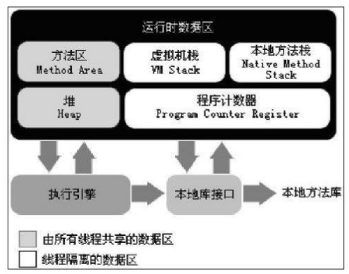
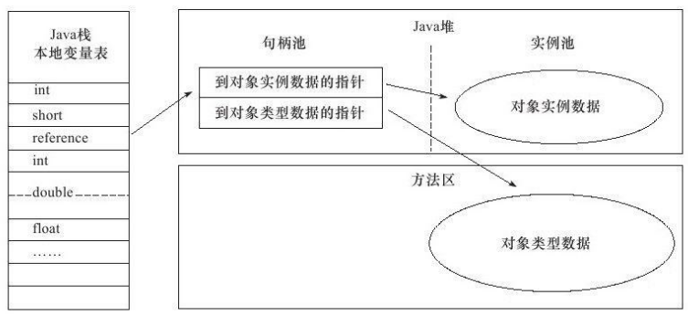
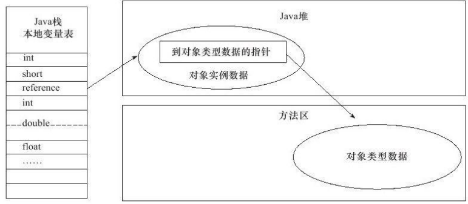

# 运行时数据区域

Java虚拟机所管理的内存将会包括以下几个运行时数据区域



## 程序计数器

- 一块较小的内存空间,它可以看作是当前线程所执行的字节码的行号指示器。
- 字节码解释器工作时就是通过改变这个计数器的值来选取下一条需要执行的字节码指令
- 每条线程都需要有一个独立的程序计数器
- 执行Java方法时，记录的是正在执行的虚拟机字节码指令的地址;
  执行Native方法时，这个计数器值则为空(Undefined)。
- 程序计数器不会发生OutOfMemoryError

## Java虚拟机栈

- 也是线程私有的,它的生命周期与线程相同。

- 每个方法在执行的同时都会创建一个栈帧(Stack Frame )用于存储局部变量表、方法出口等信息。

  每一个方法从调用直至执行完成的过程,就对应着一个栈帧在虚拟机栈中入栈到出栈的过程。

- **局部变量表**：虚拟机栈的核心部分，编译期间完成分配每个方法的局部变量表所需要的空间。

  - 存了基本数据类型
  - 对象引用(reference类型)
  - returnAddress类型
  - 64位长度的long和double类型的数据会占用2个局变量空间,其余的只占用1个。  

- 可能发生的两种异常
  - 如果线程请求的栈深度大于虚拟机所允许的深度，将抛出`StackOverflowError`异常
  - 如果扩展时无法申请到足够的内存，就会抛出`OutOfMemoryError`异常。

## 本地方法栈

- 和虚拟机栈作用相同，虚拟机栈 -> Java方法,本地方法栈->Native方法。
- 虚拟机规范中对本地方法栈的语言，数据结构等没有详细的规定，可以自由实现
  HOTSPOT直接就把本地方法栈和虚拟机栈合二为一。
- 也会抛出StackOverflowError和OutOfMemoryError异常。

## Java堆

- JVM内存中最大的一块。
- 被所有线程共享，存放对象实例
- 垃圾收集器管理的主要区域
    - 分代收集算法 ： 新生代和老年代
    - 更细致的分代：Eden空间、 From Survivor空间、 To Survivor空间等
- 可能存在多个线程私有的分配缓冲区(TLAB)

- 堆无法再扩展时,将会抛出OutOfMemoryError异常

## 方法区

- 线程共享
- 存储已被虚拟机加载的类信息、常量、静态变量、即时编译器编译后的代码等数据。
- HOTSPOT中的~~“永久代”~~。HOSTSPOT中这个部分也受GC管理，但因此更容易引发内存溢出
- 很少被回收,回收目标主要是针对常量池的回收和对类型的卸载
- 当方法区无法满足内存分配需求时，将抛出OutOfMemoryError异常。

### 运行时常量池

- 方法区的一部分
- Class文件中有一项是`常量池`，存放编译期生成的各种字面量和符号引用。
  类加载后这个部分会存放于`运行时常量池`
- 运行期间也可能将新的常量放入池中，如String类的intern()方法
- 当常量池无法再申请到内存时,会抛出OutOfMemoryError异常

## 直接内存

- 不是JVM的内存
- NIO：通过Native函数库直接分配`堆外内存`，Java堆中的DirectByteBuffer对象作为这块内存的引用进行操作，从而提高性能。

- 会受到本机总内存和处理器寻址空间的限制，导致OutOfMemoryError异常。

# HotSpot虚拟机对象探秘

探讨HotSpot虚拟机在Java堆中对象分配、布局和访问的全过程。

## 对象的创建

创建对象的过程

1. **类加载检查**
   遇到一条new时，检查参数是否能在常量池中定位到一个类的符号引用,并且检查这个符号引用代表的类是否已被加载
   如果没有,那必须先执行相应的类加载过程

2. **为新生对象分配内存**

   - 假设Java堆中内存是绝对规整的，把指针向空闲空间那边挪动一段与对象大小相等的距离。`“指针碰撞”`
   - 如果不是规整的，虚拟机就必须维护一个列表,记录上哪些内存块是可用的,在分配的时候从列表中找到一块足够大的空间划分给对象实例,并更新列表上的记录。`空闲列表`

   是否规整是由所采用的垃圾收集器是否带有压缩整理功能决定。

   - 使用Serial、ParNew等带Compact过程的收集器时,系统采用的分配算法是`指针碰撞`
   - 而使用CMS这种基于Mark-Sweep算法的收集器时,通常采用`空闲列表`

   需要考虑的并发问题：正在给对象A分配内存,指针还没来得及修改,对象B又同时使用了原来的指针来分配内存的情况。两种方案：

   - 方案1：对分配内存空间的动作进行同步处理
   - 方案2：把内存分配的动作按照线程划分在不同的空间之中进行
     即每个线程在Java堆中预先分配一小块内存,称为本地线程分配缓冲(TLAB)

3. **将分配到的内存空间都初始化为零值**
4. **对象进行必要的设置**
   把信息放入`对象头`
   例如这个对象是哪个类的实例、如何才能找到类的元数据信息、对象的哈希码、对象的GC分代年龄等信息
5. **执行<init>方法**


# 对象的内存布局

在HotSpot虚拟机中,对象在内存中存储的布局可以分为3块区域:`对象头`，`实例数据`，`对齐填充`

- 对象头
  分两个部分：
  - 存储对象自身的运行时数据,如哈希码、GC分代年龄、锁状态标志、线程持有的锁、偏向线程ID、偏向时间戳等的部分。`“Mark Word”`
  - 对象指向它的类元数据的指针,虚拟机通过这个指针来确定这个对象是哪个类的实例。
- 实例数据
  在程序代码中所定义的各种类型的字段内容。无论是从父类继承下来的,还是在子类中定义的,都需要记录起来。
- 对齐填充
  仅仅是让对象头对其8字节。所以不一定存在。

# 对象的访问定位

通过refernce数据访问访问堆中的对象，主流的访问方式有使用`句柄`和`直接指针`两种

**句柄**

Java堆中将会划分出一块内存来作为句柄池
reference中存储的就是对象的句柄地址,而句柄中包含了对象`实例数据`与`类型数据`各自的具体地址信息



**直接指针**

reference中存储的直接就是对象地址

Java堆对象的布局中就必须放置访问`类型数据`的相关信息



对比

- 句柄
  在GC过程中对象被移动时只会改变句柄中的实例数据指针,而reference本身不需要修改
- **直接指针**
  速度更快,它节省了一次指针定位的时间开销。HOTSPOT是这种

# 实战:OutOfMemoryError异常

## Java堆溢出

只要不断地创建对象,并且保证GC Roots到对象之间有可达路径来避免垃圾回收机制清除这些对象,那么在对象数量到达最大堆的容量限制后就会产生内存溢出异常。

```java
/**
 *VM Args:-Xms20m-Xmx20m-XX:+HeapDumpOnOutOfMemoryError
 * 
 * 堆的最小值-Xms参数
 * 堆的最大值-Xmx参数
 * -XX:+HeapDumpOnOutOfMemoryError：可以让虚拟机在出现内存溢出异常时Dump出当前的内存堆转储快照以便事后进行分析
 *
 * 上面表示Java堆的大小固定为20MB
 *@author zzm
 */
public class HeapOOM{
    static class OOMObject{
    }
    public static void main(String[]args){
        List<OOMObject> list=new ArrayList<>();
        while(true){
            list.add(new OOMObject());
        }
    }
}
---------------------
输出
java.lang.OutOfMemoryError: Java heap space
Dumping heap to java_pid20354.hprof ...
Heap dump file created [27725503 bytes in 0.101 secs]
```

## 虚拟机栈和本地方法栈溢出

通过`-Xss`参数设置栈容量（-Xoss参数设置本地方法栈，但在HOSTSPOT中这两者是一样的，所以-Xoss不起作用）

如果线程请求的栈深度大于虚拟机所允许的最大深度,将抛出StackOverflowError异常。
如果虚拟机在扩展栈时无法申请到足够的内存空间,则抛出OutOfMemoryError异常。

定义了大量的本地变量,增大此方法帧中本地变量表的长度。结果:抛出StackOverflowError异常时输出的堆栈深度相应缩小。

```java
/**
 *VM Args:-Xss228k
 *@author zzm
 */
public class JavaVMStackSOF{
    private int stackLength=1;
    public void stackLeak(){
        stackLength++;
        stackLeak();
    }
    public static void main(String[]args)throws Throwable{
        JavaVMStackSOF oom=new JavaVMStackSOF();
        try{
            oom.stackLeak();
        }catch(Throwable e){
            System.out.println("stack length:"+oom.stackLength);
            throw e;
        }
    }
}
-------------------------------
输出
Exception in thread "main" java.lang.StackOverflowError
	at chapter2.JavaVMStackSOF.stackLeak(JavaVMStackSOF.java:10)
stack length:1518
```

## 方法区和运行时常量池溢出

-XX:PermSize和-XX:MaxPermSize限制方法区大小,从而间接限制其中常量池的容量。

```java
/**
*VM Args:-XX:PermSize=10M-XX:MaxPermSize=10M
*@author zzm
*/
public class RuntimeConstantPoolOOM{
public static void main(String[]args){
//使用List保持着常量池引用,避免Full GC回收常量池行为
List<String>list=new ArrayList<String>();
//10MB的PermSize在integer范围内足够产生OOM了
int i=0;
while(true){
list.add(String.valueOf(i++).intern());
}
}
}
----------------------
输出
Exception in thread"main"java.lang.OutOfMemoryError:PermGen space
at java.lang.String.intern(Native Method)
at org.fenixsoft.oom.RuntimeConstantPoolOOM.main(RuntimeConstantPoolOOM.java:18)
```

> 运行时发现-XX:PermSize在Java8中没有，查了下发现现在已经取消`永久代`的管理方式了。而是被叫元空间（Metaspace)代替。参数是-XX：MetaspaceSize


## 本机直接内存溢出

可通过-XX:MaxDirectMemorySize指定,如果不指定,则默认与Java堆最大值(-Xmx指定)一样

```java
/**
 * VM Args:-Xmx20M-XX:MaxDirectMemorySize=10M
 *
 * @author zzm
 */
public class DirectMemoryOOM {
    private static final int _1MB = 1024 * 1024;

    public static void main(String[] args) throws Exception {
        Field unsafeField = Unsafe.class.getDeclaredFields()[0];
        unsafeField.setAccessible(true);
        Unsafe unsafe = (Unsafe) unsafeField.get(null);
        while (true) {
            unsafe.allocateMemory(_1MB);
        }
    }
-------------------------------------
输出
Exception in thread"main"java.lang.OutOfMemoryError
at sun.misc.Unsafe.allocateMemory(Native Method)
at org.fenixsoft.oom.DMOOM.main(DMOOM.java:20)
```

