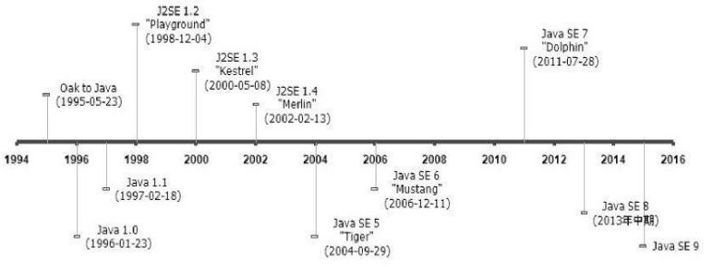

# Java发展史

- 1991年4月
  绿色计划：开发一种能够在各种消费性电子产品(如机顶盒、冰箱、收音机等)上运行的程序架
  构。
  Java语言的前身:Oak

- 1995年5月23日
  Oak语言改名为Java
  “Write Once,Run Anywhere”

- 1996年1月23日
  **JDK1.0**：

  - 纯解释执行的Java虚拟机实现(Sun Classic VM)
  - Applet、AWT等

- 1997年2月19日

   **JDK1.1** : 

  - JAR文件格式、JDBC、JavaBeans、RMI
  - 内部类，反射

- 1998年12月4日
  **JDK 1.2**：
  - 拆成3个体系 ： j2se,j2ee,j2me
  - 内置JIT（Just In Time）编译器
  - EJB,JavaPlafin-in,JavaIDL,Swing
  - strictfp关键字，Collections

- 1999年4月27日
  HotSpot虚拟机发布，之后的Sun JDK的默认虚拟机

- 2000年5月8日
  **JDK1.3**

  - 改进1.2中的库类（数学运算，TimerApi等）

- 2002年2月13日
  **jDK1.4**

  - 正则，异常链，NIO，日志，XML解析  

- 2004年9月30日

  **JDK1.5**

  - 自动装箱，泛型，注解，枚举，foreach
  - 改进JMM，java.util.concurrent并发包

- 2006年12月11日
  **JDK1.6**
  - 改名为Java SE 6、Java EE 6、Java ME 6
  - 对动态语言（js）的支持
  - 对jvm做改进：锁，同步，垃圾收集，类加载等的算法  
- 2009年2月19日-2010年9月9日
  **JDK1.7** 

# JVM发展史

**Sun Classic/Exact VM**

- Sun Classic
  - 1996 . 第一款商用Java虚拟机
  - 使用纯解释器的方法执行代码
  - 外挂JIT编译器:  sunwjit,
    解释器和编译器不能配合工作，如果使用编译器执行，那么编译器就得对每行代码进行编译,包括不会用到的
- Exact VM虚拟机：Classic的扩展
  编译器和解释器混合工作.
  能准确的管理内存。通过分辨出类型,GC能分辨对象是否还可能被使用（Classic VM基于handler的对象查找方式）

**Sun HosSpot VM**
- SunJDK和OpenJDK中所带的虚拟机
- 继承了之前两款的优点（内存管理）和比exact更强的热点探测,找出有价值的代码，通知JIT编译

**Sun Mobile-embedded VM/Meta-Circular VM**
Sun公司的其他JVM
- KVM : 安卓ios出现前在手机中被广泛使用
- CDC/CLDC HotSpot Implementation : 也是用于手机，pad的javaAPI
- Squawk VM : 曾用于SunSpot（一种手持wifi），底层大部分都是通过java代码实现
- JavaInJava : 实验室性质的JVM，必须运行在另一个宿主虚拟机内部无JIT，只能是解释模式
- Maxine VM : 类似于JavaInJava，更靠谱。有JIT，GC，宿主模式独立模式

**BEA JRockit/IBM J9 VM**
- JRockit : 速度快。关注服务器端应用，所以不太关注程序的启动速度。内部包含解释器，都是即时编译器编译执行
- J9  : 定位于HotSpot比较像，面向所有体系（se，ee，me）.主要用于ibm产品

**Azul VM/BEA Liquid VM**
硬件平台的jvm

- Azul 用于Vega系统
- Liquid 自身就实现了os的功能

**Apache Harmony/Google Android Dalvik VM**
“虚拟机”但不是”Java虚拟机“
- Apache Harmony : 包含了自己的虚拟机和java库，可以运行java软件，但一直没被授权
- Dalvik : android。并不能直接执行class文件，他执行的dex文件可以通过class文件转换