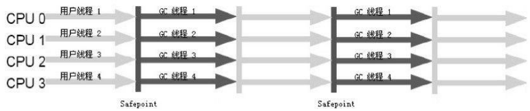

# 对象已死吗

怎样知道某个对象是活着还是死了（不会再被引用）

## 引用计数算法

> 给对象中添加一个引用计数器,每当有一个地方引用它时,计数器值就加1;当引用失效时,计数器值就减1;任何时刻计数器为0的对象就是不可能再被使用的。

很简单，但Java虚拟机里面没有选用引用计数算法来管理内存，主要的原因是它很难解决对象之间相互循环引用的问题。

```java
/**
 * 代码清单3-1引用计数算法的缺陷
 * <p>
 * testGC()方法执行后,objA和objB会不会被GC呢?
 */
public class ReferenceCountingGC {
    public Object instance = null;
    private static final int _1MB = 1024 * 1024;
    /**
     * 这个成员属性的唯一意义就是占点内存,以便能在GC日志中看清楚是否被回收过
     */
    private byte[] bigSize = new byte[2 * _1MB];

    public static void testGC() {
        ReferenceCountingGC objA = new ReferenceCountingGC();
        ReferenceCountingGC objB = new ReferenceCountingGC();
        objA.instance = objB;
        objB.instance = objA;
        objA = null;
        objB = null;
        //假设在这行发生GC,objA和objB是否能被回收?
        System.gc();
    }
}
```

从GC日志可以看出，虚拟机并没有因为这两个对象互相引用就不回收它们，也就说明虚拟机不是通过引用计数法来判
断对象是否存活的

## 可达性分析算法

Java、C#,Lisp，都是称通过`可达性分析`来判定对象是否存活的。

> 通过一系列的称为“GC Roots”的对象作为起始点,从这些节点开始向下搜索,搜索所走过的路径称为`引用链`,当一个对象到GC Roots没有任何引用链相连(用图论的话来说,就是从GC Roots到这个对象不可达)时,则证明此对象是不可用的。


可作为GC Roots的对象包括下面几种:

- 虚拟机栈(栈帧中的本地变量表)中引用的对象。
- 方法区中类静态属性引用的对象。
- 方法区中常量引用的对象。
- 本地方法栈中JNI(即一般说的Native方法)引用的对象。

## 再谈引用

JDK1.2以前:

> 如果reference类型的数据中存储的数值代表的是另外一块内存的起始地址,就称这块内存代表着一个引用。

现在的JDK：

> 当内存空间还足够时,则能保留在内存之中;如果内存空间在进行垃圾收集后还是非常紧张,则可以抛弃这些对象。
>
> 将引用分为`强引用`(Strong Reference)、`软引用`(Soft Reference)、`弱引用`(Weak Reference)、`虚引用`(Phantom Reference)4种,这4种引用强度依次逐渐减弱.

强软弱虚：

- **强引用**
  类似“Object obj=new Object()”这类的引用
  只要强引用还存在,垃圾收集器永远不会回收掉被引用的对象。

- **软引用**
  还有用但并非必需的对象。

  对于软引用关联着的对象,在系统将要发生内存溢出异常之前,将会把这些对象列进回收范围之中进行第二次回收。如果这次回收还没有足够的内存,才会抛出内存溢出异常。

  SoftReference类实现软引用

- **弱引用**
  强度比软引用更弱一些被弱引用关联的
  对象只能生存到下一次垃圾收集发生之前。当垃圾收集器工作时,无论当前内存是否足够,都会回收掉只被弱引用关联的对象。
  WeakReference类实现弱引用

- **虚引用**
  最弱的一种引用关系
  一个对象是否有虚引用的存在,完全不会对其生存时间构成影响,也无法通过虚引用来取得一个对象实例。

  为一个对象设置虚引用关联的唯一目的就是能在这个对象被收集器回收时收到一个系统通知

  PhantomReference类实现虚引用

## 生存还是死亡

即使在可达性分析算法中不可达的对象,也并非是“非死不可”的,这时候它们暂时处于“缓刑”阶段。

要真正宣告一个对象死亡,至少要经历两次标记过程。

1. 发现没有与GC Roots相连接的引用链,那它将会被第一次标记并且进行一次筛选,筛选的条件是此对象是否有必要执行finalize()方法。
   - 当对象没有覆盖finalize()方法,或者finalize()方法已经被虚拟机调用过,虚拟机将这两种情况都视为“没有必要执行”。
   - 如果有必要执行finalize()方法,那么这个对象将会放置在一个叫做`F-Queue`的队列之中，,并在稍后由一个由虚拟机自动建立的、低优先级的Finalizer线程去执行它。
     “执行”是指虚拟机会触发这个方法,但并不承诺会等待它运行结束。因为可能这个finalize()很耗时，或存在死循环
2. 如果对象要在finalize()中成功拯救自己——只要重新与引用链上的任何一个对象建立关联即可,譬如把自己(this关键字)赋值给某个类变量或者对象的成员变量,那在第二次标记时它将被移除出“即将回收”的集合。

```java
/**
 * 代码清单3-2
 * 一次对象自我拯救的演示
 * <p>
 * 此代码演示了两点:
 * 1.对象可以在被GC时自我拯救。
 * 2.这种自救的机会只有一次,因为一个对象的finalize()方法最多只会被系统自动调用一次
 *
 * @author zzm
 */
public class FinalizeEscapeGC {
    public static FinalizeEscapeGC SAVE_HOOK = null;

    public void isAlive() {
        System.out.println("yes,i am still alive:)");
    }

    @Override
    protected void finalize() throws Throwable {
        super.finalize();
        System.out.println("finalize mehtod executed!");
        FinalizeEscapeGC.SAVE_HOOK = this;
    }

    public static void main(String[] args) throws Throwable {
        SAVE_HOOK = new FinalizeEscapeGC();
        //对象第一次成功拯救自己
        SAVE_HOOK = null;
        System.gc();
        //因为finalize方法优先级很低,所以暂停0.5秒以等待它
        Thread.sleep(500);
        if (SAVE_HOOK != null) {
            SAVE_HOOK.isAlive();
        } else {
            System.out.println("no,i am dead:(");
        }
        //下面这段代码与上面的完全相同,但是这次自救却失败了
        SAVE_HOOK = null;
        System.gc();
        //因为finalize方法优先级很低,所以暂停0.5秒以等待它
        Thread.sleep(500);
        if (SAVE_HOOK != null) {
            SAVE_HOOK.isAlive();
        } else {
            System.out.println("no,i am dead:(");
        }
    }
}
------------------------------
输出
finalize mehtod executed!
yes,i am still alive:)
no,i am dead:(
```

任何一个对象的finalize()方法都只会被系统自动调用一次,如果对象面临下一次回收,它的finalize()方法不会被再次执行

**不推荐用这种finalize()的方式去拯救对象。运行代价高昂,不确定性大,无法保证各个对象的调用顺序。**

## 回收方法区

方法区(~~HotSpot虚拟机中的永久代~~）中进行垃圾收集的“性价比”一般比较低。

永久代的垃圾收集主要回收两部分内容:废弃常量和无用的类。

**废弃常量**

假如一个字符串“abc”已经进入了常量池中，没有任何String对象引用常量池中的“abc”常量,也没有其他地方引用了这个字面量,如果这时发生内存回收,而且必要的话,这个“abc”常量就会被系统清理出常量池。

常量池中的其他类(接口)、方法、字段的符号引用也与此类似。

**无用的类**

类需要同时满足下面3个条件才能算是“无用的类”:

- 该类所有的实例都已经被回收,也就是Java堆中不存在该类的任何实例。
- 加载该类的ClassLoader已经被回收。
- 该类对应的java.lang.Class对象没有在任何地方被引用,无法在任何地方通过反射访问该类的方法。

可以对满足上述3个条件的无用类进行回收,这里说的仅仅是**“可以”**,而并不是和对象一样,不使用了就必然会回收。

HotSpot虚拟机参数

- -Xnoclassgc： 是否对类进行回收
- -verbose:class ， -XX:+TraceClassLoading ，-XX:+TraceClassUnLoading ： 查看类加载和卸载信息

# 垃圾收集算法

## 标记-清除算法

算法分为“标记”和“清除”两个阶段

> 首先标记出所有需要回收的对象,在标记完成后统一回收所有被标记的对象。也就是之前说筛选的finalize()方法的方式。

缺点：

- 标记和清除两个过程的效率都不高
- 标记清除之后会产生大量不连续的内存碎片,空间碎片太多可能会导致以后在程序运行过程中需要分配较大对象时,无法找到足够的连续内存而不得不提前触发另一次垃圾收集动作。


## 复制算法

> 将可用内存按容量划分为大小相等的两块,每次只使用其中的一块。当这一块的内存用完了,就将还存活着
> 的对象复制到另外一块上面,然后再把已使用过的内存空间一次清理掉。

每次都是对整个半区进行内存回收,内存分配时也就不用考虑内存碎片等复杂情况,实现简单,运行高效。


98%是“朝生夕死”的,所以并不需要按照1:1的比例来划分内存空间,而是将内存分为一块较大的Eden空间和两块较小的Survivor空间,每次使用Eden和其中一块Survivor 。
当回收时,将Eden和Survivor中还存活着的对象一次性地复制到另外一块Survivor空间上,最后清理掉Eden和刚才用过的Survivor空间。也就是说一个Eden，两个Surviver空间。

HotSpot虚拟机默认Eden和Survivor的大小比例是8:1。当Survivor空间不够用时,需要依赖其他内存(这里指老年代)进行`分配担保`。

`分配担保`：另外一块Survivor空间没有足够空间存放上一次新生代收集下来的存活对象时,这些对象将直接通过分配担保机制进入老年代。就像去银行贷款，当你不能还款时，会从担保人的账户中扣款。

## 标记-整理算法

老年代对象存活率高、没有额外空间对它进行分配担保

根据老年代的特点,有人提出了另外一种“标记-整理”(Mark-Compact)算法

>  标记过程仍然与“标记-清除”算法一样。但后续步骤不是直接对可回收对象进行清理,而是让所有存活的对象都向一端移动,然后直接清理掉端边界以外的内存。


## 分代收集算法

当前商业虚拟机的垃圾收集都采用“分代收集”(Generational Collection)算法

> 根据对象存活周期的不同将内存划分为几块。
> 一般是把Java堆分为新生代和老年代,这样就可以根据各个年代的特点采用最适当的收集算法。
>
> - 新生代选用复制算法
> - 老年代使用“标记—清理”或者“标记—整理”算法

# HotSpot的算法实现

## 枚举根节点

枚举根节点时的问题：

- GC Roots的节点主要是方法区和本地变量表。如果要逐个检查这里面的引用,那么必然会消耗很多时间。

- 分析工作必须在一个能确保一致性的快照中进行，导致GC进行时枚举根节点的过程必须停顿所有Java执行线程。

**准确式GC**：当执行系统停顿下来后,并不需要一个不漏地检查完所有执行上下文和全局的引用位置,虚拟机应当是有办法直接得知哪些地方存放着对象引用，从而特定哪里存在GC Roots

> HotSpot的实现中,是使用一组称为OopMap的数据结构来达到这个目的的。
> 在类加载完成的时候,HotSpot就把对象内什么偏移量上是什么类型的数据计算出来,在JIT编译过程中,也会在特定的位置记录下栈和寄存器中哪些位置是引用。
> 这样,GC在扫描时就可以直接得知这些信息了。

## 安全点

在OopMap的协助下,HotSpot可以快速且准确地完成GC Roots枚举。

但问题在于：引用关系变化时OopMap也应该变换。此时如果为每一条指令都生成对应的OopMap,那将会需要大量的额外空间,这样GC的空间成本将会变得很高

HotSpot也的确没有为每条指令都生成OopMap,只是在“特定的位置”记录了这些信息（*每次对象引用发生变化时都会同一时间改每个安全点中维护的OopMap？*）,这些位置称为安全点(Safepoint),即程序执行时并非在所有地方都能停顿下来开始GC,只有在到达安全点时才能暂停。

被选为安全点的条件--“是否具有让程序长时间执行的特征”
 “长时间执行”的最明显特征就是指令序列复用,例如方法调用、循环跳转、异常跳转等,所以具有这些功能的指令才会产生Safepoint。

如何在GC发生时让所有线程都“跑”到最近的安全点上再停顿下来？

- 抢先式中断
  在GC发生时,首先把所有线程全部中断,如果发现有线程中断的地方不在安全点上,就恢复线程,让它“跑”到安全点上。
  几乎没有虚拟机采用这种
- **主动式中断**
  GC需要中断线程的时候,不直接对线程操作,仅仅简单地设置一个标志,各个线程执行时主动去轮询这个标志,发现中断标志为真时就自己中断挂起。
  轮询标志的地方和安全点是重合的

## 安全区域

程序“不执行”的时候，也就是说没有分配CPU时间的时候，如Sleep状态等。这时候线程无法响应JVM的中断请求,“走”到安全的地方去中断挂起。`安全区域`(Safe Region)来解决这个问题。

安全区域是指在一段代码片段之中,引用关系不会发生变化。在这个区域中的任意地方开始GC都是安全的。

在线程执行到Safe Region中的代码时,首先标识自己已经进入了Safe Region,那样,当在这段时间里JVM要发起GC时,就不用管标识自己为Safe Region状态的线程了。在线程要离开Safe Region时,它要检查系统是否已经完成了根节点枚举(或者是整个GC过程),如果完成了,那线程就继续执行,否则它就必须等待直到收到可以安全离开SafeRegion的信号为止。

*（？）这个跟线程中断挂起有什么关系*

# 垃圾收集器

HotSpot虚拟机的垃圾收集器，如果两个收集器之间存在连线,就说明它们可以搭配使用。


## Serial收集器

> 这个收集器是一个单线程的收集器,但它的“单线程”的意义并不仅仅说明它只会使用一个CPU或一条收集线程去完成垃圾收集工作,更重要的是在它进行垃圾收集时,必须暂停其他所有的工作线程,直到它收集结束
>
> “Stop The World”

Serial/Serial Old收集器运行示意图


适用于Client模式下的虚拟机。桌面应用

## ParNew收集器

> Serial收集器的多线程版本,除了使用多条线程进行垃圾收集之外,
> 其余行为包括Serial收集器可用的所有控制参数:
>
> - -XX:SurvivorRatio	//Eden与Survivor区的比例
> - -XX:PretenureSizeThreshold //超过这个值的时候，对象直接在old区分配内存，默认值是0，意思是不管多大都是先在eden中分配内存
> - -XX:HandlePromotionFailure等 //是否允许担保分配内存失败,即整个年老代空间不足,而整个新生代中Eden和Survivor对象都存活的极端情况
>
> 收集算法、Stop The World、对象分配规则、回收策略等都与Serial收集器完全一样


许多运行在Server模式下的虚拟机中首选的新生代收集器,其中有一个与性能无关但很重要的原因是,除了Serial收集器外,目前只有它能与CMS收集器配合工作。

- 使用-XX:+UseConcMarkSweepGC选项后,CMS默认的新生代会是ParNew，也可以使用-XX:+UseParNewGC选项来强制指定它。

- 它默认开启的收集线程数与CPU的数量相同,可以使用-XX:ParallelGCThreads参数来限制线程数

要注意的两个词：

- 并行(Parallel):指多条垃圾收集线程并行工作,但此时用户线程仍然处于等待状态。
- 并发(Concurrent):指用户线程与垃圾收集线程同时执行,用户程序在继续运行,而垃圾收集程序运行于另一个CPU上。

## Parallel Scavenge收集器

功能几乎和PerNew一样

> Parallel Scavenge收集器的目标则是达到一个可控制的吞吐量(Throughput)。
>
> 停顿时间越短就越适合需要与用户交互的程序,良好的响应速度能提升用户体验,而高吞吐量则可以高效率地利用CPU时间,尽快完成程序的运算任务,主要适合在后台运算而不需要太多交互的任务。
>
> 两个参数用于精确控制吞吐量:
>
> - -XX:MaxGCPauseMillis 最大垃圾收集停顿时间，时间越短越频繁，吞吐量低
> - -XX:GCTimeRatio 直接设置吞吐量大小，求倒数 ： 1/(1+x)。默认值为99,就是允许最大1%(即1/(1+99))
>
> 参数 -XX:+UseAdaptiveSizePolicy
> 设置后新生代的大小(-Xmn)、Eden与Survivor区的比例(-XX:SurvivorRatio)、晋升老年代对象年龄(-XX:PretenureSizeThreshold)等细节参数都会根据系统的运行情况自适应调节

##  Serial Old收集器

> Serial收集器的老年代版本,它同样是一个单线程收集器,使用“标记-整理”算法。


这个收集器的主要意义也是在于给Client模式下的虚拟机使用。

如果在Server模式下,那么它主要还有两大用途:

- 用途是在JDK 1.5以及之前的版本中与Parallel Scavenge收集器搭配使用 
- 作为CMS收集器的后备预案,在并发收集发生Concurrent Mode Failure时使用。

## Parallel Old收集器

> Parallel Old是Parallel Scavenge收集器的老年代版本,使用多线程和“标记-整理”算法

这是在JDK 1.6中才开始提供的，在这之前ParallelScavenge收集器只能和Serial Old配合工作，不能把Parallel的作用发挥到最大。因此，新生代的Parallel Scavenge收集器一直处于比较尴尬的状态。甚至不如ParNew加CMS



在注重吞吐量以及CPU资源敏感的场合,都可以优先考虑Parallel Scavenge加Parallel Old

## CMS收集器

> CMS(Concurrent Mark Sweep)收集器是一种以获取最短回收停顿时间为目标的收集器。
>
> CMS收集器是基于“标记—清除”算法实现的,但整个过程分为4个步骤：
>
> - **初始标记(CMS initial mark)**	
>   标记一下GC Roots能直接关联到的对象,速度很快。仍然需要“Stop The World”
>
> - **并发标记(CMS concurrent mark)**
>   进行GC RootsTracing的过程
>
> - **重新标记(CMS remark)**
>   修正并发标记期间因用户程序继续运作而导致标记产生变动的那一部分对象的标记记录
>   仍然需要“Stop The World”
>
>   停顿时间一般会比初始标记阶段稍长一些,但远比并发标记的时间短
>
> - **并发清除(CMS concurrent sweep)**

整个过程中耗时最长的并发标记和并发清除过程收集器线程都可以与用户线程一起工作，总体来说，内存回收过程是与用户线程一起并发执行的


并发收集、低停顿，但CMS还远达不到完美的程度,它有以下3个明显的缺点:

- **对CPU资源非常敏感**
  并发执行时会占用一部分线程(或者说CPU资源)，总吞吐量会降低

  默认启动的回收线程数是(CPU数量+3)/4，当CPU不足4个时(譬如2个),就得分出一半的运算能力去执行收集器线程

  - **增量式并发收集器”(Incremental Concurrent Mark Sweep/i-CMS)**

    思想是让GC线程、用户线程交替运行,尽量减少GC线程的独占资源的时间,这样整个垃圾收集的过程会更长,但对用户程序的影响就会显得少一些。表现很一般，现已被声明为“deprecated”

- **无法处理浮动垃圾，可能出现“Concurrent Mode Failure”失败而导致另一次Full GC的产生**

  一部分垃圾出现在标记过程之后,CMS无法在当次收集中处理掉它们,只好留待下一次GC时再清理掉

  因此CMS收集器不能像其他收集器那样等到老年代几乎完全被填满了再进行收集,需要预留一部分空间提供并发收集时的程序运作使用。
  JDK1.5的默认设置下,CMS收集器当老年代使用了68%的空间后就会被激活，通过-XX:CMSInitiatingOccupancyFraction可以调高百分比。

  预留的内存无法满足程序需要,就会出现一次“Concurrent Mode Failure”失败，此时会临时启用Serial Old收集器来
  重新进行老年代的垃圾收集,这样停顿时间就很长了。所以不能把百分比调太高。

- **基于“标记—清除”，意味着收集结束时会有大量空间碎片产生。**
  无法找到足够大的连续空间来分配当前对象时,不得不提前触发一次Full GC。

  - -XX:+UseCMSCompactAtFullCollection开关参数(默认就是开启的)：
    顶不住要进行FullGC时先开启内存碎片的合并整理过程,这个内存整理的过程是无法并发的，所以停顿时间会变长

  - -XX:CMSFullGCsBeforeCompaction

    用于设置执行多少次不压缩的Full GC后,跟着来一次带压缩的(默认值为0,表示每次进入Full GC时都进行碎片整理)。

## G1收集器

与其他GC收集器相比,G1具备如下特点:

- **并行与并发**
  和CMS一样可以并发执行。
- **分代收集**
  G1可以不需要其他收集器配合就能独立管理整个GC堆。
  它能够采用不同的方式去处理新创建的对象和已经存活了一段时间、熬过多次GC的旧对象以获取更好的收集效果。
- **空间整合**
  从整体来看是基于“标记—整理”算法.从局部(两个Region之间)上来看是基于“复制”算法实现的。不会产生内存空间碎片

- **可预测的停顿**
  对比于CMS，G1除了追求低停顿外,还能建立可预测的停顿时间模型,能让使用者明确指定在一个长度为M毫秒的时间片段内,消耗在垃圾收集上的时间不得超过N毫秒

**分代收集**

它将整个Java堆划分为多个大小相等的独立区域(Region),虽然还保留有新生代和老年代的概念,但新生代和老年代不再是物理隔离的了,它们都是一部分Region(不需要连续)的集合。

**可预测的停顿**

有计划地避免在整个Java堆中进行全区域的垃圾收集。
G1跟踪各个Region里面的垃圾堆积的价值大小,在后台维护一个优先列表,每次根据允许的收集时间,优先回收价值最大的Region。

**Remembered Set**

Region概念可能发生的问题：如果回收新生代时也不得不同时扫描老年代的话,那么Minor GC的效率可能下降不少

解决方案: G1中每个Region都有一个与之对应的Remembered Set,虚拟机发现程序在对Reference类型的数据进行写操作时,会产生一个Write Barrier暂时中断写操作,检查Reference引用的对象是否处于不同的Region之中(在分代的例子中就是检查是否老年代中的对象引用了新生代中的对象),如果是,便通过CardTable把相关引用信息记录到被引用对象所属的Region的Remembered Set之中。当进行内存回收时,在GC根节点的枚举范围中加入Remembered Set即可保证不对全堆扫描也不会有遗漏。

> G1收集器的运作大致可划分为以下几个步骤:
>
> - **初始标记(Initial Marking)**
>   标记GC Roots能直接关联到的对象
>   并且修改TAMS(Next Top at Mark Start)的值,让下一阶段用户程序并发运行时,能在正确可用的
>   Region中创建新对象
>   这阶段需要停顿线程,但耗时很短
> - **并发标记(Concurrent Marking)**
>   进行GC RootsTracing的过程
> - **最终标记(Final Marking)**
>   修正并发标记期间因用户程序继续运作而导致标记产生变动的那一部分对象的标记记录
>   虚拟机将之前这段时间对象变化记录在线程Remembered Set Logs里面,这个阶段需要把Remembered Set Logs的数据合并到Remembered Set中
>   这阶段需要停顿线程,但是可并行执行
> - **筛选回收(Live Data Counting and Evacuation)**
>   首先对各个Region的回收价值和成本进行排序,根据用户所期望的GC停顿时间来制定回收计划


## 垃圾收集器参数总结


# 内存分配与回收策略

对象的内存分配，就是在堆上分配。对象主要分配在新生代的Eden区上,如果启动了本地线程分配缓冲,将按线程优先在TLAB上分配。少数情况下也可能会直接分配在老年代。接下来我们将会讲解几条最普遍的内存分配规则

## 对象优先在Eden分配

大多数情况下,对象在新生代Eden区中分配。当Eden区没有足够空间进行分配时,虚拟机将发起一次Minor GC。

示例代码中的参数

- -Xms20M、-Xmx20M Java堆大小为20MB,不可扩展
- -Xmn10M 其中10MB分配给新生代,剩下的10MB分配给老年代
- -XX:SurvivorRatio=8 新生代中Eden区与一个Survivor区的空间比例是8:1

```java
private static final int _1MB=1024*1024;
/**
     *VM参数:-verbose:gc-Xms20M-Xmx20M-Xmn10M-XX:+PrintGCDetails
     -XX:SurvivorRatio=8
     */
public static void testAllocation(){
    byte[]allocation1,allocation2,allocation3,allocation4;
    allocation1=new byte[2*_1MB];
    allocation2=new byte[2*_1MB];
    allocation3=new byte[2*_1MB];
    allocation4=new byte[4*_1MB];//出现一次Minor GC
}
--------------------------
输出
[GC[DefNew:6651K->148K(9216K),0.0070106 secs]6651K->6292K(19456K),	//总体大小不变
0.0070426 secs][Times:user=0.00 sys=0.00,real=0.00 secs]
Heap
def new generation total 9216K,used 4326K[0x029d0000,0x033d0000,0x033d0000)
//Eden占用4MB(被allocation4占用)
eden space 8192K,51%used[0x029d0000,0x02de4828,0x031d0000)
//Survivor空闲。Survivor空间只有1MB大小,不够放入3个2MB大小的对象，通过分配担保机制提前转移到老年代
from space 1024K,14%used[0x032d0000,0x032f5370,0x033d0000)
to space 1024K,0%used[0x031d0000,0x031d0000,0x032d0000)
//老年代被占用6MB(被allocation1、allocation2、allocation3占用)
tenured generation total 10240K,used 6144K[0x033d0000,0x03dd0000,0x03dd0000)
the space 10240K,60%used[0x033d0000,0x039d0030,0x039d0200,0x03dd0000)
compacting perm gen total 12288K,used 2114K[0x03dd0000,0x049d0000,0x07dd0000)
the space 12288K,17%used[0x03dd0000,0x03fe0998,0x03fe0a00,0x049d0000)
No shared spaces configured.
```

**Minor GC和Full GC**

- **新生代GC(Minor GC)**
  指发生在新生代的垃圾收集动作,Minor GC非常频繁,一般回收速度也比较快。
- **老年代GC(Major GC/Full GC)**
  出现了Major GC,经常会伴随至少一次的Minor GC。
  Major GC的速度一般会比Minor GC慢10倍以上。

## 大对象直接进入老年代

大对象是指,需要大量连续内存空间的Java对象,最典型的大对象就是那种很长的字符串以及数组。（一群“朝生夕灭”的“短命大对象”,写程序的时候应当避免）

经常出现大对象容易导致内存还有不少空间时就提前触发垃圾收集以获取足够的连续空间来“安置”它们

- -XX:PretenureSizeThreshold参数

  令大于这个设置值的对象直接在老年代分配
  避免在Eden区及两个Survivor区之间发生大量的内存复制


```java
private static final int _1MB=1024*1024;
/**
     *VM参数:-verbose:gc-Xms20M-Xmx20M-Xmn10M-XX:+PrintGCDetails-XX:SurvivorRatio=8
     *-XX:PretenureSizeThreshold=3145728
     */
public static void testPretenureSizeThreshold(){
    byte[]allocation;
    allocation=new byte[4*_1MB];//直接分配在老年代中
}
-------------------------
输出
Heap
def new generation total 9216K,used 671K[0x029d0000,0x033d0000,0x033d0000)
//Eden空间几乎没有被使用
eden space 8192K,8%used[0x029d0000,0x02a77e98,0x031d0000)
from space 1024K,0%used[0x031d0000,0x031d0000,0x032d0000)
to space 1024K,0%used[0x032d0000,0x032d0000,0x033d0000)
//4MB的allocation对象直接就分配在老年代
tenured generation total 10240K,used 4096K[0x033d0000,0x03dd0000,0x03dd0000)
the space 10240K,40%used[0x033d0000,0x037d0010,0x037d0200,0x03dd0000)
compacting perm gen total 12288K,used 2107K[0x03dd0000,0x049d0000,0x07dd0000)
the space 12288K,17%used[0x03dd0000,0x03fdefd0,0x03fdf000,0x049d0000)
No shared spaces configured.
```

注意PretenureSizeThreshold参数只对Serial和ParNew两款收集器有效

## 长期存活的对象将进入老年代

为了识别哪些对象应放在新生代,哪些对象应放在老年代中。虚拟机给每个对象定义了一个对象年龄(Age)计数器

第一次Minor GC后仍然存活,并且能被Survivor容纳的话,将被移动到Survivor空间中,并且对象年龄设为1。对象在Survivor区中每“熬过”一次Minor GC,年龄就增加1岁,当它的年龄增加到一定程度(默认为15岁),就将会被晋升到老年代中。

- -XX:MaxTenuringThreshold参数 ： 晋升老年代的年龄阈值

```java
private static final int _1MB = 1024 * 1024;

/**
     * VM参数:-verbose:gc-Xms20M-Xmx20M-Xmn10M-XX:+PrintGCDetails-XX:SurvivorRatio=8-XX:MaxTenuringThreshold=1
     * -XX:+PrintTenuringDistribution
     */
@SuppressWarnings("unused")
public static void testTenuringThreshold() {
    byte[] allocation1, allocation2, allocation3;
    allocation1 = new byte[_1MB / 4]; //需要256KB内存,Survivor空间可以容纳
    //什么时候进入老年代取决于XX:MaxTenuringThreshold设置
    allocation2 = new byte[4 * _1MB];
    allocation3 = new byte[4 * _1MB];
    allocation3 = null;
    allocation3 = new byte[4 * _1MB];
}

```

以MaxTenuringThreshold=1参数来运行的结果:

```java
[GC[DefNew
Desired Survivor size 524288 bytes,new threshold 1(max 1)
-age 1:414664 bytes,414664 total
:4859K->404K(9216K),0.0065012 secs]4859K->4500K(19456K),0.0065283 secs][Times:user=0.02 sys=0.00,real=0.02 secs]
[GC[DefNew
Desired Survivor size 524288 bytes,new threshold 1(max 1)
:4500K->0K(9216K),	//第二次GC发生时，allocation1对象已进入老年代，新生代大小变成0KB
    0.0009253 secs]8596K->4500K(19456K),0.0009458 secs][Times:user=0.00 sys=0.00,real=0.00 secs]
```

以MaxTenuringThreshold=15参数来运行的结果:

```java
[GC[DefNew
Desired Survivor size 524288 bytes,new threshold 15(max 15)
-age 1:414664 bytes,414664 total
:4859K->404K(9216K),0.0049637 secs]4859K->4500K(19456K),0.0049932 secs][Times:user=0.00 sys=0.00,real=0.00 secs]
[GC[DefNew
Desired Survivor size 524288 bytes,new threshold 15(max 15)
-age 2:414520 bytes,414520 total
:4500K->404K(9216K),	//第二次GC发生时，allocation1还留在新生代Survivor空间
    0.0008091 secs]8596K->4500K(19456K),0.0008305 secs][Times:user=0.00 sys=0.00,real=0.00 secs]
```

## 动态对象年龄判定

除了对象的年龄必须达到MaxTenuringThreshold时进入老年代之外，如果在Survivor空间中相同年龄所有对象大小的总和大于Survivor空间的一半,年龄大于或等于该年龄的对象就可以直接进入老年代。

```java
private static final int _1MB = 1024 * 1024;

/**
     * VM参数:-verbose:gc-Xms20M-Xmx20M-Xmn10M-XX:+PrintGCDetails-XX:SurvivorRatio=8-XX:MaxTenuringThreshold=15
     * -XX:+PrintTenuringDistribution
     */
@SuppressWarnings("unused")
public static void testTenuringThreshold2() {
    byte[] allocation1, allocation2, allocation3, allocation4;
    allocation1 = new byte[_1MB / 4];
    //allocation1+allocation2大于survivo空间一半
    allocation2 = new byte[_1MB / 4];
    allocation3 = new byte[4 * _1MB];
    allocation4 = new byte[4 * _1MB];
    allocation4 = null;
    allocation4 = new byte[4 * _1MB];
}
-------------------------
输出
[GC[DefNew
Desired Survivor size 524288 bytes,new threshold 1(max 15)
-age 1:676824 bytes,676824 total
:5115K->660K(9216K),0.0050136 secs]5115K->4756K(19456K),0.0050443 secs][Times:user=0.00 sys=0.01,real=0.01 secs]
[GC[DefNew
Desired Survivor size 524288 bytes,new threshold 15(max 15)
:4756K->0K(9216K),//尽管没有等到15岁的临界年龄
    //因为这两个[_1MB / 4]大小对象加起来已经到达了512KB,并且它们是同年的，所以晋升至老年代，新生代清0
    0.0010571 secs]8852K->4756K(19456K),0.0011009 secs][Times:user=0.00 sys=0.00,real=0.00 secs]
```

## 空间分配担保

在发生Minor GC之前,虚拟机会先检查老年代最大可用的连续空间是否大于新生代所有对象总空间,如果这个条件成立,那么Minor GC可以确保是安全的。如果不成立,则虚拟机会查看HandlePromotionFailure设置值是否允许担保失败。

如果允许,那么会继续检查老年代最大可用的连续空间是否大于历次晋升到老年代对象的平均大小,如果大于,将尝试着进行
一次Minor GC,尽管这次Minor GC是有风险的;如果小于,或者HandlePromotionFailure设置不允许冒险,那这时也要改为进行一次Full GC。

分配担保： 最极端的情况就是内存回收后新生代中所有对象都存活,Survivor无法容纳这些存货对象。就需要老年代进行分配担保,把Survivor无法容纳的对象直接进入老年代。

大部分情况下都还是会将HandlePromotionFailure开关打开,避免Full GC过于频繁

**JDK 6 Update24 之后已经不会再使用它,规则变为只要老年代的连续空间大于新生代对象总大小或者历次晋升的平均大小就会进行Minor GC,否则将进行Full GC。**

```java
private static final int _1MB = 1024 * 1024;

/**
     * VM参数:-Xms20M-Xmx20M-Xmn10M-XX:+PrintGCDetails-XX:SurvivorRatio=8-XX:-HandlePromotionFailure
     */
@SuppressWarnings("unused")
public static void testHandlePromotion() {
    byte[] allocation1, allocation2, allocation3, allocation4, allocation5, allocation6, allocation7;
    allocation1 = new byte[2 * _1MB];
    allocation2 = new byte[2 * _1MB];
    allocation3 = new byte[2 * _1MB];
    allocation1 = null;
    allocation4 = new byte[2 * _1MB];
    allocation5 = new byte[2 * _1MB];
    allocation6 = new byte[2 * _1MB];
    allocation4 = null;
    allocation5 = null;
    allocation6 = null;
    allocation7 = new byte[2 * _1MB];
}
```

以HandlePromotionFailure=false参数来运行的结果:

```java
[GC[DefNew:6651K->148K(9216K),0.0078936 secs]6651K->4244K(19456K),0.0079192 secs][Times:user=0.00 sys=0.02,real=0.02 secs]
[G C[D e f N e w:6 3 7 8 K->6 3 7 8 K(9 2 1 6 K),0.0 0 0 0 2 0 6 s e c s][T e n u r e d:4096K->4244K(10240K),0.0042901 secs]10474K->
4244K(19456K),[Perm:2104K->2104K(12288K)],0.0043613 secs][Times:user=0.00 sys=0.00,real=0.00 secs]
```

以HandlePromotionFailure=true参数来运行的结果:

```java
[GC[DefNew:6651K->148K(9216K),0.0054913 secs]6651K->4244K(19456K),0.0055327 secs][Times:user=0.00 sys=0.00,real=0.00 secs]
[GC[DefNew:6378K->148K(9216K),0.0006584 secs]10474K->4244K(19456K),0.0006857 secs][Times:user=0.00 sys=0.00,real=0.00 secs]
```

