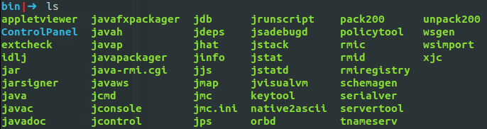
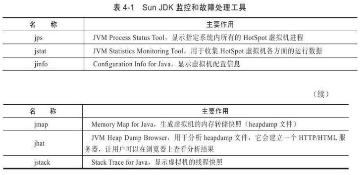
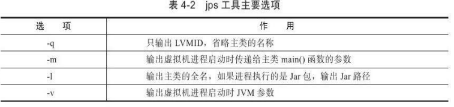
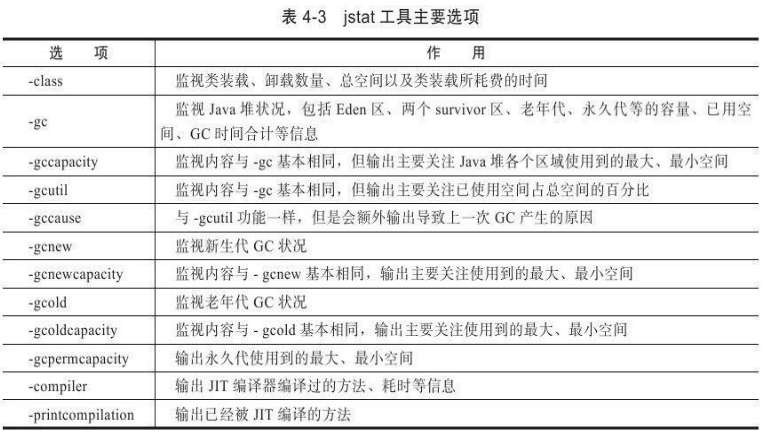
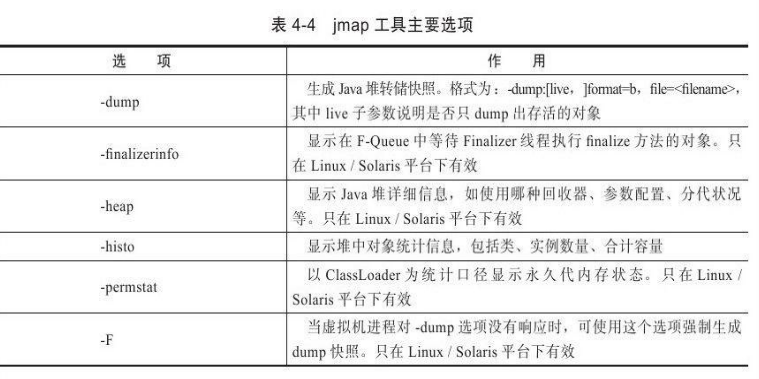
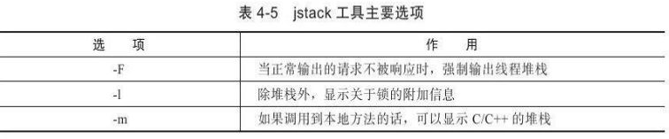

工具是运用知识处理数据的手段。这里说的数据包括:运行日志、异常堆栈、GC日志、线程快照(threaddump/javacore文件)、堆转储快照(heapdump/hprof文件)等

# JDK的命令行工具

JDK的bin目录中包含了很多工具





## jps:虚拟机进程状况工具

>  功能也和ps命令类似:
>
> 可以列出正在运行的虚拟机进程,并显示虚拟机执行主类(main()函数所在的类)名称
>
> 以及这些进程的本地虚拟机唯一ID(Local Virtual Machine Identifier,LVMID)

格式

```bash
jps[options][hostid]
```

jps执行样例:

```bash
D:\Develop\Java\jdk1.6.0_21\bin>jps-l
2388 D:\Develop\glassfish\bin\..\modules\admin-cli.jar
2764 com.sun.enterprise.glassfish.bootstrap.ASMain
3788 sun.tools.jps.Jps
```

hostid为RMI注册表中注册的主机名。也就是开启了RMI服务的远程虚拟机



## jstat:虚拟机统计信息监视工具

> 用于监视虚拟机各种运行状态信息
>
> 可以显示本地或者远程 虚拟机进程中的类装载、内存、垃圾收集、JIT编译等运行数据
>
> 在纯文本控制台环境的服务器上,它将是运行期定位虚拟机性能问题的首选工具。

jstat命令格式为:

```bash
jstat[option vmid[interval[s|ms][count]]]
```

**LVMID**，**VMID**：

- 虚拟机唯一ID

- 本地虚拟机进程VMID=LVMID

- 远程虚拟机进程，VMID格式：

  ```bash
  [protocol:][//]lvmid[@hostname[:port]/servername]
  ```

**interval，count**：

- 询间隔和次数

- 如果省略这两个参数,说明只查询一次

- 每250毫秒查询一次进程2764垃圾收集状况,一共查询20次：

  ```shell
  jstat -gc 2764 250 20
  ```

选项**option**，主要分三类：类装载、垃圾收集、运行期编译状况



jstat执行样例：

```bash
D:\Develop\Java\jdk1.6.0_21\bin>jstat -gcutil 2764	
#按百分比查看Java堆的使用状况Eden
#Survivor0 Survivor1 Eden 老年代 永久代 Minor GC 次数  Minor GC 耗时秒 Full GC 次数  Full GC 耗时秒 GC总耗时
S0 		S1 		E 		O 		P 		YGC 	YGCT	 FGC	FGCT 	GCT
0.00 	0.00 	6.20 	41.42 	47.20 	16 		0.105  		3 	0.472 	0.577
```


## jinfo:Java配置信息工具

> 实时地查看和调整虚拟机各项参数

-v: 查看虚拟机启动时显式指定的参数列表

-flag：没被显式指定的系统默认参数

-flag[+|-]name或者-flag name=value ： 修改一部分运行期可写的虚拟机参数值

-sysprops：虚拟机进程的System.getProperties()的内容打印出来

格式：

```
jinfo[option]pid
```

示例：查询CMSInitiatingOccupancyFraction参数值。

```shell
C:\>jinfo -flag CMSInitiatingOccupancyFraction 1444
-XX:CMSInitiatingOccupancyFraction=85
```


## jmap:Java内存映像工具

> 用于生成堆转储快照(一般称为heapdump或dump文件)
>
> 还可以查询finalize执行队列、Java堆和永久代的详细信息,如空间使用率、当前用的是哪种收集器等。

格式：

```
jmap[option]vmid
```

选项：



示例：生成一个正在运行的Eclipse的dump快照文件的例子,例子中的3500是通过jps命令查询到的LVMID

```bash
C:\Users\IcyFenix>jmap -dump:format=b,file=eclipse.bin 3500
Dumping heap to C:\Users\IcyFenix\eclipse.bin......
Heap dump file created
```


## jhat:虚拟机堆转储快照分析工具

>  与jmap搭配使用,来分析jmap生成的堆转储快照。
>
> jhat内置了一个微型的HTTP/HTML服务器,生成dump文件的分析结果后,可以在浏览器中查看

不推荐使用，原因：

- 一般不会在部署应用程序的服务器上直接分析dump文件,分析工作太耗资源。
- jhat的分析功能相对来说比较简陋。要用就用VisualVM，EclipseMemoryAnalyzer、IBM HeapAnalyzer 等

示例：

```bash
C:\Users\IcyFenix>jhat eclipse.bin
Reading from eclipse.bin......
Dump file created Fri Nov 19 22:07:21 CST 2010
Snapshot read,resolving......
Resolving 1225951 objects......
Chasing references,expect 245 dots......
Eliminating duplicate references......
Snapshot resolved.
Started HTTP server on port 7000
Server is ready.
```

用户在浏览器中键入http://localhost:7000/就可以看到分析结果

## jstack:Java堆栈跟踪工具

> 生成虚拟机当前时刻的线程快照(一般称为threaddump或者javacore文件)
>
> 线程快照就是当前虚拟机内每一条线程正在执行的方法堆栈的集合

主要目的是定位线程出现长时间停顿的原因,如线程间死锁、死循环、请求外部资源导致的长时间等待等都是导致线程长时间停顿的常见原因。通过jstack来查看各个线程的调用堆栈,就可以知道没有响应的线程到底在后台做些什么事情,或者等待着什么资源。

```
jstack[option]vmid
```

选项：



示例：jstack查看Eclipse线程堆栈的例子,例子中的3500是通过jps命令查询到的LVMID

```shell
C:\Users\IcyFenix>jstack -l 3500
2010-11-19 23:11:26
Full thread dump Java HotSpot(TM)64-Bit Server VM(17.1-b03 mixed mode):
"[ThreadPool Manager]-Idle Thread"daemon prio=6 tid=0x0000000039dd4000 nid=0xf50 in Object.wait()[0x000000003c96f000]
java.lang.Thread.State:WAITING(on object monitor)
at java.lang.Object.wait(Native Method)
-waiting on<0x0000000016bdcc60>(a org.eclipse.equinox.internal.util.impl.tpt.threadpool.Executor)
at java.lang.Object.wait(Object.java:485)
at org.eclipse.equinox.internal.util.impl.tpt.threadpool.Executor.run(Executor.java:106)
-locked<0x0000000016bdcc60>(a org.eclipse.equinox.internal.util.impl.tpt.threadpool.Executor)
Locked ownable synchronizers:
-None
```


在JDK 1.5中,java.lang.Thread类新增了一个getAllStackTraces()方法用于获取虚拟机中所有线程的StackTraceElement对象，可以通过简单的几行代码就完成jstack的大部分功能。

# JDK的可视化工具

还有两个功能强大的可视化工具:

- JConsole ： 虚拟机监控工具
- VisualVM ： 故障处理工具