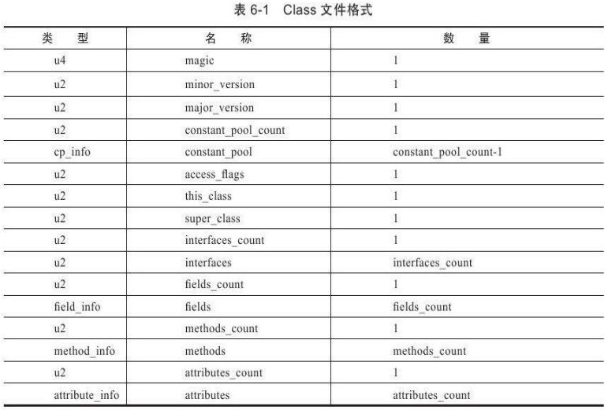

JVM只认得编译后的.class文件，并不在意编程时使用的语言，所以Java，scala等都能跑在JVM上。

# Class类文件的结构

Class文件是一组以8位字节为基础单位的二进制流,各个数据项目严格按照顺序紧凑地排列在Class文件之中,中间没有添加任何分隔符,这使得整个Class文件中存储的内容几乎全部是程序运行的必要数据,没有空隙存在。

当遇到需要占用8位字节以上空间的数据项时,则会按照高位在前 的方式分割成若干个8位字节进行存储。

Class文件格式采用一种类似于C语言结构体的伪结构来存储数据,这种伪结构中只有两种数据类型:**无符号数和表**

- **无符号数**属于基本的数据类型,以u1、u2、u4、u8来分别代表1个字节、2个字节、4个字节和8个字节的无符号数,
  无符号数可以用来描述数字、索引引用、数量值或者按照UTF-8编码构成字符串值。

- **表**是由多个无符号数或者其他表作为数据项构成的复合数据类型,所有表都习惯性地
  以“_info”结尾

  表用于描述有层次关系的复合结构的数据,整个Class文件本质上就是一张表




本章中会用到的示例代码

```java
package org.fenixsoft.clazz;
public class TestClass{
	private int m;
	public int inc(){
		return m+1;
	}
}
```


## 魔数与Class文件的版本

每个Class文件的头4个字节称为魔数(Magic Number),它的唯一作用是确定这个文件是否为一个能被虚拟机接受的Class文件。

很多文件存储标准中都使用魔数来进行身份识别,譬如图片格式,如gif或者jpeg等在文件头中都存有魔数。作用类似后缀，但无法随意改动。Class文件的魔数的获得很有“浪漫气息”,值为:0xCAFEBABE(咖啡宝贝?)

紧接着魔数的4个字节存储的是Class文件的版本号:第5和第6个字节是次版本号(Minor Version),第7和第8个字节是主版本号(Major Version)。Java的版本号是从45开始的,JDK 1.1之后的每个JDK大版本发布主版本号向上加1(JDK1.0~1.1使用了45.0~45.3的版本号)。虚拟机拒绝执行超过其版本号的Class文件


## 常量池

紧接着主次版本号之后的是常量池入口,常量池可以理解为Class文件之中的资源仓库。

由于常量池中常量的数量是不固定的,所以在常量池的入口需要放置一项u2类型的数据,代表常量池容量计数值。这个值是从1开始计数，“不引用任何一个常量池项目”的情况就可以把索引值置为0来表示。

常量池中主要存放两大类常量:**字面量**(Literal)和**符号引用**(Symbolic References)。

- **字面量**比较接近于Java语言层面的常量概念,如文本字符串、声明为final的常量值等。

- **符号引用**则属于编译原理方面的概念,包括了下面三类常量

  - 类和接口的全限定名(Fully Qualified Name)
  - 字段的名称和描述符(Descriptor)
  - 方法的名称和描述符

  原因是在Class文件中不会保存各个方法、字段的最终内存布局信息,因此这些字段、方法的符号引用不经过运行期转换的话无法得到真正的内存入口地址,也就无法直接被虚拟机使用。

常量池中每一项常量都是一个表，14种表都有一个共同的特点,就是表开始的第一位是一个u1类型的标志位(tag,取值见表6-3中标志列),代表当前这个常量属于哪种常量类型。


### CONSTANT_Class_info

常量池的第一项常量,它的标志位(偏移地址:0x0000000A)是0x07这个常量属于CONSTANT_Class_info类型,此类型的常量代表一个类或者接口的符号引用。


然后，name_index是一个索引值,它指向常量池中一个CONSTANT_Utf8_info类型常量,此常量代表了这个类(或者接口)的全限定名，这里name_index值,也即是指向了常量池中的第二项常量。

### CONSTANT_Utf8_info

第二项常量,它的标志位(地址:0x0000000D)是0x01,是一个CONSTANT_Utf8_info类型的常量。


length值说明了这个UTF-8编码的字符串长度是多少字节。后面紧跟着的长度为length字节的连续数据是一个使用UTF-8缩略编码表示的字符串。

由于Class文件中方法、字段等都需要引用CONSTANT_Utf8_info型常量来描述名称,所以CONSTANT_Utf8_info型常量，而这里的最大长度就是length的最大值,既u2类型能表达的最大值65535。所以Java程序中如果定义了超过64KB英文字符的变量或方法名,将会无法编译。

使用Javap命令输出常量表 ： 

```
C:\>javap-verbose TestClass
Compiled from"TestClass.java"
public class org.fenixsoft.clazz.TestClass extends java.lang.Object
SourceFile:"TestClass.java"
minor version:0major version:50
Constant pool:
const#1=class#2;//org/fenixsoft/clazz/TestClass
const#2=Asciz org/fenixsoft/clazz/TestClass;
const#3=class#4;//java/lang/Object
const#4=Asciz java/lang/Object;
const#5=Asciz m;
const#6=Asciz I;
const#7=Asciz<init>;
const#8=Asciz()V;
const#9=Asciz Code;
const#10=Method#3.#11;//java/lang/Object."<init>":()V
const#11=NameAndType#7:#8;//"<init>":()V
const#12=Asciz LineNumberTable;
const#13=Asciz LocalVariableTable;
const#14=Asciz this;
const#15=Asciz Lorg/fenixsoft/clazz/TestClass;
const#16=Asciz inc;
const#17=Asciz()I;
const#18=Field#1.#19;//org/fenixsoft/clazz/TestClass.m:I
const#19=NameAndType#5:#6;//m:I
const#20=Asciz SourceFile;
const#21=Asciz TestClass.java;
```


仔细看一下会发现,其中有一些常量似乎从来没有在代码中出现过,如“I”、“V”、“<init>”、“LineNumberTable”、“LocalVariableTable”等。它们会被后面即将讲到的字段表(field_info)、方法表(method_info)、属性表(attribute_info)引用到,它们会用来描述一些不方便使用“固定字节”进行表达的内容。譬如描述方法的返回值是什么?有几个参数?每个参数的类型是什么?

## 访问标志

在常量池结束之后,紧接着的两个字节代表访问标志(access_flags),这个标志用于识别一些类或者接口层次的访问信息,包括:这个Class是类还是接口;是否定义为public类型;是否定义为abstract类型;如果是类的话,是否被声明为final等。


当前只定义了其中8个 ,没有使用到的标志位要求一律为0。

比如：TestClass是一个普通Java类,不是接口、枚举或者注解,被public关键字修饰但没有被声明为final和abstract。并且它使用了JDK 1.2之后的编译器进行编译,因此它的ACC_PUBLIC、ACC_SUPER标志应当为真,而ACC_FINAL、ACC_INTERFACE、ACC_ABSTRACT、ACC_SYNTHETIC、ACC_ANNOTATION、ACC_ENUM这6个标志应当为假。因此它的access_flags的值应为:0x0001|0x0020=0x0021


## 类索引、父类索引与接口索引集合

类索引(this_class)和父类索引(super_class)都是一个u2类型的数据,而接口索引集合(interfaces)是一组u2类型的数据的集合,Class文件中由这三项数据来确定这个类的继承关系。

类索引用于确定这个类的全限定名,父类索引用于确定这个类的父类的全限定名。

- 父类索引。Java不允许多继承，所以只有一个。除了java.lang.Object之外,所有的Java类都有父类,因此除了java.lang.Object外,所有Java类的父类索引都不为0。
- 接口索引。接口索引集合就用来描述这个类实现了哪些接口。这些被实现的接口将按implements语句后的接口顺序从左到右排列在接口索引集合中

类索引和父类索引用两个u2类型的索引值表示,它们各自指向一个类型为CONSTANT_Class_info的类描述符常量，然后在CONSTANT_Utf8_info中找到全限定名字符串。


对于接口索引集合,入口的第一项——u2类型的数据为接口计数器(interfaces_count),表示索引表的容量。如果该类没有实现任何接口,则该计数器值为0,后面接口的索引表不再占用任何字节。


## 字段表集合

字段(field)包括类级变量以及实例级变量,但不包括在方法内部声明的局部变量。

可以包括的信息有:字段的作用域(public、private、protected修饰符)、是实例变量还是类变量(static修饰符)、可变性(final)、并发可见性(volatile修饰符,是否强制从主内存读写)、可否被序列化(transient修饰符)、字段数据类型(基本类型、对象、数组)、字段名称。这些都可以用布尔值表示。而字段叫什么名字、字段被定义为什么数据类
型,这些都是无法固定的,只能引用常量池中的常量来描述。

所以字段表的结构为


access_flags与类中的access_flags项目是非常类似的


跟随access_flags标志的是两项索引值:name_index和descriptor_index。它们都是对常量池的引用,分别代表着字段的简单名称以及字段和方法的描述符。

现在需要解释一下“简单名称”、“描述符”以及前面出现过多次的“全限定名”这三种特殊字符串的概念。

- **全限定名**
  “org/fenixsoft/clazz/TestClass”就是类的全限定名,仅仅是把类全名中的“.”替换成了“/”而已,为了使连续的多个全限定名之间不产生混淆,在使用时最后一般会加入一个“;”表示全限定名结束

- **简单名称**
  指没有类型和参数修饰的方法或者字段名称,这个类中的inc()方法和m字段的简单名称分别是“inc”和“m”。

- **描述符**

  描述符的作用是用来描述字段的数据类型、方法的参数列表(包括数量、类型以及顺序)和返回值。

  基本数据类型(byte、char、double、float、int、long、short、boolean)以及代表无返回值的void类型都用一个大写字符来表示,而对象类型则用字符L加对象的全限定名来表示

  

  - 对于数组类型,每一维度将使用一个前置的“[”字符来描述,如一个定义为“java.lang.String[][]”类型的二维数组,将被记录为:“[[Ljava/lang/String;”，一个整型数组“int[]”将被记录为“[I”。


- name_index 字段的简单名称： CONSTANT_Utf8_info .简单名称是指没有类型和参数修饰的方法或者字段名称,这个类中的inc()方法和m字段的简单名称分别是“inc”和“m”
- descriptor_index 字段的描述符:  CONSTANT_Utf8_info .字段的数据类型、方法的参数列表之类的
- attribute_info ： 一些多余的信息，比如声明final static int m=123时

！！不会列出继承过来的字段，所以字段是无法重载的


## 方法表集合

结构和字段表一样，访问标志synchronized之类的部分有一点不同


如果父类方法在子类中没有被重写(Override),方法表集合中就不会出现来自父类的方法信息

.png)


## 属性表(attribute_info)

字段表、方法表都可以携带自己的属性表集合,以用于描述某些场景专有的信息。不再要求各个属性表具有严格顺序,并且只要不与已有属性名重复,任何人实现的编译器都可以向属性表中写入自己定义的属性信息,Java虚拟机运行时会忽略掉它不认识的属性。

.png)

.png)

.png)

### 1.Code属性

方法体编译后的字节码。接口或者抽象类中的方法就不存在Code属性

### 2.Exceptions属性

列举出方法中可能抛出的受查异常(Checked Excepitons),也就是方法描述时在throws关键字后面列举的异常

### 3.LineNumberTable属性

描述Java源码行号与字节码行号(字节码的偏移量)之间的对应关系。因为有它所以在抛异常时会输出异常的行号。没有也没关系

### 4.LocalVariableTable属性

描述栈帧中局部变量表中的变量与Java源码中定义的变量之间的关系。如果没有这项，当其他人引用这个方法时,所有的参数名称都将会丢失,IDE将会使用诸如arg0、arg1之类的占位符代替原有的参数名。没有也没关系

### 5.SourceFile属性

记录生成这个Class文件的源码文件名称。也是可选的。对于大多数的类来说,类名和文件名是一致的，除了内部类。没有的话抛异常时不会显示文件名。

### 6.ConstantValue属性

通知虚拟机自动为静态变量赋值。只有被static关键字修饰的变量(类变量)才可以使用这项属性
关于“int x=123”和“static int x=123”：

非static类型的变量的赋值是在实例构造器<init>方法中进行的
对于类变量,则有两种方式可以选择:
- 在类构造器<clinit>方法中
- 使用ConstantValue属性
  目前static final的字符串或基本类型时ConstantValue，不然则是<clinit>

### 7.InnerClasses属性

记录内部类与宿主类之间的关联

### 8.Deprecated及Synthetic属性

两个属性都属于标志类型的布尔属性,只存在有和没有的区别
- Deprecated属性用于表示某个类、字段或者方法,已经被程序作者定为不再推荐使用,它可以通过在代码中使用@deprecated注释
- Synthetic属性代表此字段或者方法并不是由Java源码直接产生的,而是由编译器自行添加的

### 9.StackMapTable属性

位于Code属性的属性表中
这个属性会在虚拟机类加载的字节码验证阶段被新类型检查验证器(Type Checker)使用，目的在于代替以前比较消耗性能的基于数据流分析的类型推导验证器。

### 10.Signature属性

记录泛型类型
因为Java语言的泛型采用的是擦除法实现的伪泛型,在字节码(Code属性)中,泛型信息编译(类型变量、参数化类型)之后都通通被擦除掉。节省一些类型所占的内存空间

### 11.BootstrapMethods属性

用于保存invokedynamic指令引用的引导方法限定符。