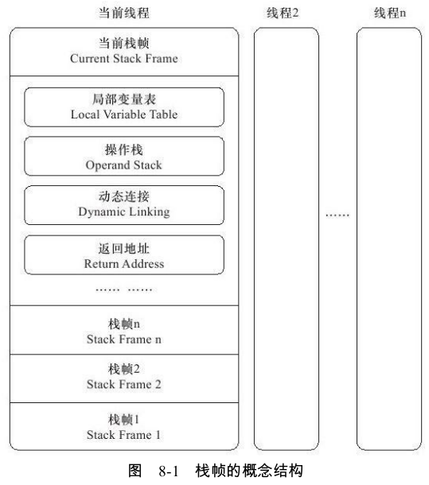
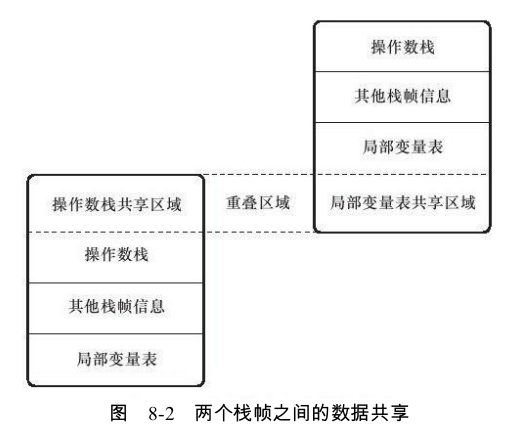
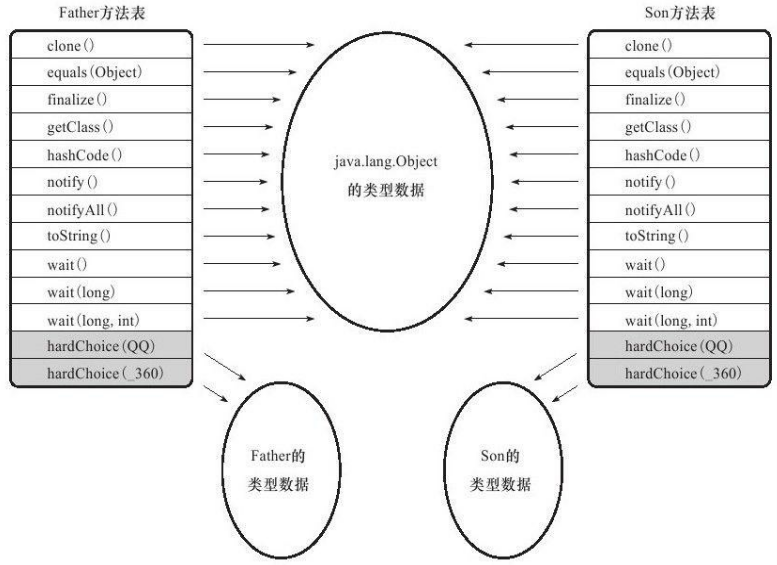

# 运行时栈帧结构

栈帧(Stack Frame)是用于支持虚拟机进行方法调用和方法执行的数据结构,它是虚拟机运行时数据区中的虚拟机栈(Virtual Machine Stack) 的栈元素。

栈帧存储了方法的局部变量表、操作数栈、动态连接和方法返回地址等信息。每一个方法从调用开始至执行完成的过程,都对应着一个栈帧在虚拟机栈里面从入栈到出栈的过程。写入到方法表的Code属性之中 ,因此一个栈帧需要分配多少内存,不会受到程序运行期变量数据的影响。


一个线程中的方法调用链可能会很长,很多方法都同时处于执行状态。对于执行引擎来说,在活动线程中,只有位于栈顶的栈帧才是有效的,称为当前栈帧。与这个栈帧相关联的方法称为当前方法。



## 局部变量表

存放方法参数和方法内部定义的局部变量。

它是以变量槽（Variable Slot）为最小单位，每一个Slot（32位）都应该能放一个 boolean 、byte 、char 、float 、 reference 、 short 、 int 或 returnAddress 类型数据。而至于 long 、double 两种数据则被规定为是64位数据（连续两个32位）。 *reference类型数据可能是32位，也可能是64位数据*


## 操作数栈

它是一个后入先出栈

操作数栈的最大深度也在编译的时候就被写入到code属性的 `max_stacks` 数据项之中。

例如,在做算术运算的时候是通过操作数栈来进行的,又或者在调用其他方法的时候是通过操作数栈来进行参数传递的。举个例子,整数加法的字节码指令iadd在运行的时候操作数栈中最接近栈顶的两个元素已经存入了两个int型的数值,当执行这个指令时,会将这两个int值出栈并相加,然后将相加的结果入栈。

在概念模型中，两个栈帧相互之间是完全独立的，但是大多数虚拟机会做一些优化处理，令两个栈帧出现一部分重叠，这样在方法调用时就可以公用一部分数据，无须进行额外的参数复制传递的操作。如下图示：



## 动态连接

每个栈帧都包含一个指向运行时常量池 中该栈帧所属方法的引用,持有这个引用是为了支持方法调用过程中的动态连接。

符号引用一部分会在类加载阶段或者第一次使用的时候就转化为直接引用,这种转化称为静态解析。另外一部分将在每一次运行期间转化为直接引用,这部分称为动态连接。


## 方法返回地址

当一个方法开始执行后,只有两种方式可以退出这个方法。

- 正常退出。这时候可能会有返回值传递给上层的方法调用者。调用者的PC计数器的值可以作为返回地址
- 异常退出。返回地址是要通过异常处理器表来确定的,栈帧中一般不会保存这部分信息

无论采用何种退出方式,在方法退出之后,都需要返回到方法被调用的位置,程序才能继续执行,方法返回时可能需要在栈帧中保存一些信息,用来帮助恢复它的上层方法的执行状态。


# 方法调用

方法调用并不等同于方法执行,方法调用阶段唯一的任务就是确定被调用方法的版本(即调用哪一个方法),暂时还不涉及方法内部的具体运行过程。

## 解析

调用目标在程序代码写好、编译器进行编译时就必须确定下来。这类方法的调用称为解析(Resolution)

满足这个条件的方法，大致有主要包括静态方法和私有方法两大类,前者与类型直接关联,后者在外部不可被访问，它们都不可能通过继承或别的方式重写。

解析调用一定是个静态的过程,在编译期间就完全确定,在类装载的解析阶段就会把涉及的符号引用全部转变为可确定的直接引用,不会延迟到运行期再去完成。

而分派(Dispatch)调用则可能是静态的也可能是动态的,根据分派依据的宗量数 可分为单分派和多分派。这两类分派方式的两两组合就构成了静态单分派、静态多分派、动态单分派、动态多分派4种分派组合情况


## 分派

本节讲解的分派调用过程将会揭示多态性特征的一些最基本的体现,如“重载”和“重写”在Java虚拟机之中是如何实现的

### 1.静态分派

```java
package org.fenixsoft.polymorphic;
/**
*方法静态分派演示
*@author zzm
*/
public class StaticDispatch{
    static abstract class Human{
    }
    static class Man extends Human{
    }
    static class Woman extends Human{
    }
    public void sayHello(Human guy){
    	System.out.println("hello,guy!");
    }
    public void sayHello(Man guy){
    	System.out.println("hello,gentleman!");
    }
    public void sayHello(Woman guy){
    	System.out.println("hello,lady!");
    }
    public static void main(String[]args){
        Human man=new Man();
        Human woman=new Woman();
        StaticDispatch sr=new StaticDispatch();
        sr.sayHello(man);	//参数的静态类型决定使用哪个重载版本
        sr.sayHello(woman);
    }
}
---
out：
hello,guy!
hello,guy!
```


```java
//实际类型变化
Human man=new Man();
man=new Woman();
//静态类型变化
sr.sayHello((Man)man)
sr.sayHello((Woman)man)
```

- 静态类型变化 ： 仅仅在使用时发生,变量本身的静态类型不会被改变,并且最终的静态类型是在编译期可知的
- 实际类型变化 ： 结果在运行期才可确定,编译器在编译程序的时候并不知道一个对象的实际类型是什么。

依赖静态类型来定位方法执行版本的分派动作称为静态分派。静态分派的典型应用是方法重载。而他只能通过语言上的规则去理解和推断

重载方法匹配优先级:

```java
package org.fenixsoft.polymorphic;
public class Overload{
    public static void sayHello(Object arg){
    	System.out.println("hello Object");
    }
    public static void sayHello(int arg){
    	System.out.println("hello int");
    }
    public static void sayHello(long arg){
 	   System.out.println("hello long");
    }
    public static void sayHello(Character arg){
    	System.out.println("hello Character");
    }
    public static void sayHello(char arg){
    	System.out.println("hello char");
    }
    public static void sayHello(char......arg){
    	System.out.println("hello char......");
    }
    public static void sayHello(Serializable arg){
    	System.out.println("hello Serializable");
    }
    public static void main(String[]args){
    	sayHello('a');
    }
}
---
out
hello char
```

如果把char的重载方法注释，它将输出hello int

按照char->int->long->float->double的顺序转型进行匹配。但不会匹配到byte和short类型的重载,因为char到byte或short的转型是不安全的。


### 2.动态分派

接下来看一下动态分派的过程,它和多态性的另外一个重要体现 ——重写(Override)有着很密切的关联。

```java
package org.fenixsoft.polymorphic;
/**
*方法动态分派演示
*@author zzm
*/
public class DynamicDispatch{
    static abstract class Human{
    	protected abstract void sayHello();
    }
    static class Man extends Human{
        @Override
        protected void sayHello(){
            System.out.println("man say hello");
        }
    }
    static class Woman extends Human{
        @Override
        protected void sayHello(){
        	System.out.println("woman say hello");
        }
    }
    public static void main(String[]args){
        Human man=new Man();
        Human woman=new Woman();
        man.sayHello();
        woman.sayHello();
        man=new Woman();
        man.sayHello();
    }
}
---
man say hello
woman say hello
woman say hello
```

如何实现的？

1)找到操作数栈顶的第一个元素所指向的对象的实际类型,记作C。
2)如果在类型C中找到与常量中的描述符和简单名称都相符的方法,则进行访问权限校验,如果通过则返回这个方法的直接引用,查找过程结束;如果不通过,则返回java.lang.IllegalAccessError异常。
3)否则,按照继承关系从下往上依次对C的各个父类进行第2步的搜索和验证过程。
4)如果始终没有找到合适的方法,则抛出java.lang.AbstractMethodError异常。

我们把这种在运行期根据实际类型确定方法执行版本的分派过程称为动态分派。


### 3.单分派与多分派

方法的接收者与方法的参数统称为方法的宗量。基于多少种宗量,可以将分派划分为单分派和多分派。

```java
/**
*单分派、多分派演示
*@author zzm
*/
public class Dispatch{
static class QQ{}
static class_360{}
public static class Father{
    public void hardChoice(QQ arg){
    	System.out.println("father choose qq");
    }
    public void hardChoice(_360 arg){
    	System.out.println("father choose 360");
    }
    }
    public static class Son extends Father{
        public void hardChoice(QQ arg){
        	System.out.println("son choose qq");
        }
        public void hardChoice(_360 arg){
        	System.out.println("son choose 360");
        }
    }
    public static void main(String[]args){
        Father father=new Father();
        Father son=new Son();
        father.hardChoice(new_360());
        son.hardChoice(new QQ());
    }
}
---
father choose 360
son choose qq
```

这时选择目标方法的依据有两点:一是静态类型是Father还是Son,二是方法参数是QQ还是360。

最终产物是产生了两条指令,两条指令的参数分别为常量池中指向Father.hardChoice(360)Father.hardChoice(QQ)方法的符号引用。因为是根据两个宗量进行选择,所以Java语言的静态分派属于多分派类型。

动态分派的过程。在执行“son.hardChoice(newQQ())”这句代码时,由于编译期已经决定目标方法的签名必须为hardChoice(QQ),虚拟机此时不会关心传递过来的参数“QQ”到底是“腾讯QQ”还是“奇瑞QQ”,因为这时参数的静态类型、实际类型都对方法的选择不会构成任何影响,唯一可以影响虚拟机选择的因素只有此方法的接受者的实际类型是Father还是Son。因为只有一个宗量作为选择依据,所以Java语言的动态分派属于单分派类型。


根据上述论证的结果,我们可以总结一句:今天的Java语言是一门静态多分派、动态单分派的语言。

### 4.虚拟机动态分派的实现

由于动态分派是非常频繁的动作,面对这种情况,最常用的“稳定优化”手段就是为类在方法区中建立一个虚方法表。



