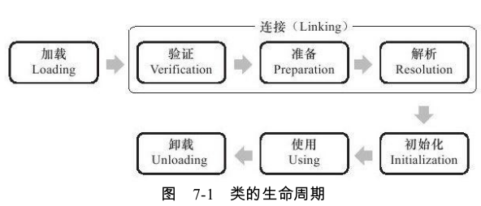
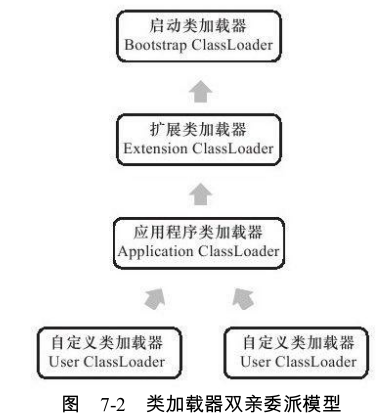

# 类的加载时机

加载、验证、准备、初始化和卸载这5个阶段的顺序是确定的
解析阶段则不一定:它在某些情况下可以在初始化阶段之后再开始,这是为了支持Java语言的运行时绑定

有5种情况必须立即对类进行“初始化”(而加载、验证、准备自然需要在此之前开始)
1)遇到new、getstatic、putstatic或invokestatic这4条字节码指令时。也就是使用new关键字实例化对象的时候、读取或设置一个类的静态字段的时候,以及调用一个类的静态方法的时候。

2)使用java.lang.reflect包的方法对类进行反射调用的时候,如果类没有进行过初始化,
则需要先触发其初始化。

3)当初始化一个类的时候,如果发现其父类还没有进行过初始化,则需要先触发其父
类的初始化。

4)当虚拟机启动时,用户需要指定一个要执行的主类

5)当使用JDK1.7的动态语言支持时

这5种场景中的行为称为对一个类进行主动引用。
相反也有被动引用，此时不会加载，比如：

1. 通过其子类来引用父类中定义的静态字段,只会触发父类的初始化而不会触发子类的初始化
2. 通过数组定义来引用类,不会触发此类的初始化
3. 常量在编译阶段会存入调用类的常量池中,本质上并没有直接引用到定义常量的类,因此不会触发定义常量的类的初始化。

类初始化与接口初始化的不同：一个接口在初始化时,并不要求其父接口全部都完成了初始化,只有在真正使用到父接口的时候才会初始化。

# 类的加载过程

## 加载

在加载阶段,虚拟机需要完成以下3件事情:
1)通过一个类的全限定名来获取定义此类的二进制字节流。
2)将这个字节流所代表的静态存储结构转化为方法区的运行时数据结构。
3)在内存中生成一个代表这个类的java.lang.Class对象,作为方法区这个类的各种数据的访问入口

## 验证

这一阶段的目的是为了确保Class文件的字节流中包含的信息符合当前虚拟机的要求,并且不会危害虚拟机自身的安全。

验证阶段大致上会完成下面4个阶段的检验动作:
文件格式验证、元数据验证、字节码验证、符号引用验证。

1.文件格式验证
第一阶段要验证字节流是否符合Class文件格式的规范,并且能被当前版本的虚拟机处
理。这一阶段可能包括下面这些验证点:
是否以魔数0xCAFEBABE开头。版本号是否在当前虚拟机处理范围之内。CONSTANT_Utf8_info型的常量中是否有不符合UTF8编码的数据。等等等

2.元数据验证
对字节码描述的信息进行语义分析。这个阶段可能包括的验证点如下:
这个类是否有父类。父类是否继承了不允许被继承的类、如果这个类不是抽象类,是否实现了其父类或接口之中要求实现的所有方法。等等等

3.字节码验证
最复杂的一个阶段,主要目的是通过数据流和控制流分析,确定程序语义是合法的、符合逻辑的。

例如:
保证任意时刻操作数栈的数据类型与指令代码序列都能配合工作,例如不会出现类似这样的情况:在操作栈放置了一个int类型的数据,使用时却按long类型来加载入本地变量表中。

4.符号引用验证
这个转化动作将在连接的第三阶段——解析阶段中发生。
对类自身以外(常量池中的各种符号引用)的信息进行匹配性校验,通常需要校验下列内容:
符号引用中通过字符串描述的全限定名是否能找到对应的类。符号引用中的类、字段、方法的访问性(private、protected、public、default)是否可被当前类访问。等等

## 准备

准备是正式为类变量分配内存并设置类变量初始值的阶段,这些变量所使用的内存都将在方法区中进行分配。

这个阶段中有两个容易产生混淆的概念需要强调一下,首先,这时候进行内存分配的仅包括类变量(被static修饰的变量),而不包括实例变量,实例变量将会在对象实例化时随着对象一起分配在Java堆中。其次,这里所说的初始值“通常情况”下是数据类型的零值

也就是说“static value = 123”中，value赋值为123的动作将在初始化阶段

## 解析

将常量池内的符号引用替换为直接引用的过程
直接引用与符号引用又有什么关联呢?

- 符号引用(Symbolic References):符号引用以一组符号来描述所引用的目标,符号可以是任何形式的字面量,只要使用时能无歧义地定位到目标即可。

- 直接引用(Direct References):直接引用可以是直接指向目标的指针、相对偏移量或是一个能间接定位到目标的句柄。如果有了直接引用,那引用的目标必定已经在内存中存在。

### 1.类或接口的解析

假设当前代码所处的类为D,如果要把一个从未解析过的符号引用N解析为一个类或接
口C的直接引用,那虚拟机完成整个解析的过程需要以下3个步骤:
1)如果C不是一个数组类型,那虚拟机将会把代表N的全限定名传递给D的类加载器去
加载这个类C。如果有必要可能去要中途去加载父类

2)如果C是一个数组类型,并且数组的元素类型为对象,也就是N的描述符会是类
似“[Ljava/lang/Integer”的形式（Integer[]）,那将会按照第1点的规则加载数组元素类型。如果N的描述符
如前面所假设的形式,需要加载的元素类型就是“java.lang.Integer”,接着由虚拟机生成一个代表此数组维度和元素的数组对象。

3)如果上面的步骤没有出现任何异常,那么C在虚拟机中实际上已经成为一个有效的类
或接口了,但在解析完成之前还要进行符号引用验证,确认D是否具备对C的访问权限。如
果发现不具备访问权限,将抛出java.lang.IllegalAccessError异常。

### 2.字段解析

1)如果C本身就包含了简单名称和字段描述符都与目标相匹配的字段,则返回这个字段的直接引用,查找结束。

2)否则,如果在C中实现了接口,将会按照继承关系从下往上递归搜索各个接口和它的父接口,如果接口中包含了简单名称和字段描述符都与目标相匹配的字段,则返回这个字段的直接引用,查找结束。

3)否则,如果C不是java.lang.Object的话,将会按照继承关系从下往上递归搜索其父类,如果在父类中包含了简单名称和字段描述符都与目标相匹配的字段,则返回这个字段的直接引用,查找结束。

4)否则,查找失败,抛出java.lang.NoSuchFieldError异常。

### 3.类方法解析

1)类方法和接口方法符号引用的常量类型定义是分开的,如果在类方法表中发现
class_index中索引的C是个接口,那就直接抛出java.lang.IncompatibleClassChangeError异常

2)如果通过了第1步,在类C中查找是否有简单名称和描述符都与目标相匹配的方法,如果有则返回这个方法的直接引用,查找结束。

3)否则,在类C的父类中递归查找是否有简单名称和描述符都与目标相匹配的方法,如果有则返回这个方法的直接引用,查找结束。

4)否则,在类C实现的接口列表及它们的父接口之中递归查找是否有简单名称和描述符都与目标相匹配的方法,如果存在匹配的方法,说明类C是一个抽象类,这时查找结束,抛出java.lang.AbstractMethodError异常。

5)否则,宣告方法查找失败,抛出java.lang.NoSuchMethodError。

最后,如果查找过程成功返回了直接引用,将会对这个方法进行权限验证,如果发现不具备对此方法的访问权限,将抛出java.lang.IllegalAccessError异常。

### 4.接口方法解析

1)与类方法解析不同,如果在接口方法表中发现class_index中的索引C是个类而不是接口,那就直接抛出java.lang.IncompatibleClassChangeError异常

2)否则,在接口C中查找是否有简单名称和描述符都与目标相匹配的方法,如果有则返回这个方法的直接引用,查找结束

3)否则,在接口C的父接口中递归查找,直到java.lang.Object类(查找范围会包括Object类)为止,看是否有简单名称和描述符都与目标相匹配的方法,如果有则返回这个方法的直接引用,查找结束。

4)否则,宣告方法查找失败,抛出java.lang.NoSuchMethodError异常。

由于接口中的所有方法默认都是public的,所以不存在访问权限的问题


## 初始化

到了初始化阶段,才真正开始执行类中定义的Java程序代码。

初始化阶段是执行类构造器`<clinit>`()方法的过程。我们在下文会讲解`<clinit>`()方法是怎么生成的,在这里,我们先看一下`<clinit>`()方法执行过程中一些可能会影响程序运行行为的特点和细节

- `<clinit>`()方法是由编译器自动收集类中的所有类变量的赋值动作和静态语句块(static{}块)中的语句合并产生的,编译器收集的顺序是由语句在源文件中出现的顺序所决定的,静态语句块中只能访问到定义在静态语句块之前的变量

- `<clinit>`()方法与类的构造函数(或者说实例构造器`<init>`()方法)不同,它不需要显式地调用父类构造器,虚拟机会保证在子类的`<clinit>`()方法执行之前,父类的`<clinit>`()方法已经执行完毕。因此在虚拟机中第一个被执行的`<clinit>`()方法的类肯定是java.lang.Object。
- 接口中不能使用静态语句块,但仍然有变量初始化的赋值操作,因此接口与类一样都会生成`<clinit>`()方法。但接口与类不同的是,执行接口的`<clinit>`()方法不需要先执行父接口的`<clinit>`()方法。只有当父接口中定义的变量使用时,父接口才会初始化。另外,接口的实现类在初始化时也一样不会执行接口的`<clinit>`()方法。
- 如果多个线程同时去初始化一个类,那么只会有一个线程去执行这个类的`<clinit>`()方法,其他线程都需要阻塞等待,直到活动线程执行`<clinit>`()方法完毕。

# 类加载器

## 双亲委派模型

从Java虚拟机的角度来讲,只存在两种不同的类加载器:

- 一种是启动类加载器(Bootstrap ClassLoader),这个类加载器使用C++语言实现 ,是虚拟机自身的一部分;

- 另一种就是所有其他的类加载器,这些类加载器都由Java语言实现,独立于虚拟机外部,并且全都继承自抽象类java.lang.ClassLoader


从Java开发人员的角度来看,类加载器还可以划分得更细致一些,绝大部分Java程序都会使用到以下3种系统提供的类加载器

- 启动类加载器(Bootstrap ClassLoader):前面已经介绍过,这个类将器负责将存放在<JAVA_HOME>\lib目录中的类库加载到虚拟机内存中。
  启动类加载器无法被Java程序直接引用,用户在编写自定义类加载器时,如果需要把加载请求委派给引导类加载器,那直接使用null代替即可

  ```java
  /**
  Returns the class loader for the class.Some implementations may use null to represent the bootstrap class loader.This method will return null in such
  implementations if this class was loaded by the bootstrap class loader.
  */
  public ClassLoader getClassLoader(){
  ClassLoader cl=getClassLoader0();
  if(cl==null)
  return null;
  SecurityManager sm=System.getSecurityManager();
  if(sm!=null){
  ClassLoader ccl=ClassLoader.getCallerClassLoader();
  if(ccl!=null&&ccl!=cl&&!cl.isAncestor(ccl)){
  sm.checkPermission(SecurityConstants.GET_CLASSLOADER_PERMISSION);
  }
  }
  return cl;
  }
  ```


- 扩展类加载器(Extension ClassLoader):这个加载器由sun.misc.Launcher$ExtClassLoader实现,它负责加载<JAVA_HOME>\lib\ext目录中的,或者被java.ext.dirs系统变量所指定的路径中的所有类库,开发者可以直接使用扩展类加载器。
- 应用程序类加载器(Application ClassLoader):这个类加载器由sun.misc.Launcher $AppClassLoader实现。由于这个类加载器是ClassLoader中的getSystemClassLoader()方法的返回值,所以一般也称它为系统类加载器。它负责加载用户类路径(ClassPath)上所指定的类库,开发者可以直接使用这个类加载器,如果应用程序中没有自定义过自己的类加载器,一般情况下这个就是程序中默认的类加载器。

这些类加载器之间的关系一般如图7-2所示。



这种层次关系,称为类加载器的双亲委派模型。其余的类加载器都应当有自己的父类加载器。这里类加载器之间的父子关系一般不会以继承(Inheritance)的关系来实现,而是都使用组合(Composition)关系来复用父加载器的代码。

双亲委派模型的工作过程是:如果一个类加载器收到了类加载的请求,它首先不会自己去尝试加载这个类,而是把这个请求委派给父类加载器去完成,每一个层次的类加载器都是如此,因此所有的加载请求最终都应该传送到顶层的启动类加载器中,只有当父加载器反馈自己无法完成这个加载请求(它的搜索范围中没有找到所需的类)时,子加载器才会尝试自己去加载。

使用双亲委派模型来组织类加载器之间的关系,有一个显而易见的好处就是Java类随着它的类加载器一起具备了一种带有优先级的层次关系。例如类java.lang.Object,它存放在rt.jar之中,无论哪一个类加载器要加载这个类,最终都是委派给处于模型最顶端的启动类加载器进行加载,因此Object类在程序的各种类加载器环境中都是同一个类。

代码清单7-10双亲委派模型的实现

```java
protected synchronized Class<?>loadClass(String name,boolean resolve)throws ClassNotFoundException
{
//首先,检查请求的类是否已经被加载过了
Class c=findLoadedClass(name);
if(c==null){
try{
if(parent!=null){
c=parent.loadClass(name,false);
}else{
c=findBootstrapClassOrNull(name);
}
}catch(ClassNotFoundException e){
//如果父类加载器抛出ClassNotFoundException
//说明父类加载器无法完成加载请求
}
if(c==null){
//在父类加载器无法加载的时候
//再调用本身的findClass方法来进行类加载
c=findClass(name);
}
}
if(resolve){
resolveClass(c);
}
return c
```


