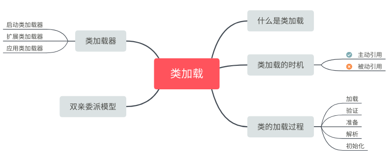

# 什么是类的加载

类的加载指的是将类的.class文件中的二进制数据读入到内存中，将其放在运行时数据区的方法区内，然后在堆区创建一个`java.lang.Class`对象，用来封装类在方法区内的数据结构。


# 类的加载时机


加载、验证、准备、初始化和卸载这5个阶段的顺序是确定的。解析阶段则不一定:它在某些情况下可以在初始化阶段之后再开始,这是为了支持Java语言的运行时绑定。

**有5种情况必须立即对类进行“初始化”**(而加载、验证、准备自然需要在此之前开始)：

1. new关键字实例化对象的时候、读取或设置一个类的静态字段的时候,以及调用一个类的静态方法的时候

2. 使用java.lang.reflect包的方法对类进行反射调用的时候
3. 当初始化一个类的时候,如果发现其父类还没有进行过初始化,则需要先触发其父类的初始化
4. 当虚拟机启动时,用户需要指定一个要执行的主类（带main的类）

5. 当使用JDK1.7的动态语言支持时

这5种场景中的行为称为对一个类进行主动引用。相反也有被动引用，此时不会加载，比如：

1. 通过其子类来引用父类中定义的静态字段,只会触发父类的初始化而不会触发子类的初始化
2. 通过数组定义来引用类,不会触发此类的初始化


# 类的加载过程

## 加载

在加载阶段,虚拟机需要完成以下3件事情:

1. 通过一个类的全限定名来获取定义此类的二进制字节流。
2. 将这个字节流所代表的静态存储结构转化为方法区的运行时数据结构。
3. 在内存中生成一个代表这个类的java.lang.Class对象,作为方法区这个类的各种数据的访问入口

加载阶段完成后，虚拟机外部的二进制字节流就按照虚拟机所需的格式存储在方法区之中，而且在Java堆中也创建一个`java.lang.Class`类的对象，这样便可以通过该对象访问方法区中的这些数据。

## 验证

确保Class文件的字节流中包含的信息符合当前虚拟机的要求

验证阶段大致上会完成下面4个阶段的检验动作:

1. **文件格式验证** ： 否符合Class文件格式的规范
   是否以魔数0xCAFEBABE开头。版本号是否在当前虚拟机处理范围之内。CONSTANT_Utf8_info型的常量中是否有不符合UTF8编码的数据。等等等

2. **元数据验证** ： 语义分析

   这个类是否有父类。父类是否继承了不允许被继承的类、如果这个类不是抽象类,是否实现了其父类或接口之中要求实现的所有方法。等等等

3. **字节码验证** ： 确定程序语义是合法的、符合逻辑的

   保证不会出现类似这样的情况:在操作栈放置了一个int类型的数据,使用时却按long类型来加载入本地变量表中。

4. **符号引用验证** : 确保解析动作能正确执行
   通过全限定名是否能找到对应的类。符号引用中的类、字段、方法的访问性(private、protected、public、default)是否可被当前类访问。等等

## 准备

为**静态变量**（被static修饰的变量）分配内存(在方法区)并设置类变量**初始值**的阶段。

不包括实例变量，实例变量会在对象实例化时（new 时）随着对象一块分配在Java堆中。此时的规则为：

- 这个初始值“通常情况”下是数据类型的零值，也就是说“static int value = 123”中，这个阶段只是把，value设置为0，而赋值为123的动作将在初始化阶段

- 如果类字段的字段属性表中存在`ConstantValue`属性，即同时被final和static修饰，那么在准备阶段变量value就会被初始化为所指定的值。

## 解析

将常量池内的符号引用替换为直接引用的过程

复习一下什么是直接引用与符号引用：

- **符号引用** ： 符号可以是任何形式的字面量,只要使用时能无歧义地定位到目标即可（好比相对地址），与实际的内存地址无关。
- **直接引用** ： 直接指向目标的指针、相对偏移量或是一个能间接定位到目标的句柄。

关于类，字段，方法的各个解析方式参考[这里](https://nnkwrik.github.io/2018/12/21/20181222/#3-%E7%B1%BB%E6%96%B9%E6%B3%95%E8%A7%A3%E6%9E%90)

## 初始化

为类的**静态变量**赋予正确的初始值，在静态变量进行初始值设定有两种方式：

- 声明类变量是指定初始值
- 使用静态代码块为类变量指定初始值

**JVM初始化步骤**

1. 假如这个类还没有被加载和连接，则程序先加载并连接该类

2. 假如该类的直接父类还没有被初始化，则先初始化其直接父类

3. 假如类中有初始化语句，则系统依次执行这些初始化语句

## 实例 ： 初始化顺序

初始化顺序在面试中出现的还是比较多的，在了解加载器之前先通过几个实例来了解初始化步骤。

### 实例1

顺序依次是（静态变量、静态初始化块）>（变量、初始化块）>构造器

```java
public class InitialOrderTest {
        /* 静态变量 */
    public static String staticField = "静态变量";
        /* 变量 */
    public String field = "变量";
        /* 静态初始化块 */
    static {
        System.out.println( staticField );
        System.out.println( "静态初始化块" );
    }
        /* 初始化块 */
    {
        System.out.println( field );
        System.out.println( "初始化块" );
    }
        /* 构造器 */
    public InitialOrderTest()
    {
        System.out.println( "构造器" );
    }


    public static void main( String[] args )
    {
        new InitialOrderTest();
    }
}
---
静态变量
静态初始化块
变量
初始化块
构造器
```

### 实例2

继承

```java
class Parent {
        /* 静态变量 */
    public static String p_StaticField = "父类--静态变量";
         /* 变量 */
    public String    p_Field = "父类--变量";
    protected int    i    = 9;
    protected int    j    = 0;
        /* 静态初始化块 */
    static {
        System.out.println( p_StaticField );
        System.out.println( "父类--静态初始化块" );
    }
        /* 初始化块 */
    {
        System.out.println( p_Field );
        System.out.println( "父类--初始化块" );
    }
        /* 构造器 */
    public Parent()
    {
        System.out.println( "父类--构造器" );
        System.out.println( "i=" + i + ", j=" + j );
        j = 20;
    }
}

public class SubClass extends Parent {
         /* 静态变量 */
    public static String s_StaticField = "子类--静态变量";
         /* 变量 */
    public String s_Field = "子类--变量";
        /* 静态初始化块 */
    static {
        System.out.println( s_StaticField );
        System.out.println( "子类--静态初始化块" );
    }
       /* 初始化块 */
    {
        System.out.println( s_Field );
        System.out.println( "子类--初始化块" );
    }
       /* 构造器 */
    public SubClass()
    {
        System.out.println( "子类--构造器" );
        System.out.println( "i=" + i + ",j=" + j );
    }


        /* 程序入口 */
    public static void main( String[] args )
    {
        System.out.println( "子类main方法" );
        new SubClass();
    }
}
---
父类--静态变量
父类--静态初始化块
子类--静态变量
子类--静态初始化块
子类main方法
父类--变量
父类--初始化块
父类--构造器
i=9, j=0
子类--变量
子类--初始化块
子类--构造器
i=9,j=20
```

### 分析

- (1)访问SubClass.main(),(这是一个static方法)，于是装载器就会为你寻找已经编译的SubClass类的代码（也就是SubClass.class文件）。在装载的过程中，装载器注意到它有一个基类（也就是extends所要表示的意思），于是它再装载基类。不管你创不创建基类对象，这个过程总会发生。如果基类还有基类，那么第二个基类也会被装载，依此类推。
- (2)执行根基类的static初始化，然后是下一个派生类的static初始化，依此类推。这个顺序非常重要，因为派生类的“static初始化”有可能要依赖基类成员的正确初始化。
- (3)当所有必要的类都已经装载结束，开始执行main()方法体，并用new SubClass（）创建对象。
- (4)类SubClass存在父类，则调用父类的构造函数，你可以使用super来指定调用哪个构造函数。基类的构造过程以及构造顺序，同派生类的相同。首先基类中各个变量按照字面顺序进行初始化，然后执行基类的构造函数的其余部分。
- (5)对子类成员数据按照它们声明的顺序初始化，执行子类构造函数的其余部分。


# 类加载器

寻找类加载器，先来一个小例子

```java
package com.neo.classloader;
public class ClassLoaderTest {
     public static void main(String[] args) {
        ClassLoader loader = Thread.currentThread().getContextClassLoader();
        System.out.println(loader);
        System.out.println(loader.getParent());
        System.out.println(loader.getParent().getParent());
    }
}
```

运行后，输出结果：

```
sun.misc.Launcher$AppClassLoader@64fef26a
sun.misc.Launcher$ExtClassLoader@1ddd40f3
null
```

从上面的结果可以看出，并没有获取到`ExtClassLoader`的父Loader，原因是`Bootstrap Loader`（引导类加载器）是用C语言实现的，找不到一个确定的返回父Loader的方式，于是就返回null。

> 注意：这里父类加载器并不是通过继承关系来实现的，而是采用组合实现的。

这几种类加载器的层次关系如下图所示：


站在Java开发人员的角度来看，类加载器可以大致划分为以下三类：

- **启动类加载器**：`Bootstrap ClassLoader`，负责加载存放在`JDK\jre\lib`(JDK代表JDK的安装目录，下同)下，或被`-Xbootclasspath`参数指定的路径中的，并且能被虚拟机识别的类库（如rt.jar，所有的java.*开头的类均被Bootstrap ClassLoader加载）。启动类加载器是无法被Java程序直接引用的。*

- **扩展类加载器**：Extension ClassLoader，该加载器由sun.misc.Launcher$ExtClassLoader实现，它负责加载JDK\jre\lib\ext目录中，或者由java.ext.dirs系统变量指定的路径中的所有类库（如javax.*开头的类），开发者可以直接使用扩展类加载器。
- **应用程序类加载器**：`Application ClassLoader`，该类加载器由`sun.misc.Launcher$AppClassLoader`来实现，它负责加载用户类路径（ClassPath）所指定的类，开发者可以直接使用该类加载器，如果应用程序中没有自定义过自己的类加载器，一般情况下这个就是程序中默认的类加载器。

**JVM类加载机制**

- **全盘负责**，当一个类加载器负责加载某个Class时，该Class所依赖的和引用的其他Class也将由该类加载器负责载入，除非显示使用另外一个类加载器来载入
- **父类委托**，先让父类加载器试图加载该类，只有在父类加载器无法加载该类时才尝试从自己的类路径中加载该类
- **缓存机制**，缓存机制将会保证所有加载过的Class都会被缓存

# 类的加载

类加载有三种方式：

- 1、命令行启动应用时候由JVM初始化加载
- 2、通过Class.forName()方法动态加载
- 3、通过ClassLoader.loadClass()方法动态加载

例子：

```java
package com.neo.classloader;
public class loaderTest { 
        public static void main(String[] args) throws ClassNotFoundException { 
                ClassLoader loader = HelloWorld.class.getClassLoader(); 
                System.out.println(loader); 
                //使用ClassLoader.loadClass()来加载类，不会执行初始化块 
                loader.loadClass("Test2"); 
                //使用Class.forName()来加载类，默认会执行初始化块 
                //Class.forName("Test2"); 
                //使用Class.forName()来加载类，并指定ClassLoader，false指定初始化时不执行静态块 
                //Class.forName("Test2", false, loader); 
        } 
}
```

demo类

```
public class Test2 { 
        static { 
                System.out.println("静态初始化块执行了！"); 
        } 
}
```

分别切换加载方式，会有不同的输出结果。

# 双亲委派模型

双亲委派模型的工作流程是：如果一个类加载器收到了类加载的请求，它首先不会自己去尝试加载这个类，而是把请求委托给父加载器去完成，依次向上，因此，所有的类加载请求最终都应该被传递到顶层的启动类加载器中，只有当父加载器在它的搜索范围中没有找到所需的类时，即无法完成该加载，子加载器才会尝试自己去加载该类。

双亲委派机制:

- 1、当`AppClassLoader`加载一个class时，它首先不会自己去尝试加载这个类，而是把类加载请求委派给父类加载器`ExtClassLoader`去完成。
- 2、当`ExtClassLoader`加载一个class时，它首先也不会自己去尝试加载这个类，而是把类加载请求委派给BootStrapClassLoader```去完成。
- 3、如果`BootStrapClassLoader`加载失败（例如在`$JAVA_HOME/jre/lib`里未查找到该class），会使用`ExtClassLoader`来尝试加载；
- 4、若ExtClassLoader也加载失败，则会使用`AppClassLoader`来加载，如果`AppClassLoader`也加载失败，则会报出异常`ClassNotFoundException`。


# 参考文章

[jvm系列(一):java类的加载机制](http://www.ityouknow.com/jvm/2017/08/19/class-loading-principle.html)

[Java类初始化顺序](https://segmentfault.com/a/1190000004527951)
[深入理解Java虚拟机-第7章-虚拟机类加载机制](https://nnkwrik.github.io/2018/12/21/20181222/)