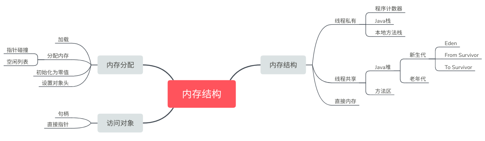
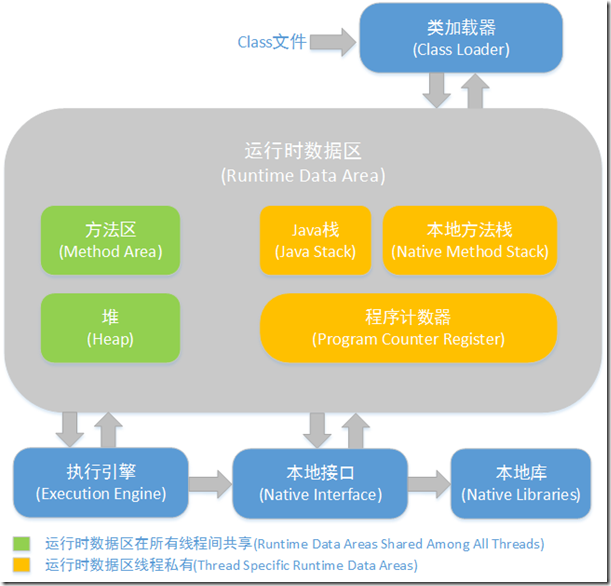
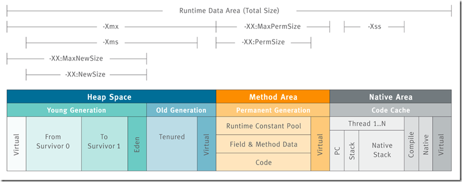
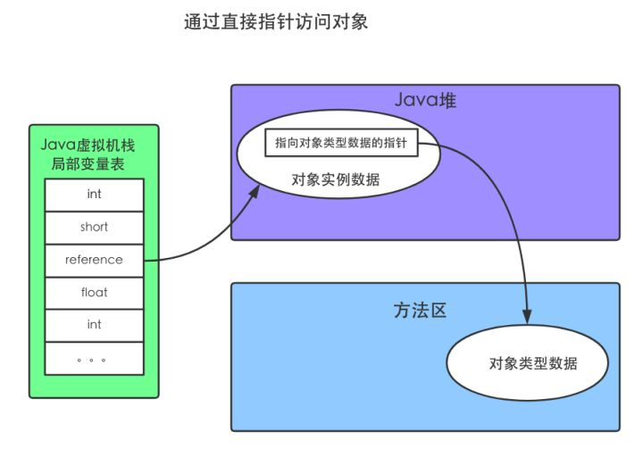

# 运行时数据区域

Java虚拟机所管理的内存将会包括以下几个运行时数据区域

## 程序计数器

- 一块较小的内存空间,它可以看作是当前线程所执行的字节码的行号指示器。
- 每条线程都需要有一个独立的程序计数器

- 不会发生OutOfMemoryError

## Java栈

- 也是线程私有的,它的生命周期与线程相同

- 每个方法在执行的同时都会创建一个栈帧(Stack Frame )用于存储局部变量表、方法出口等信息。

  **每一个方法从调用直至执行完成的过程,就对应着一个栈帧在虚拟机栈中入栈到出栈的过程。**

- **局部变量表**：虚拟机栈的核心部分，编译期间完成分配每个方法的局部变量表所需要的空间。
  - 存了基本数据类型
  - 对象引用(reference类型)
  - returnAddress类型
- 可能发生的两种异常
  - 如果线程请求的栈深度大于虚拟机所允许的深度，将抛出`StackOverflowError`异常
  - 如果扩展时无法申请到足够的内存，就会抛出`OutOfMemoryError`异常。

## 本地方法栈

- 和虚拟机栈作用相同，虚拟机栈 -> Java方法,本地方法栈->Native方法。
- 虚拟机规范中对本地方法栈的语言，数据结构等没有详细的规定，可以自由实现
  HOTSPOT就直接就把本地方法栈和虚拟机栈合二为一。
- 也会抛出`StackOverflowError`和`OutOfMemoryError`异常。

## Java堆

- JVM内存中最大的一块。
- 被所有线程共享，存放对象实例
- 垃圾收集器管理的主要区域
  - 分代收集算法 ： 新生代和老年代
  - 更细致的分代：Eden空间、 From Survivor空间、 To Survivor空间等
- 堆无法再扩展时,将会抛出`OutOfMemoryError`异常

## 方法区

- 线程共享
- 存储已被虚拟机加载的类信息、常量、静态变量、即时编译器编译后的代码等数据。
- HOTSPOT中的~~“永久代”~~。~~HOSTSPOT中这个部分也受GC管理，但因此更容易引发内存溢出~~
- 很少被回收,回收目标主要是针对常量池的回收和对类型的卸载
- 当方法区无法满足内存分配需求时，将抛出OutOfMemoryError异常。

## 直接内存

- 不是JVM的内存
- NIO：通过Native函数库直接分配`堆外内存`，Java堆中的DirectByteBuffer对象作为这块内存的引用进行操作，从而提高性能。
- 会受到本机总内存和处理器寻址空间的限制，导致OutOfMemoryError异常

# 细看内存区域

在Java堆的介绍中也提过，垃圾回收主要采用分代收集。虽然本章不涉及垃圾回收算法，但在这里了解一下这个分代具体是怎么个划分法。

如上图，JVM中最大的一块由年轻代和老年代组成，而年轻代内存又被分成三部分，**Eden空间**、**From Survivor空间**、**To Survivor空间**,默认情况下年轻代按照**8:1:1**的比例来分配；

通过参数可以控制各个区域的大小：

控制参数

- -Xms设置堆的最小空间大小。
- -Xmx设置堆的最大空间大小。
- -XX:NewSize设置新生代最小空间大小。
- -XX:MaxNewSize设置新生代最大空间大小。
- -XX:PermSize设置永久代最小空间大小。
- -XX:MaxPermSize设置永久代最大空间大小。
- -Xss设置每个线程的堆栈大小。

没有直接设置老年代的参数，但是可以设置堆空间大小和新生代空间大小两个参数来间接控制。

> 老年代空间大小=堆空间大小-年轻代大空间大小

# 内存的分配过程

也就是创建对象的过程

1. **类加载检查**
   遇到一条new时，检查参数是否能在常量池中定位到一个类的符号引用,并且检查这个符号引用代表的类是否已被加载
   如果没有,那必须先执行相应的类加载过程

2. **为新生对象分配内存**

   - 假设Java堆中内存是绝对规整的，把指针向空闲空间那边挪动一段与对象大小相等的距离。`“指针碰撞”`
   - 如果不是规整的，虚拟机就必须维护一个列表,记录上哪些内存块是可用的,在分配的时候从列表中找到一块足够大的空间划分给对象实例,并更新列表上的记录。`空闲列表`

   是否规整是由所采用的垃圾收集器是否带有压缩整理功能决定。

   - 使用Serial、ParNew等带Compact过程的收集器时,系统采用的分配算法是`指针碰撞`
   - 而使用CMS这种基于Mark-Sweep算法的收集器时,通常采用`空闲列表`

3. **将分配到的内存空间都初始化为零值**

4. **对象进行必要的设置**
   把信息放入`对象头`
   例如这个对象是哪个类的实例、如何才能找到类的元数据信息、对象的哈希码、对象的GC分代年龄等信息

5. **执行方法**

# 对象的内存布局

对象在内存中存储的布局可以分为3块区域:`对象头`，`实例数据`，`对齐填充`

- 对象头

  分两个部分：

  - 存储对象自身的运行时数据,如哈希码、GC分代年龄、锁状态标志、线程持有的锁、偏向线程ID、偏向时间戳等的部分。`“Mark Word”`
  - 对象指向它的类元数据的指针,虚拟机通过这个指针来确定这个对象是哪个类的实例。

- 实例数据
  在程序代码中所定义的各种类型的字段内容。无论是从父类继承下来的,还是在子类中定义的,都需要记录起来。

- 对齐填充
  仅仅是让对象头对其8字节。所以不一定存在。

# 对象的访问定位

通过refernce数据访问访问堆中的对象，主流的访问方式有使用`句柄`和`直接指针`两种

**句柄**

Java堆中将会划分出一块内存来作为句柄池
reference中存储的就是对象的句柄地址,而句柄中包含了对象`实例数据`与`类型数据`各自的具体地址信息

**直接指针**

reference中存储的直接就是对象地址

Java堆对象的布局中就必须放置访问`类型数据`的相关信息

对比

- 句柄
  在GC过程中对象被移动时只会改变句柄中的实例数据指针,而reference本身不需要修改
- **直接指针**
  速度更快,它节省了一次指针定位的时间开销。HOTSPOT是这种

# 参考文章

[jvm系列(二):JVM内存结构](http://www.ityouknow.com/jvm/2017/08/25/jvm-memory-structure.html)

[深入理解Java虚拟机-第2章-Java内存区域与内存溢出异常](https://nnkwrik.github.io/2018/11/09/20181109-2/)