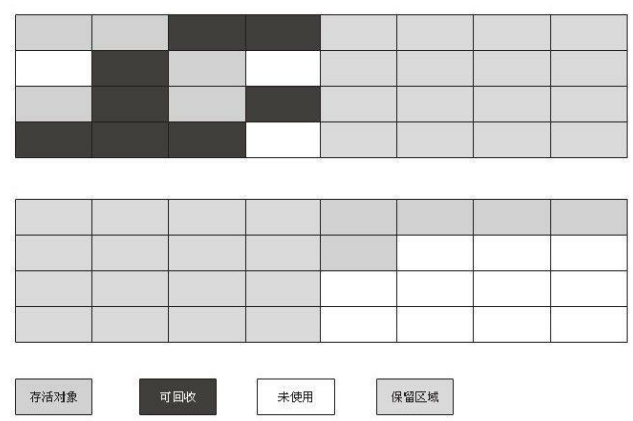
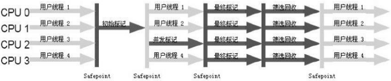

# 能被回收的对象

## 对象存活判断

当一个对象不再被引用时说明一个对象已经死了。怎样知道某个对象是活着还是死了。两种方法：

- **引用计数**：每个对象有一个引用计数属性，新增一个引用时计数加1，引用释放时计数减1，计数为0时可以回收。此方法简单，无法解决对象相互循环引用的问题。 

- **可达性分析**：从多个GC Roots开始向下搜索，搜索所走过的路径称为引用链。当一个对象到GC Roots没有任何引用链相连时，则证明此对象是不可用的。不可达对象。Java、C#,Lisp都是这种。

那些对象是GC Roots：

- 虚拟机栈中引用的对象。
- 方法区中类静态属性实体引用的对象。
- 方法区中常量引用的对象。
- 本地方法栈中Native方法引用的对象。

## 对象的强软弱虚

- **强引用**
  类似“Object obj=new Object()”这类的引用
  只要强引用还存在,垃圾收集器永远不会回收掉被引用的对象。

- **软引用**
  还有用但并非必需的对象。

  对于软引用关联着的对象,在系统将要发生内存溢出异常之前,将会把这些对象列进回收范围之中进行第二次回收。如果这次回收还没有足够的内存,才会抛出内存溢出异常。

  SoftReference类实现软引用

- **弱引用**
  强度比软引用更弱一些被弱引用关联的
  对象只能生存到下一次垃圾收集发生之前。当垃圾收集器工作时,无论当前内存是否足够,都会回收掉只被弱引用关联的对象。
  WeakReference类实现弱引用

- **虚引用**
  最弱的一种引用关系
  一个对象是否有虚引用的存在,完全不会对其生存时间构成影响,也无法通过虚引用来取得一个对象实例。

  为一个对象设置虚引用关联的唯一目的就是能在这个对象被收集器回收时收到一个系统通知

  PhantomReference类实现虚引用

## finalize()方法

可达性算法会标记一次后进行清除。第一次标记时会执行对象的finalize()方法。如果重写finalize()让他此时关联上某个对象，就能避免在第二次标记时被清除。

## 回收方法区

永久代的垃圾收集主要回收两部分内容:废弃常量和无用的类

**废弃常量**

假如一个字符串“abc”已经进入了常量池中，没有任何String对象引用常量池中的“abc”常量,也没有其他地方引用了这个字面量,如果这时发生内存回收,而且必要的话,这个“abc”常量就会被系统清理出常量池。

常量池中的其他类(接口)、方法、字段的符号引用也与此类似。

**无用的类**

类需要同时满足下面3个条件才能算是“无用的类”:

- 该类所有的实例都已经被回收,也就是Java堆中不存在该类的任何实例。
- 加载该类的ClassLoader已经被回收。
- 该类对应的java.lang.Class对象没有在任何地方被引用,无法在任何地方通过反射访问该类的方法。

可以对满足上述3个条件的无用类进行回收,这里说的仅仅是**“可以”**,而并不是和对象一样,不使用了就必然会回收。

# 垃圾收集算法

## 标记-清除算法

>  算法分为“标记”和“清除”两个阶段，首先标记出所有需要回收的对象,在标记完成后统一回收所有被标记的对象。

缺点：

- 标记和清除两个过程的效率都不高
- 标记清除之后会产生大量不连续的内存碎片,空间碎片太多可能会导致以后在程序运行过程中需要分配较大对象时,无法找到足够的连续内存而不得不提前触发另一次垃圾收集动作。

## 复制算法

> 将可用内存按容量划分为大小相等的两块,每次只使用其中的一块。当这一块的内存用完了,就将还存活着
> 的对象复制到另外一块上面,然后再把已使用过的内存空间一次清理掉。不用考虑内存碎片等复杂情况

- 98%是“朝生夕死”的,所以并不需要按照1:1的比例来划分内存空间,而是将内存分为一块较大的Eden空间和两块较小的Survivor空间,每次使用Eden和其中一块Survivor 。
- 当回收时,将Eden和Survivor中还存活着的对象一次性地复制到另外一块Survivor空间上,最后清理掉Eden和刚才用过的Survivor空间。也就是说一个Eden，两个Surviver空间。

- HotSpot虚拟机默认Eden和Survivor的大小比例是8:1。当Survivor空间不够用时,需要依赖其他内存(这里指老年代)进行`分配担保`。
  `分配担保`：另外一块Survivor空间没有足够空间存放上一次新生代收集下来的存活对象时,这些对象将直接通过分配担保机制进入老年代。就像去银行贷款，当你不能还款时，会从担保人的账户中扣款。

## 标记-整理算法

老年代对象存活率高、没有额外空间对它进行分配担保

根据老年代的特点,有人提出了另外一种“标记-整理”(Mark-Compact)算法

> 标记过程仍然与“标记-清除”算法一样。但后续步骤不是直接对可回收对象进行清理,而是让所有存活的对象都向一端移动,然后直接清理掉端边界以外的内存。

## 分代收集算法

当前商业虚拟机的垃圾收集都采用“分代收集”(Generational Collection)算法

根据对象存活周期的不同将内存划分为几块。
一般是把Java堆分为新生代和老年代,这样就可以根据各个年代的特点采用最适当的收集算法。

> - 新生代选用复制算法
> - 老年代使用“标记—清理”或者“标记—整理”算法

关于HotSpot的如何标记[参考](https://nnkwrik.github.io/2018/11/10/20181110/#%E6%9E%9A%E4%B8%BE%E6%A0%B9%E8%8A%82%E7%82%B9)

# 垃圾收集器

HotSpot虚拟机的垃圾收集器，如果两个收集器之间存在连线,就说明它们可以搭配使用。

## Serial收集器

> 这个收集器是一个单线程的收集器,但它的“单线程”的意义并不仅仅说明它只会使用一个CPU或一条收集线程去完成垃圾收集工作,更重要的是在它进行垃圾收集时,必须暂停其他所有的工作线程,直到它收集结束
>
> “Stop The World”

Serial/Serial Old收集器运行示意图

## ParNew收集器

> ParNew收集器其实就是Serial收集器的多线程版本。
>
> 收集算法、Stop The World、对象分配规则、回收策略等都与Serial收集器完全一样

要注意的两个词：

- 并行(Parallel):指多条垃圾收集线程并行工作,但此时用户线程仍然处于等待状态。
- 并发(Concurrent):指用户线程与垃圾收集线程同时执行,用户程序在继续运行,而垃圾收集程序运行于另一个CPU上。

## Parallel Scavenge收集器

> 功能几乎和PerNew一样
>
> Parallel Scavenge收集器的目标是达到一个可控制的吞吐量(Throughput)。

## Serial Old收集器

> Serial收集器的老年代版本,它同样是一个单线程收集器,使用“标记-整理”算法。

为CMS收集器的后备预案,在并发收集发生Concurrent Mode Failure时使用。

## Parallel Old收集器

>  Parallel Old是Parallel Scavenge收集器的老年代版本,使用多线程和“标记-整理”算法

在注重吞吐量以及CPU资源敏感的场合,都可以优先考虑Parallel Scavenge加Parallel Old

## CMS收集器

> CMS(Concurrent Mark Sweep)收集器是一种以获取最短回收停顿时间为目标的收集器。

CMS收集器是基于“标记—清除”算法实现的,但整个过程分为4个步骤：

- **初始标记(CMS initial mark)**
  标记一下GC Roots能直接关联到的对象,速度很快。仍然需要“Stop The World”

- **并发标记(CMS concurrent mark)**
  进行GC RootsTracing的过程

- **重新标记(CMS remark)**
  修正并发标记期间因用户程序继续运作而导致标记产生变动的那一部分对象的标记记录
  仍然需要“Stop The World”

  停顿时间一般会比初始标记阶段稍长一些,但远比并发标记的时间短

- **并发清除(CMS concurrent sweep)**

整个过程中耗时最长的并发标记和并发清除过程收集器线程都可以与用户线程一起工作，总体来说，内存回收过程是与用户线程一起并发执行的

缺点：

- 对CPU资源非常敏感
  并发执行时会占用一部分线程(或者说CPU资源)，总吞吐量会降低
- 无法处理浮动垃圾，可能出现“Concurrent Mode Failure”失败而导致另一次Full GC的产生
  此时会临时启用Serial Old收集器来收集
- 基于“标记—清除”，意味着收集结束时会有大量空间碎片产生。

## G1收集器

与CMS收集器相比G1收集器有以下特点：

1. **空间整合**，G1收集器采用标记整理算法，不会产生内存空间碎片。分配大对象时不会因为无法找到连续空间而提前触发下一次GC。
2. **可预测停顿**，这是G1的另一大优势，降低停顿时间是G1和CMS的共同关注点，但G1除了追求低停顿外，还能建立可预测的停顿时间模型，能让使用者明确指定在一个长度为N毫秒的时间片段内，消耗在垃圾收集上的时间不得超过N毫秒，这几乎已经是实时Java（RTSJ）的垃圾收集器的特征了。

它将整个Java堆划分为多个大小相等的独立区域(Region),虽然还保留有新生代和老年代的概念,但新生代和老年代不再是物理隔离的了,它们都是一部分Region(不需要连续)的集合

Region概念可能发生的问题：如果回收新生代时也不得不同时扫描老年代的话,那么Minor GC的效率可能下降不少

解决方案: G1中每个Region都有一个与之对应的Remembered Set

G1收集器的运作大致可划分为以下几个步骤:

- **初始标记(Initial Marking)**
  标记GC Roots能直接关联到的对象
  并且修改TAMS(Next Top at Mark Start)的值,让下一阶段用户程序并发运行时,能在正确可用的
  Region中创建新对象
  这阶段需要停顿线程,但耗时很短
- **并发标记(Concurrent Marking)**
  进行GC RootsTracing的过程
- **最终标记(Final Marking)**
  修正并发标记期间因用户程序继续运作而导致标记产生变动的那一部分对象的标记记录
  虚拟机将之前这段时间对象变化记录在线程Remembered Set Logs里面,这个阶段需要把Remembered Set Logs的数据合并到Remembered Set中
  这阶段需要停顿线程,但是可并行执行
- **筛选回收(Live Data Counting and Evacuation)**
  首先对各个Region的回收价值和成本进行排序,根据用户所期望的GC停顿时间来制定回收计划

## Java默认GC

- Java 7 - Parallel GC
- Java 8 - Parallel GC
- Java 9 - G1 GC
- Java 10 - G1 GC

# 常用的收集器组合

| 服务器31 | 新生代GC策略      | 老年老代GC策略 | 说明                                                         |
| -------- | ----------------- | -------------- | ------------------------------------------------------------ |
| 组合1    | Serial            | Serial Old     | Serial和Serial Old都是单线程进行GC，特点就是GC时暂停所有应用线程。 |
| 组合2    | Serial            | CMS+Serial Old | CMS（Concurrent Mark Sweep）是并发GC，实现GC线程和应用线程并发工作，不需要暂停所有应用线程。另外，当CMS进行GC失败时，会自动使用Serial Old策略进行GC。 |
| 组合3    | ParNew            | CMS            | 使用`-XX:+UseParNewGC`选项来开启。ParNew是Serial的并行版本，可以指定GC线程数，默认GC线程数为CPU的数量。可以使用-XX:ParallelGCThreads选项指定GC的线程数。如果指定了选项`-XX:+UseConcMarkSweepGC`选项，则新生代默认使用ParNew GC策略。 |
| 组合4    | ParNew            | Serial Old     | 使用`-XX:+UseParNewGC`选项来开启。新生代使用ParNew GC策略，年老代默认使用Serial Old GC策略。 |
| 组合5    | Parallel Scavenge | Serial Old     | Parallel Scavenge策略主要是关注一个可控的吞吐量：应用程序运行时间 / (应用程序运行时间 + GC时间)，可见这会使得CPU的利用率尽可能的高，适用于后台持久运行的应用程序，而不适用于交互较多的应用程序。 |
| 组合6    | Parallel Scavenge | Parallel Old   | Parallel Old是Serial Old的并行版本                           |
| 组合7    | G1GC              | G1GC           | `-XX:+UnlockExperimentalVMOptions` `-XX:+UseG1GC` #开启；`-XX:MaxGCPauseMillis =50` #暂停时间目标；`-XX:GCPauseIntervalMillis =200` #暂停间隔目标；`-XX:+G1YoungGenSize=512m` #年轻代大小；`-XX:SurvivorRatio=6` #幸存区比例 |

# 垃圾收集器参数总结

