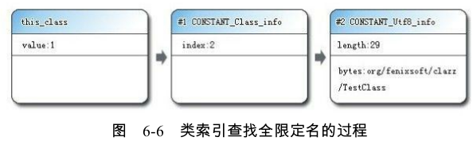

# Class类文件的结构

Class文件格式采用一种类似于C语言结构体的伪结构来存储数据,这种伪结构中只有两种数据类型:**无符号数和表**

- **无符号数**属于基本的数据类型,以u1、u2、u4、u8来分别代表1个字节、2个字节、4个字节和8个字节的无符号数。无符号数可以用来描述数字、索引引用、数量值或者按照UTF-8编码构成字符串值。

- **表**是由多个无符号数或者其他表作为数据项构成的复合数据类型,所有表都习惯性地
  以“_info”结尾

  表用于描述有层次关系的复合结构的数据,整个Class文件本质上就是一张表

## 魔术

每个Class文件的头4个字节称为魔数(Magic Number),它的唯一作用是确定这个文件是否为一个能被虚拟机接受的Class文件。

很多文件存储标准中都使用魔数来进行身份识别,譬如图片格式,如gif或者jpeg等在文件头中都存有魔数。作用类似后缀，但无法随意改动。Class文件的魔数的获得很有“浪漫气息”,值为:0xCAFEBABE(咖啡宝贝?)

## Class文件的版本号

第5和第6个字节是次版本号(Minor Version),第7和第8个字节是主版本号(Major Version)。Java的版本号是从45开始的,JDK 1.1之后的每个JDK大版本发布主版本号向上加1(JDK1.0~1.1使用了45.0~45.3的版本号)。虚拟机拒绝执行超过其版本号的Class文件

## 常量池

常量池可以理解为Class文件之中的资源仓库。由于常量池中常量的数量是不固定的,所以在常量池的入口需要放置一项u2类型的数据,代表常量池容量计数值。

常量池中主要存放两大类常量:**字面量**(Literal)和**符号引用**(Symbolic References)。

- **字面量**比较接近于Java语言层面的常量概念,如文本字符串、声明为final的常量值等。
- **符号引用**则属于编译原理方面的概念,包括了下面三类常量
  - 类和接口的全限定名(Fully Qualified Name)
  - 字段的名称和描述符(Descriptor)
  - 方法的名称和描述符

常量池中每一项常量都是一个表，14种表都有一个共同的特点,就是表开始的第一位是一个u1类型的标志位(tag,取值见表6-3中标志列),代表当前这个常量属于哪种常量类型。

比如：

### CONSTANT_Class_info

常量池的第一项常量,属于CONSTANT_Class_info类型,此类型的常量代表一个类或者接口的符号引用。

name_index是一个索引值,它指向常量池中一个CONSTANT_Utf8_info类型常量，也就是全限定名

### CONSTANT_Utf8_info

length值说明了这个UTF-8编码的字符串长度是多少字节。后面紧跟着的长度为length字节的连续数据是一个使用UTF-8缩略编码表示的字符串。

## 访问标志

这个类或者接口层次的访问信息,包括:这个Class是类还是接口;是否定义为public类型;是否定义为abstract类型;如果是类的话,是否被声明为final等。

比如：如果TestClass是一个普通Java类,不是接口、枚举或者注解,被public关键字修饰但没有被声明为final和abstract。并且它使用了JDK 1.2之后的编译器进行编译,因此它的ACC_PUBLIC、ACC_SUPER标志应当为真,而ACC_FINAL、ACC_INTERFACE、ACC_ABSTRACT、ACC_SYNTHETIC、ACC_ANNOTATION、ACC_ENUM这6个标志应当为假。因此它的access_flags的值应为:0x0001|0x0020=0x0021

## 类索引、父类索引与接口索引集合

类索引(this_class)和父类索引(super_class)都是一个u2类型的数据,而接口索引集合(interfaces)是一组u2类型的数据的集合（因为可以实现多个接口）,Class文件中由这三项数据来确定这个类的继承关系。

## 字段表集合

字段(field)包括类级变量以及实例级变量,但不包括在方法内部声明的局部变量。访问标志包括public，static，volatile等

所以字段表的结构为

现在需要解释一下“简单名称”、“描述符”以及前面出现过多次的“全限定名”这三种特殊字符串的概念。

- **全限定名**
  “org/fenixsoft/clazz/TestClass”就是类的全限定名,仅仅是把类全名中的“.”替换成了“/”而已,为了使连续的多个全限定名之间不产生混淆,在使用时最后一般会加入一个“;”表示全限定名结束

- **简单名称**
  指没有类型和参数修饰的方法或者字段名称,这个类中的inc()方法和m字段的简单名称分别是“inc”和“m”。

- **描述符**

  描述符的作用是用来描述字段的数据类型、方法的参数列表(包括数量、类型以及顺序)和返回值。

  

- name_index 字段的**简单名称**： CONSTANT_Utf8_info .简单名称是指没有类型和参数修饰的方法或者字段名称,这个类中的inc()方法和m字段的简单名称分别是“inc”和“m”
- descriptor_index 字段的**描述符**: CONSTANT_Utf8_info .字段的数据类型、方法的参数列表之类的
- attribute_info ： 一些多余的信息，比如声明final static int m=123时

## 方法表集合

结构和字段表一样，访问标志synchronized之类的部分有一点不同

## 属性表(attribute_info)

字段表、方法表都可以携带自己的属性表集合,以用于描述某些场景专有的信息。不再要求各个属性表具有严格顺序,并且只要不与已有属性名重复,任何人实现的编译器都可以向属性表中写入自己定义的属性信息,Java虚拟机运行时会忽略掉它不认识的属性。

# 参考文章

[深入理解Java虚拟机-第6章-类文件结构](https://nnkwrik.github.io/2018/12/21/20181221/)