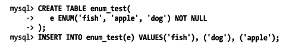
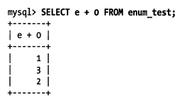
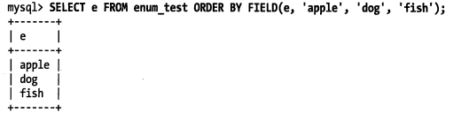
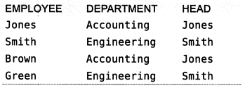
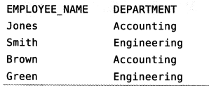
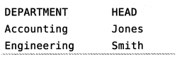

# MySQL数据类型

该如何选择数据类型？

- 更小的通常更好：一般情况下，应该尽量使用可以正确存储数据的最小数据类型。更小的数据类型通常更快，因为它们占用更少的磁盘、内存和cpu缓存，并且处理时需要的cpu周期也更少。
- 简单就好：简单数据类型的操作通常需要更少的cpu周期，例如整型比字符操作代价更低，因为字符集和校对规则（排序规则）使字符比较比整型比较更复杂，使用整型存储IP地址。

- 尽量避免NULL：通常情况下最好制定列为NOT NULL，除非真的需要存储NULL值。如果查询中包含可为NULL的列，对mysql来说更难优化，因为可为NULL的列使得索引、索引统计和值比较都更复杂。

很多MySQL的数据类型可以存储相同类型的数据，只是存储的长度和范围不一样、允许的精度不同，或者需要的物理空间（磁盘和内存空间）不同。如DATETIME和TIMESTAMP。

关于别名：MYSQL为了兼容性支持很多别名，例如integer、bool、numeric。如果建表的时候采用数据类型的别名，然后用show create table检查，会发现mysql报告的是基本类型，而不是别名。这也不会影响性能

## 整数类型

两种类型的数字：`整数`和`实数`，关于整数：

- 类型：TINYINT，SMALLINT，MEDIUMINT，INT，BITGINT。本别是16,24,32,64位存储空间
- 可选UNSIGNED属性，不允许负值，可以提高上限大小
- 可以指定宽度，如INT（11），但没有实际意义，不会限制合法范围。只是方便交互工具显示字符个数，实际上INT（1）和INT（20）是一样的。

## 实数类型

实数是带有小数部分的数字。但也不只小数，也可以用DECIMAL存比BIGINT还大的数。

- FLOAT和DOUBLE支持标准浮点运算
- DECIMAL存储精确的小数，MYSQL5.0之后支持DECIMAL的精准计算，然而CPU本身是只支持浮点计算的，所以比起DECIMAL，浮点计算速度更快。最多存65个数字
- 浮点和DECIMAL都能制定精度。如DECIMAL(18,9)小数点两边各存9个数字

## 字符串类型

VARCHAR和CHAR是两种最主要的字符串类型。

### VARCHAR

- varchar类型选用于存储可变长字符串，需要使用1或者2个额外字节记录字符串的长度，比定长类型更节省空间，因为它仅使用必要的空间（例如越短的字符串使用越少的空间）。

- 由于VARCHAR行是变长的，在UPDATE时可能使行变得比原来更长。

- varchar的使用场景：
  - 字符串列的最大长度比平均长度大很多；
  - 列的更新很少，所以碎片不是问题；
  - 使用了像utf-8这样复杂的字符集，每个字符都使用不同的字节数进行存储。

### CHAR

- CHAR类型是定长的，MySQL总是根据定义的字符串长度分配足够的空间
- 根据需要采用空格进行填充以方便比较
- char的使用场景：
  - 存储很短的字符串，或者所有值都接近同一个长度。如MD5
  - 经常更新的数据
  - 非常短的列（因为VARCHAR需要留出位置记录长度）

类似的还有BINARY和VARBINARY存储二进制，规则和这两个相似，相比较二进制字符串时可以用。


> 既然VARCHAR(5)和VARCHAT(200)存'hello'的空间开销是一样的，那么用更短的列有什么优势?
>
> 从存储空间而言是一样的，但后者会消耗更多的**内存**。因为MySQL先分配这个固定大小的内存块。
>
> 所以最好是分配真正需要的空间。

## 枚举

有时候可以用枚举代替字符串类型，使其更紧凑，会另外生成一个枚举的查询表。如



这三行实际存储的是整数：



而取出来的时候则是




## BLOB和TEXT类型

blob和text都是为了存储很大的数据而设计的字符串数据类型，分别采用二进制和字符串方式存储。

- 当BLOB和TEXT值太大时，InnoDB会在外部区域存储值，所以尽量避免使用
- blob和text列进行排序于其他类型是不同的：它只对每个列的最前max_sort_length字节而不是整个字符串排序。
- 无法将整体进行索引

## 日期和时间类型

能存储的最小时间粒度为秒。有DATETIME和TIMESTAMP

- DATETIME：YYYYMMDDHHMMSS的格式，时区无关。8字节存储空间
- TIMESTAMP：4字节存储空间，依赖于时区。默认就是NOT NULL，没插入时会是当前时间。
- TIMESTAMP优于DATETIME
- 如果想存毫秒级，只能用BIGINT等代替

## 如何选择id列的类型

应该尽可能选择展小的，下面是一些技巧：

- 整数类型：通常是标识列最好的选择，因为它们很快并且可以使用auto_increment
- enum和set类型：需要避免，适合用于存储固定信息，如性别，类型。
- 字符串类型：尽可能避免，慢，耗空间，特别是MD5这种随机的（分布广）

# 范式和反范式

什么是范式？**范式就是信息冗余**

有这么一张表，列分别是“员工，部门，领导”



这么设计的缺点

- 没有员工就不知道部门信息
- 如果领导改变，那么需要改变多行

范式的结果，改为“员工表”和“部门表”：

员工表：



部门表：



## 范式的优点和缺点

优点：

- 范式化的更新操作通常比反范式化要快
- 重复数据少，所以只需要修改更少的数据
- 表更小，可以更好地放在内存里，所以执行操作会更快
- 减少DISTINCT或者GROUP BY语句。比如从上面改造前的表进行查询时可能需要GROUP BY 部门，范式后则不需要

缺点：

- 查询需要关联，较多的关联可能使得一些索引策略无效

## 反范式的优点和缺点

优点：

- 都在一张表，不需要关联

缺点：

- update操作的代价高，需要更新多个表

# 缓存表和汇总表

有时提升性能的最好方法是在同一张表中保存衍生的冗余数据。比如，想要显示一个用户发了多少消息时，可以通过计算显示，也可以建立一个类似`num_messages`来记录，后者的这种方式就是冗余数据，这是反范式的。

如果要更优雅的实现前者，在允许少量脏数据的情况下可以选择缓存表和汇总表。

缓存表和汇总表是什么？

- **缓存表**：能比较简单地获取数据的表，也就是冗余
  缓存表就是对特定的行进行缓存，能够充分的利用索引。
- **汇总表** ： 需要用GROUP BY获取聚合数据的表，逻辑上不是冗余
  在上面的例子中，每小时生成一张汇总表，减少维护次数，但计数器不是准确的。

## 计数器表

用来缓存一个用户的好友数，文件下载次数等。这样的表小且快

# 加快更改表结构时的速度

通常用ALTER TABLE修改表结构时，是用新的结构创建一个空表，从旧表中查出所有数据插入新表，然后删除旧表的方式，非常耗时，导致服务中断。

两种解决方案：

- 先在测试服务器中进行操作后，与主库进行切换
- 影子拷贝：创建一张新表，完成操作后，重命名成主表。

## 不需要重建表

如何避免重建表的操作，只用改.frm文件的话速度快，哪些时候只需要更改.frm？

- 移除一个列的AUTO_INCREMENT属性
- 增加，移除或更改ENUM和SET常量

比如使用 alter comlum改变列的默认值：

```
alert table tablename
alert column col1 set default 5;
```


这个语句会直接修改.frm文件而不涉及表数据，所以这个操作是非常快的。

参考：[《高性能MySQL》读书笔记－－Schema与数据类型优化](https://blog.csdn.net/xifeijian/article/details/45286787)