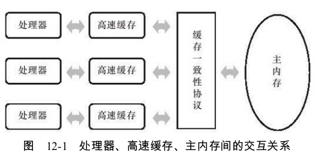
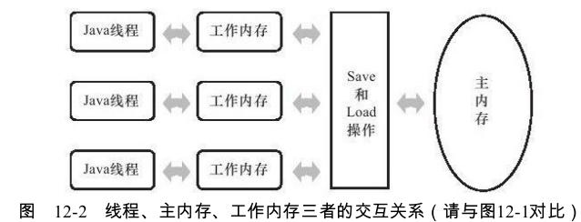
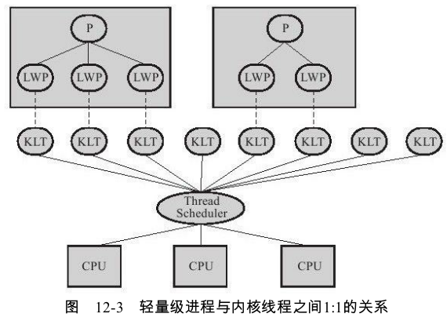
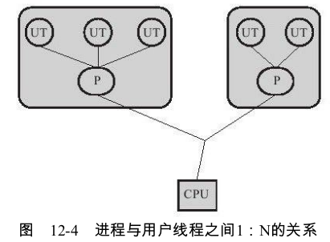
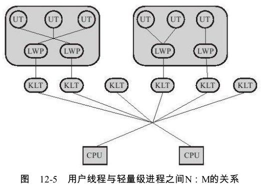
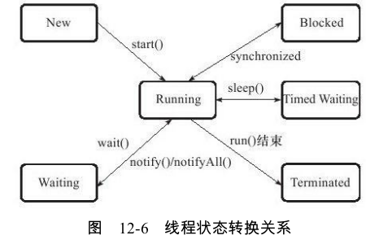

# 硬件的效率与一致性

缓存引发的问题 ： 缓存一致性



内存模型 ： 在特定的操作协议下,对特定的内存或高速缓存进行读写访问的过程抽象

指令重排序优化 :  如果存在一个计算任务依赖另外一个计算任务的中间结果,那么其顺序性并不能靠代码的先后顺序来保证


# Java内存模型

## 主内存与工作内存

Java内存模型的主要目标是定义程序中各个变量的访问规则.各个变量不包括局部变量与方法参数,这些是线程私有的 ,不会被共享,自然就不会存在竞争问题

Java内存模型规定了所有的变量都存储在主内存，每条线程还有自己的工作内存（类似于处理器高速缓存）。线程对变量的所有操作(读取、赋值等)都必须在工作内存中进行




主内存主要对应于Java堆中的对象实例数据部分 ,而工作内存则对应于虚拟机栈中的部分区域

## 内存间交互操作

如何从工作内存同步回主内存之类的实现细节,Java内存模型中定义了以下8种操作来完成

- lock(锁定):作用于主内存的变量,它把一个变量标识为一条线程独占的状态。

- unlock(解锁):作用于主内存的变量,它把一个处于锁定状态的变量释放出来,释放后的变量才可以被其他线程锁定。

- read(读取):作用于主内存的变量,它把一个变量的值从主内存传输到线程的工作内存中,以便随后的load动作使用

- load(载入):作用于工作内存的变量,它把read操作从主内存中得到的变量值放入工作内存的变量副本中。

- use(使用):作用于工作内存的变量,它把工作内存中一个变量的值传递给执行引擎,每当虚拟机遇到一个需要使用到变量的值的字节码指令时将会执行这个操作。

- assign(赋值):作用于工作内存的变量,它把一个从执行引擎接收到的值赋给工作内存的变量,每当虚拟机遇到一个给变量赋值的字节码指令时执行这个操作。

- store(存储):作用于工作内存的变量,它把工作内存中一个变量的值传送到主内存中,以便随后的write操作使用。

- write(写入):作用于主内存的变量,它把store操作从工作内存中得到的变量的值放入主内存的变量中。

read与load之间、store与write之间是可插入其他指令的

## 对于volatile型变量的特殊规则

1. 保证“可见性”，但不是立即可见

2. 禁止指令重排序优化

   ```java
   Map configOptions;
   char[]configText;
   //此变量必须定义为volatile
   volatile boolean initialized=false;
   //假设以下代码在线程A中执行
   //模拟读取配置信息,当读取完成后将initialized设置为true以通知其他线程配置可用
   configOptions=new HashMap();
   configText=readConfigFile(fileName);
   processConfigOptions(configText,configOptions);
   initialized=true;
   //假设以下代码在线程B中执行
   //等待initialized为true,代表线程A已经把配置信息初始化完成
   while(!initialized){
   sleep();
   }
   //使用线程A中初始化好的配置信息
   doSomethingWithConfig();
   ```

   可能会由于指令重排序的优化,导致位于线程A中最后一句的代码“initialized=true”被提前执行。volatile关键字则可以避免此类情况的发生（内存屏障）

关于性能:volatile变量读操作的性能消耗与普通变量几乎没有什么差别,但是写操作则可能会慢一些,因为它需要在本地代码中插入许多内存屏障指令来保证处理器不发生乱序执行。不过即便如此,大多数场景下volatile的总开销仍然要比锁低

## 对于long和double型变量的特殊规则

虚拟机将没有被volatile修饰的64位数据的读写操作划分为两次32位的操作来进行,即允许虚拟机实现选择可以不保证64位数据类型的load、store、read和write这4个操作的原子性,这点就是所谓的long和double的`非原子性协定`

不过这种读取到“半个变量”的情况非常罕见,目前各种平台下的商用虚拟机几乎都选择把64位数据的读写操作作为原子操作来对待,因此我们在编写代码时一般不需要把用到的long和double变量专门声明为volatile。


## 原子性、可见性与有序性

Java内存模型是围绕着在并发过程中如何处理原子性、可见性和有序性这3个特征来建立的

- 原子性(Atomicity):基本数据类型的访问读写是具备原子性的,synchronized块之间的操作也具备原子性。

- 可见性(Visibility):可见性是指当一个线程修改了共享变量的值,其他线程能够立即得知这个修改。volatile保证了多线程操作时变量的可见性,而普通变量则不能保证这一点。synchronized和final也能实现可见性
- 有序性 ： 如果在本线程内观察,所有的操作都是有序的;如果在一个线程中观察另一个线程,所有的操作都是无序的。前半句是指“线程内表现为串行的语义”(Within-Thread As-If-Serial Semantics),后半句是指“指令重排序”现象和“工作内存与主内存同步延迟”现象。

# Java与线程

## 线程的实现

实现线程主要有3种方式:使用内核线程实现、使用用户线程实现和使用用户线程加轻量级进程混合实现。

### 1.使用内核线程实现

内核线程(KLT)，由内核来完成线程切换。程序一般不会直接去使用内核线程,而是去使用内核线程的一种高级接口——轻量级进程（LWP），轻量级进程就是我们通常意义上所讲的线程。由于每个轻量级进程都由一个内核线程支持,因此只有先支持内核线程,才能有轻量级进程。轻量级进程与内核线程之间1:1的关系



问题 ： 1.各种线程操作都需要进行系统调用。2.消耗一定的内核资源

### 2.使用用户线程实现

用户线程(UT)，完全建立在用户空间的线程库上,系统内核不能感知线程存在的实现。操作可以是非常快速且低消耗的,也可以支持规模更大的线程数量,部分高性能数据库中的多线程就是由用户线程实现的。这种进程与用户线程之间1:N的关系称为一对多的线程模型,



所有的线程操作都需要用户程序自己处理，非常复杂。

现在使用用户线程的程序越来越少了,Java、Ruby等语言都曾经使用过用户线程,最终又都放弃使用它。

### 3.使用用户线程加轻量级进程混合实现

操作系统提供支持的轻量级进程则作为用户线程和内核线程之间的桥梁,这样可以使用内核提供的线程调度功能及处理器映射,并且用户线程的系统调用要通过轻量级线程来完成,大大降低了整个进程被完全阻塞的风险。

用户线程与轻量级进程的数量比是不定的,即为N:M的关系



### 4.Java线程的实现

Java线程在JDK 1.2之前,是基于称为“绿色线程”(Green Threads)的用户线程实现的。之后，对于Sun JDK来说,它的Windows版与Linux版都是使用一对一的线程模型实现的,一条Java线程就映射到一条轻量级进程之中,因为Windows和Linux系统提供的线程模型就是一对一的

## Java线程调度

线程调度是指系统为线程分配处理器使用权的过程,主要调度方式有两种,分别是**协同式**线程调度和**抢占式**线程调度

**协同式**调度的多线程系统,线程的执行时间由线程本身来控制,线程把自己的工作执行完了之后,要主动通知系统切换到另外一个线程上，实现简单。

 **抢占式**调度的多线程系统,每个线程将由系统来分配执行时间,线程的切换不由线程本身来决定(在Java中,Thread.yield()可以让出执行时间)，线程的执行时间是系统可控的，Java就是这种

Java语言一共设置了10个级别的线程优先级，优先级越高的线程越容易被系统选择执行。

## 状态转换

