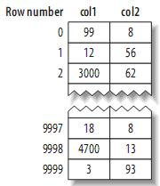
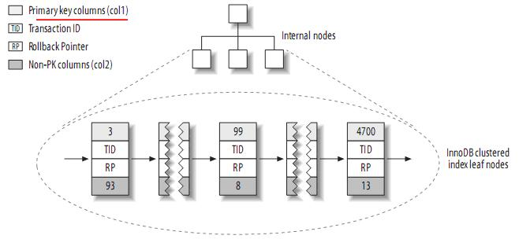
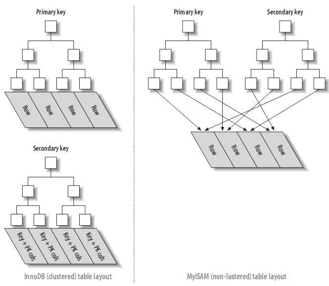

# 索引基础

在MySQL中，存储引擎用一本书的“索引”找到对应页码类似的方法。使用索引，其先在索引中找到对应值，然后根据匹配的索引记录找到对应的数据行。

比如：

```sql
SELECT first_name FROM sakila.actor WHERE actor_id = 5;
```

此时现在索引上按值进行查找，然后返回所有包含该值的数据行。

索引可以包含一个或多个列的值。如果索引包含多个列，那么列的顺序也十分重要，因为MySQL只能高效地使用索引的**最左前缀列**。

## 索引的类型

不同的引擎的索引的工作方式不一样。MySQL支持的索引类型。

### B-Tree索引

一般说道索引通常都是指B-Tree索引。意味着所有的值都是按顺序存储，并且每一个叶子页到跟的距离相同。

下面是InnoDB的索引（实际上是B+Tree）。每个引擎实现BTree的方式不同，但大致上思想相同。


从根节点进行搜索，根节点的槽中存放了指向子节点的指针，通过比较节点页的值和要查找的值可以先找到合适的指针进入下层子节点。关于最底下的叶节点，他们指向的数据的实际值。

节点中的key是按顺序的，所以要找出连续的值时速度更快。

假设有这么一张表

```sql
CREATE TABLE People (
   last_name varchar(50)    not null,
   first_name varchar(50)    not null,
   dob        date           not null,
   gender     enum('m', 'f') not null,
   key(last_name, first_name, dob)
);
```

对三列进行了索引。所以BTree是这样的。


也就是说，有多个值为索引时实现根据第一个排序（last_name，最左前缀列），第一个相同时根据指定的第二个排序（first_name），以此类推。所以索引对最左前缀列的支持最好。

**索引查询适用于什么时候**：

- 全值匹配：同事对索引中的所有类进行匹配时。last_name, first_name, dob
- 匹配最左前缀：也就是索引的第一列。last_name
- 匹配列前缀 ： 某一列的值的开头部分，也是只适用于索引的第一列。last_name = 'J%'
- 匹配范围值：也只是用于第一列。last_name在Allen和Barrymore之间
- 精确匹配某一列并范围匹配另一列：第一列last_name全匹配,第二列first_name范围匹配
- 只访问索引的查询：需要查询的列都在索引中。

**索引的使用限制**

- 如果不是按索引的最左列开始查找，则无法使用。
  例如你不能利用索引查找在某一天出生的人。
- 不能跳过索引中的列
  也就是说，不能指定了last_name（第一列）和dob（第三列），然后不指定第二列的first_name
- 如果对某个列进行了范围查询，那么它右边的列都无法用索引。
  如`WHERE last_name="Smith" AND first_name LIKE 'J%' AND dob='1976-12-23'`

### 哈希索引

哈希表实现，只有精确匹配所有的列时才会有效。对与每一行数据，存储引擎都会对所有的索引计算一个哈希码。

只有Memory引擎支持哈希索引，也是它默认的。如果多个列的哈希值相同，会以链表的方式把它们的行指针用链表保存到同一个hash表项中。

假设创建如下一个表：

```sql
CREATE TABLE testhash (
   fname VARCHAR(50) NOT NULL,
   lname VARCHAR(50) NOT NULL,
   KEY USING HASH(fname)
) ENGINE=MEMORY;
```

包含的数据如下：


哈希函数f()，返回的值如下


那么哈希索引就是：


**哈希索引的限制:**

- 只包含哈希值和行指针，不存字段值。
  MySQL不能通过使用索引避免读取记录。但是访问内存中的记录是非常迅速的，不会对性造成太大的影响。
- 不按需存储。不利于排序
- 不支持部分匹配
- 只支持`等值比较`查询，比如=，IN( )和<=>
  不适用于WHERE price>100
- 很快，除非有很多哈希冲突。发生冲突时需要遍历链表中的行指针。
- 而且哈希冲突多的时候，删除数据也很麻烦。

很强但是适合的场合少。

InnoDB引擎有一个特殊的功能叫做“自适应哈希索引”。当InnoDB注意到某些索引值被使用得非常频繁时，它会在内存中基于B-Tree索引 上再创建一个哈希索引，这样就上B-Tree索引也具有哈希索引的一些优点，比如快速的哈希查找

### 空间数据索引（R-Tree）

MyISAM支持空间索引，主要用于地理空间数据类型，不限定于前缀查询，会从所有维度进行查询。

### 全文索引

全文索引是MyISAM的一个特殊索引类型，它查找的是文本中的关键词主要用于全文检索。类似于搜索引擎，而不是简单的where匹配。

# 索引的优点

BTree索引，按照顺序存储数据，所以MYSQL可以用来做order by和group by操作。而且索引中存储了实际的列值，所以某些查询只使用索引就能够完成全部查询。

总结下来索引有如下三个优点：

- 索引大大减少了服务器需要扫描的数据量
- 索引可以磅数服务器避免排序和临时表
- 索引可以将随机IO变成顺序IO

索引的“三星系统”，评价一个索引是否适合某个查询：

- 一星：索引将相关的记录放到一起

- 二星：索引中的数据顺序和查找中的排列顺序一致

- 三星：索引中的列包含了查询中需要的全部列

**索引是最好的解决方案吗？**对于非常小的表，大部分情况下简单的全表扫描更高效

# 高性能的索引策略

如何高效地使用索引

## 独立的列

如果列是不独立的，MySQL就不会使用索引。例如以下两个查询无法使用索引：

假设actor_id是索引列

**表达式**

```sql
select actor_id from sakila.actor where actor_id+1=5;
```

应该将索引列单独放在比较号的另一侧

**函数参数**

```sql
select ... where TO_DAYS(CURRENT_DATE) - TO_DAYS(date_col)<=10;
```

## 前缀索引和索引选择性

如果索引是很长的字符串，那么会大且慢。该怎么做？

就算不能把整个字符串列为索引，但可以把它的一部分（前缀）列为索引，虽然不能准确得找到，但也能过滤掉很大一部分，从而提高索引效率。

一般情况下某个前缀的选择性也是足够高的，足以满足查询性能。对于BLOB、TEXT或者很长的VARCHAR类型的列，必须使用前缀索引，因为MYSQL不允许索引这些列的完整长度。

前缀索引是一种能使索引更小、更快的有效办法，但另一方面也有其缺点：MYSQL无法使用前缀索引做order by和group by，也无法使用前缀索引做覆盖扫描。

## 多列索引

有些人会为每个列创建独立的索引，如：

```sql
CREATE TABLE t(
    c1 INT,
    c2 INT,
    c3 INT,
    KEY(c1),
    KEY(c2),
    KEY(c3)
);
```

不正确，这种创建多个单列索引的方式不能提高查询性能。不过在新版本中，`索引合并`策略会对此做出优化，从而使用索引搜索。比如下面这条语句，按正常情况是不会使用索引的：


而索引合并策略会把这条语句优化为：


而这只能达到亡羊补牢的目的，并不能发挥索引本身的性能。所以尽量避免这个索引创建方式。如果在explain中看到有索引合并，应该好好检查一下查询的表和结构是不是已经最优。

## 选择合适的索引列顺序

因为BTree是把第一列索引放在最前面，如何选择索引顺序是一个很纠结的问题。对于如何选择索引的顺序有一个经验法则：**将选择性最高的列放在索引最前列。**

> 索引的选择性：
>
> 如果一个表中有2000条记录，表索引列有1980个不同的值，那么这个索引的选择性就是1980/2000=0.99。
>
> 一个索引的选择性越接近于1，这个索引的效率就越高。

当然，性能不只是依赖于所有索引列的选择性，也和查询条件的具体值有关，也就是和值的分布有关。

## 聚簇索引

聚簇索引是指一种数据存储方式。聚簇索引保证关键字的值相近的元组存储的物理位置也相同（所以字符串类型不宜建立聚簇索引，特别是随机字符串，会使得系统进行大量的移动操作），且一个表只能有一个聚簇索引。

聚簇索引中，数据行实际存放在索引的叶子页中。一个表只能有一个聚簇索引。并不是所有的引擎都支持聚簇索引。目前，只有solidDB和InnoDB支持。

结构如下：**叶子页包含了行的全部数据，但是节点页只包含了索引列**。这里的索引列是整数值。


InnoDB中主键索引通常就是聚簇索引，所以这个索引列的整数值实际上是行的id。

**优点**

- 相关数据保存到了一起。可以通过id查找到所有相关信息。
- 数据访问更快。可以直接找到数据

**缺点**

- 如果需要的数据都在内存中，就用不上聚簇索引的优势
- 依赖于id的插入顺序。如果主键不是按顺序插入，也就是说不是按类似auto_increment的方式插入时。
- 更新代价高。需要移动到新的位置。
- 插入新行，导致要移动行的时候，可能会发生`页分裂`。主键值导致必须将这一行插入到一个已满的页时，引擎会把这页分裂成两页，从而容纳该行。
- 全表扫描变慢。
- 二级索引（非聚簇索引）可能比想象的要大，因为二级索引的叶子节点包含了引用行的主键列。
- 二级索引访问需要两次索引查找，而不是一次

二级索引（非聚簇索引）就是主键之外的索引，索引数据和存储数据是分离的，比如唯一索引、普通索引、前缀索引等。实际上，二级索引叶子节点保存的不是指行的物理位置的指针，而是行的主键值。这意味着通过二级索引查找行，存储引擎需要找到二级索引的叶子节点获取对应的主键值，然后根据这个值去聚簇索引中查找到对应的行。这里做了重复的工作：两次B－TREE查找而不是一次。

**InnoDB对主键建立聚簇索引。如果你不指定主键，InnoDB会用一个具有唯一且非空值的索引来代替。**

## InnoDB和MyISAM的数据布局的比较

看看InnoDB和MyISAM是如何存储下面这个表的：

```sql
CREATE TABLE layout_test (
   col1 int NOT NULL,
   col2 int NOT NULL,
   PRIMARY KEY(col1),
   KEY(col2)
);
```

 假设主键的值位于1---10,000之间，且按随机顺序插入，然后用OPTIMIZE TABLE进行优化。col2随机赋予1---100之间的值，所以会存在许多重复的值。

### MyISAM的数据分布

其布局十分简单，**MyISAM按照插入的顺序在磁盘上存储数据**，如下：




左边为行号(row number)，从0开始。因为元组的大小固定，所以MyISAM可以很容易的从表的开始位置跳过需要的字节找到需要的行。它是不支持聚簇索引的，`主键值<->行号`。
MyISAM建立的primary key的索引结构大致如下：


来看看col2的索引结构：


你会发现它也和primary key的索引一样也是`索引值<->行号`，按索引值排序。

也说明，MyISAM中主键和普通索引的存储方式是一样的。

### InnoDB的数据分布

支持聚簇索引。



你会发现这聚簇索引实际上包含了整个表的信息。也就是**在InnoDB中，聚簇索引“就是”表**。

另外，二级索引存的不是行指针（MyISAM中是行数）而是主键值，虽然会让二级索引占更多空间，但行移动时不需要更新所有相关“指针”。

就如下图的col2，结构为`索引值<->主键值`。


### MyISAM和InnoDB的对比




## 在InnoDB中主键的插入顺序

定义一个代理键作为主键，常用的就是`auto_increment`的id，能提高进行连接的查询的性能。但请避免用随机的值做主键，字符串主键就是一个不好的选择，它使得插入操作变得随机。

## 覆盖索引

如果索引包含满足查询的所有数据，就称为**覆盖索引**。MYSQL也可以使用索引来直接获取列的数据，不需要去读取数据行。

**优点**：

- 索引项通常比整个行要小，所以MySQL访问更少的数据
- 索引都按值的大小顺序存储，相对于随机访问记录，需要更少的I/O
- MyISAM等，非索引的数据依赖于系统进行缓存，访问这些缓存时需要等系统调用，会造成性能问题
- InnoDB中，如果二级索引中包含查询所需的数据，就不再需要在聚集索引中查找


## 利用索引进行排序

MySQL有两种方式可以生成有序的结果：通过排序操作，或者按索引顺序扫描。如果explain出来的type列的值为“index”，则说明MYSQL使用了索引扫描来做排序。

利用索引进行排序操作是非常快的，因为只需要从一条索引记录移动到紧接着的下一条记录。但如果索引不能覆盖查询所需的全部列，那就不得不每扫描一条索引记录就回表查询一次对应的行，这基本上都是随机IO，因此按索引顺序读取的速度通常要比顺序地全表扫描慢，尤其是在IO密集型的工作负载时。

**什么时候能用索引排序:**

- 当索引的顺序与ORDER BY中的列顺序相同且所有的列是同一方向(全部升序或者全部降序)时，可以使用索引来排序。
- 如果查询是连接多个表，仅当ORDER BY中的所有列都是第一个表的列时才会使用索引。
- ORDER BY子句需要满足最左前缀的要求

创建一张表，并创建一个索引(rental_date, inventory_id, customer_id)

**可以用索引排序的例子：**

- 即使不满足最左前缀的要求，也可以用于顺序排查。因为第一列被指定为一个常数。满足左前缀

  ```sql
  ... where rental_date = '2005-01-23' order by inventory_id, customer_id
  ```

- 第一列提供常量条件，使用第二列进行排序。满足左前缀

  ```sql
  ... where rental_date = '2005-01-23' order by inventory_id desc
  ```

- ORDER BY 本身就满足最左前缀。

  ```sql
  ... where rental_date > '2005-01-23' order by rental_date, inventory_id
  ```

**不能做索引排序的例子**

- 不同排序方向

  ```sql
  ... where rental_date = '2005-01-23' order by inventory_id desc, customer_id asc
  ```

- 引用了一个不在索引中的列

  ```sql
  ... where rental_date = '2005-01-23' order by inventory_id， staff_id
  ```

- 不满足最左前缀的条件

  ```sql
  ... where rental_date = '2005-01-23' order by customer_id
  ```

- 第一列时范围条件，因此无法使用索引的其余列

  ```sql
  ... where rental_date > '2005-01-23' order by inventory_id, customer_id
  ```

- 多个等于条件，也算是范围查询

  ```sql
  ... where rental_date = '2005-01-23' and inventory_id in(1,2) order by customer_id
  ```


## 压缩（前缀压缩）索引

MyISAM使用前缀压缩来减少索引的大小，让内存中存放更多索引，默认只对字符串索引进行压缩。

压缩方式：如果一个值是“perform”，第二个值是“performance”,那么把他压缩成"7,ance"。

由于以来与前面的值，从头找的时候还行，用order by desc的是时候就很麻烦了。

## 冗余和重复索引

当发现冗余或重复索引的时候，请删除它们。

### 重复索引

指创建完全相同的两个索引。不要这样。

### 冗余索引

如同时存在索引（A,B）和索引（A）。由于查找是依赖前缀，所以索引（A,B）完全可以当做索引（A）来使用。这种就是冗余索引。

而索引（B,A）和索引（A）就不是冗余索引。

还有就是（A，ID）这种，索引本身就是`索引值<->主键`，所以索引中设置ID值也是冗余的。


参考：

[聚簇索引和二级索](https://blog.csdn.net/jijianshuai/article/details/79084874)

[《高性能MySQL》读书笔记－－索引](https://blog.csdn.net/xifeijian/article/details/20312557)

