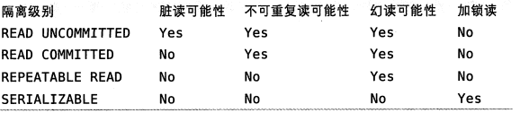

# 锁

## 读锁和写锁

同时读是没有问题的，但是进行写的时候不能去读。实现由两种类型的锁组成的锁系统来解决问题：

- 读锁（共享锁）：互不阻塞，可以同时读
- 写锁（排他锁）：当前写操作没有完成前，它会阻断其他写锁和读锁。

MySQL默认实现了这些。大多数时候，MySQL锁的内部管理都是透明的。

## 锁粒度

只对会修改的数据片进行锁定，锁定的数据范围越小越好。但加锁也需要消耗系统资源（涉及获取，检查，释放锁等动作）。

所谓锁策略，就是在锁的开销和数据的安全性之间寻求平衡。介绍两种所策略：

### 表锁

锁定整张表，当一个线程在写表示，其他所有线程都无法读或写这张表

### 行级锁

可以支持最大并发的锁策略（同时也带来了最大的锁开销）。InnoDB和Falcon两张存储引擎都采用这种策略。

# 事务

“要么全部成功，要么全部失败”。

## ACID

- **原子性**
  一个事务必须被视为一个不可分割的最小工作单元，整个事务中的所有操作要么全部提交成功，要么全部失败回滚，对于一个事务来说，不可能只执行其中的一部分操作，这就是事务的原子性。
- **一致性**
  数据库总是从一个一致性状态转换到另一个一致状态。也就是说转账前和转账后两者的账户存款的和是不变的。
- **隔离性**
  一个事务所做的修改在最终提交以前，对其他事务是不可见的。也就是说不会看到A扣了款，但B还未到账的状况这种执行到一半的状况
- **持久性**
  一旦事务提交，则其所做的修改就会永久保存到数据库中。此时即使系统崩溃，修改的数据也不会丢失。

## 隔离级别

实现隔离性其实比想象中的复杂，较低的隔离级别能提高并发性，但也会降低安全性。SQL定义的4种隔离级别，包括了一些具体规则，用来限定事务内外的哪些改变是可见的，哪些是不可见的。

- **Read Uncommitted（未提交读）**
  即使没有提交对其他事务也都是可见的。本隔离级别很少用于实际应用，因为它的性能也不比其他级别好多少。
  读取未提交的数据，也被称之为**脏读**（Dirty Read）。

- **Read Committed（提交读）**
  除了MySQL外的大多数数据库都默认是这个级别。它满足了隔离的简单定义：一个事务只能看见已经提交事务所做的改变。
  也被称为**不可复读**，因为两次执行同样的查询，可能会得到不一样的结果。（第一次查询过后又发生了commit）

- **Repeatable Read（可重复读）**
  这是MySQL的默认事务隔离级别，保证多次读取同样记录的结果是一致的，也就是它确保同一事务的多个实例在并发读取数据时，会看到同样的数据行。

  会导致**幻读**，指当用户读取某一范围的数据行时，另一个事务又在该范围内插入了新行。当之前的事务再次读取该返回的记录时会发生**幻行**

- **Serializable（可串行化）** 
  强制事务串行（排序）执行，避免幻读问题。每个读的数据行上加上锁，而这可能导致大量的超时现象和锁竞争。

## 死锁

死锁是指两个或者多个事务在同一资源上相互占用，并请求锁定对方占用的资源，从而导致恶性循环的假象。多个事务同时锁定同一个资源时，也会产生死锁。

数据库系统实现了各种死锁检测和死锁超时的机制，InnoDB目前处理死锁的方法是，将持有最少行级排他锁的事务进行回滚。

# MySQL存储引擎

## InnoDB存储引擎

mysql默认，使用最广泛的存储引擎。对事务友好，自动崩溃恢复。比较复杂

## MyISAM存储引擎

MySQL5.1之前的版本默认是MyISAM。不支持事务和行级锁，崩溃后无法安全恢复。

特性：表加锁，手动修复，BLOB和TEXT也能用索引。

参考：[《高性能MySQL》读书笔记－－锁、事务、隔离级别](https://blog.csdn.net/xifeijian/article/details/45229247)