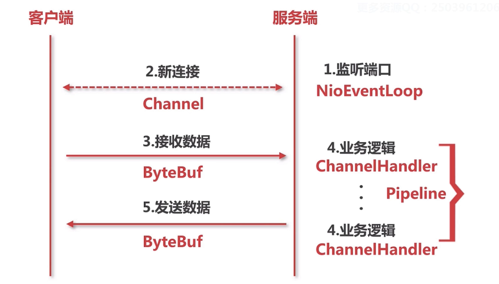

# Netty基本组件

netty中于对于原始socket相对应的概念



**NioEventLoop（Nio事件循环）**

监听以下两种

- 新连接的接入
- 数据的读写

**Channel**

表示连接。对应于在IO中的Socket，NIO中则是SocketChannel。实际上就是Socket的抽象。

**ByteBuf**

封装了一些接受发送数据的API

**ChannelHandler**

对二进制协议进行数据包的拆分，转换为Java类型等，服务端对数据的逻辑。

**PipeLine**

逻辑的处理链。ChannelHandler的集合


## NioEventLoop

NioEventLoop对应示例代码中的两个Thread：接听连接的线程，进行读写的线程

以下基于源码位置`io.netty.channel.nio.NioEventLoop#run`

对于获取新连接的`ServerSocket.accept()`和数据的读写`socket.getInputStream()`对应的都是SELECT的操作

```java
case SelectStrategy.SELECT:
	select(wakenUp.getAndSet(false));
```

相当于用select拿到用户的socket，processSelectedKeys();对这个socket（**channel**）进行处理，

## Channel

一个Channel对应一个Socket。一个channel是如何被创建的？

以下基于源码`io.netty.channel.nio.NioEventLoop#processSelectedKey(k,ch)`。继续跟踪NioEventLoop的处理流程，会看到：

```java
//OP_ACCEPT ： 一个accept事件
if ((readyOps & (SelectionKey.OP_READ | SelectionKey.OP_ACCEPT)) != 0 || readyOps == 0) {
    unsafe.read();
    if (!ch.isOpen()) {
        // Connection already closed - no need to handle write.
        return;
    }
}
```

在`unsafe.read();`中调用了`io.netty.channel.socket.nio.NioServerSocketChannel#doReadMessages`，在里面把新连接加入到了一个数组里：

```java
SocketChannel ch = javaChannel().accept();
//javaChannel是ServerSocketChannel，对应了NIO模型中的SocketChannel
if (ch != null) {
    buf.add(new NioSocketChannel(this, ch));//把底层的socket封装成，netty的channel
    return 1;
}
```


## ByteBuf

ByteBuf对应于IO bytes。`io.netty.buffer.ByteBuf`中有很多read，write开头的方法。

## PipeLine

PipeLine相当于逻辑链。什么时候把PipeLine加入到channel处理过程中的？

追踪NioSocketChannel(this, ch)的构造方法的父类，最后会到：

```java
protected AbstractChannel(Channel parent) {
    this.parent = parent;
    id = newId();
    unsafe = newUnsafe();
    pipeline = newChannelPipeline();	//加入pipeline，每一个channel都会加入pipeline
}
```

newChannelPipeline()之间返回新建的`io.netty.channel.DefaultChannelPipeline#DefaultChannelPipeline`：

```java
protected DefaultChannelPipeline(Channel channel) {
    this.channel = ObjectUtil.checkNotNull(channel, "channel");
    succeededFuture = new SucceededChannelFuture(channel, null);
    voidPromise =  new VoidChannelPromise(channel, true);
	
    //默认加入了这两个
    tail = new TailContext(this);
    head = new HeadContext(this);

    head.next = tail;
    tail.prev = head;
}
```

## ChannelHandler

一个ChannelHandler对应一个逻辑。`io.netty.channel.DefaultChannelPipeline`中就提供了很多add，remove开头的方法，提供给pipeLine添加这些ChannelHandler。比如`addAfter()`的参数就能带入一个ChannelHandler。

# 总结

- NioEventLoop
  netty的发动机，对应于socket编程中连接和读写的两个线程

- Channel
  对于连接的封装，在这个里面进行数据的读写
- pipeLine
  逻辑的处理链
- ChannelHandler
  逻辑的处理链中的逻辑
- ByteBuf
  数据流的读写的封装

