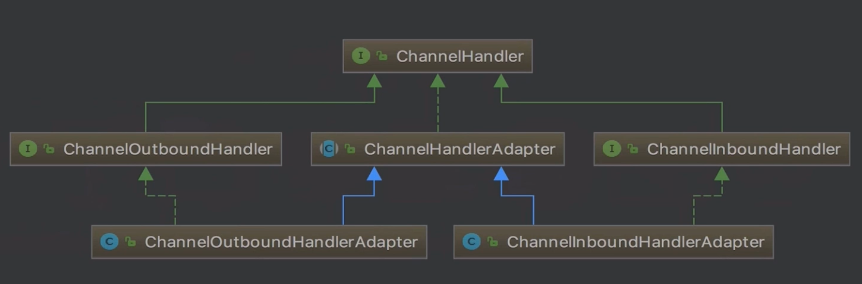

# 事件和异常的传播

## inBound事件的传播

- 何为inBound事件以及ChannelInboundHandler
- ChannelRead事件的传播
  ChannelRead是典型的inbound事件,以他为例了解inbound事件的传播
- SimpleInBoundHandler处理器

### 何为inBound事件以及ChannelInboundHandler



ChannelHandler的继承关系

- ChannelInboundHandlerAdapter,ChannelOutboundHandlerAdapter.
  用户代码中常见.平时自定义channelHandler时都会继承与他们

- ChannelHandler,所有处理器的抽象
- ChannelHandlerAdapter
  ChannelHandler的默认实现
- ChannelInboundHandler,ChannelOutboundHandler
  在ChannelHandler的基础上,自定义功能

**ChannelHandler定义了哪些功能**

```java
public interface ChannelHandler {
	//回调,handler被添加到pipeline时
    void handlerAdded(ChannelHandlerContext ctx) throws Exception;
    //handler被pipeline删除时的回调
    void handlerRemoved(ChannelHandlerContext ctx) throws Exception;
	//出现异常时的回调
    @Deprecated
    void exceptionCaught(ChannelHandlerContext ctx, Throwable cause) throws Exception;

 	//一个注解,是否可以被多个pipeline添加
    @Inherited
    @Documented
    @Target(ElementType.TYPE)
    @Retention(RetentionPolicy.RUNTIME)
    @interface Sharable {
        // no value
    }
}
```

**ChannelInboundHandler在ChannelHandler的基础上扩展了什么**

```java
public interface ChannelInboundHandler extends ChannelHandler {
	//回调,Handler注册到nioEventLoop的selector上时
    void channelRegistered(ChannelHandlerContext ctx) throws Exception;
    void channelUnregistered(ChannelHandlerContext ctx) throws Exception;
	
    //channel的激活或失效时的回调
    void channelActive(ChannelHandlerContext ctx) throws Exception;
    void channelInactive(ChannelHandlerContext ctx) throws Exception;

	//channel读到数据或接收到连接时的回调
    //对于服务端而言是连接,对于客户端channel则是bytebuf的数据
    void channelRead(ChannelHandlerContext ctx, Object msg) throws Exception;
    void channelReadComplete(ChannelHandlerContext ctx) throws Exception;

	//trigger一些用户自定义的事件
    void userEventTriggered(ChannelHandlerContext ctx, Object evt) throws Exception;
	
    //可写状态发生了改变
    void channelWritabilityChanged(ChannelHandlerContext ctx) throws Exception;

    //出现异常时的回调
    @Override
    @SuppressWarnings("deprecation")
    void exceptionCaught(ChannelHandlerContext ctx, Throwable cause) throws Exception;
}
```

这次由ChannelRead为例,看一下inbound事件是如何传播的. 

### ChannelRead事件的传播

这里创建3个自定义的InboundHandler测试ChannelRead事件

```java
public class InBoundHandlerA extends ChannelInboundHandlerAdapter {

    @Override
    public void channelRead(ChannelHandlerContext ctx, Object msg) throws Exception {
        System.out.println("InBoundHandlerA: " + msg);
        ctx.fireChannelRead(msg);
    }
}
public class InBoundHandlerB extends ChannelInboundHandlerAdapter {
    @Override
    public void channelRead(ChannelHandlerContext ctx, Object msg) throws Exception {
        System.out.println("InBoundHandlerB: " + msg);//打印
        ctx.fireChannelRead(msg);//继续传播
    }

    @Override
    public void channelActive(ChannelHandlerContext ctx) {
        //channel被激活时取到pipeline,激活channelRead事件
        ctx.channel().pipeline().fireChannelRead("hello world");
    }
}
public class InBoundHandlerC extends ChannelInboundHandlerAdapter {
    @Override
    public void channelRead(ChannelHandlerContext ctx, Object msg) throws Exception {
        System.out.println("InBoundHandlerC: " + msg);
        ctx.fireChannelRead(msg);
    }
}
```

服务端启动代码添加childHandler的部分为

```java
.childHandler(new ChannelInitializer<SocketChannel>() {
    @Override
    public void initChannel(SocketChannel ch) {
        ch.pipeline().addLast(new InBoundHandlerA());
        ch.pipeline().addLast(new InBoundHandlerB());
        ch.pipeline().addLast(new InBoundHandlerC());
    }
});
```

此时启动后在控制台执行`telnet 127.0.0.1 8888`,它的后台输出结果为

```
InBoundHandlerA: hello world
InBoundHandlerB: hello world
InBoundHandlerC: hello world
```

如果把添加childHandler的部分改为下面的顺序

```java
ch.pipeline().addLast(new InBoundHandlerA());
ch.pipeline().addLast(new InBoundHandlerC());
ch.pipeline().addLast(new InBoundHandlerB());
```

那么输出是

```java
InBoundHandlerA: hello world
InBoundHandlerC: hello world
InBoundHandlerB: hello world
```

可以推测出,inbound和添加顺序相关.在`InboundHandlerB`的`channelActive()`中打个断点.看一下它的`fireChannelRead("hello world")`的逻辑.会看到它会调用:

```java
@Override
public final ChannelPipeline fireChannelRead(Object msg) {
    //head节点
    AbstractChannelHandlerContext.invokeChannelRead(head, msg);
    return this;
}
---
    static void invokeChannelRead(final AbstractChannelHandlerContext next, Object msg) {
        final Object m = next.pipeline.touch(ObjectUtil.checkNotNull(msg, "msg"), next);
        EventExecutor executor = next.executor();
        if (executor.inEventLoop()) {//true
            //此时的next为head
            next.invokeChannelRead(m);
        } else {
            executor.execute(new Runnable() {
                @Override
                public void run() {
                    next.invokeChannelRead(m);
                }
            });
        }
    }
```

也就是说,当遇到channelRead事件时它会从调用head的invokeChannelRead.继续看

```java
private void invokeChannelRead(Object msg) {
    if (invokeHandler()) {
        //调用head的channelRead()
        ((ChannelInboundHandler) handler()).channelRead(this, msg);
    } else {
        fireChannelRead(msg);
    }
}
---
    @Override
    public void channelRead(ChannelHandlerContext ctx, Object msg) throws Exception {
    //也是调用head的fireChannelRead
    // 这里head会把fireChannelRead原封不动的进行传播
    ctx.fireChannelRead(msg);
}
```

这个fireChannelRead是`io.netty.channel.AbstractChannelHandlerContext#fireChannelRead`.它会调用`findContextInbound()`来获取下一个inboundHandler

```java
    @Override
    public ChannelHandlerContext fireChannelRead(final Object msg) {
        //获取下一个inboundHandler
        invokeChannelRead(findContextInbound(), msg);
        return this;
    }
---
    private AbstractChannelHandlerContext findContextInbound() {
        AbstractChannelHandlerContext ctx = this;
        do {
            ctx = ctx.next;
        } while (!ctx.inbound);//寻找下一个inbound节点
        return ctx;
    }
```


获取到下一个inboundHandler,也就是InboundHandlerA后它会调用`io.netty.channel.AbstractChannelHandlerContext#invokeChannelRead`,这个和之前head调用的是完全相同的方法,他回去调用当前inboundHandler,也就是InboundHandlerA的readChannel方法,它就是我们在用户代码中定义的部分.

```java
public class InBoundHandlerA extends ChannelInboundHandlerAdapter {

    @Override
    public void channelRead(ChannelHandlerContext ctx, Object msg) throws Exception {
        System.out.println("InBoundHandlerA: " + msg);
        ctx.fireChannelRead(msg);//继续往下传播
    }
}
```

然后`InBoundHandlerA`的`channelRead()`又会调用下一个`InBoundHandlerB`的`channelRead()`,它又会接着调用`InBoundHandlerC`的`channelRead()`

此时回顾一下`InBoundHandlerB`中的逻辑,会发现.pipeline中inBound的传播方式为:

```java
ctx.fireChannelRead(msg);	//从当前节点继续往下传播
ctx.channel().pipeline().fireChannelRead("hello world");//从head节点开始往下传播
```

当传播到最后一个节点(C)时,它会传播到最后的Tail节点,调用它的`channelRead()`.之前说过tial是用来做一些收尾工作,

```java
@Override
public void channelRead(ChannelHandlerContext ctx, Object msg) throws Exception {
    //事件一直传播到tail,
    //tail会认为没有被处理,这个方法会打印一个logger.debug.来提醒开发者
    onUnhandledInboundMessage(msg);
}
---
    protected void onUnhandledInboundMessage(Object msg) {
    try {
        logger.debug(
            "Discarded inbound message {} that reached at the tail of the pipeline. " +
            "Please check your pipeline configuration.", msg);
    } finally {
        //如果时bytebuf就进行释放
        ReferenceCountUtil.release(msg);
    }
}
```

### SimpleInBoundHandler处理器

以下面的自定义Handler为例,看一下它的使用场景

```java
public class AuthHandler extends SimpleChannelInboundHandler<ByteBuf> {
    @Override
    public void channelRead(ChannelHandlerContext ctx, Object msg) throws Exception {
        //如果没有把这里的ByteBuf传播到tail,那么tail节点就不会帮你释放这段ByteBuf
        //通常这种情况下你需要手动进行释放,
        //而SimpleChannelInboundHandler会帮你自动释放他们
    }

    @Override
    protected void channelRead0(ChannelHandlerContext ctx, ByteBuf password) throws Exception {
        if (paas(password)) {
            ctx.pipeline().remove(this);
        } else {
            ctx.close();
        }
    }

    private boolean paas(ByteBuf password) {
        return false;
    }
}
```

看一下`SimpleChannelInboundHandler`的`channelRead()`

```java
    @Override
    public void channelRead(ChannelHandlerContext ctx, Object msg) throws Exception {
        boolean release = true;
        try {
            //如果是inbound
            if (acceptInboundMessage(msg)) {
                //转为bytebuf
                I imsg = (I) msg;
                //抽象方法
                //继承SimpleChannelInboundHandler时你可以做一些你想干的,并且不用考虑释放
                channelRead0(ctx, imsg);
            } else {
                release = false;
                ctx.fireChannelRead(msg);
            }
        } finally {
            if (autoRelease && release) {
                //自动释放
                ReferenceCountUtil.release(msg);
            }
        }
    }
```

也就是说使用`SimpleChannelInboundHandler`时不需要管`channelRead()`而是通过`channelRead0()`来做原本在`channelRead()`中的逻辑.因为SimpleChannelInboundHandler的`channelRead()`中定义了从执行`channelRead0()`直到释放的过程,所以当`channelRead0()`被执行后它会自动帮你去释放

## outBound事件的传播

- 何为outBound事件以及ChannelOutBoundHandler
- write()事件的传播
  典型的outBound事件

### 何为outBound事件以及ChannelOutBoundHandler

**ChannelOutboundHandler在ChannelHandler的基础上扩展了什么**


```java
public interface ChannelOutboundHandler extends ChannelHandler {
	//端口绑定,服务端启动时的那个
    void bind(ChannelHandlerContext ctx, SocketAddress localAddress, ChannelPromise promise) throws Exception;
    
    void connect(
            ChannelHandlerContext ctx, SocketAddress remoteAddress,
            SocketAddress localAddress, ChannelPromise promise) throws Exception;

    void disconnect(ChannelHandlerContext ctx, ChannelPromise promise) throws Exception;


    void close(ChannelHandlerContext ctx, ChannelPromise promise) throws Exception;


    void deregister(ChannelHandlerContext ctx, ChannelPromise promise) throws Exception;

    void read(ChannelHandlerContext ctx) throws Exception;

    void write(ChannelHandlerContext ctx, Object msg, ChannelPromise promise) throws Exception;


    void flush(ChannelHandlerContext ctx) throws Exception;
}
```

相对于InBounder,outBound更像是用户主动发起的操作.而InBounder更类似于事件触发

### write()事件的传播

这里创建3个自定义的OutboundHandler测试write事件

```java
public class OutBoundHandlerA extends ChannelOutboundHandlerAdapter {

    @Override
    public void write(ChannelHandlerContext ctx, Object msg, ChannelPromise promise)  {
        System.out.println("OutBoundHandlerA: " + msg);
        ctx.write(msg, promise);
    }
}
---
public class OutBoundHandlerB extends ChannelOutboundHandlerAdapter {
    @Override
    public void write(ChannelHandlerContext ctx, Object msg, ChannelPromise promise) {
        System.out.println("OutBoundHandlerB: " + msg);
        ctx.write(msg, promise);
    }


    @Override
    public void handlerAdded(final ChannelHandlerContext ctx) {
        //定时器,模拟服务端处理完成数据后给客户端的响应
        ctx.executor().schedule(() -> {
            ctx.channel().write("hello world");
        }, 3, TimeUnit.SECONDS);
    }
}
---
public class OutBoundHandlerC extends ChannelOutboundHandlerAdapter {

    @Override
    public void write(ChannelHandlerContext ctx, Object msg, ChannelPromise promise) {
        System.out.println("OutBoundHandlerC: " + msg);
        ctx.write(msg, promise);
    }
}
```

服务端创建代码

```java
.childHandler(new ChannelInitializer<SocketChannel>() {
    @Override
    public void initChannel(SocketChannel ch) {
        ch.pipeline().addLast(new OutBoundHandlerA());
        ch.pipeline().addLast(new OutBoundHandlerB());
        ch.pipeline().addLast(new OutBoundHandlerC());
    }
});
```

输出为以下,**和添加顺序正好相反**.也就是说outBound的添加顺序和pipeline中的传播顺序是相反的 

```
OutBoundHandlerC: hello world
OutBoundHandlerB: hello world
OutBoundHandlerA: hello world
```

下面看看`write()`的源码

```java
    @Override
    public ChannelFuture write(Object msg) {
        return pipeline.write(msg);
    }
---
    @Override
    public final ChannelFuture write(Object msg) {
    	//注意,这里会调用tail的write
        return tail.write(msg);
    }
---
    @Override
    public ChannelFuture write(Object msg) {
    	//newPromise()创建一个空的回调
        return write(msg, newPromise());
    }
```

这个pipeline的write()实际会调用tail的write,这里的`newPromise()`是一个回调

```java
    @Override
    public ChannelFuture write(final Object msg, final ChannelPromise promise) {
        write(msg, false, promise);//flash=false
        return promise;
    }
---
    private void write(Object msg, boolean flush, ChannelPromise promise) {
        AbstractChannelHandlerContext next = findContextOutbound();
//..
    }

```

通过`findContextOutbound()`找到下一个传播对象,看一下它的源码

```java
    private AbstractChannelHandlerContext findContextOutbound() {
        AbstractChannelHandlerContext ctx = this;
        do {
            ctx = ctx.prev;
        } while (!ctx.outbound);
        return ctx;
    }
```

和inbound的时候相似,通过while找前面那个outbound节点,此时会返回最后添加的C节点,继续看这个`write()`的逻辑

```java
    private void write(Object msg, boolean flush, ChannelPromise promise) {
        //找到下一个节点
        AbstractChannelHandlerContext next = findContextOutbound();
        final Object m = pipeline.touch(msg, next);
        EventExecutor executor = next.executor();
        if (executor.inEventLoop()) {//true
            if (flush) {//参数传的false
                next.invokeWriteAndFlush(m, promise);
            } else {
                //最终调用这个
                next.invokeWrite(m, promise);
            }
        } else {
//..
    }
```

也就是说`write()`会调用下一个outbound节点的`invokeWrite()`

```java
    private void invokeWrite(Object msg, ChannelPromise promise) {
        if (invokeHandler()) {//true
            invokeWrite0(msg, promise);//调用这个
        } else {
            write(msg, promise);
        }
    }
---
    private void invokeWrite0(Object msg, ChannelPromise promise) {
    //拿到ChannelOutboundHandler(节点C)后,调用它的write()方法
            ((ChannelOutboundHandler) handler()).write(this, msg, promise);
    }
```

也就是会调用用户代码自定义的`write()`

```java
public class OutBoundHandlerC extends ChannelOutboundHandlerAdapter {

    @Override
    public void write(ChannelHandlerContext ctx, Object msg, ChannelPromise promise) {
        System.out.println("OutBoundHandlerC: " + msg);
        ctx.write(msg, promise);	//继续往下传播
    }
}
```

这个write会从当前节点调用`io.netty.channel.AbstractChannelHandlerContext#write(java.lang.Object, io.netty.channel.ChannelPromise)`,寻找下一个传播对象,并调用它的write

```java
    @Override
    public ChannelFuture write(final Object msg, final ChannelPromise promise) {
        write(msg, false, promise);
        return promise;
    }
---
    private void write(Object msg, boolean flush, ChannelPromise promise) {
    	//这时返回的就是节点B
        AbstractChannelHandlerContext next = findContextOutbound();
//..
    }
```

后面节点B又会通过相同逻辑调用A.A节点又会调用相同逻辑,但此时返回的next是head节点.也就是head节点的wtite()方法.

```java
@Override
public void write(ChannelHandlerContext ctx, Object msg, ChannelPromise promise){
    unsafe.write(msg, promise);
}
```

总结一下就是

```
ctx.channel().write("hello world");	//从tail开始传播
ctx.write(msg, promise);	//从当前节点开始往下传播
```

## 异常的传播

- 异常的触发链
- 异常处理的最佳实践

### 异常的触发链

在服务端启动代码中添加6个Handler

```java
.childHandler(new ChannelInitializer<SocketChannel>() {
    @Override
    public void initChannel(SocketChannel ch) {
        ch.pipeline().addLast(new InBoundHandlerA());
        ch.pipeline().addLast(new InBoundHandlerB());
        ch.pipeline().addLast(new InBoundHandlerC());
        ch.pipeline().addLast(new OutBoundHandlerA());
        ch.pipeline().addLast(new OutBoundHandlerB());
        ch.pipeline().addLast(new OutBoundHandlerC());
    }
});
```

把`InBoundHandlerB`改为以下

```java
public class InBoundHandlerB extends ChannelInboundHandlerAdapter {
    @Override
    public void channelRead(ChannelHandlerContext ctx, Object msg) throws Exception {
        //显示的抛出异常,模拟读数据的过程中抛出异常	 
        throw new BusinessException("from InBoundHandlerB");
    }

    @Override
    public void channelActive(ChannelHandlerContext ctx) {
        ctx.channel().pipeline().fireChannelRead("hello world");
    }
}
```

在`InBoundHandlerA`,`InBoundHandlerC`,`OutBoundHandlerA`,`OutBoundHandlerB`,`OutBoundHandlerC`中加入以下逻辑

```java
    @Override
    public void exceptionCaught(ChannelHandlerContext ctx, Throwable cause) throws Exception {
        System.out.println("InBoundHandlerA.exceptionCaught()");//类名
        ctx.fireExceptionCaught(cause);
    }
```

通过telnet写入数据,此时会抛出异常

```
$ telnet 127.0.0.1 8888
$ send ayt
```

服务端的输出为

```
InBoundHandlerB.exceptionCaught()
InBoundHandlerC.exceptionCaught()
OutBoundHandlerA.exceptionCaught()
OutBoundHandlerB.exceptionCaught()
OutBoundHandlerC.exceptionCaught()
//..以下异常信息
```

可以看出inBound的输出顺序和inbound事件的传播顺序很相似,但outBound的异常传播顺序和之前的outBound事件传播顺序是相反的.

跟踪源码看一下,抛出异常的`InBoundHandlerB#channelRead`的调用顺序是怎样的

```java
private void invokeChannelRead(Object msg) {
    if (invokeHandler()) {
        try {
            //调用InBoundHandlerB#channelRead
            ((ChannelInboundHandler) handler()).channelRead(this, msg);
        } catch (Throwable t) {	//会捕获到异常
            notifyHandlerException(t);
        }
    } else {
        fireChannelRead(msg);
    }
}
```

跟踪抛出异常时会执行的`notifyHandlerException(t)`

```java
    private void notifyHandlerException(Throwable cause) {
        invokeExceptionCaught(cause);
    }
---
    private void invokeExceptionCaught(final Throwable cause) {
        if (invokeHandler()) {
            try {
                //它会调用InBoundHandlerB#exceptionCaught
                handler().exceptionCaught(this, cause);
            } catch (Throwable error) {
            }
        } else {
            fireExceptionCaught(cause);
        }
    }
```

也就是说在`InBoundHandlerB#channelRead`抛出异常时它会回调`InBoundHandlerB#exceptionCaught`,

它里面通过`ctx.fireExceptionCaught(cause);`把异常事件继续进行传播.接着看

```java
    @Override
    public ChannelHandlerContext fireExceptionCaught(final Throwable cause) {
        //直接拿到当前节点的next节点进行传播,next和节点的添加顺序相关
        //当前节点为InBoundHandlerB,那么它的next是C
        invokeExceptionCaught(next, cause);
        return this;
    }
```

InBoundHandlerB会调用C的异常捕获

```java
    static void invokeExceptionCaught(final AbstractChannelHandlerContext next, final Throwable cause) {
        EventExecutor executor = next.executor();
        if (executor.inEventLoop()) {
            next.invokeExceptionCaught(cause);//这个
        } else {
		//...
        }
    }
```

接下来就和InB调用同一个方法,执行C的`exceptionCaught()`

```java
    private void invokeExceptionCaught(final Throwable cause) {
        if (invokeHandler()) {
            try {
                handler().exceptionCaught(this, cause);
            } catch (Throwable error) {
            }
        } else {
            fireExceptionCaught(cause);
        }
    }
---
    //用户代码InBoundHandlerC
    @Override
    public void exceptionCaught(ChannelHandlerContext ctx, Throwable cause) throws Exception {
        System.out.println("InBoundHandlerC.exceptionCaught()");
        ctx.fireExceptionCaught(cause);
    }
```

而`InBoundHandlerC`的下一个节点则是`OutBoundHandlerA`,再下一个则是`OutBoundHandlerB`


那么`OutBoundHandlerC`调用`ctx.fireExceptionCaught(cause);`继续往下传播异常时会传播到哪?Tail节点的`exceptionCaught()`

Tail节点的`exceptionCaught()`:

```java
@Override
public void exceptionCaught(ChannelHandlerContext ctx, Throwable cause) throws Exception {
    onUnhandledInboundException(cause);
}
---
    protected void onUnhandledInboundException(Throwable cause) {
    try {
        logger.warn(
            "An exceptionCaught() event was fired, and it reached at the tail of the pipeline. " +
            "It usually means the last handler in the pipeline did not handle the exception.",
            cause);
    } finally {
        ReferenceCountUtil.release(cause);
    }
}
```

提醒用户代码异常尚未被处理.上面的示例程序中它会打印

```
Jan 07, 2019 10:00:35 AM io.netty.channel.DefaultChannelPipeline onUnhandledInboundException
WARNING: An exceptionCaught() event was fired, and it reached at the tail of the pipeline. It usually means the last handler in the pipeline did not handle the exception.
com.imooc.netty.ch6.BusinessException: from InBoundHandlerB
	at com.imooc.netty.ch6.InBoundHandlerB.channelRead(InBoundHandlerB.java:12)
	at io.netty.channel.AbstractChannelHandlerContext.invokeChannelRead(AbstractChannelHandlerContext.java:373)
	at io.netty.channel.AbstractChannelHandlerContext.invokeChannelRead(AbstractChannelHandlerContext.java:359)
	at io.netty.channel.AbstractChannelHandlerContext.fireChannelRead(AbstractChannelHandlerContext.java:351)
//...
```

以上就是异常的触发链.可以发现它的异常触发和是inBound还是outBound没有关系,只会每次调用next触发下一个节点,也就是说和Handler的添加顺序有关.

那么如果没有在用户代码中重载`exceptionCaught()`,它的父类会做哪些事?

```java
    //io.netty.channel.ChannelHandlerAdapter#exceptionCaught
	@Override
    public void exceptionCaught(ChannelHandlerContext ctx, Throwable cause) throws Exception {
        ctx.fireExceptionCaught(cause);
    }
```

就是直接把异常往下传播

### 异常处理的最佳实践

项目中常用的异常处理方式:在每一条channel的最后给它添加一个终极的Exception处理器,如:

```java
public class ExceptionCaughtHandler extends ChannelInboundHandlerAdapter {
    @Override
    public void exceptionCaught(ChannelHandlerContext ctx, Throwable cause) throws Exception {
        if (cause instanceof BusinessException){
            System.out.println("BusinessException");
        }
    }
}
```

在pipeline的最后添加`ExceptionCaughtHandler`

```java
.childHandler(new ChannelInitializer<SocketChannel>() {
    @Override
    public void initChannel(SocketChannel ch) {
        ch.pipeline().addLast(new InBoundHandlerA());
        ch.pipeline().addLast(new InBoundHandlerB());
        ch.pipeline().addLast(new InBoundHandlerC());
        ch.pipeline().addLast(new OutBoundHandlerA());
        ch.pipeline().addLast(new OutBoundHandlerB());
        ch.pipeline().addLast(new OutBoundHandlerC());
        //终极的Exception处理器
        ch.pipeline().addLast(new ExceptionCaughtHandler());
    }
});
```

此时的输出为以下,说明异常在最后被处理了

```java
InBoundHandlerB.exceptionCaught()
InBoundHandlerC.exceptionCaught()
OutBoundHandlerA.exceptionCaught()
OutBoundHandlerB.exceptionCaught()
OutBoundHandlerC.exceptionCaught()
BusinessException
```

# 总结

- **netty如何判断ChannelHandler类型的？**
  添加一个节点时,pipeline会通过一个instanceof来判断是inbound类型还是outbound类型,然后用布尔变量来标示

- **对于ChannelHandler的添加应该遵循什么样的顺序？**
  inBound事件的传播顺序和inBoundHandler的添加顺序相同
  outBound事件的传播顺序和outBoundHandler的添加顺序相反

- **用户手动触发事件传播，不同的触发方式有什么样的区别？**

  - inbound事件,如

    ```java
    ctx.fireChannelRead(msg);	//从当前节点继续往下传播
    ctx.channel().pipeline().fireChannelRead("hello world");//从head节点开始往下传播
    ```

  - outbound事件,如

    ```java
    ctx.write(msg, promise);	//从当前节点开始往下传播
    ctx.channel().write("hello world");	//从tail开始传播
    ```
