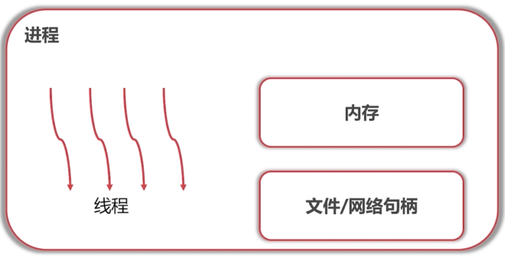
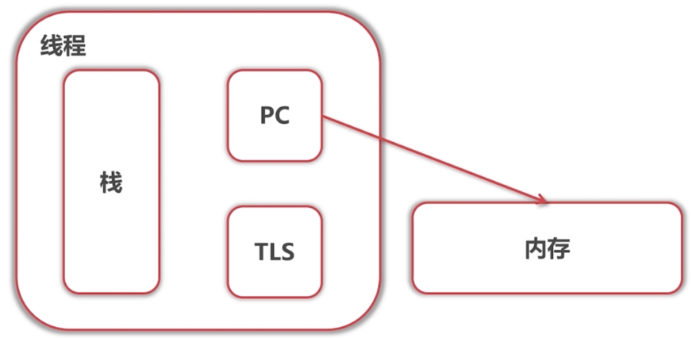
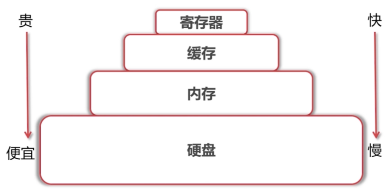
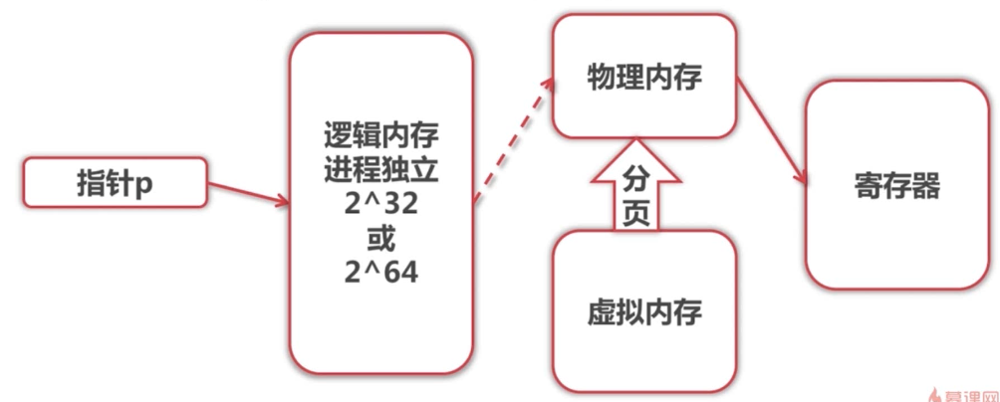

# 知识点

- 进程 vs 线程
- 寻址

# 进程 vs 线程

了解面试者侧重点 -> 进一步展开.如果面试者扯到内存就继续深入问内存

## 进程

- 比较独立,线程是进程的一部分,进程中包含多个线程
- 包含逻辑内存,进程之间内存互相独立
- 文件/网络句柄,进程间共享,可以多个进程打开同一个文件

## 线程

- 栈,把返回地址,局部变量等压入栈中
- PC,程序计数器,下一条指令的地址.而指令放在内存中
- TLS, ThreadLocalStorage,属于线程自己的空间

**线程才是程序中所运行的,而进程只是装线程的容器**

# 存储

## 存储模块

## 寻址空间

进程指针能取到的地址范围.和实际内存大小以及其他进程的线程无关

- 32位 -> 4G,
  就算装了8g的内存,进程也只能访问到4G的空间.
- 64位 -> ~10^19Bytes
- 64位JVM -> 可使用更大内存,需要重新编译
  64位的Java虚拟机,它本身就有自己的寻址逻辑
  可以在32位之上使用64位的寻址空间

## 寻址 int n = *p; -> MOV EAX,[EBX]

把p处的值赋值给n,也就是把EBX中的值读出来放入EAX寄存器

**虚拟内存在硬盘,物理内存在内存**

1. 指针指向进程的逻辑内存.这块逻辑内存并没有实际的数据，都需要把地址翻译为实际物理内存地址

2. 所有进程共享这整一块物理内存，每个进程只把自己目前需要的虚拟地址空间映射到物理内存上
3. 进程需要知道哪些地址空间上的数据在物理内存上，哪些不在（可能这部分存储在磁盘上），还有在物理内存上的哪里，这就需要通过页表来记录
4. 页表的每一个表项分两部分，第一部分记录此页是否在物理内存上，第二 部分记录物理内存页的地址（如果在的话）
5. 当进程访问某个虚拟地址的时候，就会先去看页表，如果发现对应的数据不在物理内存上，就会发生缺页异常

6. 缺页异常的处理过程，操作系统立即阻塞该进程，并将硬盘里对应的页换入内存，然后使该进程就绪，如果内存已经满了，没有空地方了，那就找一个页覆盖，至于具体覆盖的哪个页，就需要看操作系统的页面置换算法是怎么设计的了。
7. 放入寄存器

# 例题

AC

