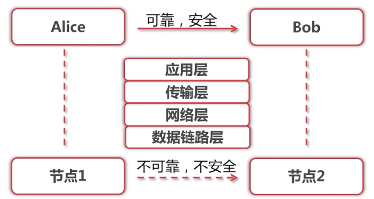
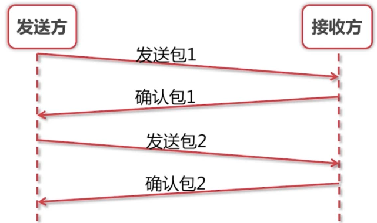
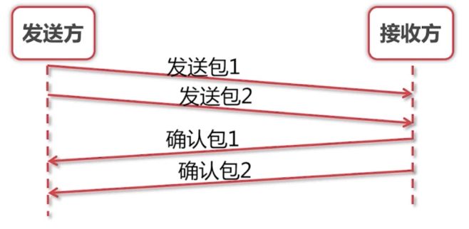
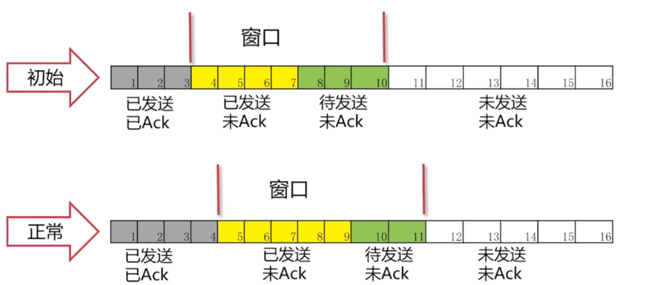
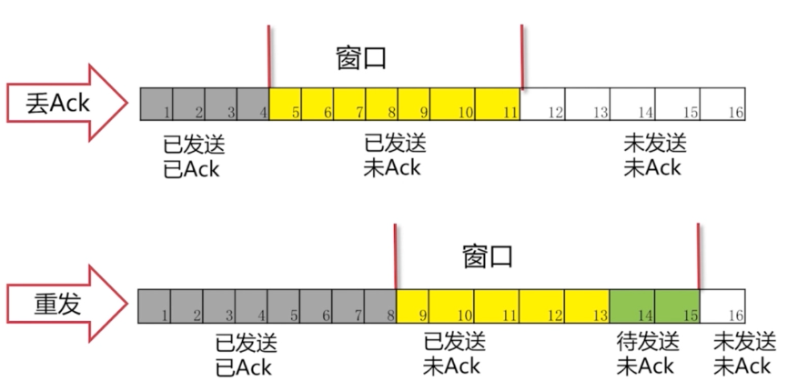
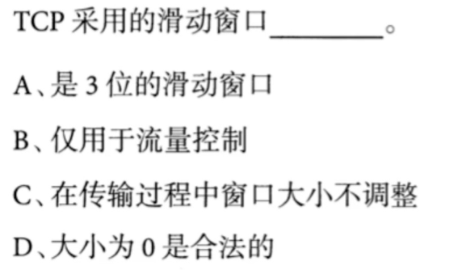
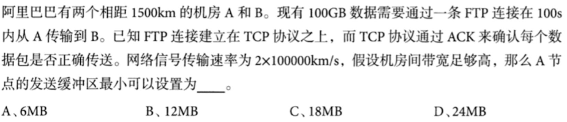

# 基础

- 数据链路层
  数据包,校验数据包是否正确
- 网络层
  路由器之间的传递,ip地址,ip协议
- 传输层
  可靠的传递,出错时重传的机制,
  - tcp协议
    先建立可靠连接后传输
  - udp协议
- 应用层
  是http还是email的协议

**从历史发展的角度的分析网络的一层层协议**

# 网络传输

**不可靠**

- 丢包,重复包
- 出错
- 乱序

**不安全**

- 中间人攻击
- 窃取
- 篡改

# 例: 滑动窗口

TCP如何解决网络不可靠问题

- TCP协议中使用
- 维持发送方/接收方缓冲区

**以往的可靠机制性方案**..耗时,麻烦

**改进方案**

那么一次该发多少个包呢? -> **滑动窗口**

当4号包收到Ack后床后向后移动了一格,窗口中的所有包都是可发送的状态

丢Ack的情况:可能是发送失败了,也可能是对方Ack了但没收到

一直等待5号包的Ack,导致窗口无法滑动,无法发送12号..超时重传机制

有一点要注意的是:对方一定会按照顺序来Ack,就算对方收到了6,7号包,但在未收到5号的情况下是不会回复这些Ack的. 所以可能重传5号后,后面的Ack会一口气被发送过来

# 例题

D.暂时调整为0,让对方暂时不要发送

- 一个来回的时间:1500 * 2/*(2**10^5) = 0.015s
- 100s = 6666个来回
- 100Gb分成6666个来回来传输,那么一次至少传15.36MB

C

