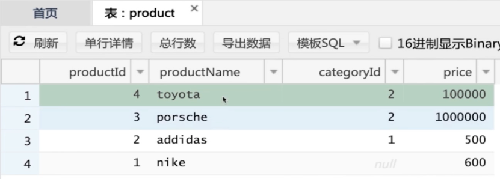
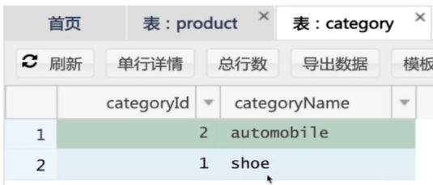
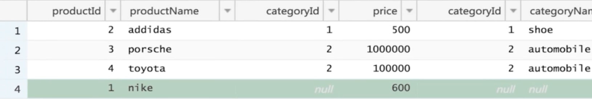
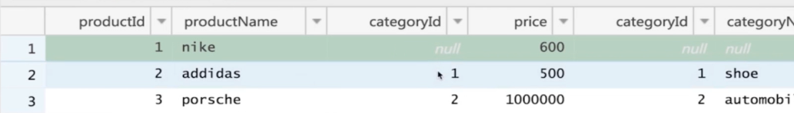
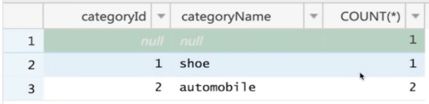
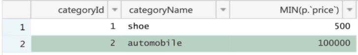
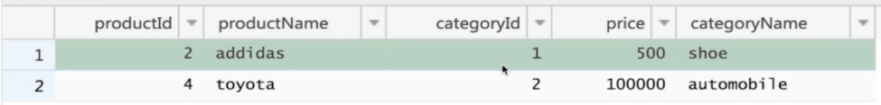
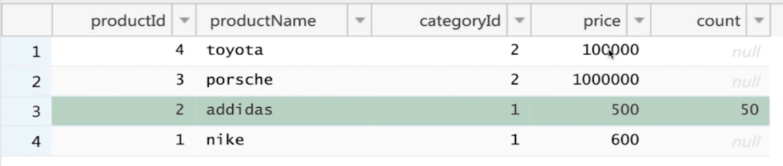
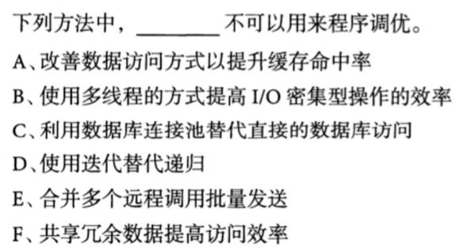

# 关系型数据库

- 基于关系代数理论
- 缺点:表结构不直观(二维表),实现复杂,速度慢
- 优点:健壮性高(外键等),社区庞大
  - 分布式系统,对于健壮性的需求不高(高也没用,因为是相互独立的) -> NoSQL(健壮性低,性能高)

 

# 示例





product表中的外键设置到了category表.

汇总表:

```sql
select * from product join category
```

结果为8条记录,4(product) * 2(category) = 8

```sql
select * from product p join category c
on p.categoryId = c.categoryId
```

结果3条记录,nike不出现.可以用外链接,展示包含null的

```sql
select * from product p left join category c
on p.categoryId = c.categoryId
```

结果为4条,nike的相关category信息都为null



对categoryId进行group by

```sql
select * from product p left join category c
on p.categoryId = c.categoryId
group by p.categoryId
```



此时显示的product信息是数据库搜索时找到的第一个.所以有些数据库不支持这种搜索

分组并统计数量:

```sql
select p.categoryId, categoryName, count(*) from product p left join category c
on p.categoryId = c.categoryId
group by p.categoryId
```



对于这种情况有的数据库也是无法执行的,所以得

```sql
select p.categoryId, categoryName, count(*) from product p left join category c
on p.categoryId = c.categoryId
group by p.categoryId,categoryName
```

聚合函数

```sql
select p.categoryId, categoryName, min(p.price) from product p left join category c
on p.categoryId = c.categoryId
group by p.categoryId,categoryName
```




此时如果想显示MIN的那行的product信息,你可能会

```sql
-- 错误
select p.categoryId, categoryName,p.productName,min(p.price) from product p left join category c
on p.categoryId = c.categoryId
group by p.categoryId,categoryName
```

但这样是不对的,因为它展示的`productName`只是数据库搜索时看到的第一行,而不是MIN的那一行.对于这种需要用子查询. 

找到在相同分类中最便宜的商品信息

```sql
select p.*,cat_min.categoryName from product p join (
    select p.categoryId, categoryName,min(p.price) as min_price from product p left join category c
    on p.categoryId = c.categoryId
    group by p.categoryId,categoryName
) as cat_min
on p.categoryId = cat_min.categoryId
where p.price = cat_min.min_price
```



# 事务

## ACID

- Atomicity(原子性)..要么全部完成,要么不做.不能只做一半
- Consistency(一致性)..操作进行前和进行后都会满足一种约束
  如 : 转账前A(20元)+B(100元) = 转账后A(10元)+B(110元) 
- **Isolation**(隔离性)..操作间互相独立,一个操作不会影响另一个操作
- Durability(持久性)..一旦提交就会永久保存到数据库中

## 事务的隔离级别(Isolation)

- **Read Uncommitted（未提交读）**
  最低级别.别人commit之前的值就能被自己读到
- **Read Committed（提交读）**
  只能读到别人commit之后的值.
  但有可能第一次读的时候是别人commit之后的值,但第二次读时期间值可能发生了改变.
- **Repeatable Read（可重复读）**
  就算别人用commit多次改变了值,仍然可以读到被改变前的值
- **Serializable（可串行化）**
  强制事务串行（排序）执行，避免幻读问题。每个读的数据行上加上锁，而这可能导致大量的超时现象和锁竞争。

## 示例:一个数量限定的商品



阿迪达斯只有50个,必须抢

读剩余数量

```sql
select count from product where productId = 2
```

写剩余数量

```sql
update from product set count = 49 where productId = 2
```

把这两行放入一个事务

验证**Read Uncommitted**(未提交读)

```sql
BEGIN; --开启一个事务,此时count = 50
SET AUTOCOMMIT = 0;	-- 关掉自动提交
-- 此时别人把count更改成了49,但未提交
select count from product where productId = 2;-- 返回50 
```

看一下**Read Committed（提交读）**

```sql
BEGIN; --开启一个事务
select @@tx_isolation; -- 查看事务级别,视频中是READ-COMMITTED
SET AUTOCOMMIT = 0;	-- 关掉自动提交,此时执行完下面时,如果没提交,别人读到的依然是改变前的值
select count from product where productId = 2; --返回50
-- 如果此时别人把count 更新成了49后提交了,那么下面这条会返回49.
-- 因为是READ-COMMITTED,就算是同一个事务中,也不保证读到的是相同的值
select count from product where productId = 2;--返回49
update from product set count = 49 where productId = 2;
```

设置为**Repeatable Read（可重复读）**,让值发生改变时依然能读到改变前的值

```sql
set SESSION TRANSACTION ISOLATION LEVEL REPEATABLE READ; --设置为可重复读
BEGIN;
select @@tx_isolation; -- 查看事务级别,视频中是READ-COMMITTED
SET AUTOCOMMIT = 0;
select count from product where productId = 2; --返回50
-- 如果此时别人把count 更新成了49后提交了.
select count from product where productId = 2;--仍返回50
update from product set count = 49 where productId = 2;
```

测试**Serializable（可串行化）**

```sql
set SESSION TRANSACTION ISOLATION LEVEL SERIALIZABLE; --设置为可串行化
BEGIN;
select @@tx_isolation; -- 查看事务级别,视频中是READ-COMMITTED
SET AUTOCOMMIT = 0;
select count from product where productId = 2; --返回50,此时会给这行加锁
-- 如果此时别人试图把count 更新成49时,它会卡住.直到我们提交
select count from product where productId = 2;--仍返回50
update from product set count = 49 where productId = 2;
COMMIT;
```

在**Repeatable Read（可重复读）**的情况下加锁

```sql
set SESSION TRANSACTION ISOLATION LEVEL REPEATABLE READ; --设置为可重复读
BEGIN;
select @@tx_isolation; -- 查看事务级别,视频中是READ-COMMITTED
SET AUTOCOMMIT = 0;
select count from product where productId = 2 FOR UPDATE; --返回50
-- 如果此时别人也执行select count from product where productId = 2 FOR UPDATE;那么它也会卡住,直到我们执行完成
```

# 乐观锁

之前的加锁步骤太耗资源

演示乐观锁:

```sql
select count from product where productId = 2; -- 50
-- 版本保护,确保更新的是目的的那行
-- 如果中途别人改变了这个值,那么下面的update就会失败,结果会是影响了[0]行
update from product set count = 49 where productId = 2 and count = 50;
```

- 读取数据, 记录Timestamp(上面的例子中是count,只要是更够确定版本的量就可以)
  上面的select
- 修改数据
  应用程序中
- 检查和提交数据
  上面的update,检查和提交数据需要同时执行

适合买家不是特别多,冲突较少时

# 综合例题



B:所有线程都在等待io的操作,大部分时间都是等待,线程的多少不会影响等待时间