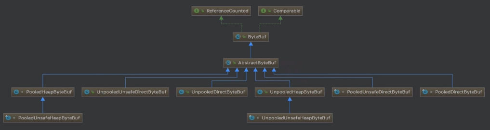
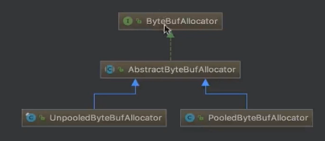
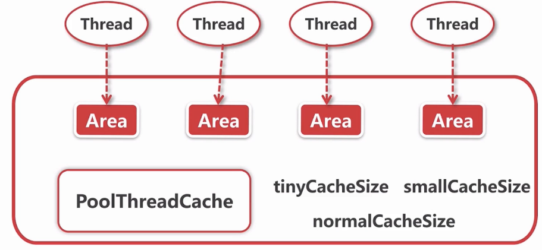

- 内存的类别有哪些
- 如何减少多线程内存分配之间的竞争
- 不同大小的内存是如何进行分配的

# ByteBuf

- 内存与内存管理器的抽象
- 不同规格大小和不同类别的内存的分配策略
- 内存的回收过程

# ByteBuf结构以及重要API

## ByteBuf的结构

```java

 *      +-------------------+------------------+------------------+
 *      | discardable bytes |  readable bytes  |  writable bytes  |
     		无效的				可以读的空间			可以写的空间
 *      +-------------------+------------------+------------------+
 *      |                   |                  |                  |
 *      0      <=      readerIndex   <=   writerIndex    <=    capacity
```

ByteBuf中三个重要的指针

- readIndex..表明读数据从这个指针开始
- writeIndex..表明如果要写数据的话就从这个指针开始写
- capacity 
- `maxCapacity()`可扩容的最大容量,当capacity不够时就会进行扩容.要是大于`maxCapacity()`就拒绝

## read,write,set方法

提供了很多read开头的方法,如`readInt();`

- `readByte()`从readerIndex开始往后读1个字节
- `readInt();`从readerIndex开始往后读4个字节...

write的API也和read相同,从指针开始往后设置.

除了这两个之外还有set的API如`setInt();`,它的功能是把第几个索引设置成目的的值 

```java
public abstract ByteBuf setByte(int index, int value);
```

它不会移动任何指针 

## mark和reset方法

```java
public abstract ByteBuf markReaderIndex();
public abstract ByteBuf resetReaderIndex();
```

通过read的API读取数据时,指针会向后移动.如果不想这样  可以在read之前先用mark记录指针位置,read完后用reset复原指针.`markWriterIndex()`也同理

##  其他常用API

```java
public abstract int readableBytes();//this.writerIndex - this.readerIndex 
public abstract int writableBytes();//this.capacity - this.writerIndex
public abstract int maxWritableBytes();//this.maxCapacity - this.writerIndex
```

# ByteBuf分类



## AbstractByteBuf

基本骨架的实现,读写的具体实现方法仍是抽象,这些抽象方法为`_`开头

保存读写指针

```java
    int readerIndex;
    int writerIndex;
    private int markedReaderIndex;
    private int markedWriterIndex;
    private int maxCapacity;
```

他实现的readByte

```java
    @Override
    public byte readByte() {
        checkReadableBytes0(1);
        int i = readerIndex;//获取当前写指针
        byte b = _getByte(i);//从这个写指针读一个字节,这里是抽象方法
        readerIndex = i + 1;//写指针后移
        return b;
    }
```

它实现的writeByte

```java
    @Override
    public ByteBuf writeByte(int value) {
        //保证能写
        ensureAccessible();
        ensureWritable0(1);
        //这里是抽象方法,表示写入指针的位置,写完后指针后移
        _setByte(writerIndex++, value);
        return this;
    }
```

## ByteBuf实现的分类

### Pooled和Unpooled

Pooled:把预先在内存中设置好的内存封装为ByteBuf
Unpooled:直接调用系统的API向操作系统申请一块内存 

### Unsafe和非Unsafe

Unsafe:可以拿到对象的内存地址,通过内存地址进行读写操作.直接调用JDK的Unsafe对ByteBuf进行读写
非Unsafe:不依赖JDK的Unsafe对象
如`PooledUnsafeHeapByteBuf#_getByte`

```java
    @Override
    protected byte _getByte(int index) {
        //通过内存去取值
        //memory:ByteBuf分配内存的首地址,index:偏移地址
        return UnsafeByteBufUtil.getByte(memory, idx(index));
    }
---
    static byte getByte(byte[] data, int index) {
    	//最终调用Unsafe对象获取
        return UNSAFE.getByte(data, BYTE_ARRAY_BASE_OFFSET + index);
    }
```

  相反`PooledHeapByteBuf#_getByte` 

```java
    @Override
    protected byte _getByte(int index) {
        return HeapByteBufUtil.getByte(memory, idx(index));
    }
---
    static byte getByte(byte[] memory, int index) {
    //直接通过数组保存
        return memory[index];
    }
```

### Heap和Direct

**Heap:在对上进行内存分配.GC管理**
**Direct:通过JDK的API在JVM外分配,没有GC**
UnpooledHeapByteBuf中 

```java
    byte[] array;//通过数组操作
```

而UnpooledDirectByteBuf中

```java
private ByteBuffer buffer;//ByteBuf对象,这个是JDK底层的ByteBuf
```

它的_getByte()

```java
    @Override
    protected byte _getByte(int index) {
        return buffer.get(index);
    }
```

这个JDK的ByteBuffer是如何分配的?

在UnpooledDirectByteBuf的构造方法:

```java
    protected UnpooledDirectByteBuf(ByteBufAllocator alloc, int initialCapacity, int maxCapacity) {
        this.alloc = alloc;
        setByteBuffer(ByteBuffer.allocateDirect(initialCapacity));//JDK提供的API 
    }
---
    public static ByteBuffer allocateDirect(int capacity) {
        return new DirectByteBuffer(capacity);//分配堆外内存
    }
```

# ByteBufAllocator分析

## ByteBufAllocator功能

所有类型的ByteBuf最终都是由ByteBufAllocator分配出来,它相当于Netty中的内存管理器.

看一下它有哪些功能

```java
public interface ByteBufAllocator {

    ByteBufAllocator DEFAULT = ByteBufUtil.DEFAULT_ALLOCATOR;
    
    //分配一块内存.依赖于Direct或heap的具体实现
    ByteBuf buffer();
    ByteBuf buffer(int initialCapacity);
    ByteBuf buffer(int initialCapacity, int maxCapacity);
	
    //分配一块内存,倾向于io,推荐用Direct实现
    ByteBuf ioBuffer();
    ByteBuf ioBuffer(int initialCapacity);
    ByteBuf ioBuffer(int initialCapacity, int maxCapacity);
	
     //在堆上分配一块内存
    ByteBuf heapBuffer();
    ByteBuf heapBuffer(int initialCapacity);
    ByteBuf heapBuffer(int initialCapacity, int maxCapacity);

    //在堆外分配一块内存
    ByteBuf directBuffer();
    ByteBuf directBuffer(int initialCapacity);
    ByteBuf directBuffer(int initialCapacity, int maxCapacity);
	
    //允许不单独基于堆或堆外实现的方式分配内存,可以把两个ByteBuf合并到一起成compositeBuffer
    //用得少
    CompositeByteBuf compositeBuffer();
    CompositeByteBuf compositeBuffer(int maxNumComponents);
    CompositeByteBuf compositeHeapBuffer();
    CompositeByteBuf compositeHeapBuffer(int maxNumComponents);
    CompositeByteBuf compositeDirectBuffer();
    CompositeByteBuf compositeDirectBuffer(int maxNumComponents);

    boolean isDirectBufferPooled();

    int calculateNewCapacity(int minNewCapacity, int maxCapacity);
 }

```

可以看到ByteBufAllocator只区分了Direct或heap,没有说道其他的几种分类方式

## AbstractByteBufAllocator抽象实现

 如buffer()的实现

```java
    @Override
    public ByteBuf buffer() {
        if (directByDefault) {
            return directBuffer();
        }
        return heapBuffer();
    }
```

同时具备direct和heap分配的两种功能,下面是`directBuffer()`

```java
    @Override
    public ByteBuf directBuffer(int initialCapacity, int maxCapacity) {
        if (initialCapacity == 0 && maxCapacity == 0) {
            return emptyBuf;
        }
        validate(initialCapacity, maxCapacity);
        return newDirectBuffer(initialCapacity, maxCapacity);//而这个部分是抽象的
    }
---
    protected abstract ByteBuf newDirectBuffer(int initialCapacity, int maxCapacity);
	protected abstract ByteBuf newHeapBuffer(int initialCapacity, int maxCapacity);
```

也就是说具体new出来的DirectBuffer是pooled还是unpooled,是由子类实现.实现这个方法的类有

- PooledByteBufAllocator
- UnPooledByteBufAllocator

反之,AbstractByteBufAllocator已经实现了这两个方法之外的所有方法

## ByteBufAllocator两大子类



回顾一下

- Pooled:从已经分配好的内存中取一段
- UnPlooed:直接调用系统API分配一块新的内存

那么unsafe和非unsafe是什么谁实现的

对于unsafe,netty会自动判别.如过能拿到unsafe对象就分配unsafe的byteBuf,如果拿不到则会分配非unsafe的byteBuf

比如UnpooledByteBufAllocator是这样实现newHeapBuffer的:

```java
@Override
protected ByteBuf newHeapBuffer(int initialCapacity, int maxCapacity) {
    //判断是否有unsafe对象,然后返回相应的ByteBuf
    return PlatformDependent.hasUnsafe() ? new UnpooledUnsafeHeapByteBuf(this, initialCapacity, maxCapacity)
        : new UnpooledHeapByteBuf(this, initialCapacity, maxCapacity);
}
```

## UnpooledByteBufAllocator分析

### Heap内存分配

`UnpooledByteBufAllocator#newHeapBuffer`如下

```java
@Override
protected ByteBuf newHeapBuffer(int initialCapacity, int maxCapacity) {
    //netty自动判断是否创建unsafe 
    return PlatformDependent.hasUnsafe() ? new UnpooledUnsafeHeapByteBuf(this, initialCapacity, maxCapacity)//先看这个
        : new UnpooledHeapByteBuf(this, initialCapacity, maxCapacity);
}
```

关于UnpooledUnsafeHeapByteBuf的创建,可以看到`UnpooledUnsafeHeapByteBuf`是`UnpooledHeapByteBuf`的子类,而他的构造函数如下

```java
    UnpooledUnsafeHeapByteBuf(ByteBufAllocator alloc, int initialCapacity, int maxCapacity) {
        super(alloc, initialCapacity, maxCapacity);
    }
```

也就是说它的创建过程和`UnpooledHeapByteBuf`是完全相同的,他们都需要去创建一个数组作为存储空间

```java
    protected UnpooledHeapByteBuf(ByteBufAllocator alloc,
                                  int initialCapacity,//初始的capacity,
                                  int maxCapacity) {	//最多可以扩容到多少capacity
        //0,0 = readIndex,writeIndex
        this(alloc, new byte[initialCapacity], 0, 0, maxCapacity);
    }
---
    private UnpooledHeapByteBuf(
            ByteBufAllocator alloc, byte[] initialArray, int readerIndex, int writerIndex, int maxCapacity) {
        super(maxCapacity);

        this.alloc = alloc;
        setArray(initialArray);//把新创建的byte数组保存到成员变量
        setIndex(readerIndex, writerIndex);//同样把这里两个指针保存到成员变量
    }
```

那么`UnpooledUnsafeHeapByteBuf`和`UnpooledHeapByteBuf`的实现的区别是什么?

关于`UnpooledHeapByteBuf`,能看出它是直接从Byte数组中取出元素

(非Unsafe:不依赖JDK的Unsafe对象)

```java
    @Override
    protected byte _getByte(int index) {
        return HeapByteBufUtil.getByte(array, index);
    }
---
    static byte getByte(byte[] memory, int index) {
        return memory[index];//
    }
```

而`UnpooledUnsafeHeapByteBuf`,它最终调用unsafe对象去获取元素

(Unsafe:可以拿到对象的内存地址,通过内存地址进行读写操作.直接调用JDK的Unsafe对ByteBuf进行读写)

```java
    @Override
    protected byte _getByte(int index) {
        return UnsafeByteBufUtil.getByte(array, index);
    }
---
    static byte getByte(byte[] data, int index) {
        return UNSAFE.getByte(data, BYTE_ARRAY_BASE_OFFSET + index);
    }
```

### direct内存分配

也就是堆外内存分配 

回到`UnpooledByteBufAllocator`的`newDirectBuffer()`

```java
    @Override
    protected ByteBuf newDirectBuffer(int initialCapacity, int maxCapacity) {
        //也是先判断unsafe
        ByteBuf buf = PlatformDependent.hasUnsafe() ?
                UnsafeByteBufUtil.newUnsafeDirectByteBuf(this, initialCapacity, maxCapacity) :
                new UnpooledDirectByteBuf(this, initialCapacity, maxCapacity);

        return disableLeakDetector ? buf : toLeakAwareBuffer(buf);
    }
```

先看`UnpooledDirectByteBuf`的创建

```java
    protected UnpooledDirectByteBuf(ByteBufAllocator alloc, int initialCapacity, int maxCapacity) {
        super(maxCapacity);
 
        this.alloc = alloc;
        //用JDK-API分配堆外内存
        setByteBuffer(ByteBuffer.allocateDirect(initialCapacity));//把创建的JDKBuffer保存到成员变量
    }
```

而上面的`newUnsafeDirectByteBuf`创建的unsafe的direct是做了什么

```java
    static UnpooledUnsafeDirectByteBuf newUnsafeDirectByteBuf(
            ByteBufAllocator alloc, int initialCapacity, int maxCapacity) {
        //创建了UnpooledUnsafeDirectByteBuf
        return new UnpooledUnsafeDirectByteBuf(alloc, initialCapacity, maxCapacity);
    }
---
    //和UnpooledDirectByteBuf相似
    protected UnpooledUnsafeDirectByteBuf(ByteBufAllocator alloc, int initialCapacity, int maxCapacity) {
        super(maxCapacity);

        this.alloc = alloc;
    	//同样是调用ByteBuffer.allocateDirect(initialCapacity);
        setByteBuffer(allocateDirect(initialCapacity), false);
    }
```

与UnpooledDirectByteBuf的内存分配步骤相同,不同在于它的`setByteBuffer()`步骤

```java
    final void setByteBuffer(ByteBuffer buffer, boolean tryFree) {

        this.buffer = buffer;//和UnpooledDirectByteBuf相同保存创建的JDKBuffer
        //不同之处 : 把这个buffer的内存地址保存到memoryAddress中
        memoryAddress = PlatformDependent.directBufferAddress(buffer);
        tmpNioBuf = null;
        capacity = buffer.remaining();
    }
```

这个`PlatformDependent.directBufferAddress`会通过`UNSAFE.getLong(object, fieldOffset);`获取内存地址

以后我们通过getByte读值的时候会通过这里保存的`memoryAddress`去读值,看一下它的getByte

```java
    @Override
    protected byte _getByte(int index) {
        return UnsafeByteBufUtil.getByte(addr(index));//算内存地址 memoryAddress + index 
    }
---
    //通过Unsafe和内存地址获取
    static byte getByte(long address) {
        return UNSAFE.getByte(address);
    }
```

而相比之下,`UnpooledDirectByteBuf`则是

```java
    @Override
    protected byte _getByte(int index) {
        return buffer.get(index);//直接用JDK的buffer的get去获取
    }
```

# 小结

### ByteBuf分类

- **按内存的分配方式分类**

| Pooled                          | Unpooled                    |
| ------------------------------- | --------------------------- |
| 利用已分配的内存空间构建ByteBuf | 重新分配内存空间构建ByteBuf |

- **按操作方式分类**

| Unsafe                                     | 非Unsafe                    |
| ------------------------------------------ | --------------------------- |
| 通过Unsafe对象,用内存地址对ByteBuf进行操作 | 用其他方式对ByteBuf进行操作 |

- **按所在空间分类**

| Heap   | Direct                    |
| ------ | ------------------------- |
| 堆内存 | 堆外内存,创建JDK的ByteBuf |

### 对于Unpooled

他们的`_getByte()`分别是如何获取元素的

|            | Unsafe                             | 非Unsafe                   |
| ---------- | ---------------------------------- | -------------------------- |
| **Heap**   | Unsafe对象从堆内地址获取元素       | 从数组直接获取索引元素     |
| **Direct** | Unsafe对象从计算堆外地址后获取元素 | 从JDK的ByteBuf直接获取元素 |

### 3个维度的分类分别在什么时候决定

1. Allocator子类决定Pooled还是UnPooled
2. 调用它的newHeapBuffer还是newDirectBuffer决定Heap还是Direct
3. 调用hasUnsafe()决定时Unsafe还是非Unsafe


# PooledByteBufAllocator概述

相对于Unpooled更复杂

```java
    @Override
    protected ByteBuf newDirectBuffer(int initialCapacity, int maxCapacity) {
        PoolThreadCache cache = threadCache.get();// 拿到PoolThreadCache对象
        PoolArena<ByteBuffer> directArena = cache.directArena;//再拿PoolArena对象

        ByteBuf buf;
        if (directArena != null) {
            //在这个directArena上分配想要的空间
            buf = directArena.allocate(cache, initialCapacity, maxCapacity);
        } 
        //...

        return toLeakAwareBuffer(buf);
    }
```

它的内存分配过程

## 1.拿到线程局部缓存PoolThreadCache

`newDirectBuffer()`可能会被多线程调用,而`threadCache.get()`能使我们获取当前线程的cache
也就是说不同的线程拥有不同的内存空间
这里的threadCache是`PoolThreadLocalCache`类型,也就是JDK的ThreadLocal的扩展类型
它是PooledByteBufAllocator的内部类,调用`threadCache.get();`时会调用它的`initialValue()`方法,分配空间一段线程私有的空间

```java
@Override
protected synchronized PoolThreadCache initialValue() {
    //heapArenas,directArenas是什么?稍后会讲
    final PoolArena<byte[]> heapArena = leastUsedArena(heapArenas);
    final PoolArena<ByteBuffer> directArena = leastUsedArena(directArenas);
	
    //线程私有的PoolThreadCache
    return new PoolThreadCache(
        heapArena, directArena, tinyCacheSize, smallCacheSize, normalCacheSize,
        DEFAULT_MAX_CACHED_BUFFER_CAPACITY, DEFAULT_CACHE_TRIM_INTERVAL);
}
```

## 2.在线程局部缓存的Arena上进行内存分配

```java
    @Override
    protected ByteBuf newDirectBuffer(int initialCapacity, int maxCapacity) {
        PoolThreadCache cache = threadCache.get();// 此时创建线程私有的
        //这里的directArena就是上面创建PoolThreadCache时放入的directArena
        PoolArena<ByteBuffer> directArena = cache.directArena;
//...
        //在线程局部缓存的Arena上进行内存分配
        buf = directArena.allocate(cache, initialCapacity, maxCapacity);
    }
```

在上面介绍的`initialValue()`中是通过`leastUsedArena()`拿到这的对象的 .从字面意思可以推断出他是从directArenas中拿到可用的Arena中最小的Arena.

但是heapArenas,directArenas是什么时候创建的?在`PooledByteBufAllocator`的构造方法中创建
heapArena的部分

```java
if (nHeapArena > 0) {
    heapArenas = newArenaArray(nHeapArena);//这个部分创建的PoolArena类型的数组
    List<PoolArenaMetric> metrics = new ArrayList<PoolArenaMetric>(heapArenas.length);
    for (int i = 0; i < heapArenas.length; i ++) {
        //并在这把PoolArena类型的数组中的各个元素创建为HeapArena
        PoolArena.HeapArena arena = new PoolArena.HeapArena(this, pageSize, maxOrder, pageShifts, chunkSize);
        heapArenas[i] = arena;
        metrics.add(arena);
    }
    heapArenaMetrics = Collections.unmodifiableList(metrics);
}
---
    private static <T> PoolArena<T>[] newArenaArray(int size) {
        return new PoolArena[size];
    }
```

他是一个PoolArena类型的数组,directArena也类似

```java
if (nDirectArena > 0) {
    directArenas = newArenaArray(nDirectArena);
    List<PoolArenaMetric> metrics = new ArrayList<PoolArenaMetric>(directArenas.length);
    for (int i = 0; i < directArenas.length; i ++) {
        PoolArena.DirectArena arena = new PoolArena.DirectArena(
            this, pageSize, maxOrder, pageShifts, chunkSize);
        directArenas[i] = arena;
        metrics.add(arena);
    }
    directArenaMetrics = Collections.unmodifiableList(metrics);
```

也就是说在我们构造`PooledByteBufAllocator`时会构造两种PoolArena数组.而这个数组的大小,也就是参数`nHeapArena`,`nDirectArena`的值是什么.它的重载构造函数是这样引入它的

```java
public PooledByteBufAllocator(boolean preferDirect) {
    this(preferDirect,
         DEFAULT_NUM_HEAP_ARENA,	//堆内
         DEFAULT_NUM_DIRECT_ARENA,	//堆外 
         DEFAULT_PAGE_SIZE, DEFAULT_MAX_ORDER);
}
```

这两个常量的值的定义:

```java
final int defaultMinNumArena = runtime.availableProcessors() * 2;//两倍的cpu核数
final int defaultChunkSize = DEFAULT_PAGE_SIZE << DEFAULT_MAX_ORDER;    

	DEFAULT_NUM_HEAP_ARENA = Math.max(0,
                SystemPropertyUtil.getInt(
                        "io.netty.allocator.numHeapArenas",
                        (int) Math.min(
                                defaultMinNumArena, 
                            //通常defaultMinNumArena > 下面
                                runtime.maxMemory() / defaultChunkSize / 2 / 3)));
        DEFAULT_NUM_DIRECT_ARENA = Math.max(0,
                SystemPropertyUtil.getInt(
                        "io.netty.allocator.numDirectArenas",
                        (int) Math.min(
                                defaultMinNumArena,
                                PlatformDependent.maxDirectMemory() / defaultChunkSize / 2 / 3)));
```

也就是说`DEFAULT_NUM_HEAP_ARENA`和`DEFAULT_NUM_DIRECT_ARENA`默认情况下就是cpu核数*2,那么什么是cpu核数*2,之前创建NioEventLoop的时候同样也是创建的cpu核数*2,这么一来每个NioEventLoop都能有自己的Arena,而且使用它们时是不用加锁的

## PooledByteBufAllocator结构



假设现在有4个线程,也就是说NioEventLoop有4个,下面的框是内存分配器`PooledByteBufAllocator`

1. 拿到一个Arena放入Thread私有的PoolThreadCache中,保存为成员变量

2. 通过`threadCache.get().directArena`的时候就可以拿到属于线程自己的Arena

3. PooledThreadCache除了直接在Arena上分配内存之外,还可以在他底层维护的ByteBuf上的缓存列表上进行分配,如:

   1. 通过它创建了1024字节的ByteBuf,当用完并释放之后可能在其他地方用到这个1024字节的空间
   2. 此时不需要再Arena上进行分配,而是直接通过PooledThreadCache中维护的ByteBuf的缓存列表

   PooledByteBufAllocator中的3个参数,表示了缓存的大小,分别表示3中不同大小的缓存量

   - tinyCacheSize	tiny大小的ByteBuf最多能缓存多大
   - smallCacheSize
   - normalCacheSize

看一下这三个成员变量的定义,他们是在创建`PoolThreadCache`时被放入的

```java
        @Override
        protected synchronized PoolThreadCache initialValue() {
            final PoolArena<byte[]> heapArena = leastUsedArena(heapArenas);
            final PoolArena<ByteBuffer> directArena = leastUsedArena(directArenas);

            return new PoolThreadCache(
                	//这里放入
                    heapArena, directArena, tinyCacheSize, smallCacheSize, normalCacheSize,
                    DEFAULT_MAX_CACHED_BUFFER_CAPACITY, DEFAULT_CACHE_TRIM_INTERVAL);
        }
```

在`PoolThreadCache`的构造方法中:

```java
if (directArena != null) {
    tinySubPageDirectCaches = createSubPageCaches(
        tinyCacheSize, PoolArena.numTinySubpagePools, SizeClass.Tiny);
    smallSubPageDirectCaches = createSubPageCaches(
        smallCacheSize, directArena.numSmallSubpagePools, SizeClass.Small);

    numShiftsNormalDirect = log2(directArena.pageSize);
    normalDirectCaches = createNormalCaches(
        normalCacheSize, maxCachedBufferCapacity, directArena);

    directArena.numThreadCaches.getAndIncrement();
}
```

看一下`createSubPageCaches`是怎么做的

```java
private static <T> MemoryRegionCache<T>[] createSubPageCaches(
    int cacheSize, int numCaches, SizeClass sizeClass) {
    if (cacheSize > 0) {
        //创建在每个PooledThreadCache中的缓存对象
        MemoryRegionCache<T>[] cache = new MemoryRegionCache[numCaches];
        for (int i = 0; i < cache.length; i++) {
            cache[i] = new SubPageMemoryRegionCache<T>(cacheSize, sizeClass);
        }
        return cache;
    } else {
        return null;
    }
}
```

# 小结

调用Pooled的newDirectBuffer()时会调用threadCache.get(),并在他返回的PoolThreadCache中分配空间

也就是说与Unpooled直接分配空间不同,Pooled会在线程私有的PoolThreadCache中分配空间

而这个PoolThreadCache是在调用threadCache.get();时,创建线程私有的空间.此时heap,direct都会创建.

这两个线程私有的空间是从整体的heapArenas[],directArenas[]数组中各取出一个可用的作为线程私有的空间.

Arenas[]数组的大小是cpu*2,也就意味着拥有NioEventLoop个数的Arena.

Arena本体是在PooledByteBufAllocator的构造方法中创建

此外,线程私有的PooledThreadCache除了在Arena上分配空间之外,还能在他维护的JDK的ByteBuf缓存列表中分配空间,提供了三种大小的缓存,分别是 tinyCache,smallCache,normalCache

## directArena分配direct内存的流程  

### 1.从对象池里面拿到`PooledByteBuf`进行复用

继续看之前调用`newDirectBuffer()`的过程

```java
protected ByteBuf newDirectBuffer(int initialCapacity, int maxCapacity) {
    //这两句是刚才分析的
    PoolThreadCache cache = threadCache.get();
    PoolArena<ByteBuffer> directArena = cache.directArena;

    ByteBuf buf;
    if (directArena != null) {
        //看这个部分是如何分配出netty.ByteBuf的
        buf = directArena.allocate(cache, initialCapacity, maxCapacity);
    }
    return toLeakAwareBuffer(buf);
}
```

```java
    PooledByteBuf<T> allocate(PoolThreadCache cache, int reqCapacity, int maxCapacity) {
        //通过newByteBuf()拿到PooledByteBuf对象
        PooledByteBuf<T> buf = newByteBuf(maxCapacity);
        //实际在PoolThreadCache上进行buf的初始化
        allocate(cache, buf, reqCapacity);
        return buf;
    }
```

`newByteBuf();`如何获取`PooledByteBuf`对象?

```java
@Override
protected PooledByteBuf<ByteBuffer> newByteBuf(int maxCapacity) {
    if (HAS_UNSAFE) {//默认true
        return PooledUnsafeDirectByteBuf.newInstance(maxCapacity);//
    } else {
        return PooledDirectByteBuf.newInstance(maxCapacity);
    }
}
```

 `PooledUnsafeDirectByteBuf.newInstance()`:

```java
static PooledUnsafeDirectByteBuf newInstance(int maxCapacity) {
    //带有回收功能,表示对象池有这个buf时拿出,没有时创建
    PooledUnsafeDirectByteBuf buf = RECYCLER.get();//拿到Buf
    //如果是从回收站中取出的,进行复用
    buf.reuse(maxCapacity);
    return buf;//返回一个重置过后的buf对象(也有可能是全新的)
}
---进行复用时,初始化 
    final void reuse(int maxCapacity) {
        maxCapacity(maxCapacity);
        setRefCnt(1);
        setIndex0(0, 0);
        discardMarks();//重置从回收站取出来时的值
    }
---实际上就是把mark索引设置为0
    final void discardMarks() {
        markedReaderIndex = markedWriterIndex = 0;
    }
```

### 2.从缓存上进行分配

```java
    PooledByteBuf<T> allocate(PoolThreadCache cache, int reqCapacity, int maxCapacity) {
        //上一步,获取一个复用的Buf对象
        PooledByteBuf<T> buf = newByteBuf(maxCapacity);
        allocate(cache, buf, reqCapacity);//这一步
        return buf;
    }
```


```java
    private void allocate(PoolThreadCache cache, PooledByteBuf<T> buf, final int reqCapacity) {
        final int normCapacity = normalizeCapacity(reqCapacity);
	//...
        if (normCapacity <= chunkSize) {
            //在PoolThreadCache上进行内存分配
            if (cache.allocateNormal(this, buf, reqCapacity, normCapacity)) {
                //分配成功
                return;
            }
            //分配失败,实际上去分配一块内存
            allocateNormal(buf, reqCapacity, normCapacity);
        } else {
            //normCapacity <= chunkSize时,不会在缓存上分配
            allocateHuge(buf, reqCapacity);
        }
    }
```

上面只展示了`normalCache`,但是`tiny`和`small`也是一样的逻辑,首先尝试在缓存中分配,分配失败就实际去分配一块内存.而当大于chunkSize时比较特殊,会直接就实际去分配内存.

### 3.缓存命中失败,从内存堆里面进行内存分配

