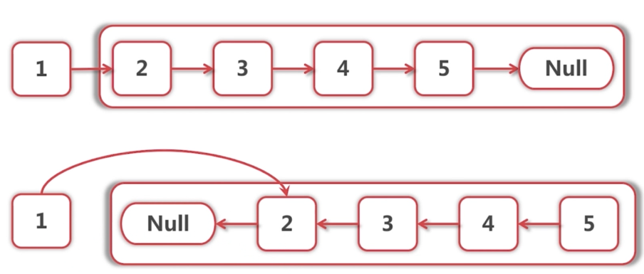

- 递归控制
- 循环控制
- 边界控制
- 数据结构 树

# 数据归纳法

用于证明断言对所有自然数成立

- 证明对于N=1成立
- 证明N>1时:如果对于N-1成立,那么对于N成立

# 递归控制

如何证明递归函数正确执行?

- 数据归纳法->编程语言

递归书写方法

- 严格定义递归函数作用,包括函数,返回值,Side-effect(副作用)
- 先写**一般**,再后**特殊(如,值=0的时候 return null)**到前面
- 每次调用必须缩小问题规模
- 每次规模缩小程度必须为**1**,因为数据归纳法中本来就是1

## 例1:链表创建

```java
public Node createLinkedList(List<Integer> data) {
    //根据1和2的特殊情况进行处理
    if (data.isEmpty()) {
        return null;
    }
    //从写好的一般情况一行一行从上往下看,排查出特殊情况
    Node firstNode = new Node(data.get(0));//1. 当没有元素时会出问题,是特殊情况.
    Node headOfSublist = createLinkedList(data.subList(1, data.size()));//2. subList()时开始和结束的索引相同时会返回空的数组,和1.是相同的特殊情况
    firstNode.setNext(headOfSublist);
    return firstNode;
}
```


## 例2:链表反转




```java
    public Node reverseLinkedList(Node head) {
        // size == 0 || size == 1
        if (head == null || head.getNext() == null) {
            return head;
        }

        Node newHead = reverseLinkedList(head.getNext());
        head.getNext().setNext(head);
        head.setNext(null);
        return newHead;
    }
```

## 例3:列出所有组合

- combinations([1,2,3,4],2): 4C2 = 6个
  - 选1 -> combinations([2,3,4],1)
  - 不选1 -> combinations([2,3,4],2)

```java
    public void combinations(List<Integer> selected, List<Integer> data, int n) {
        
        if (n == 0) {
            //output all selected elements
            for (Integer integer : selected) {
                System.out.print(integer);
                System.out.print(" ");
            }
            System.out.println();
            return;
        }
        if (data.isEmpty()) {
            return;
        }

        //select element 0
        selected.add(data.get(0));
        combinations(selected, data.subList(1, data.size()), n - 1);

        //un-select element 0
        selected.remove(selected.size() - 1);
        combinations(selected, data.subList(1, data.size()), n);
    }
```

## 递归的缺点

Stack

- 函数调用开销
- Stack Overflow!
- 问题规模:n million 栈大小?

# 循环控制

**不要尝试递归 -> 非递归**

- 一般化的方法仍然需要栈
- 代码复杂
- 不根本解决问题

**循环不变式(loop invariant)**

- 是一句断言定义各变量所需满足的条件

**循环书写方法**

- 定义循环不变式,并在循环体每次结束后**保持**循环不变
- 先写**一般**,后**特殊**
- 每次必须向前推进循环不变式中设计的变量值,从而缩小问题规模
- 每次规模缩小程度必须为**1**

## 例1:链表反转

递归的时候是以第一个元素为例;思考循环时先拿出中间元素


这句话就是循环不变式,在循环的过程中一直成立.

满足循环不变式的初始值,和最后的值:

​


```java
    public Node reverseLinkedList(Node head) {
        Node newHead = null;
        Node curHead = head;
        //Loop invariant:
        //newHead 指向反转成功的链表
        //curHead 指向还没有反转的链表
        while (curHead != null) {
            Node next = curHead.getNext();
            curHead.setNext(newHead);
            newHead = curHead;
            curHead = next;
        }
        return newHead;
    }
```

**循环创建链表**

```java
    public Node createLargeLinkedList(int size){
        Node prev = null;
        Node head = null;
        for (int i = 1 ; i <=size ; i++) {
            Node node = new Node(i);
            if (prev!=null){
                prev.setNext(node);
            }else {
                head = node;
            }
            prev = node;
        }
        return head;
    }
```

## 例2:链表中delete_if

数值为2的节点删除


还是从中间思考


头节点没有previous怎么办？

- **特殊处理**
- 增加虚拟头结点

```java
    public Node deleteIfEquals(Node head, int value) {
        while ((head != null && head.getValue() == value)) {//head就是需要删除的值
            head = head.getNext();
        }
        if (head == null) {
            return null;
        }
        Node prev = head;
        //  Loop invariant:从头结点直到prev为止都已经处理完毕
        while (prev.getNext() != null) {
            if (prev.getNext().getValue() == value) {
                //delete it
                prev.setNext(prev.getNext().getNext());
            } else {
                prev = prev.getNext();
            }
        }
        return head;
    }
```


# 边界控制

## 例：二分查找

- 在有序数组中查找元素k，返回k所在下标
- binarySearch([ 15) == 3

二分查找思路：

- 规定要查找的值k可能在的数组arr内下表区间 a，b
- 计算区间a，b的中间点m
- 若k < arr[m],将区间缩小为a,m , 继续二分查找
- 若k > arr[m],将区间缩小为m,b , 继续二分查找
- 若k == arr[m],则找到元素位置m

二分查找很难写! 边界变量很多

  ```java
    public int binarySearch(int[] arr, int k) {
        int a = 0;
        int b = arr.length;
        //Loop invariant: [a,b) is a valid range(a <= b)
        //k may only be within range[a,b).
        while (a < b) {
            //            int m = (a + b) / 2; 可能会 stackOverflow
            int m = a + (b - a) / 2;
            // a==b: m = a and m = b <- 通过循环条件排除
            // b = a+1 : m = a
            // b == a+2 : m = a+1
            if (k < arr[m]) { //a==b时 m = b ,会越界.不过此时肯定是不存在目标数字的。设置为循环条件
                b = m;
            } else if (k > arr[m]) {
                a = m + 1;
            } else {
                return m;
            }
        }
        return -1;

    }
  ```

# 数据结构

- 数据结构回顾
- 数的遍历
- 算法复杂度分析

## 列表

- 数组
  插入，删除比较耗时。插入需要往后移动一位，腾出空间之后才能插入
- 链表
  访问元素耗时。只有表头，需要一个个遍历。插入删除简单
- 队列，栈
  不支持随机访问

## 树

- 二叉树
- 搜索树
- 堆/优先队列
  堆排序就是这种树的根节点是所有节点中最大或最小

## 栈/队列/优先队列

- push(1);push(3);push(2);pop();pop();pop();
- 栈:2,3,1
- 队列:1,3,2
- 优先队列:1,2,3

## `Map<K,V>`/`Set<K>`

- HashMap/HashSet -> K.hashCode()
- TreeMap/TreeSet -> K implement Comparable

## 图

- 无向图
  双向都能走,图可能有权重
- 有向图
  单向的
- 有向无环图
  树?

### 图的算法

- 深度优先遍历
- 广度优先遍历
- 拓扑排序
- 最短路径/最小生成树

# 树

## 二叉树的遍历 

- 前序遍历 : 根->左->右
- 中序遍历 : 左->根->右
- 后序遍历 :左->右->根


后序遍历：ＤGEBFCA

```java
    public void preOrder(TreeNode root) {
        if (root == null) return;
        System.out.print(root.getValue());
        preOrder(root.getLeft());
        preOrder(root.getRight());
    }

    public void inOrder(TreeNode root) {
        if (root == null) return;
        inOrder(root.getLeft());
        System.out.print(root.getValue());
        inOrder(root.getRight());
    }

    public void postOrder(TreeNode root) {
        if (root == null) return;
        postOrder(root.getLeft());
        postOrder(root.getRight());
        System.out.print(root.getValue());
    }
```

## 例1:根据前序中序构造二叉树

前序:ABDEGCF
中序:DBGEACF

求后序


```java
    public TreeNode createTree(String preOrder, String inOrder) {
        if (preOrder.isEmpty()){
            return null;
        }
        char rootValue = preOrder.charAt(0);
        int rootIndex = inOrder.indexOf(rootValue);
        TreeNode root = new TreeNode(rootValue);
        TreeNode left = createTree(preOrder.substring(1, rootIndex+1), inOrder.substring(0, rootIndex));
        root.setLeft(left);
        TreeNode right = createTree(preOrder.substring(rootIndex+1), inOrder.substring(rootIndex + 1));
        root.setRight(right);

        return root;
    }
```

那么如果想不不创建树,直接输出postOrder的结果呢?

```java
public String postOrder(String preOrder, String inOrder) {
    if (preOrder.isEmpty()) {
        return "";
    }
    char rootValue = preOrder.charAt(0);
    int rootIndex = inOrder.indexOf(rootValue);
    String left = postOrder(preOrder.substring(1, rootIndex + 1), inOrder.substring(0, rootIndex));
    String right = postOrder(preOrder.substring(rootIndex + 1), inOrder.substring(rootIndex + 1));
    return left + right + rootValue;
}
```

## 例2:寻找中序遍历时的下一个节点


注意箭头是双向.**实际应用于搜索树**


```java
    public TreeNode next(TreeNode node) {
        if (node == null) {
            return null;
        }
        if (node.getRight() != null) {
            return first(node.getRight());
        } else {
            while (node.getParent() != null && node.getParent().getRight() == node) {
                node = node.getParent();
            }
            return node.getParent();
        }
    }

    public TreeNode first(TreeNode node) {
        if (node == null) return null;
        TreeNode curNode = node;
        while (curNode.getLeft() != null) {
            curNode = curNode.getLeft();
        }
        return curNode;
    }
```


# 算法复杂度

复杂度从大到小

```
O(N!) > O(2 ^ N) > O(N ^ 2) > O(NlogN) > O(N) > O(longN)...
```

- 代表最坏情况用时

什么样的代码会分别产生这些复杂度?

**O(N^2)**

```java
for (int i = 0; i < n; i++) {
    for (int j = i; j < n; j++) {
	...
    }
}
```

for里面还有一个for

- 插入排序,选择排序

**O(NlongN)**

```
f([...]) -> f([..]) + f([..])
```


- 归并排序,快速排序(平均,因为是从中间选,看运气)

**O(logN)**

```
f([...]) -> f([..])
```


- 二分查找

**算法的组合 例:区间合并**

一个算法做完处理后,继续用另一个算法

区间合并问题

- 给定一些列区间,合并他们
- 输入:[1,3],[4,7],[2,6],[9,10],[8,9]
- 输出:[1,7],[8,10]
- 解法
  1. 对区间进行排序,左端点从小到大排
  2. 从左到右扫描,循环不变式,记录之前看到的所有最大右端点
     - 现在看到的区间,比之前看到的最大区间小
     - 现在看到的区间,比之前看到的最大区间中
     - 现在看到的区间,比之前看到的最大区间大
- 复杂度
  1. 排序 O(NlogN)
  2. 扫描已排序的列表 O(N)
  3. 总复杂度 ?  O(NlogN)＋O(N) =  O(NlogN)

**递归的算法复杂度**
通常比较难求

- 每个节点都访问一次吗?
- 输出多少东西?
- 每个节点访问的时间是常数吗?

