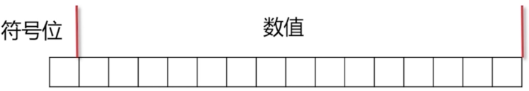

- 程序设计语言归类
- 数据类型

# 程序设计语言

## 类型检查的方式归类

- 编译时:C,C++,Java,Go...
  让他在编译时能报错,更加健壮
  变量一旦定义了,他就一直是那个类型.如 int a,String b
- 运行时:Python,Perl,JavaScript,Ruby..
  运行时才会直到一个变量的具体类型

## 运行/编译的方式归类

- 编译为机器代码运行:C,C++
  速度快
- 编译为中间代码,在虚拟机运行:Java,C#
  跨平台性
- 解释执行:Python,Perl,JavaScript
  运行在解释器上.看到一行就运行一行.仍然会依赖平台

## 编程范式(Programming Paradigm)的方式归类

- 面向过程:C,Visual Basic..
- 面向对象:Java,C#,C++,Scala..
  主流,好设计
- 函数式:Haskell,Erlang,...
  特定的场合发挥极大作用

# 数据类型(Java)

- boolean,byte,char(2个字节Unicode)
-  short,int(32),long(64),float,double
- 特殊类型String,Enum,Array.
  从Object派生出来的,如String之间可以用+连起来,Array可以用花括号初始等
- Object..

# 整数类型

32位int的范围:-2^31 ~ 2^31 - 1,这个是如何得到的?

**如果用直观的方法去定义**


- 正值的最大 : +11...11(31个) -> 2^31-1
- 负值的最小 : -11...11(31个) -> -(2^31-1)
- +0? -0?..明明是一样的值,2进制表示却不一样.处理起来麻烦

**用补码定义**

- 对于负数,先算绝对值,取反加1

  - 例 :1111..11 -> -1

    1. 0000..01 -> 取反 -> 1111..10

    2. 1111..10 -> +1 -> 1111..11

  - 例: 1000..0 -> -2^31

    1.  2^31 -> 1000..0 -> 取反 -> 0111..1
    2.  0111..1 -> +1 -> 1000..0

  - 例:0000..00 -> 0

    1. 0 -> 0000..0 -> 取反 -> 1111..1
    2. 1111..1 -> +1 -> 0000..0

- 对于正数,第一位是0,后面直接跟它的值

**补码定义的特点**

- 计算更直观
  -1 + 1 = 0 -> 1111...1 + 0000..1 = 0000..0
- 唯一标识0.没有+0,-0
- 总共表示2^32个数

# 浮点数与定点数

浮点数 (+/-)1.xxx * 2^y

- 符号位|指数部分|基数部分
- 64位double范围: +/- 10^308
- 64位double精度:10^15

能表示的范围特别大,但是能保证的精度有限

## 浮点数比较

- a==b? 不可以,哪怕实际上一样
- Math.abs(a-b) < eps? 
  如eps = 10^-6,按照需求设置它
- 使用BigDecimal算钱
  

# primitive type vs Object

- primitive type:基本数据类型 int,long,float..
- Object: Integer,Long,Float,String..

## primitive type

- 值类型
- 用 a==b判断相等

## Object

- 引用类型
- 用 a==b判断是否是同一个Object
- 用a.equals(b),或Object.equals(a,b)判断是否相等

## Boxing and Unboxing

- `Integer a = 2`,对值2进行装箱
- `Integer b = new Integer(2)`,创建了个新的箱子,把值放入进去
- `int v = a.intValue()`,拆箱

所以此时:

```java
	Integer a = 2;
    Integer b = new Integer(2);
    Integer c = 2;
    System.out.println(a == b);//false,不同的箱子
    System.out.println(a == c);//true
    System.out.println(a.equals(b));//true
```


**常见面试题**

- new Integer(2) == 2?
  t,比较对象的基本类型时自动拆箱

- new Integer(2) == new Integer(2)?
  f,判断是否是同一个箱子

- Integer.valueOf(2) == Integer.valueOf(2)?

  Integer.valueOf(),返回一个箱子,可能是新建的箱子,也可能是已经存在的箱子

  当缓存中存在箱子时(<128时存在缓存,>128时是否缓存看系统)左右会得到同一个箱子,此时就会是True

- Integer.valueOf(2).intValue() == 2?
  t

- new Integer(2).equals(new Integer(2)) ?

  t,Integer重写的equals方法中会通过intValue()转成值后进行比较