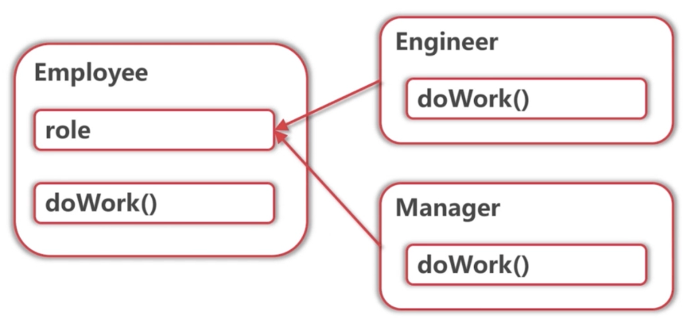
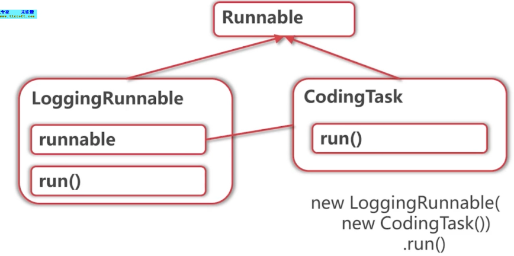

- 设计模式简介
- 再谈Singleton
- 变继承关系为组合关系
- 如何创建对象

## Singleton

**优缺点**

- 确保全局最多只有一个对象.
- 用于:构造缓慢的对象,需要统一管理的资源
- 缺点:很多全局状态,线程安全性

**Singleton的创建**

- 双重锁模式 ,在并发环境下使用
- 作为Java类的静态变量,
  也就是饿汉式,缺点在于类加载时就会被创建,浪费资源
- 使用框架提供的能力
  Spring中的DI

## 变继承关系为组合关系

**继承关系**

- 描述is-a关系,对结构要求高
- 不要用继承关系来实现复用,用设计模式实现复用

**如果Employee升级成了Manager**

现在的关系

```java
public Class Manager extends Employee{
```

->**状态模式**



**装饰器模式**



## 如何创建对象

**使用new来创建的缺点**

- 编译时必须决定创建哪个类的对象
- 参数的意义不明确

**抽象工厂创建**

- `task = new LogginTask(new CodingTask());`
- `task = taskFactory.createCodingTask();`//更好,更抽象

**建造者模式创建**

- `employee = new Employee(oldEmployee.getName,15000)`//参数不明确
- `Employee.fromExisting(oldEmployee).withSalary(15000).build()` //更好

- 往往配合不可变对象使用

