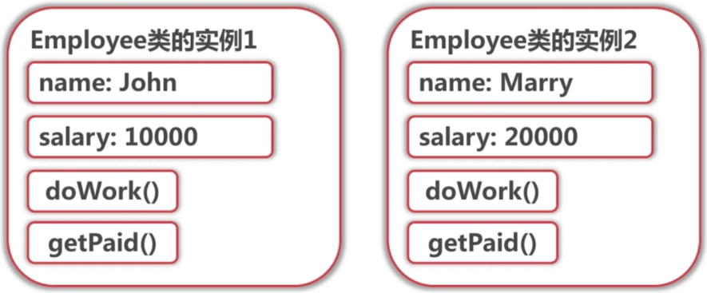
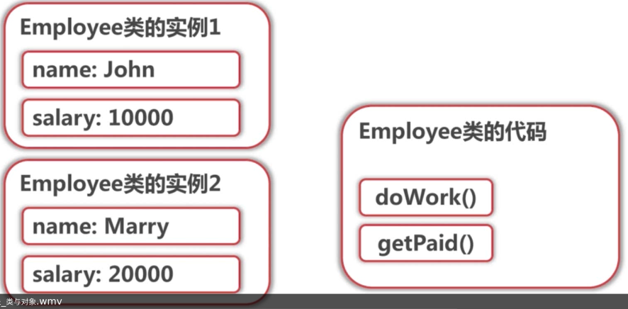
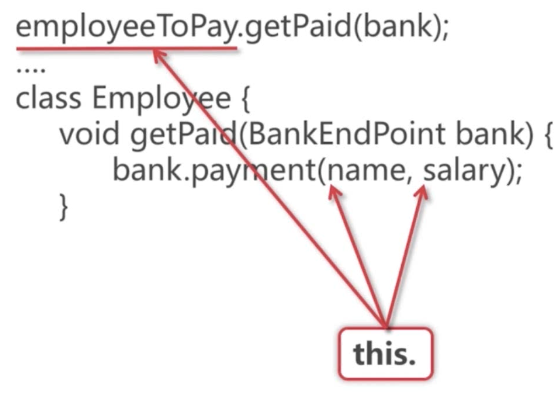
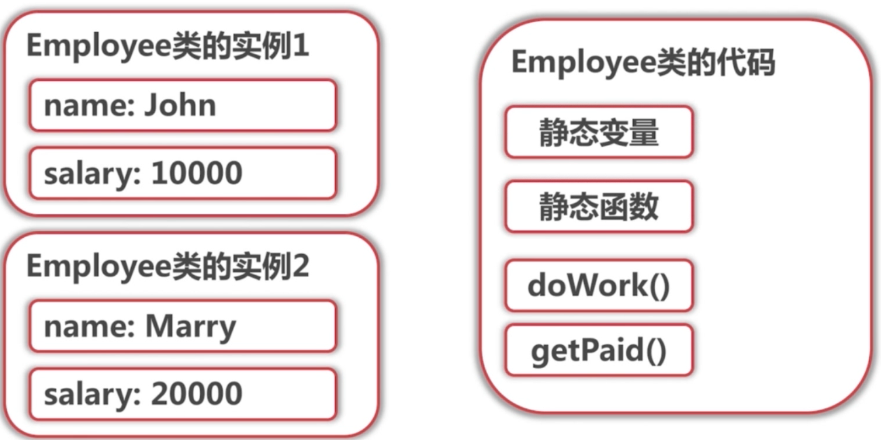

# 面向对象思想

- 类与对象
- 接口与实现
- 继承与封装
- 不可变对象
- 泛型

# 类与对象

- 类的成员变量 -> 对象状态
- 类的成员函数 -> 对象行为
- 类的静态变量
- 类的静态函数

### 成员变量或成员函数

当一个类存在两个实例的时候,在逻辑上两个实例是这样的



而实际上在内存中它却是这样的,函数部分的代码是实例之间共享的



那么调用Employee中的方法时,方法是如何区分是哪个实例在调用方法?



实际上,实例调用方法时,会为在方法中用到的成员变量隐示的加上`this.`关键字,从而确定使用的是哪个实例的变量.

### 静态变量或静态函数

- 没有this引用,静态变量全局唯一一份

所以之前的物理结构图应该是这样的



- 普通函数引用静态变量,函数 ?ｏｋ
  因为静态变量,函数 时属于类的，他能明确是哪个类的代码

- 对象上引用静态变量,函数 ?ｏｋ,编译器警告
  理由同上，但会推荐用`类名.静态函数（）`而不是`实例名.静态函数（）`

- 类名上引用静态变量,函数 ?ＮＧ,编译错误

  只能这样引用静态的，而不能是普通的．因为普通的变量,函数 无法确定this对象.

### 类的特殊函数

- 构造函数
- equals
- hashCode
- toString

关于`equals()`,Object中的equals是这样的:

```java
public boolean equals(Object obj) {
    return (this == obj);
}
```

也就是说他和直接调用"=="的方式是完全一样.
那么为什么String的`equals()`在值一样的时候会返回true?因为String重写了Object的equals方法,其中会对字符串中的一个个字符分别进行比较,从而达到比较值而非比较引用对象的效果.

```java
//String重写的equals()    
public boolean equals(Object anObject) {
        if (this == anObject) {
            return true;
        }
        if (anObject instanceof String) {
            //对字符串中的一个个字符分别进行比较
            String anotherString = (String)anObject;
            int n = value.length;
            if (n == anotherString.value.length) {
                char v1[] = value;
                char v2[] = anotherString.value;
                int i = 0;
                while (n-- != 0) {
                    if (v1[i] != v2[i])
                        return false;
                    i++;
                }
                return true;
            }
        }
        return false;
    }
```

也就是说,如果项目中创建的类没有覆盖`equals()`,那么调用equals时和调用"=="是完全相同的.

关于`hashCode()`,它和equals的关系是这样的.

JavaDoc中关于hashCode的定义: 如果根据`equals(Object)` 方法两个对象相等，则`hashCode`在两个对象中的每一个上调用方法必须产生相同的整数结果。

也就是说

```
a.equals(b) -> a.hashCode() == b.hashCode()
- hashCode相等但不一定equals
- 但equals时hashCode一定相等
```

如果重写了hashCode的定义时,也必须为equals方法做出相应的重写 

# 接口

**为什么有抽象类还需要接口**

接口适用于规定一些合约,方便用户使用,也强制实现类去实现所有规约.

抽象类通常是用于提供一些公共的实现


比如ArrayList的父类AbstractList就实现了Iterable接口,因此ArrayLIst能用在foreach上

能不能让上章的InOrder.next()也实现Iterable接口?


# 不可变性

**不可变对象**,使对象更安全

- 可以引用传递,可以缓存
- 线程安全

**final关键字**

- 类声明 -> 不可被继承
- 方法声明 -> 不可以在子类重写
- 变量声明 -> 变量不可指向其他对象,对象本身可以改变

**实现不可变性**

- final关键字无法保证不可变性
- 从接口定义,类的实现上保证不可变性
- Collections.unmodifiableXXX

# 泛型

`<T>`是实例的一部分而不是类的一部分,直到new的时候才知道T到底是什么

**泛型擦除**

编译器识别泛型然后生成中间代码,但是在中间代码中泛型会被擦除．编译器读代码时会保证类型

也就是说运行时`List`,`List<String>`,`List<Integer>`都是一样的

**运行时如何知道泛型类型**

有时运行时必须要知道泛型的类型(反射..)

- `void <T> method(List<T> list)` ..//只能输出[1,2,3]
  运行时不能知道泛型的类型
- `void <T> mothod(List<T> list,class<T> elementType)`//可以输出Integer  list of:[1,2,3]

**编译器如何保证放入的类型**

Convariance

- `ArrayList<Integer> `是`List<Integer> `吗? YES
- `List<Integer>`是`List<Object>`吗 ? NO

如果`List<Integer>`是`List<Object>`

```java
List<Object> objList = intList;
objList.set(0,"hello");
Integer first = intList.get(0);	//NO!
```

把`List<Integer>`转成`List<Object>`

```java
new ArrayList<Object>(intList); //OK
(List<Object>)(List)intList;//OK,危险,强制转换
```

