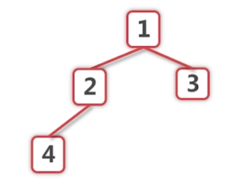
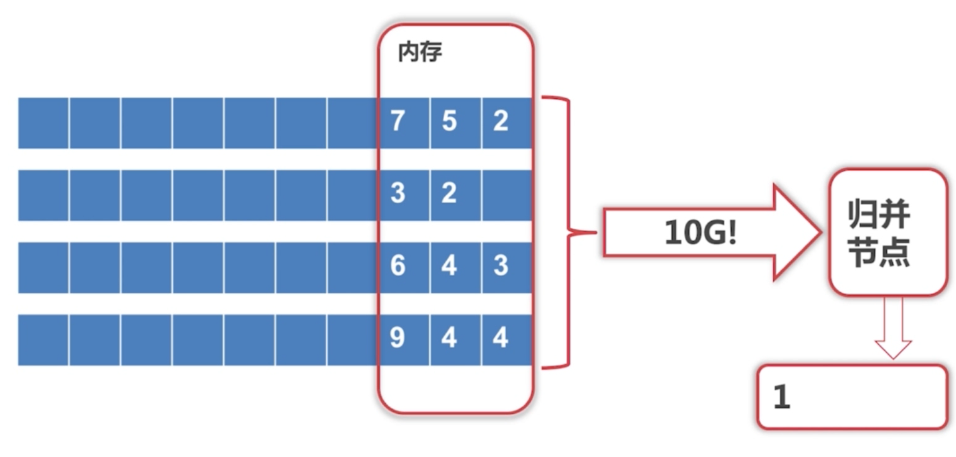
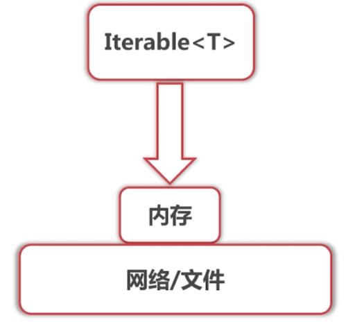
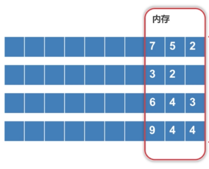
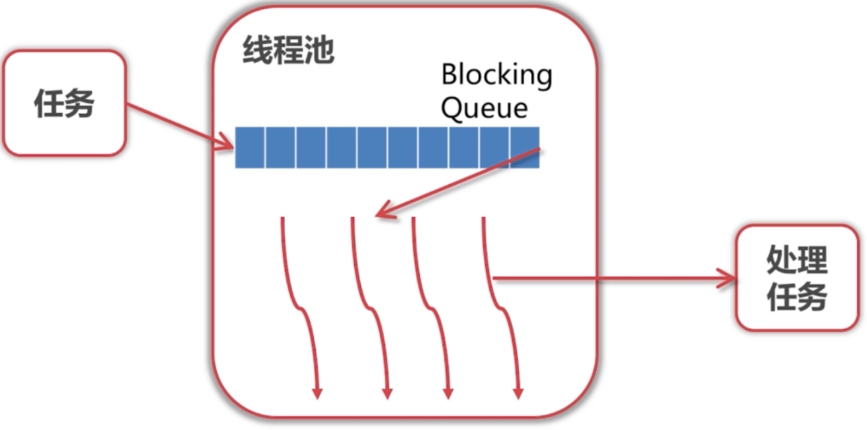

- 并行计算
- 多线程
- 资源管理

## 并行计算

### 并行计算的方法

1. 将数据拆分到每个节点上
2. 每个节点并行的结算出结果
3. 将结果汇总

### 例:外部排序

如何排序10G个元素?元素的一部分存储在外部,磁盘上

- 扩展的归并排序
  归并排序:
  - 将数据分为左右两半,分别归并排序,再把两个有序数据归并

1. 进行切分成多个节点,如1G

2. 对各个节点进行排序(快排,冒泡都行)

3. 在归并节点把排序好的节点合并

- 如何归并? 
  需要对k个节点进行k路归并,k值大时需要很多次的比较.(普通的归并排序的k是2)
  解决方式:用PriorityQueue进行合并,它实际上是一个堆的结构



- 问题:归并节点进行归并时还是得处理10G的数据量
  实际上用PriorityQueue进行合并时,我们只需要把这个堆的最小的元素留在内存里就可以了,对于下图的归并PriorityQueue只需要放入1,2,3,4.
  但是这样一来每放入一个元素时都会产生io操作,->**缓冲区**



**该如如何实现这种归并?:使用`Iterable<T>`接口**

- 可以不断获取下一个元素的能力
- 元素存储/获取方式被抽象,与归并节点无关

**使用`Iterable <T> merge(List<Iterable<T>> sortedData);`实现**




- 归并数据源来自`Iterable<T>.next()`

  思想:把每个数据源中的小的元素集加入PriorityQueue进行排序.当PriorityQueue.pop出最小元素时,找到最小元素所属的数据源,找到他的下一个元素并放入PriorityQueue.



1. 如果缓冲区有空余,读取下一批元素放入缓冲区,
   
   比如第2行的数据有1个空位,应从第2行的数据源读取一个元素放入内存(缓冲区)

2. 给出缓冲区的第一个元素,也就是最小的那个元素.使用PriorityQueue.pop

3. 可配置项:缓冲区大小,如何读取下一批元素

## 多线程

在并发环境中尝试进行加锁时可能会发生死锁

### 死锁

**例题**:考虑最不利的情况

```java
void transfer(Account from,Account to,int amount){
    synchronized(from){//不利的情况:刚锁完,别人就开始等这个锁
        synchronized(to){//不利的情况:别人抢走了to的锁,必须等
            from.setAmount(from.getAmount() - amount);
    		to.setAmount(to.getAmount() + amount);
        }
    }
}
```

- synchromized(from) -> 别的线程在等待from
- synchromized(to) -> 别的线程已经锁住了to
- 可能死锁:`transfer(a,b,100)`和`transfer(b,a,50)`同时进行时

**死锁条件**,必须同时满足

- 互斥等待
- hold and wait , 拿着一个锁,去等待另一个锁
- 循环等待,一个人拿到A等待B,另一个人拿到了B等待A
- 无法剥夺的等待,必须一直等直到拿到 

**死锁防止**

- 破除互斥等待 -> 无法破除,锁的概念就是在这之上
- 破除hold and wait -> 一次性获取所有资源
  - 方法1:让from和to暴露一个锁叫getAmountLock,可以知道它是否处于被锁的状态.当被锁时就暂时不去获取,过段时间再尝试
  - 方法2:加一个全局的锁,让只能有一个线程操作.不适用于资源不够时
- 破除循环等待-> 按顺序获取资源,比如谁的卡号小就先锁谁
- 破除无法剥夺的等待 -> 加入超时

### 线程池

- 创建线程开销大
- 线程池:预先建立好线程,等待任务派发



**线程池的参数**

- corePoolSize:线程池中初始线程数量,可能处于等待状态
- maxinumPoolSize:线程池中最大允许线程数量
- keepAliveTime:超出corePoolSize部分线程如果等待这些时间将会被回收

**Java 的 Excutor**

创建线程池,
可以通过下面的方式之间创建线程池

```java
public ThreadPoolExecutor(int corePoolSize,
                              int maximumPoolSize,
                              long keepAliveTime,
                              TimeUnit unit,//keepAliveTime的单位
                              BlockingQueue<Runnable> workQueue) {//任务队列,依次调用元素的run
```

但更推荐使用Executor去创建 

```java
//线程数量固定的线程池
ExecutorService executor = Executors.newFixedThreadPool(3);
List<Future<?>> futureList = new ArrayList<>();
for (int i = 0; i < 10; i++) {
    Future<?> submit = executor.submit(() -> {
        try {
            System.out.println(Thread.currentThread().getName() + " START ");
            TimeUnit.SECONDS.sleep(5);
            System.out.println(Thread.currentThread().getName() + " END ");
        } catch (InterruptedException e) {
            e.printStackTrace();
        }
    });
    futureList.add(submit);
}
//阻塞,直到所有task结束
for (Future<?> future : futureList) {
    future.get();
}

System.out.println("END");
executor.shutdown();    //回收线程,
// 就算不用future.get()显示阻塞,这里也会在所有任务结束完后退出
```

