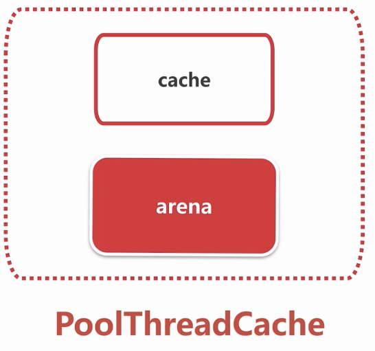
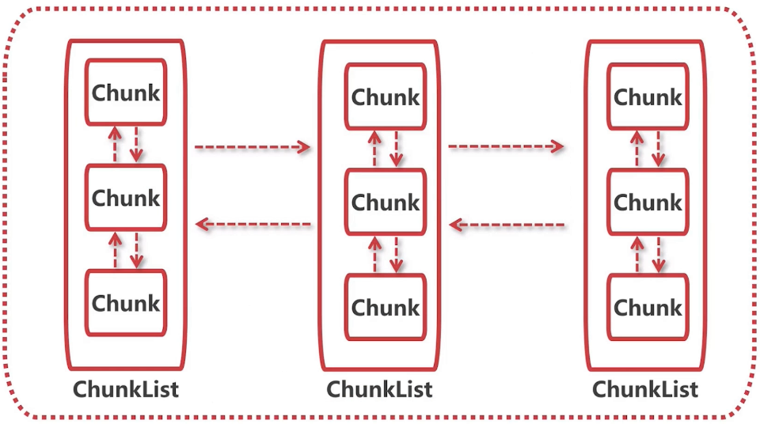
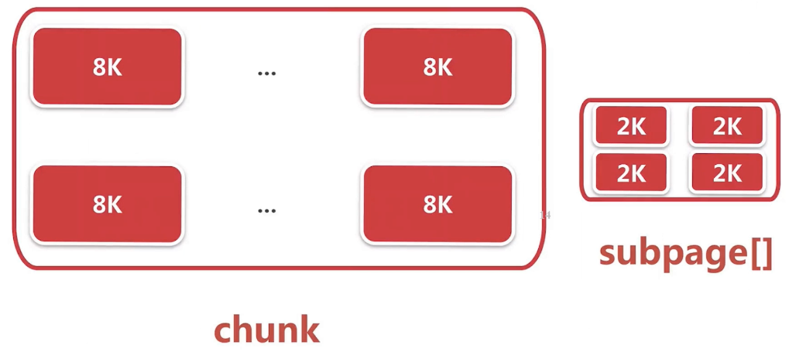

# 内存规格介绍

netty中常见的内存规格


- **Chunk**

  16M对应一个Chunck,内存申请是以Chunk为单位进行,之后的内存分配都是在申请到的Chunk中进行操作

  如:想申请1M的内存:去申请16M的Chunk,再从这里面取出1M的连续内存分配给一个ByteBuf

- **Page**
  8K对应一个Page
  如:想申请16K的内存,但会得到16M的Chunk,把这个Chunk进行切分,此时以Page为单位.然后取2个连续的Page
  16M = 8K * 2048,一个Chunk能切分为2048个Page

- **SubPage**
  如只是想申请10B时还去获取一个Page的话就会很浪费,所以对Page也进行切分
  如果需要1K内存,就把一个Page切分成8份,今后想再次分配1K时都会对应到这个Page,从中拿到空闲的索引(值为0-7 )

# 命中缓存的分配逻辑

之前说过分配内存时如果缓存命中则在缓存中进行分配,否则再在内存上划分一段连续的内存进行分配

## MemoryRegionCache

Netty中与缓存相关的数据结构:**MemoryRegionCache**  


- **queue**

  - 队列中的每一个元素都是一个实体(Entry),每一个实体都有一个chunk和handler

  - chunk..之前说过内存的分配单位,handler...指向一段唯一的连续内存.
    也就是说,chunk和指向chunk的一段连续内存,能确定一个entity的内存大小和内存位置
  - 所有entity组合起来就是一个缓存的列表
  - 去缓存里面找有没有对应的列表的时候,就会对应到queue里面的Entry,直接取出.然后在这上面分配内存

- **sizeClass**

  内存规格 , huge直接走非缓存分配

- **size**
  - 一个queue里面的ByteBuf的大小是固定的
    如果一个MemoryRegionCache缓存指定的是1K大小的元素,那么queue里面的所有元素都是1K的ByteBu

每个sizeClass分别可以对应图中的规格大小,也就是说每个线程中都存在这么多种`MemoryRegionCache`:


每一个节点都相当于MemoryRegionCache的数据结构,

如,分配一个16B的ByteBuf的时候,定位到tiny[]的第二个节点.16B的MemoryRegionCache的queue里边有对应的节点,就会把这个节点取出,此时就会得到entity,包含了chunk,handler信息,通过这些信息进行内存划分


源码:

```java
	private abstract static class MemoryRegionCache<T> {
        private final int size;
        private final Queue<Entry<T>> queue;//存储固定大小的bytebuf
        private final SizeClass sizeClass;
        private int allocations;
```

`PoolThreadCache`中维护着各个sizeclass的`MemoryRegionCache`

```java
final class PoolThreadCache {
    final PoolArena<byte[]> heapArena;
    final PoolArena<ByteBuffer> directArena;

    //sizeClass
    private final MemoryRegionCache<byte[]>[] tinySubPageHeapCaches;
    private final MemoryRegionCache<byte[]>[] smallSubPageHeapCaches;
    private final MemoryRegionCache<ByteBuffer>[] tinySubPageDirectCaches;
    private final MemoryRegionCache<ByteBuffer>[] smallSubPageDirectCaches;
    private final MemoryRegionCache<byte[]>[] normalHeapCaches;
    private final MemoryRegionCache<ByteBuffer>[] normalDirectCaches;
```

`PoolThreadCache`类是线程私有的对象,也就是说每个线程都有自己的3种线程的缓存数组.他们在的`PoolThreadCache`构造函数中被初始化,下面以`tinySubPageDirectCaches`为例:

```java
tinySubPageDirectCaches = createSubPageCaches(
    tinyCacheSize, //512,默认值
    PoolArena.numTinySubpagePools,//32,之前的图也是tiny[32],也就是说创建32个tiny规格的MemoryRegionCache
    SizeClass.Tiny);//tiny
```

`createSubPageCaches()`方法,创建制定规格和大小的`MemoryRegionCache`数组

```java
    private static <T> MemoryRegionCache<T>[] createSubPageCaches(
            int cacheSize, int numCaches, SizeClass sizeClass) {
        if (cacheSize > 0) {
            //创建长度为32的MemoryRegionCache数组,也就是tiny[32]
            MemoryRegionCache<T>[] cache = new MemoryRegionCache[numCaches];//32
            for (int i = 0; i < cache.length; i++) {
                //
                cache[i] = new SubPageMemoryRegionCache<T>(cacheSize, sizeClass);
            }
            return cache;
        } else {
            return null;
        }
    }
```

`SubPageMemoryRegionCache`的源码,它继承了`MemoryRegionCache`

```java
    private static final class SubPageMemoryRegionCache<T> extends MemoryRegionCache<T> {
        SubPageMemoryRegionCache(int size, SizeClass sizeClass) {
            super(size, sizeClass);
        }
    } 
---继续super
        MemoryRegionCache(int size, SizeClass sizeClass) {
            this.size = MathUtil.safeFindNextPositivePowerOfTwo(size);//设置大小N*16B
            queue = PlatformDependent.newFixedMpscQueue(this.size);//设置queue,长度为512
            this.sizeClass = sizeClass;
        }

```

总结一下就是,`tinySubPageDirectCaches`对外有32个节点,每个节点都是不同内存大小的队列,每个队列的长度是512

## 命中缓存的分配流程

再看内存分配时的入口`PoolArena#allocate`

```java
    private void allocate(PoolThreadCache cache,
                          PooledByteBuf<T> buf,//复用的byteBuf
                          final int reqCapacity) {//capacity
        //把申请的capacity进行规格化,比如需要15B的tiny缓存时把他规格化成16B
        final int normCapacity = normalizeCapacity(reqCapacity);
        if (isTinyOrSmall(normCapacity)) { // capacity < pageSize (capacity < 8K)
            int tableIdx;
            PoolSubpage<T>[] table;
            boolean tiny = isTiny(normCapacity)
            if (tiny) { //capacity <  512
                //缓存分配tiny
                if (cache.allocateTiny(this, buf, reqCapacity, normCapacity)) {
                    return;
                }
                tableIdx = tinyIdx(normCapacity);
                table = tinySubpagePools;
            } else {
                //缓存分配small
                if (cache.allocateSmall(this, buf, reqCapacity, normCapacity)) {
                    return;
                }
                tableIdx = smallIdx(normCapacity);
                table = smallSubpagePools;
            }
//...
            return;
        }
        if (normCapacity <= chunkSize) {
            //缓存分配normal
            if (cache.allocateNormal(this, buf, reqCapacity, normCapacity)) {
                return;
            }
            allocateNormal(buf, reqCapacity, normCapacity);
        } else {
            allocateHuge(buf, reqCapacity);
        }
    }
```


**流程**

1. 找到size对应的MemoryRegionCache
2. 从queue中弹出一个entry给ByteBuf初始化,entity表示某个chunk中的连续内存
3. 将弹出的entry扔到对象池中进行复用 

### 1.找到size对应的MemoryRegionCache

下面以`cache.allocateTiny(this, buf, reqCapacity, normCapacity)`为例:

```java
boolean allocateTiny(PoolArena<?> area, PooledByteBuf<?> buf, int reqCapacity, int normCapacity) {
    return allocate(cacheForTiny(area, normCapacity),//
                    buf,
                    reqCapacity);
}
```

`cacheForTiny()`找到对应的节点

```java
    private MemoryRegionCache<?> cacheForTiny(PoolArena<?> area, int normCapacity) {
        int idx = PoolArena.tinyIdx(normCapacity);//返回(normCapacity / 16),从而找到tiny[]的索引
        //如果capacity是16B那么就对应tiny[1]
        if (area.isDirect()) {
            return cache(tinySubPageDirectCaches, idx);//拿到tinySubPageDirectCaches[1]
        }
        return cache(tinySubPageHeapCaches, idx);
    }

```

返回对应大小的MemoryRegionCache后继续调用`allocate()`.

### 2.从queue中弹出一个entry给ByteBuf初始化

进入到`PoolThreadCache#allocate`:

```java
    private boolean allocate(MemoryRegionCache<?> cache, PooledByteBuf buf, int reqCapacity) {
        //这里从MemoryRegionCache的queue中弹出一个entry
        boolean allocated = cache.allocate(buf, reqCapacity);//
        
        return allocated;
    }
```

看下`cache.allocate()`片段,从MemoryRegionCache的queue中弹出一个entry:

```java
public final boolean allocate(PooledByteBuf<T> buf, int reqCapacity) {
    //从queue中poll一个entry,包含chunk,handler
    Entry<T> entry = queue.poll();

    //初始化这个entity
    initBuf(entry.chunk, entry.handle, buf, reqCapacity);
    entry.recycle();

    ++ allocations;
    return true;
}
```

看下初始化的过程(`PoolThreadCache.SubPageMemoryRegionCache#initBuf`):

```java
@Override
protected void initBuf(
    PoolChunk<T> chunk, long handle, PooledByteBuf<T> buf, int reqCapacity) {
    //由于是tiny,必然是SubPage
    chunk.initBufWithSubpage(buf,//是哪一块chunk
                             handle, //chunk中的哪一片位置
                             reqCapacity);//需要的capacity
}
```

他最终会调用

```java
//io.netty.buffer.PoolChunk#initBufWithSubpage(io.netty.buffer.PooledByteBuf<T>, long, int, int)    
private void initBufWithSubpage(PooledByteBuf<T> buf, long handle, int bitmapIdx, int reqCapacity) {
    //...
    //
    buf.init(
        this, 
        handle,
        runOffset(memoryMapIdx) + (bitmapIdx & 0x3FFFFFFF) * subpage.elemSize, reqCapacity, subpage.elemSize,
        arena.parent.threadCache());
}
```

`init()`方法为`io.netty.buffer.PooledByteBuf#init`

```java
    void init(PoolChunk<T> chunk, long handle, int offset, int length, int maxLength, PoolThreadCache cache) {
        assert handle >= 0;
        assert chunk != null;

        this.chunk = chunk;//哪一块内存
        this.handle = handle;//chunk中的哪一部分
        memory = chunk.memory;
        this.offset = offset;
        this.length = length;
        this.maxLength = maxLength;
        tmpNioBuf = null;
        this.cache = cache;
    }
```

也就是说他对一个`PooledByteBuf`完成了初始化,也就是说通过缓存进行分配时只需要拿到chunk和handler就能创建内存

### 3.将弹出的entry扔到对象池中进行复用 

再看`allocate()`的片段

```java
//io.netty.buffer.PoolThreadCache.MemoryRegionCache#allocate
public final boolean allocate(PooledByteBuf<T> buf, int reqCapacity) {
    Entry<T> entry = queue.poll();//从queue中弹出一个entry
	//初始化
    initBuf(entry.chunk, entry.handle, buf, reqCapacity);
    entry.recycle();//

    ++ allocations;
    return true;
}
```

进行`initBuf()`步骤时只是用entity中的chunk和handler信息去创建了`PooledByteBuf`.当初始化完毕后这个entry的工作就已经结束了.所以在这里把他扔回对象池进行复用,避免被GC.

以后一个bytebuf被回收的时候,它可以直接去对象池中取entry,然后把entry中的chunk和handler指向即将被回收的bytebuf.下次又要分配内存时,就能通过这个复用的entry找到空余的chunk和handler了.

`recycle()`片段:

```java
void recycle() {
    //表示现在这个entry不指向任何一段内存
    chunk = null;
    handle = -1;
    recyclerHandle.recycle(this);//会放对象池(一个栈 )中
}
```

# arena,chunk,page,subpage

梳理这几个概念

## arena



每一个线程去分配一块内存时,通过`ThreadLocal`获取`PoolThreadCache`对象,它分为两大部分

- cache:不同规格和大小的cache,上章讲述的就是在这部分分配
- **arena**

`PoolThreadCache`的成员变量

```java
final class PoolThreadCache {
	//arena
    final PoolArena<byte[]> heapArena;
    final PoolArena<ByteBuffer> directArena;

    // cache
    private final MemoryRegionCache<byte[]>[] tinySubPageHeapCaches;
    private final MemoryRegionCache<byte[]>[] smallSubPageHeapCaches;
    private final MemoryRegionCache<ByteBuffer>[] tinySubPageDirectCaches;
    private final MemoryRegionCache<ByteBuffer>[] smallSubPageDirectCaches;
    private final MemoryRegionCache<byte[]>[] normalHeapCaches;
    private final MemoryRegionCache<ByteBuffer>[] normalDirectCaches;
```

通过arena可以在内存里面新开辟一块连续内存,cache则是已经分配好的缓存

下面是**arena**的结构:



它是ChunkList的双向链表,而ChunkList的节点都是Chunk(Chunk:向操作系统申请内存时的最小单位16M).

netty会实时计算每个chunk分配的情况,比如16M中分配掉了2M+4M,那么这个Chunk还剩下75%.

按照内存使用率把他归类为各个ChunkList,内存分配需要chunk时就能通过快速找到合适的ChunkList,再从中选择一个chunk

`PoolArena`的片段:

```java
abstract class PoolArena<T> implements PoolArenaMetric {
	//其中包含了6个ChunkList
    private final PoolChunkList<T> q050;//使用率50%的chunk集合
    private final PoolChunkList<T> q025;
    private final PoolChunkList<T> q000;
    private final PoolChunkList<T> qInit;
    private final PoolChunkList<T> q075;
    private final PoolChunkList<T> q100;
```

看它的初始化过程:

```java
q100 = new PoolChunkList<T>(null, 100, Integer.MAX_VALUE, chunkSize);
q075 = new PoolChunkList<T>(q100, 75, 100, chunkSize);
q050 = new PoolChunkList<T>(q075, 50, 100, chunkSize);//意味着每个chunk的使用率 50 ~ 100%
q025 = new PoolChunkList<T>(q050, 25, 75, chunkSize);
q000 = new PoolChunkList<T>(q025, 1, 50, chunkSize);
qInit = new PoolChunkList<T>(q000, Integer.MIN_VALUE, 25, chunkSize);

```

通过双向链表进行连接:

```java
q100.prevList(q075);
q075.prevList(q050);
q050.prevList(q025);
q025.prevList(q000);
q000.prevList(null);
qInit.prevList(qInit);
```

通常不会一次直接分配16M的内存,所以netty又把他划分成了Page

## Page



netty把chunk以8K为单位进行划分成一个个Page,此时划分内存时只需以Page为单位分配

如,想分配16K就在一个chunk中找到两个连续的Page

## SubPage

有时8K的内存仍是过多,把Page继续进行划分成2K的subpage ,此时1个page就包含了4个subpage数据结构.这里的2K不是固定的

代码中观察一下`page`和`subpage`,在`PoolArena`的`PoolChunkList`成员变量之前还包含下面的两个变量

```java
private final PoolSubpage<T>[] tinySubpagePools;
private final PoolSubpage<T>[] smallSubpagePools;
```

看一下`PoolSubPage`的结构:

```java
final class PoolSubpage<T> implements PoolSubpageMetric {

    final PoolChunk<T> chunk;//当前的subpage从属于那个chunk
    private final int memoryMapIdx;
    private final int runOffset;
    private final int pageSize;
    private final long[] bitmap;//记录subpage的内存的分配情况
    //1表示已被分配,0表示subpage没有被分配

    //双向链表进行连接
    PoolSubpage<T> prev;
    PoolSubpage<T> next;

    boolean doNotDestroy;
    int elemSize;	//当前subpage是以多大的数值进行划分的,上图中是2K
    private int maxNumElems;
    private int bitmapLength;
    private int nextAvail;
    private int numAvail;

```

小结一下就是,`PoolThreadCache`拿到对应的arena,arena通过ChunkList取一个chunk进行分配

在这个chunk进行分配时会对想要分配的大小进行判断,如果期望的大小>page,就以page为单位进行内存分配,

如果远远小于page大小(8K),它会帮你找一个page并把它分配成多个subpage进行内存划分

# page级别的内存分配:allocateNormal()

再回到之前分配内存时的代码片段

```java
//PoolArena#allocate(io.netty.buffer.PoolThreadCache, io.netty.buffer.PooledByteBuf<T>, int)
private void allocate(PoolThreadCache cache, PooledByteBuf<T> buf, final int reqCapacity) {
    if (normCapacity <= chunkSize) {//期望的capacity <= 16M
        if (cache.allocateNormal(this, buf, reqCapacity, normCapacity)) {
      
            return;
        }
        //分析这一部分,page级别的分配
        allocateNormal(buf, reqCapacity, normCapacity);
    } 
```

`allocateNormal()`的步骤:

1. 尝试在现有的chunk上分配,就是之前图中的ChunkList
2. 如果没有chunk,创建一个chunk进行内存分配
3. 初始化`PooledByteBuf`

**下面的示例中会常识分配16K内存**

```java
private synchronized void allocateNormal(PooledByteBuf<T> buf, int reqCapacity, int normCapacity) {
    //1. 尝试在现有的chunkList上进行分配,而首次这里都是空的
    if (q050.allocate(buf, reqCapacity, normCapacity) || 
        q025.allocate(buf, reqCapacity, normCapacity) ||
        q000.allocate(buf, reqCapacity, normCapacity) ||
        qInit.allocate(buf, reqCapacity, normCapacity) ||
        q075.allocate(buf, reqCapacity, normCapacity)) {
        ++allocationsNormal;
        return;
    }

    //2.  如果没有chunk,创建一个chunk
    PoolChunk<T> c = newChunk(pageSize, maxOrder, pageShifts, chunkSize);
    //在创建的chunk上进行分配
    long handle = c.allocate(normCapacity);//handler指向chunk中的连续内存
    ++allocationsNormal;
    assert handle > 0;
    //3. 初始化PooledByteBuf,和之前缓存分配时相似
    c.initBuf(buf, handle, reqCapacity);
    qInit.add(c);
}
```

### 1.尝试在现有的chunk上分配

看一下第一步`q050.allocate()`的逻辑:

```java
boolean allocate(PooledByteBuf<T> buf, int reqCapacity, int normCapacity) {
	
    for (PoolChunk<T> cur = head;;) {
        //从head节点开始往下遍历,对于每一个chunk尝试去分配
        long handle = cur.allocate(normCapacity);
        if (handle < 0) {//没分配到
            cur = cur.next;//继续下一个chunk
            if (cur == null) {//已到末尾
                return false;
            }
        } else {
            //在chunk上分配成功 
            cur.initBuf(buf, handle, reqCapacity);
            //使用率>最大使用率 >= 加到下一个链表,如p50 -> p75
            if (cur.usage() >= maxUsage) {
                remove(cur);
                nextList.add(cur);
            }
            return true;
        }
    }
}
```

### 2.创建一个chunk进行内存分配

就是下面这部分:

```java
//创建chunk
PoolChunk<T> c = newChunk(pageSize,//8K
                          maxOrder,//11
                          pageShifts,//13
                          chunkSize);//16M
long handle = c.allocate(normCapacity);
```

看下`newChunk()`创建chunk的过程:

```java
@Override
protected PoolChunk<ByteBuffer> newChunk(int pageSize, int maxOrder, int pageShifts, int chunkSize) {
    return new PoolChunk<ByteBuffer>(
        this,
        allocateDirect(chunkSize),//他会通过JDK获取一段直接内存(DirectByteBuf),大小16M
        pageSize, maxOrder, pageShifts, chunkSize);
}
---
    PoolChunk(PoolArena<T> arena, T memory, int pageSize, int maxOrder, int pageShifts, int chunkSize) {
        unpooled = false;
        this.arena = arena;
        this.memory = memory;//就是chunk大小的16M,创建Direct时这里是DirectByteBuf
        this.pageSize = pageSize;//8K
        this.pageShifts = pageShifts;//13
        this.maxOrder = maxOrder;//11
        this.chunkSize = chunkSize;
        unusable = (byte) (maxOrder + 1);
        log2ChunkSize = log2(chunkSize);
        subpageOverflowMask = ~(pageSize - 1);
        freeBytes = chunkSize;

        assert maxOrder < 30 : "maxOrder should be < 30, but is: " + maxOrder;
        maxSubpageAllocs = 1 << maxOrder;

        memoryMap = new byte[maxSubpageAllocs << 1];//[4096]
        depthMap = new byte[memoryMap.length];//[4096]
        int memoryMapIndex = 1;
    	//有点懵,看下面的图
        for (int d = 0; d <= maxOrder; ++ d) { 
            int depth = 1 << d;
            for (int p = 0; p < depth; ++ p) {
                memoryMap[memoryMapIndex] = (byte) d;
                depthMap[memoryMapIndex] = (byte) d;
                memoryMapIndex ++;
            }
        }

        subpages = newSubpageArray(maxSubpageAllocs);
    }
```

关于那个二重for循环的解释:


上面的树表示了chunk的分配情况

- [0]表示0~16M是否被分配

- [1]表示0~8M
- [2]8~16M是否被分配...

也就是说一块Chunk它最终会以Page的方式去组织这块内存,每一个节点都表示这块连续的内存是否已被分配

如 4~8M那个节点为例,他对于整体来说是第4个节点,此时树的深度为2

再看那段代码:

```java
        for (int d = 0; d <= maxOrder; ++ d) { //从0-11层遍历
            int depth = 1 << d;//计算该层的节点数
            for (int p = 0; p < depth; ++ p) {
                //memoryMapIndex = 整体的第几个节点
                // 4~8M那个节点为例,他对于整体来说是第4个节点,memoryMapIndex = 4
                //d = 层数,所以这里是记录第几个节点在第几层
                //所以4~8M那个节点就是memoryMap[4] = 2
                memoryMap[memoryMapIndex] = (byte) d;
                depthMap[memoryMapIndex] = (byte) d;
                memoryMapIndex ++;
            }
        }
```

看完了创建chunk的步骤,回去看在这块chunk上分配capacity大小的内存的部分

```java
PoolChunk<T> c = newChunk(pageSize, maxOrder, pageShifts, chunkSize);//上一步 
long handle = c.allocate(normCapacity);//
```

它会调用下面:

```java
//io.netty.buffer.PoolChunk#allocateRun    
private long allocateRun(int normCapacity) {
    //计算层次结构中的第几层
    int d = maxOrder - (log2(normCapacity) - pageShifts);//视频中是返回第10层
    int id = allocateNode(d);//这里会返回第10层中的某个节点的index,从头开始第一个空闲节点
    //视频中返回的是第10层0~16K的那个节点,id=1024
    if (id < 0) {
        return id;//1024
    }
    freeBytes -= runLength(id);
    return id;
}
```

`allocateNode()`中获取到合适节点的index后需要把它以上的父节点都设置为已被使用,0~16K的那个节点为例0层的0~16M,1层的0~8M,2层的0~4M都得标记为已被使用

### 3.初始化`PooledByteBuf`

拿到handle = 1024后调用下面进行初始化

```java
c.initBuf(buf,
          handle,//1024
          reqCapacity); 
```

```java
void initBuf(PooledByteBuf<T> buf, long handle, int reqCapacity) {
    int memoryMapIdx = memoryMapIdx(handle);//1024
    int bitmapIdx = bitmapIdx(handle);
    if (bitmapIdx == 0) {//分配subpage时的,所以这里是0
        buf.init(this, 
                 handle,
                 runOffset(memoryMapIdx), //0
                 reqCapacity,//16K
                 runLength(memoryMapIdx),//16384 ,表示当前的1024节点长度为16K
                 arena.parent.threadCache());
    }
}
```

此时就到了`PooledByteBuf`中的初始化方法:

```java
//io.netty.buffer.PooledByteBuf#init
void init(PoolChunk<T> chunk, long handle, int offset, int length, int maxLength, PoolThreadCache cache) {
    assert handle >= 0;
    assert chunk != null;

    this.chunk = chunk;
    this.handle = handle;//1024
    memory = chunk.memory;//这里是刚才申请chunk的时候,通过JDK申请的DirectByteBuf
    this.offset = offset;//0,因为是page
    this.length = length;//16K
    this.maxLength = maxLength;
    tmpNioBuf = null;
    this.cache = cache;
}
```

