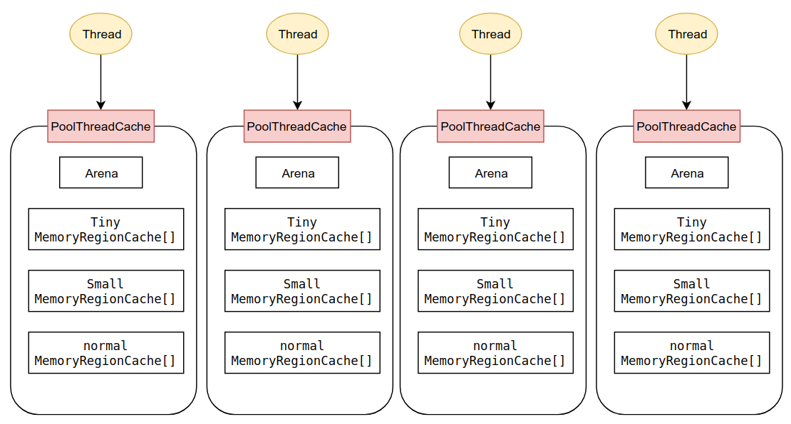
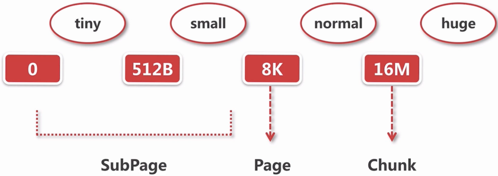
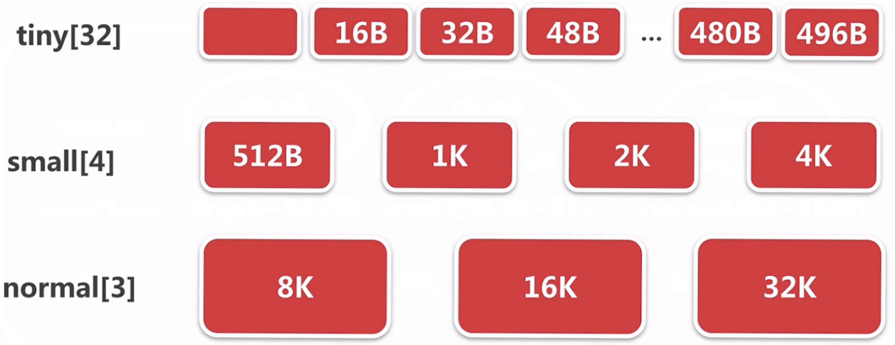
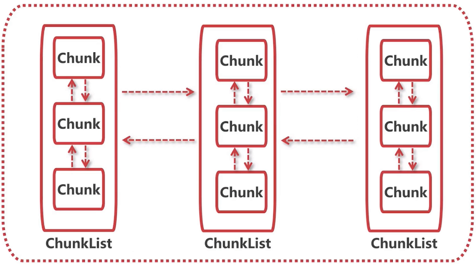

ByteBuf实在是复杂,这篇总结一下源码剖析中的概念.

## ByteBuf的结构

```java

 *      +-------------------+------------------+------------------+
 *      | discardable bytes |  readable bytes  |  writable bytes  |
     		无效的				可以读的空间			可以写的空间
 *      +-------------------+------------------+------------------+
 *      |                   |                  |                  |
 *      0      <=      readerIndex   <=   writerIndex    <=    capacity
```

ByteBuf中三个重要的指针

- readIndex..表明读数据从这个指针开始
- writeIndex..表明如果要写数据的话就从这个指针开始写
- capacity 
- `maxCapacity()`可扩容的最大容量,当capacity不够时就会进行扩容.要是大于`maxCapacity()`就拒绝

## ByteBuf分类


**AbstractByteBuf**实现了大部分API.子类只需要重写 `_getByte(i)`这种`_`开头的底层的方法实现.这些方法因底层内存的操作方式而异.底层内存的操作方式可以已三个维度进行分类.所以总共有`2*2*2 =8`种ByteBuf的实现

- **按内存的分配方式分类**

| Pooled                          | Unpooled                    |
| ------------------------------- | --------------------------- |
| 利用已分配的内存空间构建ByteBuf | 重新分配内存空间构建ByteBuf |

- **按操作方式分类**

| Unsafe                                     | 非Unsafe                    |
| ------------------------------------------ | --------------------------- |
| 通过Unsafe对象,用内存地址对ByteBuf进行操作 | 用其他方式对ByteBuf进行操作 |

- **按所在空间分类**

| Heap        | Direct                    |
| ----------- | ------------------------- |
| 堆内存,数组 | 堆外内存,创建JDK的ByteBuf |

### 3个维度的分类分别在什么时候决定

1. 看你使用了哪个内存分配器,`PooledByteBufAllocator`还是`UnpooledByteBufAllocator`,此时确定Pooled还是Unpooled
2. 调用它的`directBuffer()`还是`heapBuffer()`来创建内存,此时决定Heap还是Direct
3. 它会在创建时自动调用hasUnsafe()决定使用Unsafe还是非Unsafe.

## UnpooledByteBufAllocator分析

- Unpooled的创建比较简单,如果是heap就直接去创建一个byte数组,如果是direct就创建一个JDK的ByteBuf.

- 非Unsafe的情况下直接操作heap直接时byte[i]去取数据,direct也直接是ByteBuf.get(i)

- Unsafe的情况下heap是通过内存地址去byte[]取数据,direct是通过内存地址去ByteBuf去它的数据.

总结一下`_getByte()`分别是如何获取元素的:

|            | Unsafe                             | 非Unsafe                   |
| ---------- | ---------------------------------- | -------------------------- |
| **Heap**   | Unsafe对象从堆内地址获取元素       | 从数组直接获取索引元素     |
| **Direct** | Unsafe对象从计算堆外地址后获取元素 | 从JDK的ByteBuf直接获取元素 |

## PooledByteBufAllocator分析

比Unpooled复杂的多.他是在`PoolThreadCache`对象上进行内存分配的.每个`PoolThreadCache`都保存了一段已分配的内存空间.它是线程私有的,有就是说每个线程都有自己的内存空间候选,因此**线程间不会发生冲突.**

1. 在PooledByteBufAllocator被创建,创建CPU核数*2的Arena

2. 调用`PooledByteBufAllocator`的`directBuffer()`或`heapBuffer()`被调用的时候,划出其中一块Arena构造线程私有的`PoolThreadCache`
3. 在这个`PoolThreadCache`获取可用内存并分配

### PooledByteBufAllocator结构

`CPU核数*2`的Arena是什么鬼,还记得NioEventLoop数默认也是`CPU核数*2`吗.也就是说给每个NioEventLoop分配一个线程私有的`PoolThreadCache`.



除了DirectArena,HeapArena之外Cache还包括Direct和Heap的缓存(MemoryRegionCache[]),Cache又存在tiny,small,normal之分.所以`PoolThreadCache`的结构是下面这样的

```java
final class PoolThreadCache {
	//arena部分
    final PoolArena<byte[]> heapArena;
    final PoolArena<ByteBuffer> directArena;

	//缓存部分
    private final MemoryRegionCache<byte[]>[] tinySubPageHeapCaches;
    private final MemoryRegionCache<byte[]>[] smallSubPageHeapCaches;
    private final MemoryRegionCache<ByteBuffer>[] tinySubPageDirectCaches;
    private final MemoryRegionCache<ByteBuffer>[] smallSubPageDirectCaches;
    private final MemoryRegionCache<byte[]>[] normalHeapCaches;
    private final MemoryRegionCache<ByteBuffer>[] normalDirectCaches;
```

arena是在PoolThreadCache被构造时从参数带入进来的.MemoryRegionCache[]也是在构造函数中创建的.

关于tiny,small,normal下面会讲.

下面以direct为例

1. 从对象池里面拿到`PooledByteBuf`进行复用
   为了性能,ByteBuf在释放后netty都不会让他被gc回收,而是放入对象池中.此时会去查看对象池中有没有之前被释放的ByteBuf.有则复用,没有则创建
2. 在cache上试图去分配一块内存,下面会讲缓存上的分配步骤
3. 如果缓存命中失败,从arena里面进行内存分配,下面会讲arena上的分配步骤

### 内存规格



不管是cache还是arena,内存申请的单位都是chunk,都具备4种内存规格

- tiny:0-512B 
- small:512B-8K
- normal:8K-16M
- huge:16M~

还有3种内存单位:

- Chunk:
  向JDK申请内存时的单位
  16M
- Page:
  当想申请1个Chunk未满的内存时(normal),先申请Chunk,把这个Chunk拆分为2048个8K的Page,在一个或多个Page上进行分配
  大小8K
- SubPage:
  想申请1个Page未满的内存时(tiny,small),把一个Page划分成期望大小的SubPage,SubPage的数量是8K/期望大小个,今后这个Page都用于分配这个大小的SubPage
  SubPage大小不固定

### PoolThreadCache中的Cache部分

#### 结构

Cache的类型是MemoryRegionCache

拥有一个entry的队列,每个entry记录了空闲的存储空间.创建ByteBuf时会通过这些entry去找到空闲的空间分配.

考虑到会在chunk上获取一部分空间:

entry会包含以下信息:

- chunk:有空闲位置的chunk
- handler:chunk中的索引,这个Chunk的哪个部分是空闲的

而一个MemoryRegionCache中每个entry指向的空间大小都是固定的,也就是说创建一个MemoryRegionCache时,指定了16K大小,那么这个MemoryRegionCache它的所有entry都是用于创建16K大小的空间.

也就是说PoolThreadCache中为了创建多种大小的Cache,它会**保存MemoryRegionCache[],而不是单独的一个**.数组中的每一个MemoryRegionCache都具备分配不同大小的能力,比如:

- MemoryRegionCache[1]:用于分配16B的缓存
- MemoryRegionCache[2]:用于分配32B的缓存

那么如何确定一个MemoryRegionCache该用于分配多大的缓存,也就是为什么上面的[1]是分配16B而不是15B,14B?

这和MemoryRegionCache中的sizeClass(内存规格)有关,创建MemoryRegionCache时会在参数中带入它的内存规格,然后根据这个内存规格创建合适大小的entry.内存规格包括tiny,small,normal.不包括**huge**



也就是说PoolThreadCache**不仅保存一个MemoryRegionCache[],而是对应了3种内存规格的3个MemoryRegionCache[]**.实际上,由于有heap,direct之分,它保存的是**6个MemoryRegionCache[]**.

- tiny的MemoryRegionCache[]

  对于tiny的MemoryRegionCache[],它的各个元素可创建bytebuf的大小是Ｎ*16B的.而内存tiny的大小是0-512B

  也就是说,tiny的MemoryRegionCache[]大小长度为32

  - tiny的MemoryRegionCache[1]:用于分配16B大小的内存
  - tiny的MemoryRegionCache[2]:用于分配32B大小的内存
  - ...tiny的MemoryRegionCache[31]:用于分496B大小的内存

- small的MemoryRegionCache[]
  它的各个元素可创建bytebuf的大小是512B,1K,2K,4K(幂)
  也就是说small的MemoryRegionCache[]大小长度为4

  - small的MemoryRegionCache[0]:用于分配512B大小的内存
  - small的MemoryRegionCache[1]:用于分配1k大小的内存
  - ...small的MemoryRegionCache[3]:用于分4K大小的内存

- normal的MemoryRegionCache[]
  它的各个元素可创建8K,1K,16K,32K(幂),和small类似

#### 分配流程

Cache上保存的是被释放之后的空间,此时比起重新划分新空间,必然在缓存上进行复用更高效.要注意的是,服务器刚启动时时不存在缓存的.也就是说,**首次创建ByteBuf是在Arena上获取空间创建**

如果存在Cache就能在Cache上进行分配,而非Arena.流程:

1. 找到size对应的MemoryRegionCache
2. 从queue中弹出一个entry给ByteBuf初始化,entity表示某个chunk中的连续内存
3. 将弹出的entry扔到对象池中进行复用

### PoolThreadCache中的Arena部分

没获取到合适大小的缓存的时候(或者sizeClass为huge的时候)才会在Arena上进行分配.

#### 结构



一个Arena会包含:

- **一个ChunkList的双向链表**
  每个ChunkList又是Chunk的双向链表.每个ChunkList包含的chunk的空间使用率不同.如第一个chunkList存放使用率0-25%的chunk,第二个chunkList存放使用率1-50%的.

- **用于tiny的PoolSubpage[]**

- **用于small的PoolSubpage[]**
  PoolSubpage的逻辑和`MemoryRegionCache[]`相似,每个元素都是某个大小的subPage集合专属的`PoolSubpage`.

  所以一个PoolSubpage会包括以下信息:

  - PoolSubpage包含SubPage[],它们是在那个chunk上划分,和偏移
  - SubPage[]中哪些已经被分配出去了(bitmap[])
  - 这个PoolSubpage专属的SubPage的大小是多少

### page级别的内存分配

对于normal(8K~16K > page(8K)大小),会进行Page级别的分配

步骤

1. 尝试在现有的chunk上分配,就是之前图中的ChunkList
2. 如果没有chunk,通过JDK获取一段内存,创建成一个chunk进行内存分配,并对这个chunk的相关**层次数组**进行标记
3. 初始化`PooledByteBuf`

**chunk的层次标记**:


### subpage级别的内存分配

步骤

1. 定位一个Subpage对象,基于一个page.可能是用已有的subpage,也可能是新创建的
2. 如果是新创建的subpage,初始化Subpage.
   初始化过程,去chunk里找一个page.把这个page按照期望的subpage大小进行划分
   如:期望1K的内存 ,把8K的Page分成8份
3. 初始化pooledByteBuf.
   其实就是拿到内存信息,放入到一个bytebuf中

## ByteBuf的回收

释放步骤:

1. 连续的内存区段加到缓存.
   无论是通过新分配空间创建的,还是在缓存中获取的.此时缓存中都缺少这段空间,所以把他加到缓存
2. 如果加入缓存失败,标记连续的内存区段为未使用
   如果缓存队列满了就会失败.根据时page级别还是SubPage级别,标记方式不同
   page:按之前的**层的逻辑图**去把标记复原
   subpage:通过**bitmap**的方式去标记,标记为0就是未使用
3. ByteBuf加到对象池
   之前创建时也提到过,如果以后创建时去得到就会在这上面进行初始化

