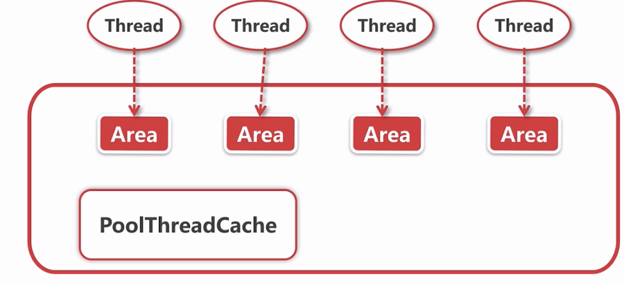

# subpage级别的内存分配:allocateTiny()

步骤

1. 定位一个Subpage对象,基于一个page.可能是用已有的subpage,也可能是新创建的
2. 如果是新创建的subpage,初始化Subpage.
   初始化过程,去chunk里找一个page.把这个page按照期望的subpage大小进行划分
   如:期望1K的内存 ,把8K的Page分成8份
3. 初始化pooledByteBuf.
   其实就是拿到内存信息,放入到一个bytebuf中

**下面使用16B进行测试**

代码片段:

```java
//PoolArena#allocate(io.netty.buffer.PoolThreadCache, io.netty.buffer.PooledByteBuf<T>, int)
    private void allocate(PoolThreadCache cache, PooledByteBuf<T> buf, final int reqCapacity) {
        final int normCapacity = normalizeCapacity(reqCapacity);
        if (isTinyOrSmall(normCapacity)) { // capacity < pageSize
            int tableIdx;
            PoolSubpage<T>[] table;
            boolean tiny = isTiny(normCapacity);
            if (tiny) { // < 512
                
                if (cache.allocateTiny(this, buf, reqCapacity, normCapacity)) {//false
                    return;
                }
                
                tableIdx = tinyIdx(normCapacity);//tableIdx = normCapacity/16
                table = tinySubpagePools;//分级的SubPage池
            } 
            //拿到对应的SubPagePools,这里是table[1]所以拿到的是16B专属的SubPage池
            //拿到头结点,由于是第一次,此时这个头结点没有任何内存相关的信息
            final PoolSubpage<T> head = table[tableIdx];

            synchronized (head) {
                final PoolSubpage<T> s = head.next;
                if (s != head) {//false,因为此时头结点为空
				...省略
                }
            }
            //用allocateNormal的方式去分配,就是之前分配page时的那段逻辑
            allocateNormal(buf, reqCapacity, normCapacity);
            return;
        }
    }
```

**tinySubPagePools**

它和**MemoryRegionCache**的结构很像,也是分级.比如第一个tinySubPagePools[1]是16B专属的SubPage池


这里的tiny最终会调用**allocateNormal**的方式去分配,就是之前分配page时的那段逻辑.而这里和之前有不同:

创建新的chunk后会在这个新的`PoolChunk`对上上调用`PoolChunk#allocate`,就是下面这段.但上次我们分配page级别的时候它会进入`allocateRun()`,而这次我们想分配的是`subpage`,他会进入下面的`allocateSubpage()`部分

```java
    long allocate(int normCapacity) {
        if ((normCapacity & subpageOverflowMask) != 0) { // >= pageSize
            return allocateRun(normCapacity);
        } else {
            //因为想分配的是subpage,他会进入下面
            return allocateSubpage(normCapacity);//
        }
    }
```

下面就是`PoolChunk#allocateSubpage()`,用于定位一个subpage

```java
private long allocateSubpage(int normCapacity) {
	//通过arena找到head,就是之前PoolSubpage[1],16B专属的空的SubPage池
    PoolSubpage<T> head = arena.findSubpagePoolHead(normCapacity);
    synchronized (head) {
        int d = maxOrder; //11,就是上章的chunk层,.(这层是8K单位的元素,Page的单位 )
        int id = allocateNode(d);//命令他在第11层分配节点.拿到节点的索引,示例是2048(0~8k的节点)
        if (id < 0) {
            return id;
        }

        final PoolSubpage<T>[] subpages = this.subpages;
        final int pageSize = this.pageSize;

        freeBytes -= pageSize;

        int subpageIdx = subpageIdx(id);//id= 2048.计算这个节点是第几个分配index,这里是0
        PoolSubpage<T> subpage = subpages[subpageIdx];//由于什么都没有,这里会是null
        if (subpage == null) {
            //创建初始化为subpage
            subpage = new PoolSubpage<T>(head, this, id, runOffset(id), pageSize, normCapacity);
            //创建好后,把这个subpages[0]赋值成当前subpage.表示当前节点是以subpage的方式存在
            subpages[subpageIdx] = subpage;
        } else {
            subpage.init(head, normCapacity);
        }
        return subpage.allocate();//
    }
}
```

创建的`PoolSubpage`时调用它的构造方法,其构造方法中又会调用这么一段

```java
    void init(PoolSubpage<T> head,
              int elemSize) {//指定的capacity
        doNotDestroy = true;
        this.elemSize = elemSize;
        if (elemSize != 0) {
            //把page划分成page/capacity个,计算划分个数
            maxNumElems = numAvail = pageSize / elemSize;
            nextAvail = 0;
            bitmapLength = maxNumElems >>> 6;
            if ((maxNumElems & 63) != 0) {
                bitmapLength ++;
            }

            for (int i = 0; i < bitmapLength; i ++) {
                bitmap[i] = 0;//表示已被分配的subpage[]中已被分配的subpage
                //0表示未分配,1表示已分配
            }
        }
        addToPool(head);//把这个新节点加到Arena的PoolSubPageSubPage[]中
    }
```

下次再分配16B大小的时候就可已找到这个划分好的page了

接上面的`PoolChunk#allocateSubpage()`片段,在调用完`PoolSubpage`的构造方法,完成创建初始化为subpage后会`return subpage.allocate();`.通过这个方法,在刚才初始化完成的`PoolSubpage`中取出一个`subpage`,进行返回.

`subpage.allocate()`的代码片段如下:

```java
//PoolSubpage#allocate
long allocate() {
	//从PoolSubpage中找到一个未被使用的SubPage
    final int bitmapIdx = getNextAvail();
    int q = bitmapIdx >>> 6;
    int r = bitmapIdx & 63;
    assert (bitmap[q] >>> r & 1) == 0;
    bitmap[q] |= 1L << r;

    if (-- numAvail == 0) {//如果是最后一个可用的SubPage,就把这个PoolSubpage删除 
        removeFromPool();
    }

    return toHandle(bitmapIdx);//返回bitmapIdx和memoryMapIdx的拼接
}
```

然后就会返回到`allocateNormal()`.此时的handler可以算出表示chunk中第几个节点,第几个subpage.也就是这块chunk中的位置

```java
private synchronized void allocateNormal(PooledByteBuf<T> buf, int reqCapacity, int normCapacity) {
    //1.
    if (q050.allocate(buf, reqCapacity, normCapacity) ||
        q025.allocate(buf, reqCapacity, normCapacity) ||
        q000.allocate(buf, reqCapacity, normCapacity) ||
        qInit.allocate(buf, reqCapacity, normCapacity) ||
        q075.allocate(buf, reqCapacity, normCapacity)) {
        ++allocationsNormal;
        return;
    }

    //2.
    PoolChunk<T> c = newChunk(pageSize, maxOrder, pageShifts, chunkSize);
    long handle = c.allocate(normCapacity);//从这里返回,拿到subpage在chunk中的位置
    ++allocationsNormal;
    assert handle > 0;
    c.initBuf(buf, handle, reqCapacity);//进行初始化
    qInit.add(c);
}
```

看看它最后一步进行初始化的过程

```java
//PoolChunk#initBuf
void initBuf(PooledByteBuf<T> buf, long handle, int reqCapacity) {
    int memoryMapIdx = memoryMapIdx(handle);
    int bitmapIdx = bitmapIdx(handle);
    if (bitmapIdx == 0) {//此时不是0,与page级别的分配不同
        byte val = value(memoryMapIdx);
        assert val == unusable : String.valueOf(val);
        buf.init(this, handle, runOffset(memoryMapIdx), reqCapacity, runLength(memoryMapIdx),
                 arena.parent.threadCache());
    } else {
        //调用以下
        initBufWithSubpage(buf, handle, bitmapIdx, reqCapacity);
    }
}
---
    private void initBufWithSubpage(PooledByteBuf<T> buf, long handle, int bitmapIdx, int reqCapacity) {

        buf.init(
            this, handle,
            //算出位置,page在chunk中的偏移量+page中这个subpage的偏移量
            runOffset(memoryMapIdx) + (bitmapIdx & 0x3FFFFFFF) * subpage.elemSize, reqCapacity, subpage.elemSize,
            arena.parent.threadCache());
    }
```

# ByteBuf的回收

用户代码如下,释放一个ByteBuf

```java
PooledByteBufAllocator allocator = PooledByteBufAllocator.DEFAULT;
ByteBuf bytebuf = allocator.directBuffer(16);
byteBuf.release();//释放bytebuf
```

无论是那种类型的ByteBuf,它都会调用`AbstractReferenceCountedByteBuf#release0`进行释放

```java
    private boolean release0(int decrement) {
        for (;;) {
            int refCnt = this.refCnt;
            if (refCnt < decrement) {
                throw new IllegalReferenceCountException(refCnt, -decrement);
            }

            if (refCntUpdater.compareAndSet(this, refCnt, refCnt - decrement)) {
                if (refCnt == decrement) {
                    deallocate();//调用这个进行释放
                    return true;
                }
                return false;
            }
        }
    }
```

它又通过`PooledByteBuf#deallocate`进行释放

```java
protected final void deallocate() {
    if (handle >= 0) {
        final long handle = this.handle;
        this.handle = -1;//清除handle,表示当前的PooledByteBuf不指向任何内存
        memory = null;
        //1.2.
        chunk.arena.free(chunk, handle, maxLength, cache);
        //3
        recycle();
    }
}
```

**释放步骤**:

1. 连续的内存区段加到缓存.
   无论是通过新分配空间创建的,还是在缓存中获取的.此时缓存中都缺少这段空间,所以把他加到缓存
2. 如果加入缓存失败,标记连续的内存区段为未使用
   根据时page级别还是SubPage级别,标记方式不同
   page:按之前的层的逻辑图去标记
   subpage:通过bitmap的方式去标记,标记为0就是未使用
3. ByteBuf加到对象池
   之前创建时也提到过,如果以后创建时去得到就会在这上面进行初始化

### 1.连续的内存区段加到缓存

深入到`chunk.arena.free();`中

```java
//io.netty.buffer.PoolArena#free
void free(PoolChunk<T> chunk, long handle, int normCapacity, PoolThreadCache cache) {
    if (chunk.unpooled) {
        int size = chunk.chunkSize();
        destroyChunk(chunk);
        activeBytesHuge.add(-size);
        deallocationsHuge.increment();
    } else {//示例是pooled
        SizeClass sizeClass = sizeClass(normCapacity);//算内存规格,tiny
        if (cache != null && 
            cache.add(this, chunk, handle, normCapacity, sizeClass)//尝试加入到缓存
           ) {
            // cached so not free it.
            return;
        }

        freeChunk(chunk, handle, sizeClass);
    }
}
```

看一下尝试加入缓存的部分,就是从缓存中找到专属的MemoryRegionCache并加入

```java
//io.netty.buffer.PoolThreadCache#add
boolean add(PoolArena<?> area, PoolChunk chunk, long handle, int normCapacity, SizeClass sizeClass) {
    //拿到大小对应的MemoryRegionCache
    MemoryRegionCache<?> cache = cache(area, normCapacity, sizeClass);
    if (cache == null) {
        return false;
    }
    return cache.add(chunk, handle);//加入到缓存
}
---
    public final boolean add(PoolChunk<T> chunk, long handle) {
    
    Entry<T> entry = newEntry(chunk, handle);//获取复用的Entry对象
    boolean queued = queue.offer(entry);//假如到queue
    if (!queued) {
        entry.recycle();
    }

    return queued;
}
```

之前从一个MemoryRegionCache获取合适的大小的chunk部分并创建时,会把废弃的`Entry`清空后放入一个对象池中,而这个`newEntry()`就会尝试从对象池中获取一个复用的`Entry`对象.并把这个加到缓存的queue里面

### 2.如果加入缓存失败,标记连续的内存区段为未使用

可能是缓存队列已经满了

就会进到`free()`中的下面的部分

```java
//io.netty.buffer.PoolArena#free
void free(PoolChunk<T> chunk, long handle, int normCapacity, PoolThreadCache cache) {
    if (chunk.unpooled) {
        ..省略
    } else {//示例是pooled
        SizeClass sizeClass = sizeClass(normCapacity);//算内存规格,tiny
        //尝试加入到缓存
        if (cache != null && cache.add(this, chunk, handle, normCapacity, sizeClass)) {
            return;
        }//失败
		//调用这个标记连续的内存区段为未使用
        freeChunk(chunk, handle, sizeClass);
    }
}
```

这个`freeChunk()`会调用`PoolChunkList#free`

```java
//io.netty.buffer.PoolChunkList#free    
boolean free(PoolChunk<T> chunk, long handle) {
    chunk.free(handle);
    if (chunk.usage() < minUsage) {
        remove(chunk);
        // Move the PoolChunk down the PoolChunkList linked-list.
        return move0(chunk);
    }
    return true;
}
```


`PoolChunk#free`.也就是说通过chunk释放掉一段连续内存.这里会先判断释放的是page还是subpage.

- page:按之前的层的逻辑图去标记
- subpage:通过bitmap的方式去标记,标记为0就是未使用

```java
//io.netty.buffer.PoolChunk#free
void free(long handle) {
    int memoryMapIdx = memoryMapIdx(handle);
    int bitmapIdx = bitmapIdx(handle);

    if (bitmapIdx != 0) { // 释放的是subpage
        PoolSubpage<T> subpage = subpages[subpageIdx(memoryMapIdx)];
        assert subpage != null && subpage.doNotDestroy;
		//找到对应的PoolSubpage,这个大小的subpage的专属Subpage池
        PoolSubpage<T> head = arena.findSubpagePoolHead(subpage.elemSize);
        synchronized (head) {
            //释放他,就是把对应的bitmapIdx标记为0
            if (subpage.free(head, bitmapIdx & 0x3FFFFFFF)) {
                return;
            }
        }
    }
    //释放的是page,恢复之前的层次图
    freeBytes += runLength(memoryMapIdx);
    setValue(memoryMapIdx, depth(memoryMapIdx));
    updateParentsFree(memoryMapIdx);
}
```

### 3.ByteBuf加到对象池

复用:申请时尽可能从对象池中申请,释放时也尽可能释放到对象池

```java
//PooledByteBuf#deallocate
protected final void deallocate() {
    if (handle >= 0) {
        ..省略
		//1.2.要么加到缓存,要么标记为未使用
        //3.ByteBuf加到对象池
        recycle();
    }
}
```

`PooledByteBuf#deallocate`的`recycle();`会进行这个过程

# ByteBuf总结

- bytebuf的api和分类
  api:read和writeapi
  分类:

  - 堆内(数组)还是堆外(JDK的ByteBuf)
  - Unsafe(通过JDK的Unsafe对象对内存地址进行读写 )还是非Unsafe(直接读写)
  - Pooled(每次分配内存都直接申请内存)还是UnPooled(预先分配好一整块内存,从这块内存中获取一部分)

- 分配Pooled内存的总步骤
  线程私有的PooledThreadCache获取缓存空间,去找之前使用过然后被释放了的内存
  如果没有就通过chunk重新进行分配

- 不同规格的Pooled内存分配与释放

  - page级别:从chunk的层次结构中分配
  - subpage级别:把一个page按照subpage大小进行划分,然后通过bitmap管理

  释放后加入缓存队列,方别下次分配时使用

### 三个问题

- 内存的类别有哪些
  三个唯独
- 如何减少多线程内存分配之间的竞争
  各个NioEventLoop有自己的分配空间,和ThreadLocal同理,下图:



- 不同大小的内存是如何进行分配的