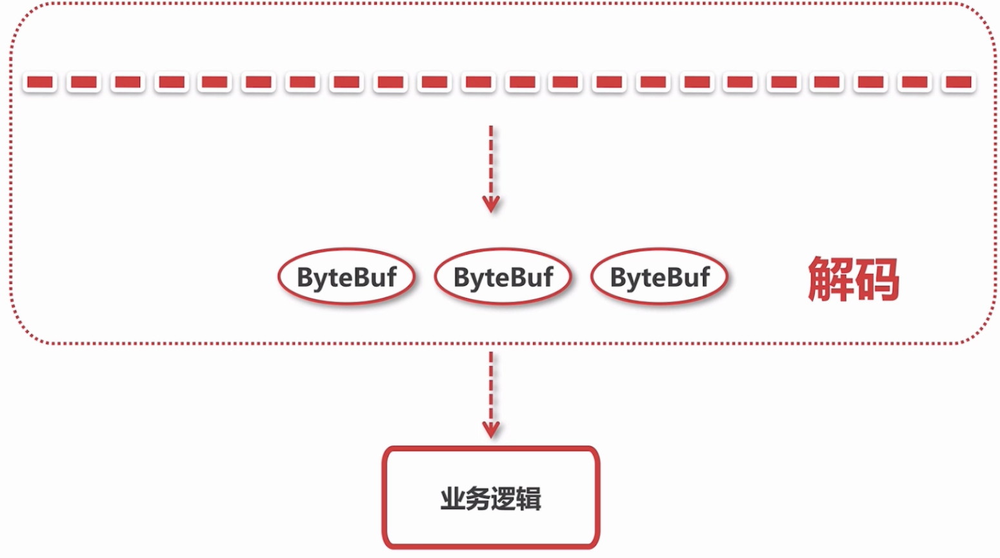
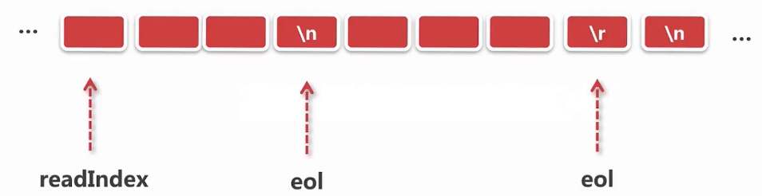
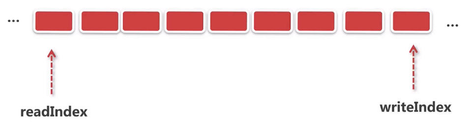
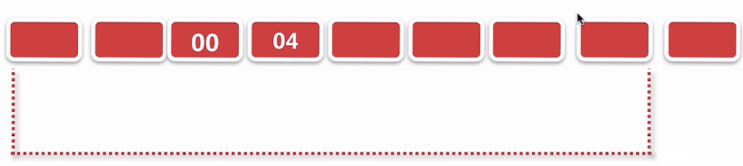

解码:把一串二进制数据流解析成ByteBuf




- 解码器抽象的解码过程
- netty里面有哪些拆箱即用的解码器

本章内容

- 解码器基类
- netty中常见的解码器分析

# 解码器基类

## ByteToMessageDecoder解码步骤

所有底层解码器都基于它实现

解码步骤:

1. 累加字节流
2. 调用子类的decode方法进行解析
3. 将解析到的ByteBuf向下传播

### 1.累加字节流

- 如果是第一次读数据,把当前读入的数据设置成累加器
- 否则,把这次读入的数据累加到累加器上

```java
//io.netty.handler.codec.ByteToMessageDecoder#channelRead
    @Override
    public void channelRead(ChannelHandlerContext ctx, Object msg) throws Exception {
        if (msg instanceof ByteBuf) {//此时会传入bytebuf ,以下进入解码器的处理
            CodecOutputList out = CodecOutputList.newInstance();
            try {
                ByteBuf data = (ByteBuf) msg;
                first = cumulation == null;
                if (first) {//当前累加器==null,表示首次从io流中读取数据
                    cumulation = data;//把累加器设置为当前的ByteBuf
                } else {
                    //不是第一次,把这次读入的数据累加到累加器上
                    cumulation = cumulator.cumulate(ctx.alloc(), cumulation, data);
                }
                //调用子类的decode方法
                callDecode(ctx, cumulation, out);
..省略
        } else {//如果不是ByteBuf类型,不解码直接向下传播
            ctx.fireChannelRead(msg);
        }
    }
```

累加器`cumulation`是什么.

```java
private Cumulator cumulator = MERGE_CUMULATOR;

public static final Cumulator MERGE_CUMULATOR = new Cumulator() {
    @Override
    public ByteBuf cumulate(ByteBufAllocator alloc, ByteBuf cumulation, ByteBuf in) {
        ByteBuf buffer;
        if (cumulation.writerIndex() > cumulation.maxCapacity() - in.readableBytes()
            || cumulation.refCnt() > 1) {
			//进行扩容
            buffer = expandCumulation(alloc, cumulation, in.readableBytes());
        } else {
            //不需要扩容,设置为当前累加器
            buffer = cumulation;
        }
        //把当期数据累加到累加器
        buffer.writeBytes(in);
        in.release();//释放
        return buffer;
    }
};
```

### 2.调用子类的decode方法进行解析

放入累加器后会调用子类的decode方法进行解析.

```java
//io.netty.handler.codec.ByteToMessageDecoder#channelRead			
    public void channelRead(ChannelHandlerContext ctx, Object msg) throws Exception {
            CodecOutputList out = CodecOutputList.newInstance();
...
                //调用子类的decode方法
                callDecode(ctx, cumulation, out);
```

可以把`out`简单理解为一个ArrayList.调用`callDecode()`进行解析,然后把解析完成后的结果放入

`out`.然后再从这个`out`的List里面的解析结果一个个拿出,向下进行传播

```java
//io.netty.handler.codec.ByteToMessageDecoder#callDecode
protected void callDecode(ChannelHandlerContext ctx, ByteBuf in, List<Object> out) {
    		//一个while循环,累加器里面有东西就继续
            while (in.isReadable()) {
                int outSize = out.size();//list里面是否已经有对象

                if (outSize > 0) {//有对象,首次进入时不会进这里
                    //向下进行传播
                    fireChannelRead(ctx, out, outSize);
                    out.clear();//清空list
                    if (ctx.isRemoved()) {
                        break;
                    }
                    outSize = 0;
                }

                int oldInputLength = in.readableBytes(); //可读数据的长度
                decode(ctx, in, out);//这里调用子类的解码器
                if (ctx.isRemoved()) {
                    break;
                }

                if (outSize == out.size()) {//解析前的大小==解析后的大小,没有解析到数据
                    //累加器里面的数据长度不足以封装成一个数据包
                    if (oldInputLength == in.readableBytes()) {
                        break;//没有足够的数据包,退出
                    } else {
                        //已经读取了一部分数据,但还没有构成对象 
                        continue;
                    }
                }

                //没有读取到数据,但是decode到一个message.有问题
                if (oldInputLength == in.readableBytes()) {
                    throw new DecoderException(
                            StringUtil.simpleClassName(getClass()) +
                            ".decode() did not read anything but decoded a message.");
                }

                if (isSingleDecode()) {//只解析一次
                    break;
                }
            }
    }
```

### 3.将解析到的ByteBuf向下传播

```java
//io.netty.handler.codec.ByteToMessageDecoder#channelRead    
	@Override
    public void channelRead(ChannelHandlerContext ctx, Object msg) throws Exception {
        if (msg instanceof ByteBuf) {
            CodecOutputList out = CodecOutputList.newInstance();
            try {
                ByteBuf data = (ByteBuf) msg;
                //1.
                first = cumulation == null;
                if (first) {
                    cumulation = data;
                } else {
                    cumulation = cumulator.cumulate(ctx.alloc(), cumulation, data);
                }
                //2.
                callDecode(ctx, cumulation, out);
..
            } finally {
..
                int size = out.size();//当前list长度
                decodeWasNull = !out.insertSinceRecycled();
                fireChannelRead(ctx, out, size);//把解析到的对象向下进行传播
                out.recycle();//list回收
            }
        } else {
            ctx.fireChannelRead(msg);
        }
    }
```

跟踪`fireChannelRead()`看一下传播的过程:

```java
//io.netty.handler.codec.ByteToMessageDecoder#fireChannelRead(io.netty.channel.ChannelHandlerContext, io.netty.handler.codec.CodecOutputList, int)    
static void fireChannelRead(ChannelHandlerContext ctx, CodecOutputList msgs, int numElements) {
        for (int i = 0; i < numElements; i ++) {
            //对解析出的每一个对象进行传播
            ctx.fireChannelRead(msgs.getUnsafe(i)//返回bytebuf
                               );
        }
    }
```

传播后业务代码就能获取到解码后的`ByteBuf`对象

# netty中常见的解码器分析

## 基于固定长度解码器分析

最简单的解码器`io.netty.handler.codec.FixedLengthFrameDecoder`.只有一个成员变量,在构造方法中传入

```java
public class FixedLengthFrameDecoder extends ByteToMessageDecoder {

    private final int frameLength;//长度
    public FixedLengthFrameDecoder(int frameLength) {
        this.frameLength = frameLength;
    }
```

规则如下:

```
 如果你传入这样的数据包
 * +---+----+------+----+
 * | A | BC | DEFG | HI |
 * +---+----+------+----+
 设置长度=3,那么会封装成一下的形式
 * +-----+-----+-----+
 * | ABC | DEF | GHI |
 * +-----+-----+-----+
```

它的`decode()`实现

```java
//io.netty.handler.codec.FixedLengthFrameDecoder#decode(io.netty.channel.ChannelHandlerContext, io.netty.buffer.ByteBuf, java.util.List<java.lang.Object>)
@Override
protected final void decode(ChannelHandlerContext ctx, ByteBuf in, List<Object> out) throws Exception {
    Object decoded = decode(ctx, in);
    if (decoded != null) {
        out.add(decoded);//如果decode到了对象就加入容器
    }
}
---
    protected Object decode(ChannelHandlerContext ctx, ByteBuf in) throws Exception {
    if (in.readableBytes() < frameLength) {//可读字节是否小于帧长度
        return null;
    } else {
        return in.readRetainedSlice(frameLength);//满足长度,从当前的累加器去截取指定长度的ByteBuf
    }
}
```

当小于帧长度时,会返回null,导致父类的`callDecode()`方法会返回,直到下次再进数据时继续进行解析:

```java
//io.netty.handler.codec.ByteToMessageDecoder#callDecode
if (outSize == out.size()) {
    if (oldInputLength == in.readableBytes()) {
        //可读字节小于帧长度时会到这里
        break;//没有足够的数据包,退出
    } else {
        continue;
    }
}
```

## 基于行解码器

对`\n`或`\r\n`进行分割,`io.netty.handler.codec.LineBasedFrameDecoder`

```java
public class LineBasedFrameDecoder extends ByteToMessageDecoder {

    //解析数据包的最大长度,超过长度时丢弃当前的解码过程.下面的discarding会被设置为true
    //也就是说每一行数据不能超过这一行
    private final int maxLength;
    /** Whether or not to throw an exception as soon as we exceed maxLength. */
    private final boolean failFast;//超过最大长度时是否该抛异常.true则立即抛出
    private final boolean stripDelimiter;//最终解析出的数据包带不带换行符,true则不带

    /** True if we're discarding input because we're already over maxLength.  */
    private boolean discarding;//超过长度时设为true,丢弃当前的解码过程.
    private int discardedBytes;//当前丢弃了多少字节
```

它的`decode()`,和上一节的一模一样:

```java
//io.netty.handler.codec.LineBasedFrameDecoder#decode(io.netty.channel.ChannelHandlerContext, io.netty.buffer.ByteBuf, java.util.List<java.lang.Object>)
@Override
protected final void decode(ChannelHandlerContext ctx, ByteBuf in, List<Object> out) throws Exception {
    Object decoded = decode(ctx, in);
    if (decoded != null) {
        out.add(decoded);
    }
}
```

`decode()`具体实现:

通过`findEndOfLine`可以找到换行处的索引,`\n`或`\r\n`:

```java
//io.netty.handler.codec.LineBasedFrameDecoder#findEndOfLine
private static int findEndOfLine(final ByteBuf buffer) {
        int i = buffer.forEachByte(ByteProcessor.FIND_LF);//找\n
        if (i > 0 && buffer.getByte(i - 1) == '\r') {//找\r\n
            i--;
        }
        return i;
    }
```





```java
    protected Object decode(ChannelHandlerContext ctx, ByteBuf buffer) throws Exception {
        final int eol = findEndOfLine(buffer);//找这一行的结尾处,\n或\r\n
        if (!discarding) {//首次会进入
            if (eol >= 0) {//找到换行符
                final ByteBuf frame;
                //从换行符到刻度字节之间的长度.也就是解码后的数据包的长度
                final int length = eol - buffer.readerIndex();
                
                final int delimLength = buffer.getByte(eol) == '\r'? 2 : 1;

                if (length > maxLength) {//本行的长度超过了长度限制
                    //移动到换行符之后的数据.有就是说它会把本行的数据进行丢弃
                    buffer.readerIndex(eol + delimLength);
                    fail(ctx, length);//传播异常
                    return null;
                }

                if (stripDelimiter) {//是否不算入分隔符
                    frame = buffer.readRetainedSlice(length);
                    buffer.skipBytes(delimLength);
                } else {
                    frame = buffer.readRetainedSlice(length + delimLength);
                }

                return frame;
            } else {//没找到换行符
                final int length = buffer.readableBytes();
                if (length > maxLength) {//如果超过最大长度了 
                    discardedBytes = length;
                    //把读指针移到写指针,所有数据都进行丢弃
                    buffer.readerIndex(buffer.writerIndex());
                    discarding = true;//标记为丢弃模式
                    if (failFast) {//丢弃前触发异常
                        //传播异常
                        fail(ctx, "over " + discardedBytes);
                    }
                }
                //没有换行符,但是所有数据的长度不超过长度限制,返回null.
                //也就是不进行解析
                return null;
            }
        } else {//丢弃模式下.就是没有找到换行符,而且全文大小又超过限制所以进行丢弃的那段逻辑
            if (eol >= 0) {//丢弃模式下找到了换行符,
                //直接丢弃本行,指针移到下一行开始处
                //前面已经丢弃的+这次要丢弃的
                final int length = discardedBytes + eol - buffer.readerIndex();
                final int delimLength = buffer.getByte(eol) == '\r'? 2 : 1;
                buffer.readerIndex(eol + delimLength);
                discardedBytes = 0;
                discarding = false;//返回非丢弃模式
                if (!failFast) {//丢弃之后触发异常,两者只会触发一个
                    fail(ctx, length);
                }
            } else {//丢弃模式下没有换行符
                //直接丢弃到writeIndex
                discardedBytes += buffer.readableBytes();
                buffer.readerIndex(buffer.writerIndex());
            }
            return null;//无论是否有换行,在丢弃模式下都不会解析
        }
    }
```

没有找到换行符,就是下面这种情况:



如果这个readIndex和writeIndex之间的长度大于长度限制的话,会把所有数据进行丢弃,并标记为丢弃模式

## 基于分隔符解码器分析

`io.netty.handler.codec.DelimiterBasedFrameDecoder`

它的构造函数:

```java
    public DelimiterBasedFrameDecoder(int maxFrameLength, 
                                      ByteBuf... delimiters) {//表示对这些分割符进行处理
        this(maxFrameLength, true, delimiters);
    }
```

还是看它的`decode()`,拆解成3个步骤:

1. 行处理器
   如果带入的分割符是基于行的分隔符,通过行处理器去处理,就是上小节的
2. 找到最小分隔符
   因为它支持基于多个分隔符机进行分割
3. 解码

### 1.行处理器

```java
//io.netty.handler.codec.DelimiterBasedFrameDecoder#decode(io.netty.channel.ChannelHandlerContext, io.netty.buffer.ByteBuf)
protected Object decode(ChannelHandlerContext ctx, ByteBuf buffer) throws Exception {
    	//1.行处理器
        if (lineBasedDecoder != null) {
            return lineBasedDecoder.decode(ctx, buffer);
        }

```

`lineBasedDecoder`是在构造方法中被初始化的,之后分隔符为行分隔符是会被初始化

```java
public DelimiterBasedFrameDecoder(
...
    if (isLineBased(delimiters) && !isSubclass()) {//分隔符为行分隔符
        lineBasedDecoder = new LineBasedFrameDecoder(maxFrameLength, stripDelimiter, failFast);
        this.delimiters = null;
    }
```

### 2.找到最小分隔符

```java
//io.netty.handler.codec.DelimiterBasedFrameDecoder#decode(io.netty.channel.ChannelHandlerContext, io.netty.buffer.ByteBuf)
protected Object decode(ChannelHandlerContext ctx, ByteBuf buffer) throws Exception {
    
    // 2.找到最小分隔符
    int minFrameLength = Integer.MAX_VALUE;
    ByteBuf minDelim = null;
    for (ByteBuf delim: delimiters) {
        int frameLength = indexOf(buffer, delim);
        if (frameLength >= 0 && frameLength < minFrameLength) {//找min的分隔符
            minFrameLength = frameLength;
            minDelim = delim;
        }
    }
```

### 3.解码

```java
//io.netty.handler.codec.DelimiterBasedFrameDecoder#decode(io.netty.channel.ChannelHandlerContext, io.netty.buffer.ByteBuf)
protected Object decode(ChannelHandlerContext ctx, ByteBuf buffer) throws Exception {
	//3.解码
    if (minDelim != null) {//已经找到分隔符
        int minDelimLength = minDelim.capacity();
        ByteBuf frame;

        if (discardingTooLongFrame) {//是否属于丢弃模式,首次是false

            discardingTooLongFrame = false;
            //丢弃掉一整段
            buffer.skipBytes(minFrameLength + minDelimLength);

            int tooLongFrameLength = this.tooLongFrameLength;
            this.tooLongFrameLength = 0;
            if (!failFast) {
                fail(tooLongFrameLength);
            }
            return null;
        }
		//当前属于非丢弃模式
        
        if (minFrameLength > maxFrameLength) {
            // 大于限制长度,把不合法的部分进行丢弃
            buffer.skipBytes(minFrameLength + minDelimLength);
            fail(minFrameLength);//抛出异常
            return null;
        }
		//正常分割
        if (stripDelimiter) {//包不包含分隔符
            frame = buffer.readRetainedSlice(minFrameLength);
            buffer.skipBytes(minDelimLength);
        } else {
            frame = buffer.readRetainedSlice(minFrameLength + minDelimLength);
        }

        return frame;
    } else {//没有找到分割符
        if (!discardingTooLongFrame) {//非丢弃模式
            if (buffer.readableBytes() > maxFrameLength) {//大于长度限制
                // Discard the content of the buffer until a delimiter is found.
                tooLongFrameLength = buffer.readableBytes();
                buffer.skipBytes(buffer.readableBytes());//丢弃所有
                discardingTooLongFrame = true;//标记为丢弃状态
                if (failFast) {
                    fail(tooLongFrameLength);
                }
            }
        } else {
            //丢弃模式下没有分隔符
            tooLongFrameLength += buffer.readableBytes();//累计
            buffer.skipBytes(buffer.readableBytes());
        }
        return null;
    }
}
```

## 基于长度域解码器分析

也就是`io.netty.handler.codec.LengthFieldBasedFrameDecoder`

###  重要参数



- lengthFieldOffset = 2:
  偏移量是多少,图中从开头到00距离2个字节,所以2
- lengthFieldLength = 2: 
  从00出开始几个字节为止为长度,图中是2个字节,所以2

而0004 = 4也就是说这个数据包的结尾是从04开始往后的4个字节.所以最终的出这个数据包的范围如图所示


### 例子

```java
 * <b>lengthFieldOffset</b>   = <b>0</b>长度域便宜0
 * <b>lengthFieldLength</b>   = <b>2</b>0,1字节拼起来的数表示了这个数据包的长度
 * lengthAdjustment    = 0
 * initialBytesToStrip = 0 (= do not strip header)
 *
 * BEFORE DECODE (14 bytes)         AFTER DECODE (14 bytes)
 * +--------+----------------+      +--------+----------------+
 * | Length | Actual Content |----->| Length | Actual Content |
 * | 0x000C | "HELLO, WORLD" |      | 0x000C | "HELLO, WORLD" |
 * +--------+----------------+      +--------+----------------+

```

0,1字节拼接为 0x000C =12也就是说数据包的结尾是从这里开始12个字节之后,也就是`Hello,World`那段.由于`lengthAdjustment`和`initialBytesToStrip`的值为0,所以最后完成的数据包也是同样的.
那么这两个参数分别代表什么?

- lengthAdjustment
  有时候算出的Length( 0x000C )可能不代表后面的数据包的长度,所以用这个参数进行调整
  比如,当`lengthAdjustment= 1`的时候,他将会包括`Hello,World`那段加上后面的一个字节
- initialBytesToStrip
  解析数据包时是否需要跳过字节

### 例子2

```java
 * lengthFieldOffset   = 0
 * lengthFieldLength   = 2	
 * lengthAdjustment    = 0 同样算出0x000C
 * <b>initialBytesToStrip = 2</b> (= the length of the Length field)
 *
 * BEFORE DECODE (14 bytes)         AFTER DECODE (12 bytes)
 * +--------+----------------+      +----------------+
 * | Length | Actual Content |----->| Actual Content |
 * | 0x000C | "HELLO, WORLD" |      | "HELLO, WORLD" |
 * +--------+----------------+      +----------------+
```

initialBytesToStrip = 2表示跳过开头的两个字节,因此得出的数据包不包含开头表明长度的那2个字节

### 例子3

```java
 * lengthFieldOffset   =  0
 * lengthFieldLength   =  2
 * lengthAdjustment = -2</b> (= the length of the Length field)
 * initialBytesToStrip =  0
 *
 * BEFORE DECODE (14 bytes)         AFTER DECODE (14 bytes)
 * +--------+----------------+      +--------+----------------+
 * | Length | Actual Content |----->| Length | Actual Content |
 * | 0x000E | "HELLO, WORLD" |      | 0x000E | "HELLO, WORLD" |
 * +--------+----------------+      +--------+----------------+
```

这里的Length是4个字节( 0x000E ),这里把lengthAdjustment= -2,让它只算12个字节

### 例子4

```java
 * <b>lengthFieldOffset = 2</b> (= the length of Header 1)
 * <b>lengthFieldLength = 3</b>
 * lengthAdjustment    = 0
 * initialBytesToStrip = 0
 *
 * BEFORE DECODE (17 bytes)                      AFTER DECODE (17 bytes)
 * +----------+----------+----------------+      +----------+----------+----------------+
 * | Header 1 |  Length  | Actual Content |----->| Header 1 |  Length  | Actual Content |
 * |  0xCAFE  | 0x00000C | "HELLO, WORLD" |      |  0xCAFE  | 0x00000C | "HELLO, WORLD" |
 * +----------+----------+----------------+      +----------+----------+----------------+
```

从2字节处开始的3个字节表示长度,因此的出长度为从这里开始的12(0x00000C)个字节

### 例子5

```java
 * lengthFieldOffset   = 0
 * lengthFieldLength   = 3
 * <b>lengthAdjustment = 2</b> (= the length of Header 1)
 * initialBytesToStrip = 0
 *
 * BEFORE DECODE (17 bytes)                      AFTER DECODE (17 bytes)
 * +----------+----------+----------------+      +----------+----------+----------------+
 * |  Length  | Header 1 | Actual Content |----->|  Length  | Header 1 | Actual Content |
 * | 0x00000C |  0xCAFE  | "HELLO, WORLD" |      | 0x00000C |  0xCAFE  | "HELLO, WORLD" |
 * +----------+----------+----------------+      +----------+----------+----------------+
```

如果不让写lengthAdjustment = 2,那么的出的实际数据会是`0xCAFEHELLO, WOR`

### 例子6

```java
* lengthFieldOffset   = 1 (= the length of HDR1)
* lengthFieldLength   = 2
* <b>lengthAdjustment = 1</b> (= the length of HDR2)
* <b>initialBytesToStrip = 3</b> (= the length of HDR1 + LEN)
*
* BEFORE DECODE (16 bytes)                       AFTER DECODE (13 bytes)
* +------+--------+------+----------------+      +------+----------------+
* | HDR1 | Length | HDR2 | Actual Content |----->| HDR2 | Actual Content |
* | 0xCA | 0x000C | 0xFE | "HELLO, WORLD" |      | 0xFE | "HELLO, WORLD" |
* +------+--------+------+----------------+      +------+----------------+
```

从1字节处开始的2个字节表示长度,因此的出长度为从这里开始的12(0x00000C)个字节,此时只会截到`HELLO, WORL`,通过lengthAdjustment扩大1个字节,再通过initialBytesToStrip跳过开头的不必要的两段

### 例子7

```java
 * lengthFieldOffset   =  1
 * lengthFieldLength   =  2
 * <b>lengthAdjustment = -3</b> (= the length of HDR1 + LEN, negative)
 * <b>initialBytesToStrip = 3</b>
 *
 * BEFORE DECODE (16 bytes)                       AFTER DECODE (13 bytes)
 * +------+--------+------+----------------+      +------+----------------+
 * | HDR1 | Length | HDR2 | Actual Content |----->| HDR2 | Actual Content |
 * | 0xCA | 0x0010 | 0xFE | "HELLO, WORLD" |      | 0xFE | "HELLO, WORLD" |
 * +------+--------+------+----------------+      +------+----------------+
```

得到Length = 16(0x0010),显然太长了,`lengthAdjustment = -3`调整长度,再设置initialBytesToStrip跳过开头的不必要的两段

```java
public class LengthFieldBasedFrameDecoder extends ByteToMessageDecoder {

    private final ByteOrder byteOrder;
    private final int maxFrameLength;//这个数据包能包含的最大字节的长度
    private final int lengthFieldOffset;//表示长度的字节的起始位置
    private final int lengthFieldLength;//表示长度的字节的长度
    private final int lengthFieldEndOffset;//表示尾部的偏移量,lengthFieldOffset+lengthFieldLength
    private final int lengthAdjustment;//长度调整
    private final int initialBytesToStrip;//从头跳过
    private final boolean failFast;//立即失败
    private boolean discardingTooLongFrame;//丢弃模式
    private long tooLongFrameLength;//当前丢弃了多少个字节
    private long bytesToDiscard;
```


### 基于长度域解码器步骤

1. 计算需要抽取的数据包长度
2. 跳过字节逻辑处理
3. 丢弃模式下的处理
   如果当前的长度大于长度限制,把接下来的字节流丢弃.**丢弃到长度域里面指定的字节为止**

#### 1.计算需要抽取的数据包长度

 ```java
//io.netty.handler.codec.LengthFieldBasedFrameDecoder#decode(io.netty.channel.ChannelHandlerContext, io.netty.buffer.ByteBuf)
protected Object decode(ChannelHandlerContext ctx, ByteBuf in) throws Exception {
        if (discardingTooLongFrame) {
            long bytesToDiscard = this.bytesToDiscard;
            int localBytesToDiscard = (int) Math.min(bytesToDiscard, in.readableBytes());
            in.skipBytes(localBytesToDiscard);
            bytesToDiscard -= localBytesToDiscard;
            this.bytesToDiscard = bytesToDiscard;

            failIfNecessary(false);
        }
		
    	//可读字节 长度未达到尾部偏移量,没有实际内容部分,解析失败
        if (in.readableBytes() < lengthFieldEndOffset) {
            return null;
        }
		//计算实际的长度域偏移量,之前是相对的
        int actualLengthFieldOffset = in.readerIndex() + lengthFieldOffset;
        long frameLength = getUnadjustedFrameLength(in, actualLengthFieldOffset, lengthFieldLength, byteOrder);

        if (frameLength < 0) {//不合法
            in.skipBytes(lengthFieldEndOffset);
            throw new CorruptedFrameExcept ion(
                    "negative pre-adjustment length field: " + frameLength);
        }
		//得出从当前流中需要抽取的二进制数据包的长度
        frameLength += lengthAdjustment + lengthFieldEndOffset;

        if (frameLength < lengthFieldEndOffset) {//有问题 
            in.skipBytes(lengthFieldEndOffset);
            throw new CorruptedFrameException(
                    "Adjusted frame length (" + frameLength + ") is less " +
                    "than lengthFieldEndOffset: " + lengthFieldEndOffset);
        }

        if (frameLength > maxFrameLength) {
            long discard = frameLength - in.readableBytes();
            tooLongFrameLength = frameLength;

            if (discard < 0) {
                // buffer contains more bytes then the frameLength so we can discard all now
                in.skipBytes((int) frameLength);
            } else {
                // Enter the discard mode and discard everything received so far.
                discardingTooLongFrame = true;
                bytesToDiscard = discard;
                in.skipBytes(in.readableBytes());
            }
            failIfNecessary(true);
            return null;
        }

        // never overflows because it's less than maxFrameLength
        int frameLengthInt = (int) frameLength;
    	//可读数据长是否小于这次想读的数据长
        if (in.readableBytes() < frameLengthInt) {
            //可能下次还会持续有数据包发来,到时再进行解码
            return null;
        }

        if (initialBytesToStrip > frameLengthInt) {
            in.skipBytes(frameLengthInt);
            throw new CorruptedFrameException(
                    "Adjusted frame length (" + frameLength + ") is less " +
                    "than initialBytesToStrip: " + initialBytesToStrip);
        }
        in.skipBytes(initialBytesToStrip);

        // extract frame
        int readerIndex = in.readerIndex();
        int actualFrameLength = frameLengthInt - initialBytesToStrip;
        ByteBuf frame = extractFrame(ctx, in, readerIndex, actualFrameLength);
        in.readerIndex(readerIndex + actualFrameLength);
        return frame;
    }
 ```

#### 2.跳过字节逻辑处理

```java
//io.netty.handler.codec.LengthFieldBasedFrameDecoder#decode(io.netty.channel.ChannelHandlerContext, io.netty.buffer.ByteBuf)
protected Object decode(ChannelHandlerContext ctx, ByteBuf in) throws Exception {
    
..省略上一步
    	//要跳过的长度>当前数据包的长度
        if (initialBytesToStrip > frameLengthInt) {
            //抛异常
            in.skipBytes(frameLengthInt);
            throw new CorruptedFrameException(
                    "Adjusted frame length (" + frameLength + ") is less " +
                    "than initialBytesToStrip: " + initialBytesToStrip);
        }
    	//跳过initialBytesToStrip
        in.skipBytes(initialBytesToStrip);

        // extract frame
        int readerIndex = in.readerIndex();
        int actualFrameLength = frameLengthInt - initialBytesToStrip;//实际上要读到的字节长度
    	//开始抽取字节
        ByteBuf frame = extractFrame(ctx, in, readerIndex, actualFrameLength);
    	//读指针往后移
        in.readerIndex(readerIndex + actualFrameLength);
        return frame;
    }
```

#### 3.丢弃模式下的处理

想抽取的长度>`maxFrameLength`

```java
//io.netty.handler.codec.LengthFieldBasedFrameDecoder#decode(io.netty.channel.ChannelHandlerContext, io.netty.buffer.ByteBuf)
protected Object decode(ChannelHandlerContext ctx, ByteBuf in) throws Exception {
        if (discardingTooLongFrame) {//丢弃状态
            long bytesToDiscard = this.bytesToDiscard;//还需要丢弃多少字节
            //丢弃本次能丢到的
            int localBytesToDiscard = (int) Math.min(bytesToDiscard, in.readableBytes());
            in.skipBytes(localBytesToDiscard);
            bytesToDiscard -= localBytesToDiscard;
            this.bytesToDiscard = bytesToDiscard;

            failIfNecessary(false);//决定是否抛出异常
        }
		
...
        if (frameLength > maxFrameLength) {
            long discard = frameLength - in.readableBytes();//需要丢弃多少字节
            tooLongFrameLength = frameLength;

            if (discard < 0) {
                
                in.skipBytes((int) frameLength);
            } else {
                //还需要丢弃更多的字节
                discardingTooLongFrame = true;//开启丢弃模式 
                bytesToDiscard = discard;
                in.skipBytes(in.readableBytes());
            }
            failIfNecessary(true);
            return null;
        }
...

    }
```

# 总结

- 解码器抽象的解码过程
  1. 累加字节流
  2. 调用子类的decode方法进行解析
  3. 将解析到的ByteBuf向下传播
- netty里面有哪些拆箱即用的解码器
  - 基于固定长度解码器
  - 基于行解码器
  - 基于分隔符解码器
  - 基于长度域解码器