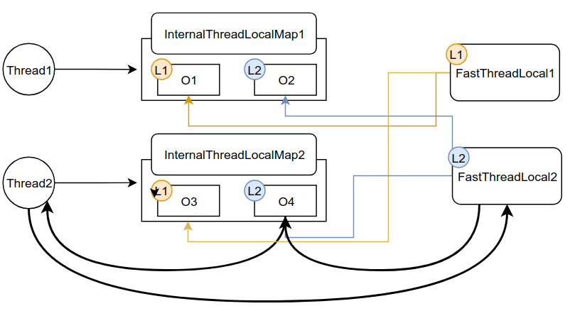

- FastThreadLocal
- Recycler

# FastThreadLocal

## FastThreadLocal的使用

示例代码

```java
private static FastThreadLocal<Object> threadLocal0 = new FastThreadLocal<Object>() {
    @Override
    protected Object initialValue() {
        return new Object();
    }
};
public static void main(String[] args) {
    //两个线程
    new Thread(() -> {
        Object object = threadLocal0.get();
        // .... do with object
        System.out.println(object);
    }).start();
    new Thread(() -> {
        Object object = threadLocal0.get();
        // .... do with object
        System.out.println(object);
    }).start();
}
```

与`ThreadLocal`相同,就算Thread中获取了同一个`object`,两个线程对这个`object`的更变都不会相互影响

示例的运行结果:

```java
java.lang.Object@7b21370
java.lang.Object@561b6988
```

也就说两个线程拿到的`Object`的内存地址不相同

把示例程序改为以下,判断两个线程是否会相互影响:

```java
public static void main(String[] args) {
    //两个线程
    new Thread(() -> {
        Object object = threadLocal0.get();
        // .... do with object
        System.out.println(object);
        //不断去修改threadLocal0中的Object
        while (true) {
            threadLocal0.set(new Object());
            try {
                Thread.sleep(1);
            } catch (InterruptedException e) {
                e.printStackTrace();
            }
        }
    }).start();
    new Thread(() -> {
        Object object = threadLocal0.get();
        // ... do with object
        System.out.println(object);
        while (true) {
            //判断新拿出的object是否和最早拿到的是同一个
            System.out.println(threadLocal0.get() == object);
            try {
                Thread.sleep(1000);
            } catch (InterruptedException e) {
                e.printStackTrace();
            }
        }
    }).start();
}
```

运行结果如下

```java
java.lang.Object@4ce83a23
java.lang.Object@462724bb
true
true
true
..
```

也就是说Thread1不管如何去修改,Thread2拿到的永远和它最初拿到的那个对象相等

## FastThreadLocal实现机制

- FastThreadLocal的创建
- FastThreadLocal的get()方法实现 
- FastThreadLocal的set()方法实现 

### FastThreadLocal的创建

看`FastThreadLocal`的构造方法

```java
private final int index;
public FastThreadLocal() { 
    index = InternalThreadLocalMap.nextVariableIndex();
} 
```

FastThreadLocal示例间的`index`值独立,值为0,1,2,3...,如下:

```java
//io.netty.util.internal.InternalThreadLocalMap#nextVariableIndex
public static int nextVariableIndex() {
    int index = nextIndex.getAndIncrement();//AtomicInteger, 获取自增
    if (index < 0) {
        nextIndex.decrementAndGet();
    }
    return index;
}
```

也就是说每个`FastThreadLocal`都有一个唯一的`Index`,当做是身份标示

### FastThreadLocal的get()方法实现 

步骤:

1. 获取ThreadLocalMap
   通过之前的index获取
2. 直接通过索引取出对象
3. 初始化
   如果还没初始化就初始化,**只有首次调用`get()`时会触发**

#### 1.获取ThreadLocalMap

```java
//io.netty.util.concurrent.FastThreadLocal#get()
public final V get() {
    return get(InternalThreadLocalMap.get());
}
---
//io.netty.util.internal.InternalThreadLocalMap#get
public static InternalThreadLocalMap get() {
    Thread thread = Thread.currentThread();
    //1.获取ThreadLocalMap
    if (thread instanceof FastThreadLocalThread) {
        return fastGet((FastThreadLocalThread) thread);
    } else {//示例中的是普通的Thread,所以是这边.
        return slowGet();//同样能获取到ThreadLocalMap
    }
}
```

示例中的是普通的Thread,所以是用`slowGet()`获取ThreadLocalMap

```java
//io.netty.util.internal.InternalThreadLocalMap#slowGet
private static InternalThreadLocalMap slowGet() {
    //
    ThreadLocal<InternalThreadLocalMap> slowThreadLocalMap = 
        							UnpaddedInternalThreadLocalMap.slowThreadLocalMap;
    //通过JDK的ThreadLocal,获取当前线程的InternalThreadLocalMap
    InternalThreadLocalMap ret = slowThreadLocalMap.get();
    if (ret == null) {//首次是null
        ret = new InternalThreadLocalMap();
        slowThreadLocalMap.set(ret);
    }
    return ret;
}
```

这个`UnpaddedInternalThreadLocalMap.slowThreadLocalMap`实际上是JDK的`ThreadLocal`.也就是说netty的`InternalThreadLocalMap`实际上是基于JDK的`ThreadLocal`实现

```java
static final ThreadLocal<InternalThreadLocalMap> slowThreadLocalMap = new ThreadLocal<InternalThreadLocalMap>();
```

之所以是`slow`,是因为他需要通过`ThreadLocal`去获取`InternalThreadLocalMap`.

下面再看一下`fastGet()`,也就是直接在`FastThreadLocalThread`线程中使用时会调用的快速获取ThreadLocalMap的方式

```java
//io.netty.util.internal.InternalThreadLocalMap#fastGet
private static InternalThreadLocalMap fastGet(FastThreadLocalThread thread) {
    //直接从线程中的threadLocalMap就能获得
    InternalThreadLocalMap threadLocalMap = thread.threadLocalMap();
    if (threadLocalMap == null) {
        thread.setThreadLocalMap(threadLocalMap = new InternalThreadLocalMap());
    }
    return threadLocalMap;
}
```

`FastThreadLocalThread`线程自己就维护了一个`threadLocalMap`变量,通过这个就能拿到`InternalThreadLocalMap`.

**也就是说,普通的Thread是通过JDK的TreadLocal中维护`<线程,InternalThreadLocalMap>`的键值对获取`InternalThreadLocalMap`,而`FastThreadLocalThread`中是自带`InternalThreadLocalMap`**

#### 2.直接通过索引取出对象

通过上一步获取到线程私有的`InternalThreadLocalMap`后,又回到这一步:

```java
//io.netty.util.concurrent.FastThreadLocal#get()
public final V get() {
    return get(InternalThreadLocalMap.get());
}
```

接下来会通过这个`InternalThreadLocalMap`,取出对象:

```java
//io.netty.util.concurrent.FastThreadLocal#get(io.netty.util.internal.InternalThreadLocalMap)
public final V get(InternalThreadLocalMap threadLocalMap) {
    //index是当前FastThreadLocal对象的标示
    Object v = threadLocalMap.indexedVariable(index);//直接是Object[index]取相应的
    if (v != InternalThreadLocalMap.UNSET) {
        return (V) v;
    }
	//最初必然是UNSET,
    //这一步就是调用客户端代码中的initialValue()把new Object()放入ThreadLocalMap的过程
    return initialize(threadLocalMap);
}
```

也就是说,首先获取这个线程私有的`InternalThreadLocalMap`,然后通过当前FastThreadLocal对象的标示从`InternalThreadLocalMap`获取这个FastThreadLocal对象对应的Object

此时我们会发现,所谓的`InternalThreadLocalMap`,实际上是数组实现的

```java
//io.netty.util.internal.InternalThreadLocalMap#indexedVariable
public Object indexedVariable(int index) {
    Object[] lookup = indexedVariables;
    return index < lookup.length? lookup[index] : UNSET;
}
```




#### 3.初始化 

首次获取时值为UNSET,此时再调用客户端代码中的` initialValue()`把new Object()放入`ThreadLocalMap`

### FastThreadLocal的set()方法实现 

1. 获取ThreadLocalMap
   基于数组实现的
2. 直接通过索引set对象
3. remove对象
   **如果是UNSET对象,调用remove方法**

示例程序中的`set()`会到下面这步

```java
//io.netty.util.concurrent.FastThreadLocal#set(V)
public final void set(V value) {
    if (value != InternalThreadLocalMap.UNSET) {
        set(InternalThreadLocalMap.get(), //1.获取ThreadLocalMap
            value);
    } else {
        remove();
    }
}
```

获取到`ThreadLocalMap`后`set()`:

```java
//io.netty.util.concurrent.FastThreadLocal#set(io.netty.util.internal.InternalThreadLocalMap, V)
public final void set(InternalThreadLocalMap threadLocalMap, V value) {
    if (value != InternalThreadLocalMap.UNSET) {//想set进去的是否是普通的对象
        //2.直接通过索引set对象
        if (threadLocalMap.setIndexedVariable(index, value)) {
            addToVariablesToRemove(threadLocalMap, this);
        }
    } else {//想set的是UNSAFE
        remove(threadLocalMap);//3.remove对象
    }
}
```

简单看一下3.remove对象的`remove(threadLocalMap)`:

```java
//io.netty.util.concurrent.FastThreadLocal#remove(io.netty.util.internal.InternalThreadLocalMap)
public final void remove(InternalThreadLocalMap threadLocalMap) {
...
    Object v = threadLocalMap.removeIndexedVariable(index);//把当前索引处设置为UNSET
...
}
```

