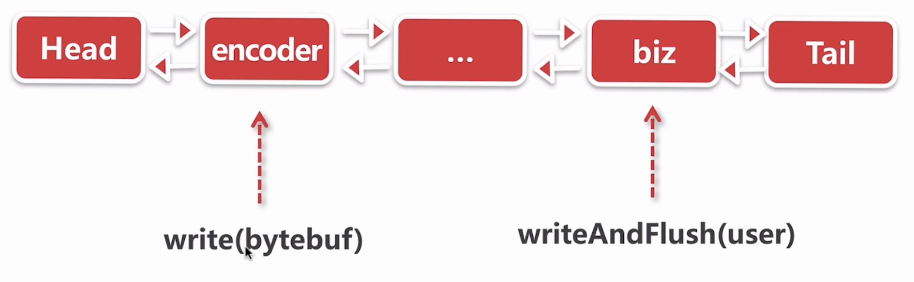
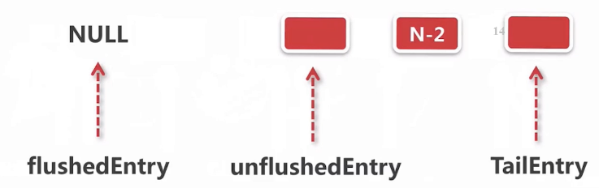
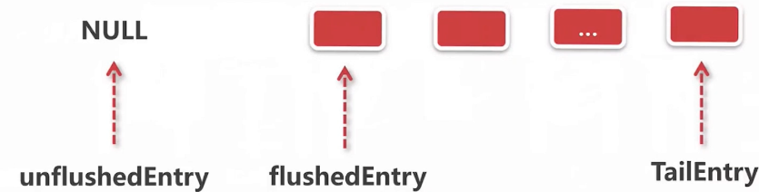

如何把对象变成字节流,最终写到Socket底层?

# writeAndFlush()



重要的ChannelHandler

- **biz**:生成一个对象,调用writeAndFlush写出去
- **encoder**:对该对象进行编码 

### 示例代码

```java
ServerBootstrap b = new ServerBootstrap();
b.group(bossGroup, workerGroup).channel(NioServerSocketChannel.class).childHandler(new ChannelInitializer<SocketChannel>() {
    @Override
    public void initChannel(SocketChannel ch) {
        ch.pipeline().addLast(new Encoder());
        ch.pipeline().addLast(new BizHandler());
    }
});
```

这里定义的BizHandler如下:

```java
public class BizHandler extends ChannelInboundHandlerAdapter {
    @Override
    public void channelRead(ChannelHandlerContext ctx, Object msg) throws Exception {
        User user = new User(19, "zhangsan");
        ctx.channel().writeAndFlush(user);
    }
}
```

Encoder如下:
MessageToByteEncoder表示把Message(User)转成Byte.覆盖encode方法去转换

```java
public class Encoder extends MessageToByteEncoder<User> {
    @Override
    protected void encode(ChannelHandlerContext ctx, User user, ByteBuf out) throws Exception {

        byte[] bytes = user.getName().getBytes();
        out.writeInt(4 + bytes.length);//ageLen + nameLen
        out.writeInt(user.getAge());
        out.writeBytes(bytes);
    }
}
```

Encoder的结果:

```java
 * ---------------------
 *|   4    |  4  |  ?   |
 * ---------------------
 *| length | age | name |
 * ---------------------
```

通过上章学习的长度域解码器就能解码.
**问题,这个`ByteBuf out`是从哪来的.又如何通过`out.writeBytes(bytes);`写入socket底层?**

## writeAndFlush()处理步骤

1. 从tail节点开始往前传播
2. 逐个 调用channelHandler的write方法
3. 逐个调用channelHandler的flush方法
   写到socket底层

### 1.从tail节点开始往前传播

跟到`BizHandler` 的`ctx.channel().writeAndFlush(user);`步骤

```java
//io.netty.channel.AbstractChannel#writeAndFlush(java.lang.Object)    
@Override
public ChannelFuture writeAndFlush(Object msg) {
    return pipeline.writeAndFlush(msg);
}
//io.netty.channel.DefaultChannelPipeline#writeAndFlush(java.lang.Object)
@Override
public final ChannelFuture writeAndFlush(Object msg) {
    return tail.writeAndFlush(msg);
}
```

它会调用`tail`节点,从它开始`writeAndFlush`,继续往下看,最终调用下面:

```java
//io.netty.channel.AbstractChannelHandlerContext#write(java.lang.Object, boolean, io.netty.channel.ChannelPromise)
private void write(Object msg, boolean flush, ChannelPromise promise) {//flush = true
    AbstractChannelHandlerContext next = findContextOutbound();
    final Object m = pipeline.touch(msg, next);
    EventExecutor executor = next.executor();
    if (executor.inEventLoop()) {//是否是本地线程调用
        if (flush) {//true
            next.invokeWriteAndFlush(m, promise);//
        } else {
            next.invokeWrite(m, promise);
        }
    } else {//非本地线程,封装成task,放到task queue中
        AbstractWriteTask task;
        if (flush) {
            task = WriteAndFlushTask.newInstance(next, m, promise);
        }  else {
            task = WriteTask.newInstance(next, m, promise);
        }
        safeExecute(executor, task, promise, m);
    }
}
```

跟踪`next.invokeWriteAndFlush(m, promise);`的步骤:

```java
//io.netty.channel.AbstractChannelHandlerContext#invokeWriteAndFlush
    private void invokeWriteAndFlush(Object msg, ChannelPromise promise) {
        if (invokeHandler()) {
            invokeWrite0(msg, promise);//前面分析的第二步
            invokeFlush0();//前面分析的第三步
        } else {
            writeAndFlush(msg, promise);
        }
    }
```

而当flush=false的时候它只会进行第二步的`invokeWrite0(msg, promise);`

### 2.逐个 调用channelHandler的write方法

先分析`invokeWrite0`:

```java
    private void invokeWrite0(Object msg, ChannelPromise promise) {
        try {
            //在pipeline中的每个ChannelHandler进行传播,调用他们的write方法
            ((ChannelOutboundHandler) handler()).write(this, msg, promise);
        } catch (Throwable t) {
            notifyOutboundHandlerException(t, promise);
        }
    }
```

传播过程中会到我们自己编写的`Encoder`.`Encoder`它本身是没有重写`write`,所以调用的是他父类`MessageToByteEncoder `的:

```java
//io.netty.handler.codec.MessageToByteEncoder#write
    @Override
    public void write(ChannelHandlerContext ctx,
                      Object msg,//从BizHandler传入的User对象
                      ChannelPromise promise) throws Exception {
        ByteBuf buf = null;
        try {
            if (acceptOutboundMessage(msg)) { 
                I cast = (I) msg;
                buf = allocateBuffer(ctx, cast, preferDirect);
                try {
                    encode(ctx, cast, buf);//抽象方法,在Encoder中重写了
                } finally {
                    ReferenceCountUtil.release(cast);
                }

                if (buf.isReadable()) {
                    ctx.write(buf, promise);
                } else {
                    buf.release();
                    ctx.write(Unpooled.EMPTY_BUFFER, promise);
                }
                buf = null;
            } else {
                ctx.write(msg, promise);
            }
            ...
    }
```

这里`encode`的细节待会会涉及到.

### 3.逐个调用channelHandler的flush方法

再看刚才的`invokeFlush0();`步骤,它的传播方式与`write`类似

```java
    private void invokeFlush0() {
        try {
            ((ChannelOutboundHandler) handler()).flush(this);
        } catch (Throwable t) {
            notifyHandlerException(t);
        }
    }
```

通常情况下这个`flush()`不会被覆盖,包括我们用于`encode`的`MessageToByteEncoder`.它会一直传播直到`head`节点

整理一下:

- 对`User`调用`write`时,会从tail一直往下传播,中途我们自己写的`encoder`会把`User`对象取出来进行一系列操作,最后传给`Head`节点.`Head`节点也会进行一些处理
- 对`User`调用`flush`时,会从tail一直往下传播,中途不会有人插手,直到传给`Head`节点.`Head`节点会进行一些处理

# 编码器处理逻辑:MessageToByteEncoder

本节分析`write()`.`MessageToByteEncoder`用于把对象变成字节.

`wtite()`的步骤:

1. **匹配对象**
   是否能处理User对象,不过不能就扔到下一个处理器.
2. **内存分配**
   在内存中开辟一块空间给ByteBuf
3. **编码实现**
   也就是去执行`Encoder`中覆盖的`encode()`.可以实现自定义的协议,示例中用的就是基于长度域的协议
4. **释放对象**
   转换成ByteBuf后,对原有的对象进行释放
5. **传播数据**
   把编码后的二进制数据包往前进行传播
6. **释放内存**
   发生异常时对这块分配的ByteBuf进行释放

```java
//io.netty.handler.codec.MessageToByteEncoder#write
    @Override
    public void write(ChannelHandlerContext ctx,
                      Object msg,//从BizHandler传入的User对象
                      ChannelPromise promise) throws Exception {
        ByteBuf buf = null;
        try {
            if (acceptOutboundMessage(msg)) { //1.是否能处理User对象
                I cast = (I) msg;
                buf = allocateBuffer(ctx, cast, preferDirect);//2.内存分配
                try {
                    encode(ctx, cast, buf);//3.编码实现
                } finally {
                    ReferenceCountUtil.release(cast);//4.释放对象
                }

                if (buf.isReadable()) {
                    ctx.write(buf, promise);//5.传播数据
                } else {//encode没有传进数据,也就是失败了.把buf进行释放
                    buf.release();
                    ctx.write(Unpooled.EMPTY_BUFFER, promise);
                }
                buf = null;//把buf设为空
            } else {
                //不能处理该对象,往前传播
                ctx.write(msg, promise);
            }
            ..
 		finally {
            if (buf != null) {
                buf.release();//6.发生异常,释放内存
            }
        }
    }
```

### 1.匹配对象

调用下面判断是否能处理User对象

```java
//io.netty.handler.codec.MessageToByteEncoder#acceptOutboundMessage
public boolean acceptOutboundMessage(Object msg) throws Exception {
    return matcher.match(msg);
}
```

它会通过反射进行判断

```java
@Override//io.netty.util.internal.TypeParameterMatcher.ReflectiveMatcher#match
public boolean match(Object msg) {
    return type.isInstance(msg);//Class<?> type
}
```

### 2.内存分配

`write()`中的`buf = allocateBuffer(ctx, cast, preferDirect);`进行内存分配

```java
//io.netty.handler.codec.MessageToByteEncoder#allocateBuffer
protected ByteBuf allocateBuffer(ChannelHandlerContext ctx,
                                 I msg,//User
                                 boolean preferDirect) throws Exception {
    if (preferDirect) {//是否分配堆外内存,默认true
        return ctx.alloc().ioBuffer();
    } else {
        return ctx.alloc().heapBuffer();
    }
}
```

### 3.编码实现

通过`encode(ctx, cast, buf);`调用在`Encoder`中自定义重写的方法:

```java
//com.imooc.netty.ch9.Encoder#encode
@Override
protected void encode(ChannelHandlerContext ctx, User user, ByteBuf out) throws Exception {

    byte[] bytes = user.getName().getBytes();
    out.writeInt(4 + bytes.length);//ageLen + nameLen
    out.writeInt(user.getAge());
    out.writeBytes(bytes);
}
```

### 4.释放对象

下一步通过`ReferenceCountUtil.release(cast);`释放对象

```java
//io.netty.util.ReferenceCountUtil#release(java.lang.Object)
public static boolean release(Object msg) {
    if (msg instanceof ReferenceCounted) {
        return ((ReferenceCounted) msg).release();
    }
    return false;
}
```

### 5.传播数据

调用`ctx.write(buf, promise);`,把二进制数据往前扔,直到`Head`节点,他负责把数据写到socket底层

### 6.释放内存

如果中途出现异常,最后在`finally`块中对buf进行释放

```java
} finally {
    if (buf != null) {//try块未完成时
        buf.release();
    }
}
```

# write-写buffer队列

编码完成后会把包含二进制数据的ByteBuf传播到head的`write()`

**write-写buffer队列**的步骤

1. direct化ByteBuf
2. 插入写队列.
   封装成entry插入到写队列.通过指针标示ByteBuf的状态
3. 设置写状态
   还能写多少?

```java
//io.netty.channel.DefaultChannelPipeline.HeadContext#write
@Override
public void write(ChannelHandlerContext ctx, Object msg, ChannelPromise promise) throws Exception {
    unsafe.write(msg, promise);
}
---
//io.netty.channel.AbstractChannel.AbstractUnsafe#write
public final void write(Object msg,//包含User数据的ByteBuf
                        ChannelPromise promise) {
    assertEventLoop();

    ChannelOutboundBuffer outboundBuffer = this.outboundBuffer;//负责缓冲写入的ByteBuf
..
    int size;
    try {
        msg = filterOutboundMessage(msg);//1.direct化ByteBuf
        size = pipeline.estimatorHandle().size(msg);
        if (size < 0) {
            size = 0;
        }
    } catch (Throwable t) {
        safeSetFailure(promise, t);
        ReferenceCountUtil.release(msg);
        return;
    }

    outboundBuffer.addMessage(msg, size, promise);//2.设置写状态
}
```

### 1.direct化ByteBuf

看一下`filterOutboundMessage(msg)`如何direct化ByteBuf

```java
//io.netty.channel.nio.AbstractNioByteChannel#filterOutboundMessage
@Override
protected final Object filterOutboundMessage(Object msg) {
    if (msg instanceof ByteBuf) //true
        ByteBuf buf = (ByteBuf) msg;
        if (buf.isDirect()) {//已经是对外内存
            return msg;
        }

        return newDirectBuffer(buf);//创建成堆外内存
    }
}
```

非对外内存到对外内存的转换

```java
    protected final ByteBuf newDirectBuffer(ByteBuf buf) {
        final int readableBytes = buf.readableBytes();
        if (readableBytes == 0) {//没字节,返回空的buffer
            ReferenceCountUtil.safeRelease(buf);
            return Unpooled.EMPTY_BUFFER;
        }

        final ByteBufAllocator alloc = alloc();
        if (alloc.isDirectBufferPooled()) {
            ByteBuf directBuf = alloc.directBuffer(readableBytes);//创建一个堆外byteBuf
            directBuf.writeBytes(buf, buf.readerIndex(), readableBytes);//把内容写到新创建的byteBuf中
            ReferenceCountUtil.safeRelease(buf);
            return directBuf;
        }
		//和上面一样
        final ByteBuf directBuf = ByteBufUtil.threadLocalDirectBuffer();
        if (directBuf != null) {
            directBuf.writeBytes(buf, buf.readerIndex(), readableBytes);
            ReferenceCountUtil.safeRelease(buf);
            return directBuf;
        }

        // Allocating and deallocating an unpooled direct buffer is very expensive; give up.
        return buf;
    }
```

### 2.插入写队列

通过`outboundBuffer.addMessage(msg, size, promise)`把刚才创建的堆外内存插入到`outboundBuffer`,也就是写的缓冲区中

它里边包含了几个指针,关于这些指针的定义:

```java
// Entry(flushedEntry) --> ... Entry(unflushedEntry) --> ... Entry(tailEntry)
//
// 链表中第一个已经被flush了的entry
private Entry flushedEntry;
// 链表中第一个没有被flush了的entry
private Entry unflushedEntry;
// 尾指针,  
private Entry tailEntry;
```

也就是说前面一段`flush`过的是可以写入Socket的部分,后面则还不能写入.

再看它的`addMessage()`:

```java
//io.netty.channel.ChannelOutboundBuffer#addMessage
public void addMessage(Object msg, int size, ChannelPromise promise) {
    Entry entry = Entry.newInstance(msg, size, total(msg), promise);//把堆外buf放入entry
    //通过调整指针大小,更变outboundBuffer的状态
    //Entry(flushedEntry) --> ... Entry(unflushedEntry) --> ... Entry(tailEntry)
    if (tailEntry == null) {//第一次调用write.flush过的为空,没flush的只有当前entry.
        flushedEntry = null;
        tailEntry = entry;
    } else {//非第一次调用,在尾部添加
        Entry tail = tailEntry;
        tail.next = entry;
        tailEntry = entry;
    }
    if (unflushedEntry == null) {
        unflushedEntry = entry;
    }

    incrementPendingOutboundBytes(size, false);//3.设置写状态
}
```

第一次调用write:


第N次调用:



### 3.设置写状态

同样在`#addMessage`里设置写状态

```java
//io.netty.channel.ChannelOutboundBuffer#addMessage
public void addMessage(Object msg, int size, ChannelPromise promise) {
	..2.插入写队列
    incrementPendingOutboundBytes(size, false);//3.设置写状态
}
```

目的是统计当前有多少直接需要被写出 

```java
//io.netty.channel.ChannelOutboundBuffer#incrementPendingOutboundBytes(long, boolean)
private void incrementPendingOutboundBytes(long size, boolean invokeLater) {
	//计算当前缓冲区中的字节加上这一次的长度
    long newWriteBufferSize = TOTAL_PENDING_SIZE_UPDATER.addAndGet(this, size);
    //要写出的字节大小是否超出限制 ,默认 是64K
    if (newWriteBufferSize > channel.config().getWriteBufferHighWaterMark()) {
        setUnwritable(invokeLater);
    }
}
```

如果要写出的大小超过64K

```java
//io.netty.channel.ChannelOutboundBuffer#setUnwritable
private void setUnwritable(boolean invokeLater) {
    for (;;) {
        final int oldValue = unwritable;
        final int newValue = oldValue | 1;
        if (UNWRITABLE_UPDATER.compareAndSet(this, oldValue, newValue)) {
            if (oldValue == 0 && newValue != 0) {
                //传播到channelHandler里面, 告诉他不能写
                fireChannelWritabilityChanged(invokeLater);
            }
            break;
        }
    }
}
```

也就是说如果要写出的大小超过64K,就传播到channelHandler里面, 告诉现在不可写

# flush-刷新buffer队列

步骤:

1. 添加刷新标志并设置写状态
   移动指针,如果之前因为超过64K而设置了不可写,这里要设置成可写
2.   遍历buffer队列,过滤ByteBuf
3. 调用jdk底层api进行自旋写

```java
//io.netty.channel.DefaultChannelPipeline.HeadContext#flush
@Override
public void flush(ChannelHandlerContext ctx) throws Exception {
    unsafe.flush();
}
---
    //io.netty.channel.AbstractChannel.AbstractUnsafe#flush
    @Override
    public final void flush() {
    assertEventLoop();

    ChannelOutboundBuffer outboundBuffer = this.outboundBuffer;
    if (outboundBuffer == null) {
        return;
    }

    outboundBuffer.addFlush();//1.添加刷新标志并设置写状态
    flush0();//2.3.
}
```

### 1.添加刷新标志并设置写状态

这一步是调用` outboundBuffer.addFlush();`:

```java
//io.netty.channel.ChannelOutboundBuffer#addFlush
public void addFlush() {
    Entry entry = unflushedEntry;//未flush部分的开头
    if (entry != null) {//true
        if (flushedEntry == null) {
            //指向第一个entry
            flushedEntry = entry;
        }
        do {
            flushed ++;//计数,有多少个flush对象
            if (!entry.promise.setUncancellable()) {

                int pending = entry.cancel();
                decrementPendingOutboundBytes(pending, false, true);//设置写状态
            }
            entry = entry.next;
        } while (entry != null);

        //把未flush的部分设置为null
        unflushedEntry = null;
    }
}
```

下面就是设置写状态,和之前write时的过程相反.

```java
//io.netty.channel.ChannelOutboundBuffer#decrementPendingOutboundBytes(long)
private void decrementPendingOutboundBytes(long size, boolean invokeLater, boolean notifyWritability) {
    if (size == 0) {
        return;
    }

    //从总大小减去flush的大小
    long newWriteBufferSize = TOTAL_PENDING_SIZE_UPDATER.addAndGet(this, -size);
    //如果他已经小到某个阈值就设置写状态,默认32K.
    if (notifyWritability && newWriteBufferSize < channel.config().getWriteBufferLowWaterMark()) {
        setWritable(invokeLater);//此时改为可写
    }
}
```

也就是说缓存的大小大于64K时设置为不可写,小于32K时又设置为可写

此时的状态如下图:



### 2.遍历buffer队列,过滤ByteBuf,3.调用jdk底层api进行自旋写

第2步和3步是在`flush0();`中进行,它又会调用下面的`io.netty.channel.nio.AbstractNioByteChannel#doWrite`

```java
//io.netty.channel.nio.AbstractNioByteChannel#doWrite
protected void doWrite(ChannelOutboundBuffer in) throws Exception {
    int writeSpinCount = -1;

    boolean setOpWrite = false;
    for (;;) {
        //2.遍历buffer队列,过滤ByteBuf
        //获取flushedEntry位置的entry,也就是当前要flush的第一个entry
        Object msg = in.current();
        ...
            //3.调用jdk底层api进行自旋写
        if (msg instanceof ByteBuf) {//true
            ByteBuf buf = (ByteBuf) msg;
            int readableBytes = buf.readableBytes();
            if (readableBytes == 0) {//没有可写的
                in.remove();
                continue;
            }

            boolean done = false;
            long flushedAmount = 0;
            //自旋锁
            if (writeSpinCount == -1) {
                //并发编程中使用自旋锁可以提高内存使用率
                writeSpinCount = config().getWriteSpinCount();//默认16
            }
            for (int i = writeSpinCount - 1; i >= 0; i --) {
                int localFlushedAmount = doWriteBytes(buf);//这一步把buf写到socket 
                //此时localFlushedAmount = 刚才写出了多少字节
                if (localFlushedAmount == 0) {
                    setOpWrite = true;
                    break;
                }

                flushedAmount += localFlushedAmount;
                if (!buf.isReadable()) {//buf已经全部写入socket了
                    done = true;
                    break;
                }
            }

            in.progress(flushedAmount);

            if (done) {
                in.remove();//把flushEntry移到后面一个
            } else {
                // Break the loop and so incompleteWrite(...) is called.
                break;
            }
        }
    }
    incompleteWrite(setOpWrite);
}
```


分析`int localFlushedAmount = doWriteBytes(buf);`那一步,此时把buf写到socket的:

```java
//io.netty.channel.socket.nio.NioSocketChannel#doWriteBytes
protected int doWriteBytes(ByteBuf buf) throws Exception {
    final int expectedWrittenBytes = buf.readableBytes();
    return buf.readBytes(javaChannel(),//jdk原生channel
                         expectedWrittenBytes);//buf的可读字节数
}
```

此时默认情况下是`PooledDirectByteBuf`

```java
//io.netty.buffer.PooledDirectByteBuf#readBytes(java.nio.channels.GatheringByteChannel, int)
@Override
public int readBytes(GatheringByteChannel out, int length) throws IOException {
    checkReadableBytes(length);
    int readBytes = getBytes(readerIndex,//读指针
                             out,//JDK原生Channel
                             length,//buf的可读字节数
                             true);
    readerIndex += readBytes;//更新写指针
    return readBytes;
}
```


```java
//io.netty.buffer.PooledDirectByteBuf#getBytes(int, java.nio.channels.FileChannel, long, int, boolean)
private int getBytes(int index, FileChannel out, long position, int length, boolean internal) throws IOException {
    //获取JDK的ByteBuffer,internal = true
    ByteBuffer tmpBuf = internal ? internalNioBuffer() : memory.duplicate();
    index = idx(index);
    tmpBuf.clear().position(index).limit(index + length);//设置读指针
    return out.write(tmpBuf, position);//调用JDK原生Channel的write写出JDK的ByteBuffer,也就是写到socket
    //返回已经写掉多少字节
}
```

# 总结

**如何把对象变成字节流,最终写到Socket底层?**

1.  自定义的ChannelHandler通过writeAndFlush(user),试图写出
2. write(user)这一步会从Tail往前传播,到我们自定义的`Encoder`,`Encoder`把user转成2进制数据并放入堆外bytebuf向前传播
3. head拿到这个bytebuf后暂时把他保存到一个缓存中,缓存是链表结构
4. 之后,flush()会从Tail往前传播,直到head
5. head把当前缓存中的ByteBuf转换成JDK的ByteBuf,然后通过JDK底层API和自旋锁输出到底层Channel,也就是socket