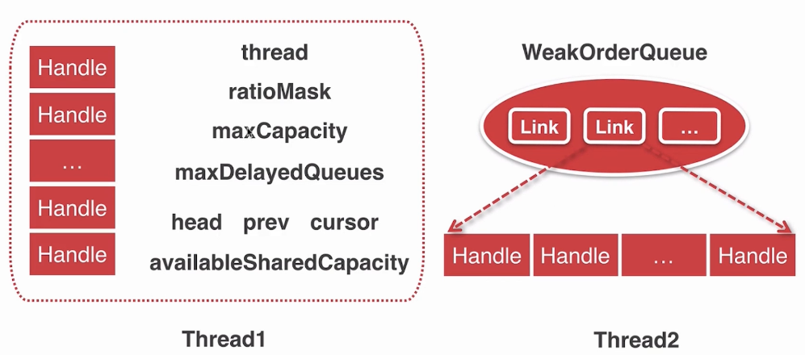
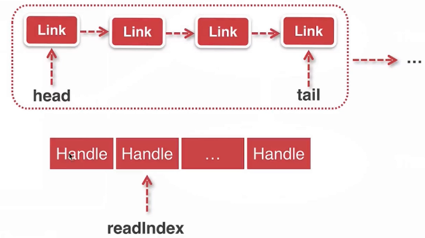
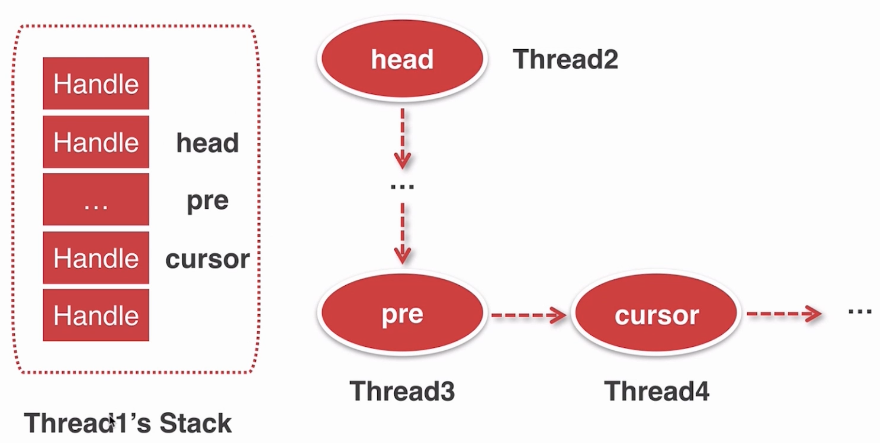
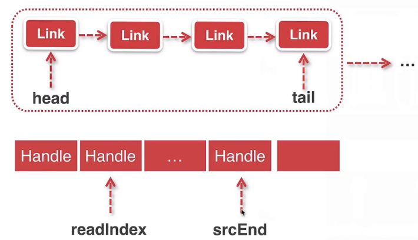

# 轻量级对象池Recycler

如果recycler中有对象就能复用,不用每次都去new.

基于`FastThreadLocal`
好处:

- 减少内存使用
- 减少GC频率

## Recycler使用

示例程序:

```java
public class RecycleTest {
    private static final Recycler<User> RECYCLER = new Recycler<User>() {
        @Override
        protected User newObject(Handle<User> handle) {
            //没有对象可以拿出来直接用的时候.
            return new User(handle);
        }
    };

    private static class User {
        private final Recycler.Handle<User> handle;

        public User(Recycler.Handle<User> handle) {
            this.handle = handle;
        }

        public void recycle() {
            handle.recycle(this);//访问者模式
        }
    }

    public static void main(String[] args) {
        User user = RECYCLER.get();//从对象池拿

        user.recycle();//回收
        RECYCLER.get().recycle();

        User user1 = RECYCLER.get();

        System.out.println(user1 == user);//true
    }
}
```

我们之前在学习ByteBuf的时候,就接触过这个`Recycler`类:

```java
final class PooledDirectByteBuf extends PooledByteBuf<ByteBuffer> {

    private static final Recycler<PooledDirectByteBuf> RECYCLER = 
        new Recycler<PooledDirectByteBuf>() {
        @Override
        protected PooledDirectByteBuf newObject(Handle<PooledDirectByteBuf> handle) {
            return new PooledDirectByteBuf(handle, 0);
        }
    };

    static PooledDirectByteBuf newInstance(int maxCapacity) {
        //allocator中调用的newInstance()实际上也是RECYCLER的复用
        PooledDirectByteBuf buf = RECYCLER.get();
        buf.reuse(maxCapacity);//初始化一些值
        return buf;
    }
```

## Recycler创建

看`io.netty.util.Recycler`的构造函数:

```java
protected Recycler() {
    this(DEFAULT_MAX_CAPACITY_PER_THREAD);
}
```

这个`DEFAULT_MAX_CAPACITY_PER_THREAD`是什么,稍后会讨论.
注意到`Recycler`中有一个`FastThreadLocal`的变量:

```java
private final FastThreadLocal<Stack<T>> threadLocal = new FastThreadLocal<Stack<T>>() {
    @Override
    protected Stack<T> initialValue() {//生成当前线程要在FastThreadLocal中存放的值
        return new Stack<T>(Recycler.this, 
                            Thread.currentThread(), 
                            maxCapacityPerThread, //栈的最大大小,存多少个handle
                            maxSharedCapacityFactor,
                            ratioMask, 	//对象回收的频率
                            maxDelayedQueuesPerThread);//当前线程创建的对象能释放的线程数有多少
        //值 = 1时,只能在Thread2中释放,释放到Thread3就直接扔掉了 
    }
};
```

也就是说这个`FastThreadLocal`,对于每个线程都维护一个`io.netty.util.Recycler.Stack`对象.

**也就是说一个`Recycler`会通过一个`FastThreadLocal`保存该线程私有的对象池**

我们看一下这个线程私有的`Stack`里面的变量默认值:假设当前的线程是Thread1



- `thread` : 当前线程
- `ratioMask`:对象回收的频率
- `maxCapacity`:Stack能存的最大大小,存多少个handle
- `maxDelayedQueues`:当前线程创建的对象能释放的线程数有多少
  如:值 = 1时,Thread1只能在Thread2中释放,释放到Thread3就直接扔掉了 
- `head,pre,cursor`.指向Thread2的那个数组的指针
- `availableSharedCapacity`:Thread1创建的对象能在其他线程里缓存的最大个数

那么些`Stack`的变量的默认值是什么,根据分析,传入的初始值如下注释所示:

```java
private final FastThreadLocal<Stack<T>> threadLocal = new FastThreadLocal<Stack<T>>() {
    @Override
    protected Stack<T> initialValue() {//生成当前线程要在FastThreadLocal中存放的值
        return new Stack<T>(Recycler.this, 
                            Thread.currentThread(), 
                            maxCapacityPerThread, //32k .栈的最大大小,Recyculer能存多少个handle
                            maxSharedCapacityFactor,//2
                            ratioMask, 	//7.对象回收的频率
                            maxDelayedQueuesPerThread);//cpu*2 .当前线程创建的对象能释放的线程数有多少
    }
};

//availableSharedCapacity会初始化为16K (= maxCapacityPerThread/maxSharedCapacityFactor)
```

也就是说当前线程能存32K个,能在别的线程存16K个handler

## 从Recycler获取对象

1. 获取当前线程的Stack
2. 从Stack里面弹出对象,如果弹出的对象不为空则直接返回
3. 如果弹出的对象为空,创建对象并绑定到Stack

从示例程序的`RECYCLER.get()`的步骤开始分析:

```java
//io.netty.util.Recycler#get
public final T get() {
    if (maxCapacityPerThread == 0) {//只有0个对象能放入Stack
        return newObject((Handle<T>) NOOP_HANDLE);//什么都不干
    }
    Stack<T> stack = threadLocal.get();//1.获取线程私有stack
    DefaultHandle<T> handle = stack.pop();//2.从Stack里面弹出对象 
    if (handle == null) {//当前stack为空
        handle = stack.newHandle();//3.创建一个handler
        handle.value = newObject(handle);//handler的value值就是在用户代码中写的部分
    }
    return (T) handle.value;
}
```

分析创建一个handler的`handle = stack.newHandle();步骤`:

```java
//io.netty.util.Recycler.Stack#newHandle
DefaultHandle<T> newHandle() {
    return new DefaultHandle<T>(this);//this = 当前stack
}
```

因此客户端可以调用`handle.recycle()`让管理它的Stack回收

再看一下它从stack中`pop()`的过程:

```java
//io.netty.util.Recycler.Stack#pop
DefaultHandle<T> pop() {
    int size = this.size;//stack中存的对象数
    if (size == 0) {
        if (!scavenge()) {//可能释放到其他线程了,跑去其他线程把这些对象给捞回来
            return null;
        }
        size = this.size;
    }
    size --;
    DefaultHandle ret = elements[size];
    elements[size] = null;
    if (ret.lastRecycledId != ret.recycleId) {
        throw new IllegalStateException("recycled multiple times");
    }
    //表示这个对象已经被拿出
    ret.recycleId = 0;
    ret.lastRecycledId = 0;
    this.size = size;
    return ret;
}
```


## 回收对象到Recycler

需要考虑两方面:

- 同线程回收对象
- 异线程回收对象

看示例程序的`user.recycle();`也就是`handle.recycle(this)`方法:

```java
//io.netty.util.Recycler.DefaultHandle#recycle
public void recycle(Object object) {
    if (object != value) {
        throw new IllegalArgumentException("object does not belong to handle");
    }
    stack.push(this);
}
```

`stack.push(this);`的细节:

```java
//io.netty.util.Recycler.Stack#push
void push(DefaultHandle<?> item) {
    Thread currentThread = Thread.currentThread();
    if (thread == currentThread) {//是否是创建stack时的线程

        pushNow(item);//同线程回收对象,直接放入stack
    } else {
        // 异线程回收对象
        pushLater(item, currentThread);
    }
}
```

### 同线程回收对象

先分析创建stack时的线程进行回收时调用的`pushNow(item);`:

```java
//io.netty.util.Recycler.Stack#pushNow
private void pushNow(DefaultHandle<?> item) {
    if ((item.recycleId | item.lastRecycledId) != 0) {//初次=0
        throw new IllegalStateException("recycled already");
    }
    item.recycleId = item.lastRecycledId = OWN_THREAD_ID;

    int size = this.size;
    if (size >= maxCapacity || //达到能存放的对象的上限了(32K)
        dropHandle(item)) {//是否不满足回收频率
        //丢弃这个对象
        return;
    }
    if (size == elements.length) {//扩容
        elements = Arrays.copyOf(elements, min(size << 1, maxCapacity));
    }

    elements[size] = item;
    this.size = size + 1;
}
```

### 异线程回收对象

分析线程试图回收非自己创建的对象时调用的`pushLater(item, currentThread);`

步骤:

1. 获取`WeakOrderQueue`,用于回收在异线程创建的对象

2. 首次获取不到`WeakOrderQueue`,创建`WeakOrderQueue`

   把`Thread1`的Stack和`Tread2`的`WeakOrderQueue`进行绑定

3. 将对象追加到`WeakOrderQueue`

下面开始跟踪源码

```java
//io.netty.util.Recycler.Stack#pushLater
private void pushLater(DefaultHandle<?> item, Thread thread) {
    // DELAYED_RECYCLED也是个FastThreadLocal它的元素是:Map<Stack<?>, WeakOrderQueue>类型
    Map<Stack<?>, WeakOrderQueue> delayedRecycled = DELAYED_RECYCLED.get();
    //也就是说不同的stack对应了不同的WeakOrderQueue,一个Stack对应一个线程.
    WeakOrderQueue queue = delayedRecycled.get(this);//1.拿到属于创建Stack的线程的WeakOrderQueue
    if (queue == null) {//Thread2从未回收过Thread1创建的对象
        if (delayedRecycled.size() >= maxDelayedQueues) {
            // > 16K了,不能再回收其他线程创建的对象了
            // 传入把当前Stack对应的value设置为DUMMY,和下面对应
            delayedRecycled.put(this, WeakOrderQueue.DUMMY);
            //丢弃
            return;
        }
		//2.创建WeakOrderQueue,this = Thread1的stack,thread = Thread2.进行绑定
        if ((queue = WeakOrderQueue.allocate(this, thread)) == null) {
            // drop object
            return;
        }
        delayedRecycled.put(this, queue);//与当前stack进行绑定
    } else if (queue == WeakOrderQueue.DUMMY) {//如果是DUMMY,表示这个WeakOrderQueue已经满了
        //丢弃
        return;
    }

    queue.add(item);//3.将对象追加到WeakOrderQueue
}
```


看一下创建的`WeakOrderQueue`的部分:

```java
//io.netty.util.Recycler.WeakOrderQueue#allocate
static WeakOrderQueue allocate(Stack<?> stack, Thread thread) {
    //当前stack是否允许在外部线程分配LINK_CAPACITY大小的空间.(availableSharedCapacity=16K)
    return reserveSpace(stack.availableSharedCapacity, LINK_CAPACITY)
        ? new WeakOrderQueue(stack, thread) //允许
        : null;//不允许,丢弃
}
```

允许则通过` new WeakOrderQueue(stack, thread)`创建

先看一下`WeakOrderQueue`的结构




- 每个Link都包括Handler数组

- head指向第一个link,tail指向最后一个link
- next指向下一个WeakOrderQueue,也就是其他线程的WeakOrderQueue

- 一个link的的大小是16,也就是说Handler数组的长度为16.目的是减少管理的次数

它的构造函数:

```java
//io.netty.util.Recycler.WeakOrderQueue#WeakOrderQueue(io.netty.util.Recycler.Stack<?>, java.lang.Thread)
private WeakOrderQueue(Stack<?> stack, Thread thread) {
    head = tail = new Link();
    owner = new WeakReference<Thread>(thread);
    synchronized (stack) {
        next = stack.head;
        stack.head = this;
    }
io.netty.util.Recycler.Stack#pushLater
    availableSharedCapacity = stack.availableSharedCapacity;
}
```

第三步是调用当前线程的`WeakOrderQueue`的`add(handler)`去添加handler

```java
//io.netty.util.Recycler.WeakOrderQueue#add
void add(DefaultHandle<?> handle) {
    handle.lastRecycledId = id;

    Link tail = this.tail;//拿到尾指针
    int writeIndex;
    if ((writeIndex = tail.get()) == LINK_CAPACITY) {//当前link已经超出长度了
        if (!reserveSpace(availableSharedCapacity, LINK_CAPACITY)) {
            //超出当前stack允许在外部分配的空间
            return;
        }
        //stack允许继续分配,新加一个Link
        this.tail = tail = tail.next = new Link();

        writeIndex = tail.get();//0
    }
    tail.elements[writeIndex] = handle;//追加
    handle.stack = null;//这个handle已经不属于这个stack了

    tail.lazySet(writeIndex + 1);
}
```

## 从Recycler获取对象

在前面的小节中,我们提到了从Recycler获取对象时会从`stack`pop出一个对象

```java
//io.netty.util.Recycler.Stack#pop
DefaultHandle<T> pop() {
    int size = this.size;//stack中存的对象数
    if (size == 0) {
        if (!scavenge()) {//可能释放到其他线程了,跑去其他线程把这些对象给捞回来
            return null;
        }
        size = this.size;
    }
    size --;
    DefaultHandle ret = elements[size];
    elements[size] = null;
    if (ret.lastRecycledId != ret.recycleId) {
        throw new IllegalStateException("recycled multiple times");
    }
    //表示这个对象已经被拿出
    ret.recycleId = 0;
    ret.lastRecycledId = 0;
    this.size = size;
    return ret;
}
```

其中讲到当本线程的stack为空时,如果有释放到其他线程的handle,就跑去其他线程把这些对象给捞回来

分析一下这一步:



- head指向首次放入到其他线程时创建的`WeakOrderQueue`
- cursor指针指向当前想获取的位置
- pre是指向cursor的前一个节点

它是通过`scavenge()`来完成从`WeakOrderQueue`捞回的:

```java
//io.netty.util.Recycler.Stack#scavenge
boolean scavenge() {
    if (scavengeSome()) {
        return true;//回收成功
    }
    // reset
    prev = null;
    cursor = head;//表示下次从头部开始回收
    return false;//回收失败
}
```

它会调用`scavengeSome()`:

```java
//io.netty.util.Recycler.Stack#scavengeSome
boolean scavengeSome() {
    WeakOrderQueue cursor = this.cursor;//当前需要回收的Queue
    if (cursor == null) {
        cursor = head;
        if (cursor == null) {
            return false;//没有与当前栈关联的Queue
        }
    }

    boolean success = false;
    WeakOrderQueue prev = this.prev;
    do {
        if (cursor.transfer(this)) {//把Queue中的元素传输到当前stack
            success = true;
            break;
        }
		//拿到cursor的下一个节点,图中Thread4的下一个节点
        WeakOrderQueue next = cursor.next;
        if (cursor.owner.get() == null) {//owner = 与这个WeakOrderQueue关联的线程,也就是Thread4
            //Thread4已经不存在了,进行清理工作  
            if (cursor.hasFinalData()) {
                //如果有数据,全传输到当前stack
                for (;;) {
                    if (cursor.transfer(this)) {//它一次值传输一个link 
                        success = true;
                    } else {
                        break;
                    }
                }
            }
            //把Thread3的next设为Thread5.把Thread4丢弃
            if (prev != null) {
                prev.next = next;
          `  }
        } else {
            prev = cursor;//Thread4存在,但获取失败, 去看它的下一个节点Thread5
        }

        cursor = next; 

    } while (cursor != null && !success);//直到最后一个Queue节点

    this.prev = prev;
    this.cursor = cursor;
    return success;
}
```

分析把WeakOrderQueue中的一个link传输到当前stack时执行的`cursor.transfer(this)`:



```java
//io.netty.util.Recycler.WeakOrderQueue#transfer
boolean transfer(Stack<?> dst) {
    Link head = this.head;
    if (head == null) {
        return false;
    }

    if (head.readIndex == LINK_CAPACITY) {//所有link都已经被取走了
        if (head.next == null) {
            return false;
        }
        this.head = head = head.next;//去下一个link
    }

    final int srcStart = head.readIndex;
    int srcEnd = head.get();//表示了当前link中有多少对象
    final int srcSize = srcEnd - srcStart;//要传输多少个对象
    if (srcSize == 0) {
        return false;
    }

    final int dstSize = dst.size;
    final int expectedCapacity = dstSize + srcSize;//传输时需要多少容量

    if (expectedCapacity > dst.elements.length) {
        //进行扩容 
        final int actualCapacity = dst.increaseCapacity(expectedCapacity);
        srcEnd = min(srcStart + actualCapacity - dstSize, srcEnd);
    }

    if (srcStart != srcEnd) {
        final DefaultHandle[] srcElems = head.elements;//当前link的数组
        final DefaultHandle[] dstElems = dst.elements;//当前stack的数组
        int newDstSize = dstSize;
        //把一个个元素复制到stack数组里 
        for (int i = srcStart; i < srcEnd; i++) {
            DefaultHandle element = srcElems[i];
            if (element.recycleId == 0) {
                element.recycleId = element.lastRecycledId;
            } else if (element.recycleId != element.lastRecycledId) {
                throw new IllegalStateException("recycled already");
            }
            srcElems[i] = null;//把link对应的设置为null

            if (dst.dropHandle(element)) {//控制回收频率
                // Drop the object.
                continue;
            }
            element.stack = dst;
            dstElems[newDstSize ++] = element;
        }
		
        if (srcEnd == LINK_CAPACITY && head.next != null) {//当前link后面还有link
            reclaimSpace(LINK_CAPACITY);

            this.head = head.next;
        }

        head.readIndex = srcEnd;
        if (dst.size == newDstSize) {//没有回收到对象
            return false;
        }
        dst.size = newDstSize;
        return true;
    } else {
        // 当前stack已经满了
        return false;
    }
}
```

## 小结

netty提供了一个轻量级对象池Recycler.如果recycler中有对象就能复用,不用每次都去new.

一个Recycler它会包括

- `FastThreadLocal<Stack>`用于存储当前线程分配并回收的对象
- `FastThreadLocal<Map<Stack<?>, WeakOrderQueue>>`用于存储其他线程创建,当前线程回收的对象
  `<K,V> = <Thread1的Stack,在当前线程里回收到的Thread1分配的对象>`
  `<K,V> = <Thread2的Stack,在当前线程里回收到的Thread2分配的对象>`

获取:

- 当前线程Stack不是空时,返回里面的已回收对象
- 当前Stack为空,可能释放到其他线程了,跑去其他线程从他的WeakOrderQueue里把这些对象给捞回来

回收:
- 回收当前线程自己创建的对象,直接放入stack
- 回收别的线程创建的对象,放入属于那个线程的WeakOrderQueue