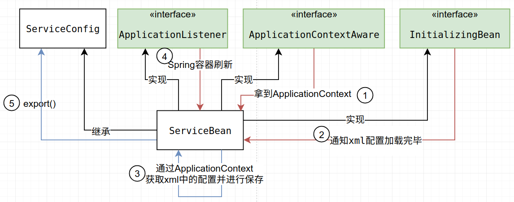
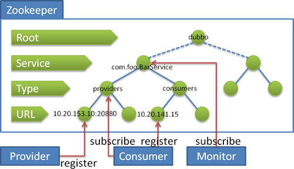
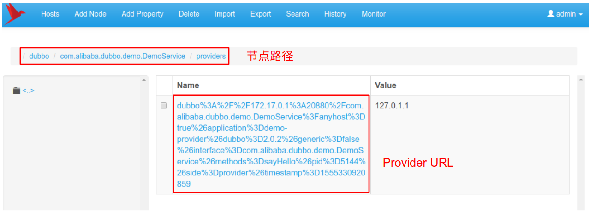
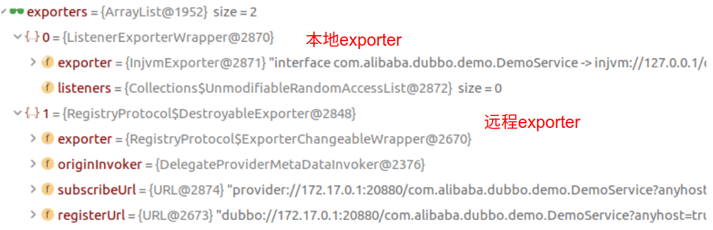

## 前言

Dubbo的核心是URL,但是实际调用时出现的URL数量实在是太多了,读源码的时候分不清是哪个,也不知道所谓的URL中到底存了哪些配置.因此,在这几篇文章中,我会对官方Demo的运行过程进行跟踪,从而深入理解Dubbo的原理.

文章中运行的是官方的Demo:

https://github.com/apache/incubator-dubbo/tree/dubbo-2.6.4/dubbo-demo

Demo中采用的注册中心是multicast的方式,但dubbo更提倡把zookeeper作为注册中心.所以我把

dubbo-demo-consumer/src/main/resources/META-INF/spring/dubbo-demo-consumer.xml

dubbo-demo-provider/src/main/resources/META-INF/spring/dubbo-demo-provider.xml中的`<dubbo:registry>`标签替换成了以下:

```xml
<dubbo:registry address="zookeeper://127.0.0.1:2181"/>
```

> 推荐阅读:
>
> https://dubbo.incubator.apache.org/zh-cn/
>
> https://segmentfault.com/blog/dubboanalysis

## xml的解析

当编写dubbo的xml的时候首先会注意到的是,它与普通的spring的`<bean>`不同,用的是`<dubbo:application>`这种配置方式.

这一部分是如何解析并处理的呢?源码就不具体看了.官方文档给出了简单的介绍:

https://dubbo.incubator.apache.org/zh-cn/docs/dev/implementation.html

## Provider启动


Provider的启动过程可以分成三个部分

1. 前置工作
   对配置进行检查 组装URL

2. 导出服务

   Dubbo 服务导出过程始于 Spring 容器发布刷新事件.
   包含导出服务到本地 (JVM)，和导出服务到远程两个过程

3. 向注册中心注册服务
   用于服务发现。

## 前置工作



上图描述了从前置工作的过程.

1. ServiceBean实现了`ApplicationContextAware`.所以它可以通过`ServiceBean#setApplicationContext`方法获取到`ApplicationContext`.把它保存到`ServiceBean`的变量中

2. 当xml配置加载完毕时`ServiceBean#afterPropertiesSet`会被Spring调用.

3. 这时再从`ApplicationContext`获取xml配置的内容.把它们保存到`ServiceBean`的变量中
   此时会拿到如下配置:

   ```properties
   applicationConfig = <dubbo:application name="demo-provider" id="demo-provider" />
   registries[0] = <dubbo:registry address="zookeeper://127.0.0.1:2181" id="com.alibaba.dubbo.config.RegistryConfig" />
   protocols[0] = <dubbo:protocol name="dubbo" port="20880" id="dubbo" />
   path = com.alibaba.dubbo.demo.DemoService
   ```

4. 当Spring容器发布刷新事件时`ServiceBean#onApplicationEvent`被调用.

5. 在里面调用`export()`方法,开始服务导出的过程.

# 服务导出

服务到处的重点是从`ServiceConfig#doExportUrls`开始:

```java
//com.alibaba.dubbo.config.ServiceConfig#doExportUrls
private void doExportUrls() {
    //获取服务中心URL
    List<URL> registryURLs = loadRegistries(true);
    //protocols[0] = <dubbo:protocol name="dubbo" port="20880" id="dubbo" />
    for (ProtocolConfig protocolConfig : protocols) {
        doExportUrlsFor1Protocol(protocolConfig, registryURLs);
    }
}
```

第一步是获取服务中心URL,它会根据在xml中获取到的服务中心配置,也就是保存到registries变量的基础上进行URL的构建.

此时registries变量的值如下

```properties
registries[0] = <dubbo:registry address="zookeeper://127.0.0.1:2181" id="com.alibaba.dubbo.config.RegistryConfig" />
```

在注册中心地址`zookeeper://127.0.0.1:2181`的基础上开始URL的构建,过程在`AbstractInterfaceConfig#loadRegistries`中.步骤如下:

```
拿到注册中心地址 zookeeper://127.0.0.1:2181
加入application标签的配置 : "application" -> "demo-provider"和"qos.port" -> "22222"
加入path,这里的Path是RegistryService : "path" -> "com.alibaba.dubbo.registry.RegistryService"
加入"dubbo" -> "2.0.2"
加入"timestamp" -> "1555308747141"
加入"pid" -> "15632"
加入"protocol" -> "dubbo"
加入注册中心参数 registry=zookeeper
替换协议为registry(url的开头)
```

最终拼出来的注册中心URL为以下:

```
registry://127.0.0.1:2181/com.alibaba.dubbo.registry.RegistryService?
application=demo-provider&
dubbo=2.0.2&
pid=15632&
qos.port=22222&
registry=zookeeper&
timestamp=1555308747141
```

在存在多个注册中心地址的情况下将会为每个注册中心都生成这么一个URL.

得到注册中心地址后就可以进入第二步了:遍历 protocols，并在每个协议下导出服务

## 为每个协议导出服务

这个部分主要是分析`ServiceConfig#doExportUrlsFor1Protocol`方法

由于示例中没有配置`<dubbo:protocol>`,所以只有一个默认protocol,:

```properties
protocols[0] = <dubbo:protocol name="dubbo" port="20880" id="dubbo" />
```

这个方法可以分成三个部分

1. 构建ProviderURL
2. 导出服务到本地,构建exporter
3. 导出服务到远程,构建exporter
4. 保存这些exporter

### 构建ProviderURL

这个部分和构建注册中心时相似.拿到本机地址作为provider的地址,在这个地址上加入需要的参数来构建ProviderURL

构建的ProviderURL如下,host是本机,也就是Provider的地址,port是dubbo的20880.

```
dubbo://172.17.0.1:20880/com.alibaba.dubbo.demo.DemoService? //host为本机地址
anyhost=true&
application=demo-provider&
bind.ip=172.17.0.1& //Provider地址
bind.port=20880& //Provider端口.
dubbo=2.0.2&
generic=false&
interface=com.alibaba.dubbo.demo.DemoService&
methods=sayHello& //如果有多个method,则用逗号分隔
pid=4206&
qos.port=22222&
side=provider&
timestamp=1555313315589
```

### 导出服务到本地,构建exporter

这个部分由`ServiceConfig#exportLocal`完成.第一步还是构建URL,这次只需要在ProviderURL的基础上稍作修改,得到的URL如下:

```
injvm://127.0.0.1/com.alibaba.dubbo.demo.DemoService?	//更改协议头
anyhost=true&
application=demo-provider&
bind.ip=172.17.0.1&
bind.port=20880&
dubbo=2.0.2&
generic=false&
interface=com.alibaba.dubbo.demo.DemoService&
methods=sayHello&
pid=7374&
qos.port=22222&
side=provider&
timestamp=1555313952423
```

然后创建 Invoker， protocol 会在运行时调用 InjvmProtocol 的 export 方法.

### 导出服务到远程,构建exporter

这个部分会调用`RegistryProtocol#export()`.它要做的事情就比较多了

1. 调用 doLocalExport 导出服务,其实就是创建netty服务器
2. 向注册中心注册服务
3. 向注册中心进行订阅 override 数据 // 这部分不讲
4. 创建并返回 DestroyableExporter // 这部分不讲

顺便说一下这里的参数带入的是wrapperInvoker,它持有服务提供类(ref)的Invoker和ServiceConfig(包括ProviderURL 和 注册中心URL),几乎包括了我们之前生成的大多数变量.

#### 1.调用 doLocalExport 导出服务

这个部分主要就是调用DubboRegistry#export()

这一部分会干什么? 它的核心是调用`DubboProtocol#openServer`来开启服务器.

对开启服务器的过程进行追踪,发现他最后的行为如下

```java
//com.alibaba.dubbo.remoting.transport.netty.NettyTransporter#bind
public Server bind(URL url, ChannelHandler listener) throws RemotingException {
	// 创建 NettyServer
	return new NettyServer(url, listener);
}
```

**也就是说所谓的远程导出服务,就是在Provider地址上开启一个Netty服务器的过程**

接下来就是典型的netty服务端启动代码,这里就不解释了.

### 2.向注册中心注册服务

再回到`RegistryProtocol#export()`,看它接下来的行为

接下来它会创建注册中心的URL.注册中心的URL我们在服务导出章节的刚开始就进行过描述了.这里是在之前组建的URL上添加了export参数.

```properties
zookeeper://127.0.0.1:2181/com.alibaba.dubbo.registry.RegistryService?
application=demo-provider&
dubbo=2.0.2&

export=dubbo%3A%2F%2F172.17.0.1%3A20880%2Fcom.alibaba.dubbo.demo.DemoService%3Fanyhost%3Dtrue%26application%3Ddemo-provider%26bind.ip%3D172.17.0.1%26bind.port%3D20880%26dubbo%3D2.0.2%26generic%3Dfalse%26interface%3Dcom.alibaba.dubbo.demo.DemoService%26methods%3DsayHello%26pid%3D14793%26qos.port%3D22222%26side%3Dprovider%26timestamp%3D1555315558335&

pid=14793&
qos.port=22222&
timestamp=1555315558324
```

刚看到这段的时候可能会一脸懵逼.这个export部分实际上是对ProviderURL进行了编码.也就是说现在的注册中心URL不仅包括了注册中心的信息,还包括要暴露的Provider的URL.

然后调用`RegistryProtocol#register`进行向注册中心注册服务的过程.

```java
//参数: registryUrl = 注册中心URL+编码后的服务提供者URL , registedProviderUrl = 服务提供者URL
public void register(URL registryUrl, URL registedProviderUrl) {
    //拿到ZookeeperRegistry.构造方法中会创建zk客户端
    //传入注册中心URL,方便获取注册中心地址
    Registry registry = registryFactory.getRegistry(registryUrl);
    //这里最终会调用子类ZookeeperRegistry的doRegister(url)方法
    //目的是在zk上创建服务节点,也就是服务注册
    registry.register(registedProviderUrl);
}
```


首先第一步会获取ZookeeperRegistry.在构造方法中会顺便进行zk客户端的构建,建立与zookeeper的连接.

虽然调用`registryFactory.getRegistry(registryUrl);`时传入的是注册中心URL+编码后的服务提供者URL ,跟踪源码时发现这个部分已经被AbstractRegistryFactory进行了一系列的更改.最终传入到ZookeeperRegistry构造方法的url如下:

```
zookeeper://127.0.0.1:2181/com.alibaba.dubbo.registry.RegistryService?
application=demo-provider&
dubbo=2.0.2&
interface=com.alibaba.dubbo.registry.RegistryService&//新加入了这段
//移除了export,也就是服务提供者的URL,可是为什么有必要这样呢(?)
pid=32292&
qos.port=22222&
timestamp=1555329846889
```

ZookeeperRegistry的在构造方法中最终会调用`CuratorZookeeperTransporter#connect(url)`完成zk客户端的构建.这一部分实际上就是从url中获取zk的地址127.0.0.1:2181,创建zk的客户端对象进行返回.然后在ZookeeperRegistry中保存这个zkClient(zk客户端)对象.

经过上面的过程,此时我们已经创建好与zkClient,并拿到registry对象了.

第二步就是调用`registry.register(registedProviderUrl);`.目的是在zk上创建服务节点,也就是服务注册.

这一部分的代码如下

```java
@Override
protected void doRegister(URL url) {//参数是服务提供者的URL
    try {
        // 根据URL内容创建ZK节点
        // /dubbo/com.alibaba.dubbo.demo.DemoService/providers/服务提供者URL
        zkClient.create(toUrlPath(url),//
                        url.getParameter(Constants.DYNAMIC_KEY, true));
    } catch (Throwable e) {
        throw new RpcException("Failed to register " + url + " to zookeeper " + getUrl() + ", cause: " + e.getMessage(), e);
    }
}
```

这里会调用toUrlPath()根据ProviderURL创建zk节点.

dubbo中zk节点的结构规则如下:



根据上图规则,我们为该Provider创建的节点如下:

```
/dubbo/com.alibaba.dubbo.demo.DemoService/providers/${ProviderURL}
```

zkClient.create()方法返回后节点就创建完成了.我们通过zookeeper可视化工具zkui来看一下现在zookeeper中的节点状况:



这么一来把服务注册到注册中心的过程就完成了.

最后回到ServiceConfig#doExportUrls().此时,本地exporter和远程exporter的两个exporter都被保存到exporters中了



## 总结

回顾一下从服务导出到注册服务的流程

```
ServiceConfig#doExportUrls()
	|
	loadRegistries() /构建注册中心URL
	|
	doExportUrlsFor1Protocol() //遍历协议,每个协议上都进行导出
		|
		1. 构建ProviderURL
		2. exportLocal() //导出服务到本地,构建exporter
		3. RegistryProtocol#export() //导出服务到远程,构建exporter
			|
			1. doLocalExport() //导出服务,就是开启Provider的Netty服务器
			2. register() //向注册中心注册服务
				|
				1. 创建ZookeeperRegistry,构建zk客户端
				2. ZookeeperRegistry#register() //根据providerURL创建zk节点,完成服务注册.
				3. 创建并返回 DestroyableExporter //没讲
		|
		4. 保存这两个exporter
```