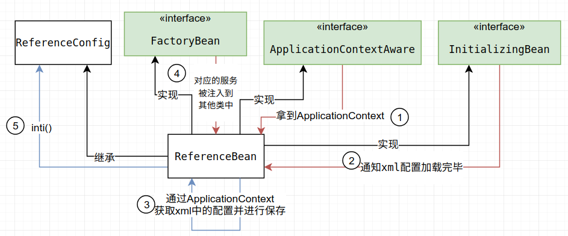
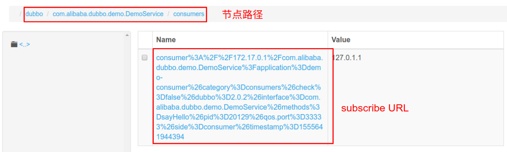
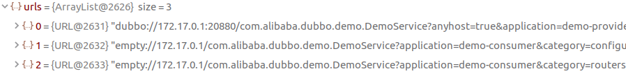

## 前言

上一章主要对Provider的启动过程进行了分析,接下来主要看Consumer的启动过程.Consumer的许多部分与Provider都是对称的,甚至有很多通用的代码,文中会省略与Provider中相同部分的解释.所谓的服务引入就是Consumer对在注册中心获取到的信息创建Invoker的过程.

文章中运行的是官方的Demo:

<https://github.com/apache/incubator-dubbo/tree/dubbo-2.6.4/dubbo-demo>

Demo中采用的注册中心是multicast的方式,但dubbo更提倡把zookeeper作为注册中心.所以我把

dubbo-demo-consumer/src/main/resources/META-INF/spring/dubbo-demo-consumer.xml

dubbo-demo-provider/src/main/resources/META-INF/spring/dubbo-demo-provider.xml中的`<dubbo:registry>`标签替换成了以下:

```
<dubbo:registry address="zookeeper://127.0.0.1:2181"/>
```

> 推荐阅读:
>
> <https://dubbo.incubator.apache.org/zh-cn/>
>
> <https://segmentfault.com/blog/dubboanalysis>

## Consumer启动



从上图可以看到Consumer的启动方式与Provider有许多相似的地方,从xml加载配置,最后调用ReferenceConfig的init()开始服务引入的过程.与Provider不同的是,Provider是在Spring容器刷新时开始启动,而Consumer默认则是对应的服务被注册到其他类时开始启动.

# 服务引入

在ReferenceConfig#init的目的是创建xml配置期望的服务的代理对象:

1. 创建服务接口的Class对象,进行保存
2. 收集情报,构建map
3. ref = createProxy(map);//创建代理对象
4. 把ref创建成ConsumerModel,把ConsumerModel保存到ApplicationModel

所以我们可以从`ReferenceConfig#createProxy`开始分析.

此时的参数map带入的是一些消费者的配置,如下:

```
map = {HashMap@1964}  size = 10
 0 = {HashMap$Node@1985} "side" -> "consumer"
 1 = {HashMap$Node@1986} "application" -> "demo-consumer"
 2 = {HashMap$Node@1987} "register.ip" -> "172.17.0.1"
 3 = {HashMap$Node@1988} "methods" -> "sayHello"
 4 = {HashMap$Node@1989} "qos.port" -> "33333"
 5 = {HashMap$Node@1990} "dubbo" -> "2.0.2"
 6 = {HashMap$Node@1991} "pid" -> "28271"
 7 = {HashMap$Node@1992} "check" -> "false"
 8 = {HashMap$Node@1993} "interface" -> "com.alibaba.dubbo.demo.DemoService"
 9 = {HashMap$Node@1994} "timestamp" -> "1555634256457"
```

Provider中也出现了类似的配置map,当时ProviderURL就是基于这么一个map构建的.继续来看Consumer中的做法.

ReferenceConfig#createProxy中做的事情:

1. 根据配置构建注册中心的url.因为Provider相同也是调用的loadRegistries(),所以这里就不分析了

   ```
   registry://127.0.0.1:2181/com.alibaba.dubbo.registry.RegistryService?
   application=demo-consumer& 
   dubbo=2.0.2&
   pid=30305&
   qos.port=33333&
   registry=zookeeper&
   timestamp=1555635096072
   ```

2. 在注册中心url中加入Consumer相关的配置map(有点像Provider的export).结果为

   ```
   registry://127.0.0.1:2181/com.alibaba.dubbo.registry.RegistryService?
   application=demo-consumer&
   dubbo=2.0.2&
   pid=30305&
   qos.port=33333&
   
   refer=application%3Ddemo-consumer%26check%3Dfalse%26dubbo%3D2.0.2%26interface%3Dcom.alibaba.dubbo.demo.DemoService%26methods%3DsayHello%26pid%3D30305%26qos.port%3D33333%26register.ip%3D172.17.0.1%26side%3Dconsumer%26timestamp%3D1555634966726&
   
   registry=zookeeper&
   timestamp=1555635096072
   ```

3. refprotocol.refer(interfaceClass, url)
   接下就是创建服务的invoker的过程.也就是调用protocol.refer创建invoker.
   如果有多个注册中心，多个服务提供者，这个时候会得到一组 Invoker 实例，此时需要通过集群管理类 Cluster 将多个 Invoker 合并成一个实例.

4. proxyFactory.getProxy(invoker)
   为该Invoker创建Proxy

接下来主要分析这里的第3步和第4步

## 创建Invoker

创建invoker是通过调用protocol.refer().而这里有两个protocol对象,分别是:RegistryProtocol和DubboProtocol.在ReferenceConfig中调用的是哪一个呢?

答案是ReferenceConfig首先会调用RegistryProtocol,再由RegistryProtocol调用DubboProtocol的refer方法的.

所以这里先从RegistryProtocol开始分析,代码如下:

```java
@Override
@SuppressWarnings("unchecked")
public <T> Invoker<T> refer(Class<T> type, URL url) throws RpcException {
    //把协议头改成注册中心,zookeeper://
    url = url.setProtocol(url.getParameter(Constants.REGISTRY_KEY, Constants.DEFAULT_REGISTRY)).removeParameter(Constants.REGISTRY_KEY);
    // 取注册中心实例,创建zk客户端连接
    Registry registry = registryFactory.getRegistry(url);//获取zookeeperRegistry
    if (RegistryService.class.equals(type)) {
        return proxyFactory.getInvoker((T) registry, type, url);
    }
    //${无关代码}
    // 调用 doRefer 继续执行服务引用逻辑
    return doRefer(cluster, registry, type, url);
}
```

它做了什么?

1. 对传入的url的协议头进行更改,构建为注册中心URL

   ```
   registry://127.0.0.1:2181/com.alibaba.dubbo.registry.RegistryService?
   application=demo-consumer&
   dubbo=2.0.2&
   pid=9914&
   qos.port=33333&
   
   refer=application%3Ddemo-consumer%26check%3Dfalse%26dubbo%3D2.0.2%26interface%3Dcom.alibaba.dubbo.demo.DemoService%26methods%3DsayHello%26pid%3D9914%26qos.port%3D33333%26register.ip%3D172.17.0.1%26side%3Dconsumer%26timestamp%3D1555638452753&
   
   registry=zookeeper&
   timestamp=1555638452774
   ```

2. 构建注册中心实例,同时创建zk客户端连接.这里registry是`ZookeeperRegistry`

3. 调用重载方法

构建ZookeeperRegistry与Provider类似,这里就不分析了.继续看它调用的重载方法

```java
private <T> Invoker<T> doRefer(Cluster cluster, Registry registry, Class<T> type, URL url) {

    // 创建 RegistryDirectory 实例
    RegistryDirectory<T> directory = new RegistryDirectory<T>(type, url);
    directory.setRegistry(registry);//zookeeperRegistry
    directory.setProtocol(protocol);//DubboProtocol
    // all attributes of REFER_KEY
    Map<String, String> parameters 
        = new HashMap<String, String>(directory.getUrl().getParameters());
    
    // 构建订阅者(消费者)URL
    URL subscribeUrl = new URL(Constants.CONSUMER_PROTOCOL, parameters.remove(Constants.REGISTER_IP_KEY), 0, type.getName(), parameters);
    
    if (!Constants.ANY_VALUE.equals(url.getServiceInterface())
        && url.getParameter(Constants.REGISTER_KEY, true)) {
        //调用ZookeeperRegistry.doSubscribe进行注册
        registry.register(subscribeUrl.addParameters(Constants.CATEGORY_KEY, Constants.CONSUMERS_CATEGORY,
                                                     Constants.CHECK_KEY, String.valueOf(false)));
    }
    //订阅 providers、configurators、routers 等节点数据
    //subscribeURL加入category=providers,configurators,routers
    directory.subscribe(subscribeUrl.addParameter(Constants.CATEGORY_KEY,
                                                  Constants.PROVIDERS_CATEGORY
                                                  + "," + Constants.CONFIGURATORS_CATEGORY
                                                  + "," + Constants.ROUTERS_CATEGORY));

    Invoker invoker = cluster.join(directory);
    ProviderConsumerRegTable.registerConsumer(invoker, url, subscribeUrl, directory);
    return invoker;
}
```

在这一部分我们

这一部分做了什么?

1. 创建了一个`RegistryDirectory`的实例.告诉它zookeeperRegistry和DubboProtocol

2. 构建订阅者(消费者)URL.

   ```
   consumer://172.17.0.1/com.alibaba.dubbo.demo.DemoService?
   application=demo-consumer&check=false&dubbo=2.0.2&
   interface=com.alibaba.dubbo.demo.DemoService&
   methods=sayHello&
   pid=25186&
   qos.port=33333&
   side=consumer&
   timestamp=1555652263169
   ```

3. 调用ZookeeperRegistry.doRegister()把订阅者URL创建并放置到合适的节点上




4.subscribeURL加入category=providers,configurators,routers

5.directory.subscribe(subscribeURL).订阅 providers、configurators、routers 等节点数据

6.Invoker invoker = cluster.join(directory).把directory构建成Invoker并返回

下一小节简单分析一下directory.subscribe(subscribeURL)的过程,它最终会调用DubboProtocol的refer()

### 订阅服务

```java
//RegistryDirectory#subscribe
public void subscribe(URL url) {
    setConsumerUrl(url);
    //调用zkRegistry的subscribe方法.NotifyListener = this
    registry.subscribe(url, this);
}
```

也就是说它调用了zkRegistry的subscribe().我们继续往下看

```java
//com.alibaba.dubbo.registry.zookeeper.ZookeeperRegistry#doSubscribe
@Override
protected void doSubscribe(final URL url, final NotifyListener listener) {
    if (Constants.ANY_VALUE.equals(url.getServiceInterface())) {
        //${无关代码}
    } else {
        // 处理指定 Service 层的发起订阅，例如服务消费者的订阅.调用两次notify
        List<URL> urls = new ArrayList<URL>();
        // 把url中的category项改成zk的Path,如下:
        /**
                 * categoriesPath:
                 * 0 = "/dubbo/com.alibaba.dubbo.demo.DemoService/providers"
                 * 1 = "/dubbo/com.alibaba.dubbo.demo.DemoService/configurators"
                 * 2 = "/dubbo/com.alibaba.dubbo.demo.DemoService/routers"
                 */
        for (String path : toCategoriesPath(url)) {
            // 获得监听器集合
            ConcurrentMap<NotifyListener, ChildListener> listeners = zkListeners.get(url);
            // 如果没有则创建
            if (listeners == null) {
                zkListeners.putIfAbsent(url, new ConcurrentHashMap<NotifyListener, ChildListener>());
                listeners = zkListeners.get(url);
            }
            // 获得节点监听器
            ChildListener zkListener = listeners.get(listener);
            if (zkListener == null) {//null
                //创建该节点的监听器
                listeners.putIfAbsent(listener, new ChildListener() {
                    @Override
                    public void childChanged(String parentPath, List<String> currentChilds) {
                        // 通知服务变化 回调NotifyListener
                        ZookeeperRegistry.this.notify(url, listener, toUrlsWithEmpty(url, parentPath, currentChilds));
                    }
                });
                // 重新获取节点监听器，保证一致性
                zkListener = listeners.get(listener);
            }
            // 创建type节点，该节点为持久节点
            // 比如 创建/dubbo/com.alibaba.dubbo.demo.DemoService/providers节点
            zkClient.create(path, false);
            // 比如 向zookeeper的/dubbo/com.alibaba.dubbo.demo.DemoService/providers节点发起订阅
            // 获得providers提供的service
            List<String> children = zkClient.addChildListener(path, zkListener);
            if (children != null) {
                // 加入到自子节点数据数组
                urls.addAll(toUrlsWithEmpty(url, path, children));
            }
        }
        // 通知数据变化
        //url = consumer也就是subscribeURL,listener = registryDirectory,urls = providers,configurators,routers 的URL
        notify(url, listener, urls);
    }
}
```

这一部分比较复杂,主要可以分成下面几步:

1. 取出ConsumerURL中的category项构建成zk节点Path的List并遍历

   ```
   0 = "/dubbo/com.alibaba.dubbo.demo.DemoService/providers"
   1 = "/dubbo/com.alibaba.dubbo.demo.DemoService/configurators"
   2 = "/dubbo/com.alibaba.dubbo.demo.DemoService/routers"
   ```

2. 创建该节点的监听器

3. 如果zk上不存在path节点则创建该节点

4. 获取节点上存储的URL并把它加入urls

5. notify(url, listener, urls)

首先关注一下这个category项.第一项的providers的path是之前Provider服务导出时创建的,所以上面有ProviderURL.但是接下来的configurators和routers是provider和consumer从未使用过得节点.所以节点上不存在东西.

当调用

```
List<String> children = zkClient.addChildListener(path, zkListener);
```

的时候,provider返回的是编码后的ProviderURL,但是另外两个返回后children.size=0(非空).对于空的内容

我们将在`toUrlsWithEmpty()`中为它构建特殊的url.这么说可能有些晕,简单总结一下就是:

对于

```
0 = "/dubbo/com.alibaba.dubbo.demo.DemoService/providers"
```

是从zk获取ProviderURL:

```
dubbo://172.17.0.1:20880/com.alibaba.dubbo.demo.DemoService?anyhost=true&
application=demo-provider&
dubbo=2.0.2&
generic=false&
interface=com.alibaba.dubbo.demo.DemoService&
methods=sayHello&
pid=24006&
side=provider&
timestamp=1555633157677
```

对于

```
1 = "/dubbo/com.alibaba.dubbo.demo.DemoService/configurators"
2 = "/dubbo/com.alibaba.dubbo.demo.DemoService/routers"
```

则是创建zk节点并创建特殊url

```
empty://172.17.0.1/com.alibaba.dubbo.demo.DemoService?
application=demo-consumer&
category=configurators& //或者 category=routers
check=false&
dubbo=2.0.2&
interface=com.alibaba.dubbo.demo.DemoService&
methods=sayHello&
pid=28212&
qos.port=33333&
side=consumer&
timestamp=1555644356890
```

最后urls的size将会是3



关于第5步的notify(url, listener, urls):

将会对上面的3个url循环调用listener.notify(url);.也就是RegistryDirectory#notify方法.

这个方法中每种category都会有不同的处理方式.但是我们的configurators和routers的URL开头都是`empty://`,这说明没有合适的方式,所以会被直接retuen.

而providers则与前面的两个不同.它会调用refreshInvoker(),当我们深入进去时发现他最终调用了

```java
//com.alibaba.dubbo.registry.integration.RegistryDirectory#toInvokers
invoker = new InvokerDelegate<T>(protocol.refer(serviceType, url), url, providerUrl);
```

这里的protocol就是DubboProtocol.这部分代码比较复杂,我个人也有不明白的部分,无论如何DubboProtocol在这里终于登场了

### DubboProtocol#refer 构建netty客户端

简单看一下DubboProtocol的refer.它与前面的RegistryProtocol相比要简单去多

```java
@Override
public <T> Invoker<T> refer(Class<T> serviceType, URL url) throws RpcException {
    /**
         * 这里传进来的url,已经在别改成了.
         * dubbo://172.17.0.1:20880/com.alibaba.dubbo.demo.DemoService?
         * anyhost=true&
         * application=demo-consumer&
         * check=false&
         * dubbo=2.0.2&
         * generic=false&
         * interface=com.alibaba.dubbo.demo.DemoService&
         * methods=sayHello&
         * pid=5580&
         * qos.port=33333&
         * register.ip=172.17.0.1&
         * remote.timestamp=1555633157677&
         * side=consumer&
         * timestamp=1555637046917
         */
    optimizeSerialization(url);
    // 创建 DubboInvoker. getClient()构建netty客户端
    DubboInvoker<T> invoker = new DubboInvoker<T>(serviceType, url, getClients(url), invokers);//invokers.size = 0
    invokers.add(invoker);
    return invoker;
}
```

我注意到此时参数的url是通过RegistryDirectory的mergeUrl(providerUrl)构建的.所以这里传入的URL的地址和端口应该都是从注册中心获取到的服务端的地址端口

步骤简单可以分为:

1. getClients(url). 根据ProviderURL和ConsumerURL构建netty客户端
2. 把netty客户端包装成invoker

这么一来服务的Invoker就创建完成了.

## 生成代理类

再回到`ReferenceConfig#createProxy`.其实我们的目的并不只是创建远程服务的invoker.而是通过invoker创建服务的proxy.

```java
//com.alibaba.dubbo.config.ReferenceConfig#createProxy
return (T) proxyFactory.getProxy(invoker);
```

这里最终会调用JavassistProxyFactory 类中getProxy()来生成Proxy的代码.过程这里就不分析了,最后产生的Proxy的代码如下:

```java
package org.apache.dubbo.common.bytecode;

public class proxy0 implements org.apache.dubbo.demo.DemoService {

    public static java.lang.reflect.Method[] methods;

    private java.lang.reflect.InvocationHandler handler;

    public proxy0() {
    }

    public proxy0(java.lang.reflect.InvocationHandler arg0) {
        handler = $1;
    }

    public java.lang.String sayHello(java.lang.String arg0) {
        Object[] args = new Object[1];
        args[0] = ($w) $1;
        Object ret = handler.invoke(this, methods[0], args);
        return (java.lang.String) ret;
    }
}
```

## 总结

回顾一下代码的调用链

```
ReferenceConfig#init
	|
	createProxy(map) //创建代理对象
		|
		1. loadRegistries() //构建注册中心的url
		2. RegistryProtocol.refer()
			|
			1. 构建注册中心实例,同时创建zk客户端连接
			2. RegistryProtocol.doRefer()
				|
                1. 创建了一个RegistryDirectory的实例
                2. 构建订阅者(消费者)URL
                3. ZookeeperRegistry#register()//根据订阅者URL创建zk节点,并放入
                4. directory.subscribe(subscribeURL) //订阅服务
                    |
                    1. 从注册中心获取providerURL
                    2. DubboRegistry#refer 创建与provider连接的netty客户端
                    3. 返回invoker
		|
		3. proxyFactory.getProxy(invoker)//生成invoker的代理类
	|
	保存代理对象到ConsumerModel,ApplicationModel
```

和Provider导出时调用顺序有明显的区别:

- Provider:先开netty服务端再注册服务
- Consumer:先去注册中心放入自己的URL,然后找ProviderURL,再创建netty客户端

关于directory和cluster的部分,我目前也还有不理解的地方.希望后期能完善这部分的解释.