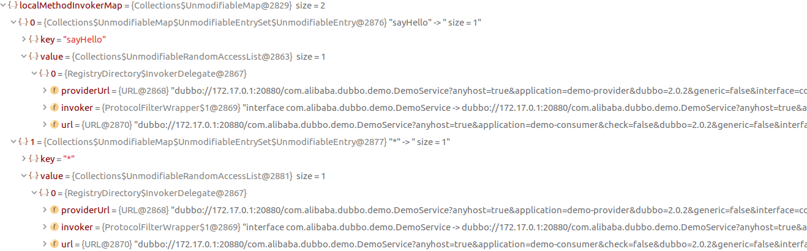

## 前言


从这一章节开始讲Dubbo的集群容错.

集群容错部分包含四个部分

- 服务目录Directory
- 服务路由Router
- 集群Cluster
- 负载均衡LoadBalance

本章讲服务目录Directory.服务目录是什么,官方文档的描述如下:

> 服务目录中存储了一些和服务提供者有关的信息，通过服务目录，服务消费者可获取到服务提供者的信息，比如 ip、端口、服务协议等。通过这些信息，服务消费者就可通过 Netty 等客户端进行远程调用。
>
> 在一个服务集群中，服务提供者数量并不是一成不变的，如果集群中新增了一台机器，相应地在服务目录中就要新增一条服务提供者记录。或者，如果服务提供者的配置修改了，服务目录中的记录也要做相应的更新。如果这样说，服务目录和注册中心的功能不就雷同了吗？确实如此，这里这么说是为了方便大家理解。实际上服务目录在获取注册中心的服务配置信息后，会为每条配置信息生成一个 Invoker 对象，并把这个 Invoker 对象存储起来，这个 Invoker 才是服务目录最终持有的对象。Invoker 有什么用呢？看名字就知道了，这是一个具有远程调用功能的对象。讲到这大家应该知道了什么是服务目录了，它可以看做是 Invoker 集合，且这个集合中的元素会随注册中心的变化而进行动态调整。

下面开始Directory的源码分析.文章中运行的是官方的Demo:

<https://github.com/apache/incubator-dubbo/tree/dubbo-2.6.4/dubbo-demo>

Demo中采用的注册中心是multicast的方式,但dubbo更提倡把zookeeper作为注册中心.所以我把

dubbo-demo-consumer/src/main/resources/META-INF/spring/dubbo-demo-consumer.xml

dubbo-demo-provider/src/main/resources/META-INF/spring/dubbo-demo-provider.xml中的`<dubbo:registry>`标签替换成了以下:

```
<dubbo:registry address="zookeeper://127.0.0.1:2181"/>
```

> 推荐阅读:
>
> <https://dubbo.incubator.apache.org/zh-cn/>
>
> <https://segmentfault.com/blog/dubboanalysis>

## 继承体系


Directory 接口的方法,用于列举invoker:

```
List<Invoker<T>> list(Invocation invocation) throws RpcException;
```

实现Node接口的还有Registry,Monitor,Invoker等.它包含以下方法

```
URL getUrl();
```

所以实现该接口的类通常可以向外提供配置信息

NotifyListener 接口:

当注册中心节点信息发生变化后，RegistryDirectory 可以通过此接口方法得到变更信息，并根据变更信息动态调整内部 Invoker 列表。


## AbstractDirectory

```java
//com.alibaba.dubbo.rpc.cluster.directory.AbstractDirectory#list
@Override
public List<Invoker<T>> list(Invocation invocation) throws RpcException {
    if (destroyed) {
        throw new RpcException("Directory already destroyed .url: " + getUrl());
    }
    // 调用 doList 方法列举 Invoker，doList 是模板方法，由子类实现
    List<Invoker<T>> invokers = doList(invocation);
    List<Router> localRouters = this.routers; // local reference
    if (localRouters != null && !localRouters.isEmpty()) {
        for (Router router : localRouters) {
            try {
                // 获取 runtime 参数，并根据参数决定是否进行路由
                if (router.getUrl() == null || router.getUrl().getParameter(Constants.RUNTIME_KEY, false)) {
                    // 进行服务路由
                    invokers = router.route(invokers, getConsumerUrl(), invocation);
                }
            } catch (Throwable t) {
                logger.error("Failed to execute router: " + getUrl() + ", cause: " + t.getMessage(), t);
            }
        }
    }
    return invokers;
}
```

list()的核心部分doList()是模板的抽象方法,该部分由子类实现.

1. 调用 doList 获取 Invoker 列表
2. 根据 Router 的 getUrl 返回值为空与否，以及 runtime 参数决定是否进行服务路由

Router的runtime参数决定了是否每次调用服务是都执行路由规则.如果 runtime 为 true，那么每次调用服务前，都需要进行服务路由.

## StaticDirectory

StaticDirectory是AbstractDirectory的子类之一,StaticDirectory 即静态服务目录，顾名思义，它内部存放的 Invoker 是不会变动的。所以，理论上它和不可变 List 的功能很相似。所以它的源码也非常简约,当`doList()`被调用时,无论参数的invocation是什么,它都直接返回存储在变量中的invokers列表

## RegistryDirectory

由于RegistryDirectory实现了 NotifyListener 接口。当注册中心服务配置发生变化后，RegistryDirectory 可收到与当前服务相关的变化。收到变更通知后，RegistryDirectory 可根据配置变更信息刷新 Invoker 列表。

它的包括三个重要的方法:

- RegistryDirectory#doList
  列举Invoker列表
- RegistryDirectory#notify
  接收服务配置变更的逻辑
- RegistryDirectory#refreshInvoker
  Invoker 列表的刷新

接下来依次分析

### RegistryDirectory#doList 列举Invoker列表

源码的大致分析

```java
public List<Invoker<T>> doList(Invocation invocation) {
    if (forbidden) {//false
        // 服务提供者关闭或禁用了服务，此时抛出 No provider 异常
        throw new RpcException(RpcException.FORBIDDEN_EXCEPTION,
            "No provider available from registry ...");
    }
    List<Invoker<T>> invokers = null;
    // 获取 Invoker 本地缓存
    Map<String, List<Invoker<T>>> localMethodInvokerMap = this.methodInvokerMap;
    if (localMethodInvokerMap != null && localMethodInvokerMap.size() > 0) {
        // ${localMethodInvokerMap.get("获取方法名+参数列表") 的方式获取}

        if (invokers == null) {//null
            // 通过方法名获取 Invoker 列表.
            invokers = localMethodInvokerMap.get(methodName);
        }
        if (invokers == null) {
            // 通过星号 * (泛化调用)获取 Invoker 列表
            invokers = localMethodInvokerMap.get(Constants.ANY_VALUE);
        }
        
    }

	// 返回 Invoker 列表
    return invokers == null ? new ArrayList<Invoker<T>>(0) : invokers;
}
```

debug跟踪结果

获取 Invoker 本地缓存放入localMethodInvokerMap时,取出来的内容如下:



有两个key.分别是"sayHello"和"*",他们的value是同样的`InvokerDelegate`类型.

这个invokerDelegate里面包含了:

- providerURL...服务端url
- invoker...封装了netty客户端的Invoker
- url...消费者URL

`*`是用于泛化调用的,而这里`*`对应的value与"sayHello"相同.

示例中最后返回了"sayHello"对应的invoker.在debug的过程中我注意到,每一次消费者试图调用生产者提供的方法时该`toList()`方法都会被调用.

doList 方法可以看做是对 methodInvokerMap 变量的读操作，至于对 methodInvokerMap 变量的写操作，下一节进行分析。

### RegistryDirectory#notify 接收服务配置变更的逻辑

notify()是来自NotifyListener接口的方法.当配置发生改变时该方法就会被调用.

```java
@Override
public synchronized void notify(List<URL> urls) {
    // 定义三个集合，分别用于存放服务提供者 url，路由 url，配置器 url
    List<URL> invokerUrls = new ArrayList<URL>();
    List<URL> routerUrls = new ArrayList<URL>();
    List<URL> configuratorUrls = new ArrayList<URL>();
    for (URL url : urls) {
        String protocol = url.getProtocol();
        // 获取 category 参数
        String category = url.getParameter(Constants.CATEGORY_KEY, Constants.DEFAULT_CATEGORY);
        // 根据 category 参数将 url 分别放到不同的列表中
        if (Constants.ROUTERS_CATEGORY.equals(category)
            || Constants.ROUTE_PROTOCOL.equals(protocol)) {
            // 添加路由器 url
            routerUrls.add(url);
        } else if (Constants.CONFIGURATORS_CATEGORY.equals(category)
                   || Constants.OVERRIDE_PROTOCOL.equals(protocol)) {
            // 添加配置器 url
            configuratorUrls.add(url);
        } else if (Constants.PROVIDERS_CATEGORY.equals(category)) {
            // 添加服务提供者 url
            invokerUrls.add(url);
        } else {
            // 忽略不支持的 category
            logger.warn("Unsupported category " + category + " in notified url: " + url + " from registry " + getUrl().getAddress() + " to consumer " + NetUtils.getLocalHost());
        }
    }
    // configurators
    if (configuratorUrls != null && !configuratorUrls.isEmpty()) {
        // 将 url 转成 Configurator
        this.configurators = toConfigurators(configuratorUrls);
    }
    // routers
    if (routerUrls != null && !routerUrls.isEmpty()) {
        // 将 url 转成 Router
        List<Router> routers = toRouters(routerUrls);
        if (routers != null) { // null - do nothing
            setRouters(routers);
        }
    }
    List<Configurator> localConfigurators = this.configurators; // local reference
    this.overrideDirectoryUrl = directoryUrl;
    if (localConfigurators != null && !localConfigurators.isEmpty()) {
        for (Configurator configurator : localConfigurators) {
            // 配置 overrideDirectoryUrl
            this.overrideDirectoryUrl = configurator.configure(overrideDirectoryUrl);
        }
    }
    // 刷新 Invoker 列表
    refreshInvoker(invokerUrls);
}
```

当配置发生变更时,变更后的URL列表会作为参数带入到该方法中.URL中包含"category"这一参数.根据URL的category对应的内容完成特定的行为.

category的值可能是routers,configurators,providers.如果是routers或configurators,把它从URL转换成特定的配置对象并进行保存.如果是providers那么为它调用refreshInvoker()方法.

其实这一部份的代码跟踪在上一章已经分析过了,这里再简单总结一下:routers,configurators,providers都会去ZK对应的节点下获取数据,但这里除了生产者放入的providers节点存在ProviderURL之外,routers,configurators节点都是空的.对于空的两个节点,我们临时为它们分别生成了`empty://`开头的URL.

所以最后进入`notify()`的仍是3个URL(1个providerURL,2个`empty://`开头的URL).但由于`empty://`开头的URL是不会被受理的.所以configurators和router对象都没有被生成.只有providers的URL被保存,并进入了refreshInvoker()

### RegistryDirectory#refreshInvoker Invoker 列表的刷新

refreshInvoker 方法是保证 RegistryDirectory 随注册中心变化而变化的关键所在。

```java
//RegistryDirectory#refreshInvoker
private void refreshInvoker(List<URL> invokerUrls) {
    // invokerUrls 仅有一个元素，且 url 协议头为 empty，此时表示禁用所有服务
    if (invokerUrls != null && invokerUrls.size() == 1 && invokerUrls.get(0) != null
        && Constants.EMPTY_PROTOCOL.equals(invokerUrls.get(0).getProtocol())) {
        // 设置 forbidden 为 true
        this.forbidden = true;
        this.methodInvokerMap = null;
        destroyAllInvokers(); // 销毁所有 Invoker
    } else {//这边
        this.forbidden = false; // Allow to access
        Map<String, Invoker<T>> oldUrlInvokerMap = this.urlInvokerMap;
        if (invokerUrls.isEmpty() && this.cachedInvokerUrls != null) {
            // 添加缓存 url 到 invokerUrls 中
            invokerUrls.addAll(this.cachedInvokerUrls);
        } else {
            this.cachedInvokerUrls = new HashSet<URL>();
            // 缓存 invokerUrls
            this.cachedInvokerUrls.addAll(invokerUrls);
        }
        if (invokerUrls.isEmpty()) {
            return;
        }
        // 将 providerUrl 转成 Invoker.  <url, Invoker>
        Map<String, Invoker<T>> newUrlInvokerMap = toInvokers(invokerUrls);
        // 将 newUrlInvokerMap 转成方法名到 Invoker 列表的映射 .<methodName, Invoker 列表>
        Map<String, List<Invoker<T>>> newMethodInvokerMap = toMethodInvokers(newUrlInvokerMap);
        // 转换出错，直接打印异常，并返回
        if (newUrlInvokerMap == null || newUrlInvokerMap.size() == 0) {
            logger.error(new IllegalStateException("urls to invokers error .invokerUrls.size :" + invokerUrls.size() + ", invoker.size :0. urls :" + invokerUrls.toString()));
            return;
        }
        // 合并多个组的 Invoker.methodInvokerMap就是toList()中用到的
        this.methodInvokerMap = multiGroup ? toMergeMethodInvokerMap(newMethodInvokerMap) : newMethodInvokerMap;
        this.urlInvokerMap = newUrlInvokerMap;
        try {
            // 销毁无用 Invoker
            destroyUnusedInvokers(oldUrlInvokerMap, newUrlInvokerMap);
        } catch (Exception e) {
            logger.warn("destroyUnusedInvokers error. ", e);
        }
    }
}

```

这个方法的核心工作是什么?

1. 将providerURL转换成 `<url, Invoker>`的Map
2. 把`<url, Invoker>`的Map转换成`<methodName, Invoker 列表>`的map
3. 把`<methodName, Invoker 列表>`的map保存到methodInvokerMap.方便toList()方法调用
4. 合并多组 Invoker
5. 销毁无用 Invoker

那么`toInvokers()`和`toMethodInvokers()`将会是该方法的重点.下面分别分析这两个方法

#### RegistryDirectory#toInvokers providerURL 转 `Map<url, Invoker>`

```java
private Map<String, Invoker<T>> toInvokers(List<URL> urls) {
    Map<String, Invoker<T>> newUrlInvokerMap = new HashMap<String, Invoker<T>>();
    if (urls == null || urls.isEmpty()) {
        return newUrlInvokerMap;
    }
    Set<String> keys = new HashSet<String>();
    // 获取服务消费端配置的协议.queryMap里面是消费者的配置参数
    String queryProtocols = this.queryMap.get(Constants.PROTOCOL_KEY);//null
    for (URL providerUrl : urls) {
        if (queryProtocols != null && queryProtocols.length() > 0) {//null
            boolean accept = false;
            String[] acceptProtocols = queryProtocols.split(",");
            // 检测服务提供者协议是否被服务消费者所支持
            for (String acceptProtocol : acceptProtocols) {
                if (providerUrl.getProtocol().equals(acceptProtocol)) {
                    accept = true;
                    break;
                }
            }
            if (!accept) {
                // 若服务消费者协议头不被消费者所支持，则忽略当前 providerUrl
                continue;
            }
        }
        // 忽略 empty 协议
        if (Constants.EMPTY_PROTOCOL.equals(providerUrl.getProtocol())) {
            continue;
        }
        // 通过 SPI 检测服务端协议(dubbo)是否被消费端支持，不支持则抛出异常.也就是检测是否能加载DubboProtocol
        if (!ExtensionLoader.getExtensionLoader(Protocol.class).hasExtension(providerUrl.getProtocol())) {
            logger.error(new IllegalStateException("Unsupported protocol " + providerUrl.getProtocol() + " in notified url: " + providerUrl + " from registry " + getUrl().getAddress() + " to consumer " + NetUtils.getLocalHost()
                                                   + ", supported protocol: " + ExtensionLoader.getExtensionLoader(Protocol.class).getSupportedExtensions()));
            continue;
        }
        // 合并 url
        URL url = mergeUrl(providerUrl);

        String key = url.toFullString();
        if (keys.contains(key)) {
            // 忽略重复 url
            continue;
        }
        keys.add(key);
        // 将本地 Invoker 缓存赋值给 localUrlInvokerMap
        Map<String, Invoker<T>> localUrlInvokerMap = this.urlInvokerMap; // null
        // 获取与 url 对应的 Invoker
        Invoker<T> invoker = localUrlInvokerMap == null ? null : localUrlInvokerMap.get(key);//null
        // 缓存未命中
        if (invoker == null) {
            try {
                boolean enabled = true;
                if (url.hasParameter(Constants.DISABLED_KEY)) {
                    // 获取 disable 配置，取反，然后赋值给 enable 变量
                    enabled = !url.getParameter(Constants.DISABLED_KEY, false);
                } else {
                    // 获取 enable 配置，并赋值给 enable 变量
                    enabled = url.getParameter(Constants.ENABLED_KEY, true);
                }
                if (enabled) {
                    // 调用 refer 获取 Invoker
                    invoker = new InvokerDelegate<T>(protocol.refer(serviceType, url), url, providerUrl);
                }
            } catch (Throwable t) {
                logger.error("Failed to refer invoker for interface:" + serviceType + ",url:(" + url + ")" + t.getMessage(), t);
            }
            if (invoker != null) { // 缓存 Invoker 实例
                newUrlInvokerMap.put(key, invoker);
            }
        } else {// 缓存命中
            // 将 invoker 存储到 newUrlInvokerMap 中
            newUrlInvokerMap.put(key, invoker);
        }
    }
    keys.clear();
    return newUrlInvokerMap;
}
```

大致流程如下:

1. 如果Consumer的配置里面指定了protocol,检查Provider的URL是否支持该protocol.

1. 消费者是否支持provider的url.示例中就是检查是否能用SPI加载DubboProtocol类

1. 缓存未命中时,调用DubboProtocol的refer()创建invoker.

1. 并把该invoker封装成InvokerDelegate类型

关于第3步,在上一章中做过分析.

实际上就是根据marge后的(消费者+提供者)URL创建netty的客户端连接并封装成invoker.具体可以参考我的上一篇文章

要注意的是,该方法返回的`Map<url,Invoker>`的url并单纯的providerURL,还合并了Consumer的一些配置.此时产生的url如下:

```
dubbo://172.17.0.1:20880/com.alibaba.dubbo.demo.DemoService?
anyhost=true&
application=demo-consumer&
check=false&
dubbo=2.0.2&
generic=false&
interface=com.alibaba.dubbo.demo.DemoService&
methods=sayHello&
pid=25772&
qos.port=33333&
register.ip=172.17.0.1&
remote.timestamp=1555722960408&
side=consumer&
timestamp=1555730193393
```

#### RegistryDirectory#toMethodInvokers `Map<url, Invoker>`转`Map<methodName, Invoker 列表>`

```java
private Map<String, List<Invoker<T>>> toMethodInvokers(Map<String, Invoker<T>> invokersMap) {

    // 方法名 -> Invoker 列表
    Map<String, List<Invoker<T>>> newMethodInvokerMap = new HashMap<String, List<Invoker<T>>>();
    List<Invoker<T>> invokersList = new ArrayList<Invoker<T>>();
    if (invokersMap != null && invokersMap.size() > 0) {//有无Map<url,map>
        for (Invoker<T> invoker : invokersMap.values()) {
            // 获取 methods 参数.sayHello
            String parameter = invoker.getUrl().getParameter(Constants.METHODS_KEY);
            if (parameter != null && parameter.length() > 0) {
                // 切分 methods 参数值，得到方法名数组
                String[] methods = Constants.COMMA_SPLIT_PATTERN.split(parameter);
                if (methods != null && methods.length > 0) {
                    for (String method : methods) {
                        // 方法名不为 *
                        if (method != null && method.length() > 0
                            && !Constants.ANY_VALUE.equals(method)) {
                            // 根据方法名获取 Invoker 列表
                            List<Invoker<T>> methodInvokers = newMethodInvokerMap.get(method);
                            if (methodInvokers == null) {
                                methodInvokers = new ArrayList<Invoker<T>>();
                                newMethodInvokerMap.put(method, methodInvokers);
                            }
                            // 存储 Invoker 到列表中
                            methodInvokers.add(invoker);
                        }
                    }
                }
            }
            invokersList.add(invoker);
        }
    }
    // 进行服务级别路由
    List<Invoker<T>> newInvokersList = route(invokersList, null);
    // 存储 <*, newInvokersList> 映射关系
    newMethodInvokerMap.put(Constants.ANY_VALUE, newInvokersList);
    if (serviceMethods != null && serviceMethods.length > 0) {
        for (String method : serviceMethods) {
            List<Invoker<T>> methodInvokers = newMethodInvokerMap.get(method);
            if (methodInvokers == null || methodInvokers.isEmpty()) {
                methodInvokers = newInvokersList;
            }
            // 进行方法级别路由
            newMethodInvokerMap.put(method, route(methodInvokers, method));
        }
    }
    // 排序，转成不可变列表
    for (String method : new HashSet<String>(newMethodInvokerMap.keySet())) {
        List<Invoker<T>> methodInvokers = newMethodInvokerMap.get(method);
        Collections.sort(methodInvokers, InvokerComparator.getComparator());
        newMethodInvokerMap.put(method, Collections.unmodifiableList(methodInvokers));
    }
    return Collections.unmodifiableMap(newMethodInvokerMap);
}
```

大致工作如之下:

1. 构建普通方法的map:

   1. 遍历参数`Map<url, Invoker>`的value值

   1. 通过invoker.getUrl().getParameter(Constants.METHODS_KEY).拿到方法名

   1. 构建成`Map<methodName, Invoker 列表>`

2. 进行服务级别的路由.:

   也就是存储` <*, newInvokersList> `映射关系,这里的value就是直接取之前普通方法的invoker集合.

3. 排序，转成不可变列表

之后`Map<methodName, Invoker 列表>`就完成了.在没有多个组的情况下,这个map就是前几小结`toList()`中需要获取的map.

## 最后

关于合并多组invoker和销毁复用Invoker的部分,我这里暂时就不分析了.如果需要可以参考官方文档

https://dubbo.incubator.apache.org/zh-cn/docs/source_code_guide/directory.html

文中有多个(3个?)地方用到了Router#route()方法.如:

RegistryDirectory#toMethodInvokers和AbstractDirectory#toList.

以后会进行分析