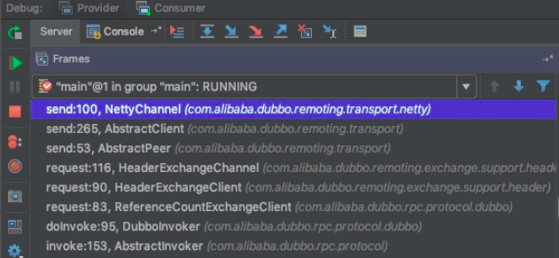
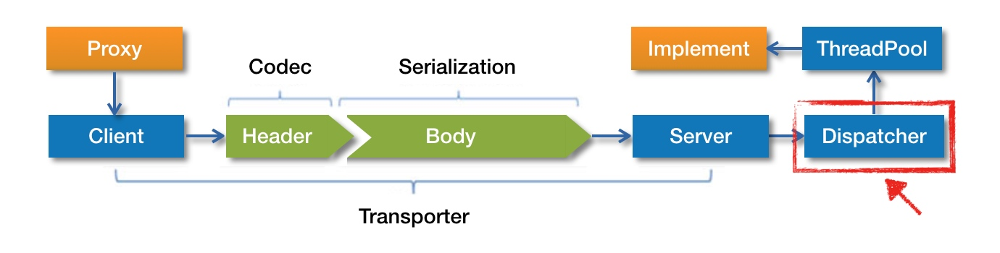

远程调用的过程：

首先服务消费者通过代理对象 Proxy 发起远程调用，接着通过网络客户端 Client 将编码后的请求发送给服务提供方的网络层上，也就是 Server。Server 在收到请求后，首先要做的事情是对数据包进行解码。然后将解码后的请求发送至分发器 Dispatcher，再由分发器将请求派发到指定的线程池上，最后由线程池调用具体的服务。这就是一个远程调用请求的发送与接收过程。

## 服务调用方式

Dubbo 支持同步和异步两种调用方式，其中异步调用还可细分为“有返回值”的异步调用和“无返回值”的异步调用。所谓“无返回值”异步调用是指服务消费方只管调用，但不关心调用结果，此时 Dubbo 会直接返回一个空的 RpcResult。若要使用异步特性，需要服务消费方手动进行配置。默认情况下，Dubbo 使用同步调用方式。


在介绍Consumer服务引入章节的最后部分中说过,dubbo最后会通过JavassistProxyFactory为invoker生成代理类,然后进行保存.当时为DemoService生成的代理类如下:

```java
public class proxy0 implements ClassGenerator.DC, EchoService, DemoService {
    // 方法数组
    public static Method[] methods;
    private InvocationHandler handler;

    public proxy0(InvocationHandler invocationHandler) {
        this.handler = invocationHandler;
    }

    public proxy0() {
    }

    public String sayHello(String string) {
        // 将参数存储到 Object 数组中
        Object[] arrobject = new Object[]{string};
        // 调用 InvocationHandler 实现类的 invoke 方法得到调用结果
        Object object = this.handler.invoke(this, methods[0], arrobject);
        // 返回调用结果
        return (String)object;
    }

    /** 回声测试方法 */
    public Object $echo(Object object) {
        Object[] arrobject = new Object[]{object};
        Object object2 = this.handler.invoke(this, methods[1], arrobject);
        return object2;
    }
}
```

就是调用InvocationHandler接口的invoke方法,并返回结果.

这里的InvokerHandler的实现类是什么?跟踪`JavassistProxyFactory`创建代理的过程就能看到,它代理方法放入的InvokerHandler为InvokerInvocationHandler类型,而参数的invoker是MockClusterInvoker类型(待会讲)

JavassistProxyFactory构造代理类的过程:

```java
//com.alibaba.dubbo.rpc.proxy.javassist.JavassistProxyFactory#getProxy
@Override
public <T> T getProxy(Invoker<T> invoker, Class<?>[] interfaces) {
    // 生成 Proxy 子类（Proxy 是抽象类）。并调用 Proxy 子类的 newInstance 方法创建 Proxy 实例
    return (T) Proxy.getProxy(interfaces).newInstance(new InvokerInvocationHandler(invoker));
}
```

先看一下这个InvocationHandler的实现类InvokerInvocationHandler的代码:

```java
public class InvokerInvocationHandler implements InvocationHandler {

    private final Invoker<?> invoker;

    public InvokerInvocationHandler(Invoker<?> handler) {
        this.invoker = handler;
    }

    @Override
    public Object invoke(Object proxy, Method method, Object[] args) throws Throwable {
        String methodName = method.getName();
        Class<?>[] parameterTypes = method.getParameterTypes();
        
        // 拦截定义在 Object 类中的方法（未被子类重写），比如 wait/notify
        if (method.getDeclaringClass() == Object.class) {
            return method.invoke(invoker, args);
        }
        
        // 如果 toString、hashCode 和 equals 等方法被子类重写了，这里也直接调用
        if ("toString".equals(methodName) && parameterTypes.length == 0) {
            return invoker.toString();
        }
        if ("hashCode".equals(methodName) && parameterTypes.length == 0) {
            return invoker.hashCode();
        }
        if ("equals".equals(methodName) && parameterTypes.length == 1) {
            return invoker.equals(args[0]);
        }
        
        // 将 method 和 args 封装到 RpcInvocation 中，并执行后续的调用
        return invoker.invoke(new RpcInvocation(method, args)).recreate();
    }
}
```

其实就是进行一系列检查后,调用invoker的invoke方法.

之前的章节讲过这里的invoke是聚合了多个服务提供端invoke的clusterInvoker.但经过代码跟踪就会发现,此时拿到的invoke并不是FailoverClusterInvoker等clusterInvoker的实现类,而是一个叫MockClusterInvoker的类型.

MockClusterInvoker包装了directory和clusterInvoker,另外MockClusterInvoker 内部封装了服务降级逻辑.

```java
public class MockClusterInvoker<T> implements Invoker<T> {
    
    private final Invoker<T> invoker; //FailoverClusterInvoker
    
    public Result invoke(Invocation invocation) throws RpcException {
        Result result = null;

        // 获取 mock 配置值
        String value = directory.getUrl().getMethodParameter(invocation.getMethodName(), Constants.MOCK_KEY, Boolean.FALSE.toString()).trim();
        if (value.length() == 0 || value.equalsIgnoreCase("false")) {
            // 无 mock 逻辑，直接调用其他 Invoker 对象的 invoke 方法，
            // 比如 FailoverClusterInvoker
            result = this.invoker.invoke(invocation);
        } else if (value.startsWith("force")) {
            // force:xxx 直接执行 mock 逻辑(服务降级)，不发起远程调用
            result = doMockInvoke(invocation, null);
        } else {
            // fail:xxx 表示消费方对调用服务失败后，再执行 mock 逻辑，不抛出异常
            try {
                // 调用其他 Invoker 对象的 invoke 方法
                result = this.invoker.invoke(invocation);
            } catch (RpcException e) {
                if (e.isBiz()) {
                    throw e;
                } else {
                    // 调用失败，执行 mock 逻辑(服务降级)
                    result = doMockInvoke(invocation, e);
                }
            }
        }
        return result;
    }
    
    // 省略其他方法
}
```

简单解释一下,url中没有mock配置时单纯调用Invoker的invoke(),如果mock配置为"force"时直接进行服务降级,如果不是"force",那么则在Invoker的invoke()调用失败后进行服务降级.服务降级逻辑doMockInvoke,在这里不分析.

无视这些降级操作,就是proxy会调用FailoverClusterInvoker的invoke方法.上一章说过了FailoverClusterInvoker通过负载均衡操作选择一个服务的invoker,此时选出的Invoker会是DubboInvoker类型的.

看到这里可能不记得这个DubboInvoker从哪来的,复习一下.Consumer服务引入时的中途过程如下:

```
		2. RegistryProtocol.doRefer()
				|
                4. directory.subscribe(subscribeURL) //订阅服务
                    |
                    1. 从注册中心获取providerURL
                    2. DubboProtocol#refer 创建与provider连接的netty客户端.<= 这里创建DubboInvoker
                    3. 返回invoker
				|
				5. cluster.join(directory);//如果该注册中心下有多个服务提供者,合并成一个invoker
```

也就是说在调用directry.subscribe()的时候会根据providerURL和subscribeURL构建netty客户端,并把这个客户端封装成DubboInvoker类型的invoker.具体参考之前讲Consumer服务引入那一章.

总而言之我们将通过FailoverClusterInvoker选择出了DubboInvoker并有它的父类AbstractInvoke调用它的doInvoke(),它才是真正进行远程调用的invoker.下面开始分析DubboInvoker:

```java
public class DubboInvoker<T> extends AbstractInvoker<T> {
    
    private final ExchangeClient[] clients;
    
    protected Result doInvoke(final Invocation invocation) throws Throwable {
        RpcInvocation inv = (RpcInvocation) invocation;
        final String methodName = RpcUtils.getMethodName(invocation);
        // 设置 path 和 version 到 attachment 中
        inv.setAttachment(Constants.PATH_KEY, getUrl().getPath());
        inv.setAttachment(Constants.VERSION_KEY, version);

        ExchangeClient currentClient;
        if (clients.length == 1) {
            // 从 clients 数组中获取 ExchangeClient
            currentClient = clients[0];
        } else {
            currentClient = clients[index.getAndIncrement() % clients.length];
        }
        try {
            // 获取异步配置
            boolean isAsync = RpcUtils.isAsync(getUrl(), invocation);
            // isOneway 为 true，表示“单向”通信
            boolean isOneway = RpcUtils.isOneway(getUrl(), invocation);
            int timeout = getUrl().getMethodParameter(methodName, Constants.TIMEOUT_KEY, Constants.DEFAULT_TIMEOUT);

            // 异步无返回值
            if (isOneway) {
                boolean isSent = getUrl().getMethodParameter(methodName, Constants.SENT_KEY, false);
                // 发送请求
                currentClient.send(inv, isSent);
                // 设置上下文中的 future 字段为 null
                RpcContext.getContext().setFuture(null);
                // 返回一个空的 RpcResult
                return new RpcResult();
            } 

            // 异步有返回值
            else if (isAsync) {
                // 发送请求，并得到一个 ResponseFuture 实例
                ResponseFuture future = currentClient.request(inv, timeout);
                // 设置 future 到上下文中
                RpcContext.getContext().setFuture(new FutureAdapter<Object>(future));
                // 暂时返回一个空结果
                return new RpcResult();
            } 

            // 同步调用
            else {
                RpcContext.getContext().setFuture(null);
                // 发送请求，得到一个 ResponseFuture 实例，并调用该实例的 get 方法进行等待
                return (Result) currentClient.request(inv, timeout).get();
            }
        } catch (TimeoutException e) {
            throw new RpcException(..., "Invoke remote method timeout....");
        } catch (RemotingException e) {
            throw new RpcException(..., "Failed to invoke remote method: ...");
        }
    }
    
    // 省略其他方法
}
```

概括一下就是

- 异步无返回值:上下文的future字段为null,返回空结果
- 异步有返回值:上下文的future字段为实际的future,返回空结果
- 同步调用:调用future的get进行阻塞,直到返回结果.

获取ResponseFuture时用到的currentClient为ExchangeClient类型,也就是netty客户端的封装.ResponseFuture 是一个接口，下面我们来看一下它的默认实现类 DefaultFuture 的源码。

```java
public class DefaultFuture implements ResponseFuture {
    
    private static final Map<Long, Channel> CHANNELS = 
        new ConcurrentHashMap<Long, Channel>();

    private static final Map<Long, DefaultFuture> FUTURES = 
        new ConcurrentHashMap<Long, DefaultFuture>();
    
    private final long id;
    private final Channel channel;
    private final Request request;
    private final int timeout;
    private final Lock lock = new ReentrantLock();
    private final Condition done = lock.newCondition();
    private volatile Response response;
    
    public DefaultFuture(Channel channel, Request request, int timeout) {
        this.channel = channel;
        this.request = request;
        
        // 获取请求 id，这个 id 很重要，后面还会见到
        this.id = request.getId();
        this.timeout = timeout > 0 ? timeout : channel.getUrl().getPositiveParameter(Constants.TIMEOUT_KEY, Constants.DEFAULT_TIMEOUT);
        // 存储 <requestId, DefaultFuture> 映射关系到 FUTURES 中
        FUTURES.put(id, this);
        CHANNELS.put(id, channel);
    }
    
    @Override
    public Object get() throws RemotingException {
        return get(timeout);
    }

    @Override
    public Object get(int timeout) throws RemotingException {
        if (timeout <= 0) {
            timeout = Constants.DEFAULT_TIMEOUT;
        }
        
        // 检测服务提供方是否成功返回了调用结果
        if (!isDone()) {
            long start = System.currentTimeMillis();
            lock.lock();
            try {
                // 循环检测服务提供方是否成功返回了调用结果
                while (!isDone()) {
                    // 如果调用结果尚未返回，这里等待一段时间
                    done.await(timeout, TimeUnit.MILLISECONDS);
                    // 如果调用结果成功返回，或等待超时，此时跳出 while 循环，执行后续的逻辑
                    if (isDone() || System.currentTimeMillis() - start > timeout) {
                        break;
                    }
                }
            } catch (InterruptedException e) {
                throw new RuntimeException(e);
            } finally {
                lock.unlock();
            }
            
            // 如果调用结果仍未返回，则抛出超时异常
            if (!isDone()) {
                throw new TimeoutException(sent > 0, channel, getTimeoutMessage(false));
            }
        }
        
        // 返回调用结果
        return returnFromResponse();
    }
    
    @Override
    public boolean isDone() {
        // 通过检测 response 字段为空与否，判断是否收到了调用结果
        return response != null;
    }
    
    private Object returnFromResponse() throws RemotingException {
        Response res = response;
        if (res == null) {
            throw new IllegalStateException("response cannot be null");
        }
        
        // 如果调用结果的状态为 Response.OK，则表示调用过程正常，服务提供方成功返回了调用结果
        if (res.getStatus() == Response.OK) {
            return res.getResult();
        }
        
        // 抛出异常
        if (res.getStatus() == Response.CLIENT_TIMEOUT || res.getStatus() == Response.SERVER_TIMEOUT) {
            throw new TimeoutException(res.getStatus() == Response.SERVER_TIMEOUT, channel, res.getErrorMessage());
        }
        throw new RemotingException(channel, res.getErrorMessage());
    }
    
    // 省略其他方法
}
```

也就是说当get()被调用时一直阻塞到response变量为非空为止.那么response变量是在什么时候被放入呢?是在DefaultFuture#received被调用的时候,在设置response变量的同时,把id从map中移除.那么什么时候DefaultFuture#received会被调用呢,是在HeaderExchangeHandler#handleResponse的时候被调用.这一部分稍后会进行分析.

异步模式中放入上下文的FutureAdapter 是什么呢? FutureAdapter 是一个适配器，用于将 Dubbo 中的 ResponseFuture 与 JDK 中的 Future 进行适配。这样当用户线程调用 Future 的 get 方法时，经过 FutureAdapter 适配，最终会调用 ResponseFuture 实现类对象的 get 方法，也就是 DefaultFuture 的 get 方法。

## 服务消费方发送请求

### 发送请求



发送请求时的调用链如上

```
DubboInvoker#doInvoke -> ReferenceCountExchangeClient#request -> HeaderExchangeClient#request
-> HeaderExchangeChannel#request -> AbstractPeer#send -> AbstractClient#send -> NettyChannel#send
```

下面开始是逐步调用request方法的过程.request方法的参数为`public ResponseFuture request(Object request)`看到这里的时候可能已经不记得这个Object是什么了.这里的Object是 封装了method 和 args 的 **RpcInvocation** .在InvokerInvocationHandler#invoke中被放入的.

下面开始逐步分析.

#### ReferenceCountExchangeClient

ReferenceCountExchangeClient的request就是简单调用HeaderExchangeClient#request.

ReferenceCountExchangeClient 内部定义了一个引用计数变量 referenceCount，每当该对象被引用一次 referenceCount 都会进行自增。每当 close 方法被调用时，referenceCount 进行自减。ReferenceCountExchangeClient 内部仅实现了一个引用计数的功能，其他方法并无复杂逻辑，均是直接调用被装饰对象也就是HeaderExchangeClient的相关方法。

#### HeaderExchangeClient

接下来是HeaderExchangeClient.它与ReferenceCountExchangeClient相似,也是简单调用下一层的HeaderExchangeChannel#request.与ReferenceCountExchangeClient的引用计数相比,它的功能是加入心跳检测的逻辑,心跳检测会在构造方法中被开启,close()被调用后停止:

```java
public class HeaderExchangeClient implements ExchangeClient {

    private static final ScheduledThreadPoolExecutor scheduled = new ScheduledThreadPoolExecutor(2, new NamedThreadFactory("dubbo-remoting-client-heartbeat", true));
    private final Client client;
    private final ExchangeChannel channel;
    private ScheduledFuture<?> heartbeatTimer;
    private int heartbeat;
    private int heartbeatTimeout;

    public HeaderExchangeClient(Client client, boolean needHeartbeat) {
        if (client == null) {
            throw new IllegalArgumentException("client == null");
        }
        this.client = client;
        
        // 创建 HeaderExchangeChannel 对象
        this.channel = new HeaderExchangeChannel(client);
        
        // 以下代码均与心跳检测逻辑有关
        String dubbo = client.getUrl().getParameter(Constants.DUBBO_VERSION_KEY);
        this.heartbeat = client.getUrl().getParameter(Constants.HEARTBEAT_KEY, dubbo != null && dubbo.startsWith("1.0.") ? Constants.DEFAULT_HEARTBEAT : 0);
        this.heartbeatTimeout = client.getUrl().getParameter(Constants.HEARTBEAT_TIMEOUT_KEY, heartbeat * 3);
        if (heartbeatTimeout < heartbeat * 2) {
            throw new IllegalStateException("heartbeatTimeout < heartbeatInterval * 2");
        }
        if (needHeartbeat) {
            // 开启心跳检测定时器
            startHeartbeatTimer();
        }
    }
    
        @Override
    public void close() {
        doClose();
        channel.close();
    }
    
    private void doClose() {
        // 停止心跳检测定时器
        stopHeartbeatTimer();
    }

    private void startHeartbeatTimer() {
        stopHeartbeatTimer();
        if (heartbeat > 0) {
            heartbeatTimer = scheduled.scheduleWithFixedDelay(
                    new HeartBeatTask(new HeartBeatTask.ChannelProvider() {
                        @Override
                        public Collection<Channel> getChannels() {
                            return Collections.<Channel>singletonList(HeaderExchangeClient.this);
                        }
                    }, heartbeat, heartbeatTimeout),
                    heartbeat, heartbeat, TimeUnit.MILLISECONDS);
        }
    }

    private void stopHeartbeatTimer() {
        if (heartbeatTimer != null && !heartbeatTimer.isCancelled()) {
            try {
                heartbeatTimer.cancel(true);
                scheduled.purge();
            } catch (Throwable e) {
                if (logger.isWarnEnabled()) {
                    logger.warn(e.getMessage(), e);
                }
            }
        }
        heartbeatTimer = null;
    }
    // 省略部分方法
}

```

接下来看它调用的下层:

#### HeaderExchangeChannel

```java
final class HeaderExchangeChannel implements ExchangeChannel {
    
    private final Channel channel;
    
    HeaderExchangeChannel(Channel channel) {
        if (channel == null) {
            throw new IllegalArgumentException("channel == null");
        }
        
        // 这里的 channel 指向的是 NettyClient
        this.channel = channel;
    }
    
    @Override
    public ResponseFuture request(Object request) throws RemotingException {
        return request(request, channel.getUrl().getPositiveParameter(Constants.TIMEOUT_KEY, Constants.DEFAULT_TIMEOUT));
    }

    @Override
    public ResponseFuture request(Object request, int timeout) throws RemotingException {
        if (closed) {
            throw new RemotingException(..., "Failed to send request ...);
        }
        // 创建 Request 对象
        Request req = new Request();
        req.setVersion(Version.getProtocolVersion());
        // 设置双向通信标志为 true
        req.setTwoWay(true);
        // 这里的 request 变量类型为 RpcInvocation
        req.setData(request);
                                        
        // 创建 DefaultFuture 对象
        DefaultFuture future = new DefaultFuture(channel, req, timeout);
        try {
            // 调用 NettyClient 的 send 方法发送请求
            channel.send(req);
        } catch (RemotingException e) {
            future.cancel();
            throw e;
        }
        // 返回 DefaultFuture 对象
        return future;
    }
}
```

在HeaderExchangeChannel中RpcInvoker与一系列信息一同被封装到了Request对象中.下面终于能调用NettyClient的send方法发送Request对象了.

需要说明的是，NettyClient 中并未实现 send 方法，该方法继承自父类 AbstractPeer，下面直接分析 AbstractPeer 的代码。

#### AbstractPeer,AbstractClient

```java
public abstract class AbstractPeer implements Endpoint, ChannelHandler {
    
    @Override
    public void send(Object message) throws RemotingException {
        // 该方法由 AbstractClient 类实现
        send(message, url.getParameter(Constants.SENT_KEY, false));
    }
    
    // 省略其他方法
}

public abstract class AbstractClient extends AbstractEndpoint implements Client {
    
    @Override
    public void send(Object message, boolean sent) throws RemotingException {
        if (send_reconnect && !isConnected()) {
            connect();
        }
        
        // 获取 Channel，getChannel 是一个抽象方法，具体由子类实现
        Channel channel = getChannel();//获取nettyChannel类型对象
        if (channel == null || !channel.isConnected()) {
            throw new RemotingException(this, "message can not send ...");
        }
        
        // 继续向下调用
        channel.send(message, sent);
    }
    
    protected abstract Channel getChannel();
    
    // 省略其他方法
}
```


简单看一下AbstractClient(NettyClient)调用getChannel获取NettyChannel的过程

```java
public class NettyClient extends AbstractClient {
    
    // 这里的 Channel 全限定名称为 org.jboss.netty.channel.Channel
    private volatile Channel channel;//doConnect()的时候拿到的

    @Override
    protected com.alibaba.dubbo.remoting.Channel getChannel() {
        Channel c = channel;
        if (c == null || !c.isConnected())
            return null;
        // 获取一个 NettyChannel 类型对象
        return NettyChannel.getOrAddChannel(c, getUrl(), this);
    }
}

final class NettyChannel extends AbstractChannel {

    private static final ConcurrentMap<org.jboss.netty.channel.Channel, NettyChannel> channelMap = 
        new ConcurrentHashMap<org.jboss.netty.channel.Channel, NettyChannel>();

    private final org.jboss.netty.channel.Channel channel;
    
    /** 私有构造方法 */
    private NettyChannel(org.jboss.netty.channel.Channel channel, URL url, ChannelHandler handler) {
        super(url, handler);
        if (channel == null) {
            throw new IllegalArgumentException("netty channel == null;");
        }
        this.channel = channel;
    }

    static NettyChannel getOrAddChannel(org.jboss.netty.channel.Channel ch, URL url, ChannelHandler handler) {
        if (ch == null) {
            return null;
        }
        
        // 尝试从集合中获取 NettyChannel 实例
        NettyChannel ret = channelMap.get(ch);
        if (ret == null) {
            // 如果 ret = null，则创建一个新的 NettyChannel 实例
            NettyChannel nc = new NettyChannel(ch, url, handler);
            if (ch.isConnected()) {
                // 将 <Channel, NettyChannel> 键值对存入 channelMap 集合中
                ret = channelMap.putIfAbsent(ch, nc);
            }
            if (ret == null) {
                ret = nc;
            }
        }
        return ret;
    }
}
```

获取到 NettyChannel 实例后，即可进行后续的调用。下面看一下 NettyChannel 的 send 方法。

#### NettyChannel

提醒一下参数的`Object message`是什么.是放了RPCInvoker和一系列通信信息的**Request**对象.

```java
public void send(Object message, boolean sent) throws RemotingException {
    super.send(message, sent);

    boolean success = true;
    int timeout = 0;
    try {
        // 发送消息(包含请求和响应消息)
        ChannelFuture future = channel.write(message);
        
        // sent 的值源于 <dubbo:method sent="true/false" /> 中 sent 的配置值，有两种配置值：
        //   1. true: 等待消息发出，消息发送失败将抛出异常
        //   2. false: 不等待消息发出，将消息放入 IO 队列，即刻返回
        // 默认情况下 sent = false；
        if (sent) {
            timeout = getUrl().getPositiveParameter(Constants.TIMEOUT_KEY, Constants.DEFAULT_TIMEOUT);
            // 等待消息发出，若在规定时间没能发出，success 会被置为 false
            success = future.await(timeout);
        }
        Throwable cause = future.getCause();
        if (cause != null) {
            throw cause;
        }
    } catch (Throwable e) {
        throw new RemotingException(this, "Failed to send message ...");
    }

    // 若 success 为 false，这里抛出异常
    if (!success) {
        throw new RemotingException(this, "Failed to send message ...");
    }
}
```

经历多次调用，到这里请求数据的发送过程就结束了，过程漫长。为了便于大家阅读代码，这里以 DemoService 为例，将 sayHello 方法的整个调用路径贴出来。

```
proxy0#sayHello(String)
  —> InvokerInvocationHandler#invoke(Object, Method, Object[]) //进行检查,把method 和 args 封装到 RpcInvocation 中传给下面
    —> MockClusterInvoker#invoke(Invocation) //有必要的话进行降权操作
    --- 本章没有解释的部分 .通过负载均衡在clusterInvoker中选出一个invoker.并调用它的invoke方法
      —> AbstractClusterInvoker#invoke(Invocation)
        —> FailoverClusterInvoker#doInvoke(Invocation, List<Invoker<T>>, LoadBalance)
          —> Filter#invoke(Invoker, Invocation)  // 包含多个 Filter 调用
            —> ListenerInvokerWrapper#invoke(Invocation) 
            ---
              —> AbstractInvoker#invoke(Invocation) 
                —> DubboInvoker#doInvoke(Invocation)//调用ExchangeClient的request().根据用户的设置(异步还是同步)进行不同的后续工作
                  —> ReferenceCountExchangeClient#request(Object, int)//加入引用计数机制,调用下层
                    —> HeaderExchangeClient#request(Object, int)//加入心跳机制,调用下层
                      —> HeaderExchangeChannel#request(Object, int)//把RPCInvoker封装为Request对象,创建future.调用nettyClient的send()发送Request
                        —> AbstractPeer#send(Object)//nettyClient的父类.直接传递给AbstractClient
                          —> AbstractClient#send(Object, boolean)//获取nettyChannel类型对象,调用它的send方法.
                            —> NettyChannel#send(Object, boolean)//参数为Request对象.调用Channel的write写出Request对象
                              —> NioClientSocketChannel#write(Object)
```

### 请求编码

在分析请求编码逻辑之前，我们先来看一下 Dubbo 数据包结构。


Dubbo 数据包分为消息头和消息体，消息头用于存储一些元信息，比如魔数（Magic），数据包类型（Request/Response），消息体长度（Data Length）等。消息体中用于存储具体的调用消息，比如方法名称，参数列表等。下面简单列举一下消息头的内容。

| 偏移量(Bit) | 字段         | 取值                                                         |
| ----------- | ------------ | ------------------------------------------------------------ |
| 0 ~ 7       | 魔数高位     | 0xda00                                                       |
| 8 ~ 15      | 魔数低位     | 0xbb                                                         |
| 16          | 数据包类型   | 0 - Response, 1 - Request                                    |
| 17          | 调用方式     | 仅在第16位被设为1的情况下有效，0 - 单向调用，1 - 双向调用    |
| 18          | 事件标识     | 0 - 当前数据包是请求或响应包，1 - 当前数据包是心跳包         |
| 19 ~ 23     | 序列化器编号 | 2 - Hessian2Serialization 3 - JavaSerialization 4 - CompactedJavaSerialization 6 - FastJsonSerialization 7 - NativeJavaSerialization 8 - KryoSerialization 9 - FstSerialization |
| 24 ~ 31     | 状态         | 20 - OK 30 - CLIENT_TIMEOUT 31 - SERVER_TIMEOUT 40 - BAD_REQUEST 50 - BAD_RESPONSE ...... |
| 32 ~ 95     | 请求编号     | 共8字节，运行时生成                                          |
| 96 ~ 127    | 消息体长度   | 运行时计算                                                   |

了解了 Dubbo 数据包格式，接下来我们就可以探索编码过程了。在进行编码类的分析之前,先来回顾一下编码类是在什么时候被创建,并放入pipeline的.

对netty了解的话都知道,netty在启动前都需要在pipeline中添加编码器的和解码器.Dubbo的netty服务器,客户端的创建分别在NettyServer和NettyClient类中,因为添加编码器的过程两者类似,这里只介绍客户端的

NettyClient的启动方法doOpen()的代码如下

```java
    @Override
    protected void doOpen() throws Throwable {
		// ${创建bootStrap,放入option}
        bootstrap.setPipelineFactory(new ChannelPipelineFactory() {
            @Override
            public ChannelPipeline getPipeline() {
                //getCodec()获取编解码器.创建NettyCodecAdapter
                NettyCodecAdapter adapter = new NettyCodecAdapter(getCodec(), getUrl(), NettyClient.this);
                ChannelPipeline pipeline = Channels.pipeline();
                pipeline.addLast("decoder", adapter.getDecoder());
                pipeline.addLast("encoder", adapter.getEncoder());
                pipeline.addLast("handler", nettyHandler);
                return pipeline;
            }
        });
    }
```

getCodec()在其父类AbstractEndpoint的代码中.codec是在它初始化时根据url中的codec参数,通过SPI创建对应的codec.示例的sayHello的url的codec是"dubbo".所以加入pipeline的codec的类型为**DubboCodec**.

我们先从它的父类**ExchangeCodec**开始分析

```java
public class ExchangeCodec extends TelnetCodec {

    // 消息头长度
    protected static final int HEADER_LENGTH = 16;
    // 魔数内容
    protected static final short MAGIC = (short) 0xdabb;
    protected static final byte MAGIC_HIGH = Bytes.short2bytes(MAGIC)[0];
    protected static final byte MAGIC_LOW = Bytes.short2bytes(MAGIC)[1];
    protected static final byte FLAG_REQUEST = (byte) 0x80;
    protected static final byte FLAG_TWOWAY = (byte) 0x40;
    protected static final byte FLAG_EVENT = (byte) 0x20;
    protected static final int SERIALIZATION_MASK = 0x1f;
    private static final Logger logger = LoggerFactory.getLogger(ExchangeCodec.class);

    public Short getMagicCode() {
        return MAGIC;
    }

    @Override
    public void encode(Channel channel, ChannelBuffer buffer, Object msg) throws IOException {
        if (msg instanceof Request) {
            // 对 Request 对象进行编码
            encodeRequest(channel, buffer, (Request) msg);
        } else if (msg instanceof Response) {
            // 对 Response 对象进行编码，后面分析
            encodeResponse(channel, buffer, (Response) msg);
        } else {
            super.encode(channel, buffer, msg);
        }
    }

    protected void encodeRequest(Channel channel, ChannelBuffer buffer, Request req) throws IOException {
        Serialization serialization = getSerialization(channel);
        // 创建消息头字节数组，长度为 16
        byte[] header = new byte[HEADER_LENGTH];
        // 设置魔数
        Bytes.short2bytes(MAGIC, header);

        // 设置数据包类型（Request/Response）和序列化器编号
        header[2] = (byte) (FLAG_REQUEST | serialization.getContentTypeId());

        // 设置通信方式(单向/双向)
        if (req.isTwoWay()) header[2] |= FLAG_TWOWAY;
        // 设置事件标识
        if (req.isEvent()) header[2] |= FLAG_EVENT;

        // 设置请求编号，8个字节，从第4个字节开始设置
        Bytes.long2bytes(req.getId(), header, 4);

        // 获取 buffer 当前的写位置
        int savedWriteIndex = buffer.writerIndex();
        // 更新 writerIndex，为消息头预留 16 个字节的空间.留着待会写header
        buffer.writerIndex(savedWriteIndex + HEADER_LENGTH);
        ChannelBufferOutputStream bos = new ChannelBufferOutputStream(buffer);
        // 创建序列化器，比如 Hessian2ObjectOutput
        ObjectOutput out = serialization.serialize(channel.getUrl(), bos);
        if (req.isEvent()) {
            // 对事件数据进行序列化操作
            encodeEventData(channel, out, req.getData());
        } else {
            // 对请求数据进行序列化操作.注意这里的data为RpcInvoker类型
            encodeRequestData(channel, out, req.getData(), req.getVersion());
        }
        out.flushBuffer();
        if (out instanceof Cleanable) {
            ((Cleanable) out).cleanup();
        }
        bos.flush();
        bos.close();

        // 获取写入的字节数，也就是消息体长度
        int len = bos.writtenBytes();
        checkPayload(channel, len);

        // 将消息体长度写入到消息头中
        Bytes.int2bytes(len, header, 12);

        // 将 buffer 指针移动到 savedWriteIndex，应当开始写入header的地方
        buffer.writerIndex(savedWriteIndex);
        buffer.writeBytes(header); // 写入header
        //把指针移到消息的末尾. writerIndex = 原写下标 + 消息头长度 + 消息体长度
        buffer.writerIndex(savedWriteIndex + HEADER_LENGTH + len);
    }
    
    // 省略其他方法
}
```

上面方法中我们调用encodeRequestData()对Request的data,也就是RpcInvoker进行了序列化.下面看一下它的序列化过程,这一部分是在DubboCodec中实现.

```java
public class DubboCodec extends ExchangeCodec implements Codec2 {
    
	protected void encodeRequestData(Channel channel, ObjectOutput out, Object data, String version) throws IOException {
        RpcInvocation inv = (RpcInvocation) data;

        // 依次序列化 dubbo version、path、version
        out.writeUTF(version);
        out.writeUTF(inv.getAttachment(Constants.PATH_KEY));
        out.writeUTF(inv.getAttachment(Constants.VERSION_KEY));

        // 序列化调用方法名
        out.writeUTF(inv.getMethodName());
        // 将参数类型转换为字符串，并进行序列化
        out.writeUTF(ReflectUtils.getDesc(inv.getParameterTypes()));
        Object[] args = inv.getArguments();
        if (args != null)
            for (int i = 0; i < args.length; i++) {
                // 对运行时参数进行序列化
                out.writeObject(encodeInvocationArgument(channel, inv, i));
            }
        
        // 序列化 attachments
        out.writeObject(inv.getAttachments());
    }
}
```

非常简单,就是依次把方法名和方法参数进行序列化,并放入out里面.

至此，关于服务消费方发送请求的过程就分析完了，接下来我们来看一下服务提供方是如何接收请求的。

## 服务提供方接收请求

### 请求解码

当netty服务端(提供者)收到来自客户端(消费者)的请求时通过pipeline,调用DubboCodec的decode()方法.逻辑如下:

```java
public class ExchangeCodec extends TelnetCodec {
    
    @Override
    public Object decode(Channel channel, ChannelBuffer buffer) throws IOException {
        int readable = buffer.readableBytes();
        // 创建消息头字节数组
        byte[] header = new byte[Math.min(readable, HEADER_LENGTH)];
        // 读取消息头数据
        buffer.readBytes(header);
        // 调用重载方法进行后续解码工作
        return decode(channel, buffer, readable, header);
    }

    @Override
    protected Object decode(Channel channel, ChannelBuffer buffer, int readable, byte[] header) throws IOException {
        // 检查魔数是否相等
        if (readable > 0 && header[0] != MAGIC_HIGH
                || readable > 1 && header[1] != MAGIC_LOW) {
            int length = header.length;
            if (header.length < readable) {
                header = Bytes.copyOf(header, readable);
                buffer.readBytes(header, length, readable - length);
            }
            for (int i = 1; i < header.length - 1; i++) {
                if (header[i] == MAGIC_HIGH && header[i + 1] == MAGIC_LOW) {
                    buffer.readerIndex(buffer.readerIndex() - header.length + i);
                    header = Bytes.copyOf(header, i);
                    break;
                }
            }
            // 通过 telnet 命令行发送的数据包不包含消息头，所以这里
            // 调用 TelnetCodec 的 decode 方法对数据包进行解码
            return super.decode(channel, buffer, readable, header);
        }
        
        // 检测可读数据量是否少于消息头长度，若小于则立即返回 DecodeResult.NEED_MORE_INPUT
        if (readable < HEADER_LENGTH) {
            return DecodeResult.NEED_MORE_INPUT;
        }

        // 从消息头中获取消息体长度
        int len = Bytes.bytes2int(header, 12);
        // 检测消息体长度是否超出限制，超出则抛出异常
        checkPayload(channel, len);

        int tt = len + HEADER_LENGTH;
        // 检测可读的字节数是否小于实际的字节数
        if (readable < tt) {
            return DecodeResult.NEED_MORE_INPUT;
        }
        
        ChannelBufferInputStream is = new ChannelBufferInputStream(buffer, len);

        try {
            // 继续进行解码工作
            return decodeBody(channel, is, header);
        } finally {
            if (is.available() > 0) {
                try {
                    StreamUtils.skipUnusedStream(is);
                } catch (IOException e) {
                    logger.warn(e.getMessage(), e);
                }
            }
        }
    }
}
```

上面方法通过检测消息头中的魔数是否与规定的魔数相等，提前拦截掉非常规数据包，比如通过 telnet 命令行发出的数据包。运行时 DubboCodec 中的 decodeBody 方法会被调用。此时将会进行复原Request对象的操作.

```java
public class DubboCodec extends ExchangeCodec implements Codec2 {

    @Override
    protected Object decodeBody(Channel channel, InputStream is, byte[] header) throws IOException {
        // 获取消息头中的第三个字节，并通过逻辑与运算得到序列化器编号
        byte flag = header[2], proto = (byte) (flag & SERIALIZATION_MASK);
        Serialization s = CodecSupport.getSerialization(channel.getUrl(), proto);
        // 获取调用编号
        long id = Bytes.bytes2long(header, 4);
        // 通过逻辑与运算得到调用类型，0 - Response，1 - Request
        if ((flag & FLAG_REQUEST) == 0) {
            // 对响应结果进行解码，得到 Response 对象。这个非本节内容，后面再分析
            // ...
        } else {
            // 创建 Request 对象
            Request req = new Request(id);
            req.setVersion(Version.getProtocolVersion());
            // 通过逻辑与运算得到通信方式，并设置到 Request 对象中
            req.setTwoWay((flag & FLAG_TWOWAY) != 0);
            
            // 通过位运算检测数据包是否为事件类型
            if ((flag & FLAG_EVENT) != 0) {
                // 设置心跳事件到 Request 对象中
                req.setEvent(Request.HEARTBEAT_EVENT);
            }
            try {
                Object data;
                if (req.isHeartbeat()) {
                    // 对心跳包进行解码，该方法已被标注为废弃
                    data = decodeHeartbeatData(channel, deserialize(s, channel.getUrl(), is));
                } else if (req.isEvent()) {
                    // 对事件数据进行解码
                    data = decodeEventData(channel, deserialize(s, channel.getUrl(), is));
                } else {
                    DecodeableRpcInvocation inv;
                    // 根据 url 参数判断是否在 IO 线程上对消息体进行解码
                    if (channel.getUrl().getParameter(
                            Constants.DECODE_IN_IO_THREAD_KEY,
                            Constants.DEFAULT_DECODE_IN_IO_THREAD)) {
                        inv = new DecodeableRpcInvocation(channel, req, is, proto);
                        // 在当前线程，也就是 IO 线程上进行后续的解码工作。此工作完成后，可将
                        // 调用方法名、attachment、以及调用参数解析出来
                        inv.decode();
                    } else {
                        // 仅创建 DecodeableRpcInvocation 对象，但不在当前线程上执行解码逻辑
                        inv = new DecodeableRpcInvocation(channel, req,
                                new UnsafeByteArrayInputStream(readMessageData(is)), proto);
                    }
                    data = inv;
                }
                
                // 设置 data 到 Request 对象中
                req.setData(data);
            } catch (Throwable t) {
                // 若解码过程中出现异常，则将 broken 字段设为 true，
                // 并将异常对象设置到 Reqeust 对象中
                req.setBroken(true);
                req.setData(t);
            }
            return req;
        }
    }
}
```

我们知道Request的Data部分是RpcInvoker.而在上面代码中,默认情况下(如sayHello示例)通过DecodeableRpcInvocation 的 decode 方法直接在这里对RpcInvoker进行解码,构建RpcInvoker对象.并放入到Request.

下面我们来看一下 DecodeableRpcInvocation 的 decode 方法逻辑。

```java
//DecodeableRpcInvocation是RpcInvocation的子类
public class DecodeableRpcInvocation extends RpcInvocation implements Codec, Decodeable {
    
    @Override
    public Object decode(Channel channel, InputStream input) throws IOException {
        ObjectInput in = CodecSupport.getSerialization(channel.getUrl(), serializationType)
                .deserialize(channel.getUrl(), input);

        // 通过反序列化得到 dubbo version，并保存到 attachments 变量中
        String dubboVersion = in.readUTF();
        request.setVersion(dubboVersion);
        setAttachment(Constants.DUBBO_VERSION_KEY, dubboVersion);

        // 通过反序列化得到 path，version，并保存到 attachments 变量中
        setAttachment(Constants.PATH_KEY, in.readUTF());
        setAttachment(Constants.VERSION_KEY, in.readUTF());

        // 通过反序列化得到调用方法名
        setMethodName(in.readUTF());
        try {
            Object[] args;
            Class<?>[] pts;
            // 通过反序列化得到参数类型字符串，比如 Ljava/lang/String;
            String desc = in.readUTF();//desc = Ljava/lang/String;
            if (desc.length() == 0) {
                pts = DubboCodec.EMPTY_CLASS_ARRAY;
                args = DubboCodec.EMPTY_OBJECT_ARRAY;
            } else {
                // 将 desc 解析为参数类型数组
                pts = ReflectUtils.desc2classArray(desc);//pts[0] = java.lang.String
                args = new Object[pts.length];
                for (int i = 0; i < args.length; i++) {
                    try {
                        // 解析运行时参数
                        args[i] = in.readObject(pts[i]);// "world"
                    } catch (Exception e) {
                        if (log.isWarnEnabled()) {
                            log.warn("Decode argument failed: " + e.getMessage(), e);
                        }
                    }
                }
            }
            // 设置参数类型数组
            setParameterTypes(pts);//java.lang.String

            // 通过反序列化得到原 attachment 的内容
            Map<String, String> map = (Map<String, String>) in.readObject(Map.class);
            if (map != null && map.size() > 0) {
                Map<String, String> attachment = getAttachments();
                if (attachment == null) {
                    attachment = new HashMap<String, String>();
                }
                // 将 map 与当前对象中的 attachment 集合进行融合
                attachment.putAll(map);
                setAttachments(attachment);
            }
            // 对 callback 类型的参数进行处理
            for (int i = 0; i < args.length; i++) {
                args[i] = decodeInvocationArgument(channel, this, pts, i, args[i]);
            }

            // 设置参数列表
            setArguments(args);//"world"

        } catch (ClassNotFoundException e) {
            throw new IOException(StringUtils.toString("Read invocation data failed.", e));
        } finally {
            if (in instanceof Cleanable) {
                ((Cleanable) in).cleanup();
            }
        }
        return this;
    }
}
```

如上,上面的方法通过反序列化将诸如 path、version、调用方法名、参数列表等信息依次解析出来，并设置到相应的字段中.

到这里，请求数据解码的过程就分析完了。此时我们得到了一个 Request 对象，这个对象会被传送到下一个入站处理器中，我们继续往下看。

### 服务调用

在创建netty服务端时,在pipeline的末尾加入了nettyHandler (请参考NettyServer#doOpen ).所以,解码器将数据包解析成 Request 对象后，NettyHandler 的 messageReceived 方法紧接着会收到这个对象，并将这个对象继续向下传递。最后由 AllChannelHandler 将该对象封装到 Runnable 实现类对象中，并将 Runnable 放入线程池中执行后续的调用逻辑。

```
NettyHandler#messageReceived(ChannelHandlerContext, MessageEvent)
  —> AbstractPeer#received(Channel, Object)
    —> MultiMessageHandler#received(Channel, Object)
      —> HeartbeatHandler#received(Channel, Object)
        —> AllChannelHandler#received(Channel, Object)
          —> ExecutorService#execute(Runnable)    // 由线程池执行后续的调用逻辑
```

#### NettyHandler

这里我们直接分析调用栈中的分析第一个和最后一个调用方法逻辑。如下：

```java
@Sharable
public class NettyHandler extends SimpleChannelHandler {
    
    private final Map<String, Channel> channels = new ConcurrentHashMap<String, Channel>();

    private final URL url;

    private final ChannelHandler handler;
    
    public NettyHandler(URL url, ChannelHandler handler) {
        if (url == null) {
            throw new IllegalArgumentException("url == null");
        }
        if (handler == null) {
            throw new IllegalArgumentException("handler == null");
        }
        this.url = url;
        
        // 这里的 handler 类型为 NettyServer
        this.handler = handler;
    }
    
	public void messageReceived(ChannelHandlerContext ctx, MessageEvent e) throws Exception {
        // 获取 NettyChannel
        NettyChannel channel = NettyChannel.getOrAddChannel(ctx.getChannel(), url, handler);
        try {
            // 继续向下调用
            handler.received(channel, e.getMessage());
        } finally {
            NettyChannel.removeChannelIfDisconnected(ctx.getChannel());
        }
    }
}
```

下面再来看看 AllChannelHandler 的逻辑，在详细分析代码之前，我们先来了解一下 Dubbo 中的线程派发模型。

#### 线程派发模型

Dubbo 将底层通信框架中接收请求的线程称为 IO 线程。如果一些事件处理逻辑可以很快执行完，比如只在内存打一个标记，此时直接在 IO 线程上执行该段逻辑即可。但如果事件的处理逻辑比较耗时，比如该段逻辑会发起数据库查询或者 HTTP 请求。此时我们就不应该让事件处理逻辑在 IO 线程上执行，而是应该派发到线程池中去执行。原因也很简单，IO 线程主要用于接收请求，如果 IO 线程被占满，将导致它不能接收新的请求。

以上就是线程派发的背景，下面我们再来通过 Dubbo 调用图，看一下线程派发器所处的位置。



如上图，红框中的 Dispatcher 就是线程派发器。需要说明的是，Dispatcher 真实的职责创建具有线程派发能力的 ChannelHandler，比如 AllChannelHandler、MessageOnlyChannelHandler 和 ExecutionChannelHandler 等，其本身并不具备线程派发能力。Dubbo 支持 5 种不同的线程派发策略，下面通过一个表格列举一下。

| 策略       | 用途                                                         |
| ---------- | ------------------------------------------------------------ |
| all        | 所有消息都派发到线程池，包括请求，响应，连接事件，断开事件等 |
| direct     | 所有消息都不派发到线程池，全部在 IO 线程上直接执行           |
| message    | 只有**请求**和**响应**消息派发到线程池，其它消息均在 IO 线程上执行 |
| execution  | 只有**请求**消息派发到线程池，不含响应。其它消息均在 IO 线程上执行 |
| connection | 在 IO 线程上，将连接断开事件放入队列，有序逐个执行，其它消息派发到线程池 |

默认配置下，Dubbo 使用 `all` 派发策略，即将所有的消息都派发到线程池中。

#### AllChannelHandler

下面我们来分析一下 AllChannelHandler 的代码。

```java
public class AllChannelHandler extends WrappedChannelHandler {

    public AllChannelHandler(ChannelHandler handler, URL url) {
        super(handler, url);
    }

    /** 处理连接事件 */
    @Override
    public void connected(Channel channel) throws RemotingException {
        // 获取线程池
        ExecutorService cexecutor = getExecutorService();
        try {
            // 将连接事件派发到线程池中处理
            cexecutor.execute(new ChannelEventRunnable(channel, handler, ChannelState.CONNECTED));
        } catch (Throwable t) {
            throw new ExecutionException(..., " error when process connected event .", t);
        }
    }

    /** 处理断开事件 */
    @Override
    public void disconnected(Channel channel) throws RemotingException {
        ExecutorService cexecutor = getExecutorService();
        try {
            cexecutor.execute(new ChannelEventRunnable(channel, handler, ChannelState.DISCONNECTED));
        } catch (Throwable t) {
            throw new ExecutionException(..., "error when process disconnected event .", t);
        }
    }

    /** 处理请求和响应消息，这里的 message 变量类型可能是 Request，也可能是 Response */
    @Override
    public void received(Channel channel, Object message) throws RemotingException {
        ExecutorService cexecutor = getExecutorService();
        try {
            // 将请求和响应消息派发到线程池中处理
            cexecutor.execute(new ChannelEventRunnable(channel, handler, ChannelState.RECEIVED, message));
        } catch (Throwable t) {
            if(message instanceof Request && t instanceof RejectedExecutionException){
                Request request = (Request)message;
                // 如果通信方式为双向通信，此时将 Server side ... threadpool is exhausted 
                // 错误信息封装到 Response 中，并返回给服务消费方。
                if(request.isTwoWay()){
                    String msg = "Server side(" + url.getIp() + "," + url.getPort() 
                        + ") threadpool is exhausted ,detail msg:" + t.getMessage();
                    Response response = new Response(request.getId(), request.getVersion());
                    response.setStatus(Response.SERVER_THREADPOOL_EXHAUSTED_ERROR);
                    response.setErrorMessage(msg);
                    // 返回包含错误信息的 Response 对象
                    channel.send(response);
                    return;
                }
            }
            throw new ExecutionException(..., " error when process received event .", t);
        }
    }

    /** 处理异常信息 */
    @Override
    public void caught(Channel channel, Throwable exception) throws RemotingException {
        ExecutorService cexecutor = getExecutorService();
        try {
            cexecutor.execute(new ChannelEventRunnable(channel, handler, ChannelState.CAUGHT, exception));
        } catch (Throwable t) {
            throw new ExecutionException(..., "error when process caught event ...");
        }
    }
}
```

如上，请求对象会被封装 ChannelEventRunnable 中，ChannelEventRunnable 将会是服务调用过程的新起点。

```java
public class ChannelEventRunnable implements Runnable {
    
    private final ChannelHandler handler;
    private final Channel channel;
    private final ChannelState state;
    private final Throwable exception;
    private final Object message;
    
    @Override
    public void run() {
        // 检测通道状态，对于请求或响应消息，此时 state = RECEIVED
        if (state == ChannelState.RECEIVED) {
            try {
                // 将 channel 和 message 传给 ChannelHandler 对象，进行后续的调用
                handler.received(channel, message);
            } catch (Exception e) {
                logger.warn("... operation error, channel is ... message is ...");
            }
        } 
        
        // 其他消息类型通过 switch 进行处理
        else {
            switch (state) {
            case CONNECTED:
                try {
                    handler.connected(channel);
                } catch (Exception e) {
                    logger.warn("... operation error, channel is ...");
                }
                break;
            case DISCONNECTED:
                // ...
            case SENT:
                // ...
            case CAUGHT:
                // ...
            default:
                logger.warn("unknown state: " + state + ", message is " + message);
            }
        }

    }
}
```

ChannelEventRunnable 仅是一个中转站，它的 run 方法中并不包含具体的调用逻辑，仅用于将参数传给其他 ChannelHandler 对象进行处理，该对象类型为 **DecodeHandler**。

#### DecodeHandler

DecodeHandler 存在的意义就是保证请求或响应对象可在线程池中被解码。解码完毕后，完全解码后的 Request 对象会继续向后传递，下一站是 **HeaderExchangeHandler**。

#### HeaderExchangeHandler

```java
public class HeaderExchangeHandler implements ChannelHandlerDelegate {

    private final ExchangeHandler handler;

    public HeaderExchangeHandler(ExchangeHandler handler) {
        if (handler == null) {
            throw new IllegalArgumentException("handler == null");
        }
        this.handler = handler;
    }

    @Override
    public void received(Channel channel, Object message) throws RemotingException {
        channel.setAttribute(KEY_READ_TIMESTAMP, System.currentTimeMillis());
        ExchangeChannel exchangeChannel = HeaderExchangeChannel.getOrAddChannel(channel);
        try {
            // 处理请求对象
            if (message instanceof Request) {
                Request request = (Request) message;
                if (request.isEvent()) {
                    // 处理事件
                    handlerEvent(channel, request);
                } 
                // 处理普通的请求
                else {
                    // 双向通信
                    if (request.isTwoWay()) {
                        // 向后调用服务，并得到调用结果
                        Response response = handleRequest(exchangeChannel, request);
                        // 将调用结果返回给服务消费端
                        channel.send(response);
                    } 
                    // 如果是单向通信，仅向后调用指定服务即可，无需返回调用结果
                    else {
                        handler.received(exchangeChannel, request.getData());
                    }
                }
            }      
            // 处理响应对象，服务消费方会执行此处逻辑，后面分析
            else if (message instanceof Response) {
                handleResponse(channel, (Response) message);
            } else if (message instanceof String) {
                // telnet 相关，忽略
            } else {
                handler.received(exchangeChannel, message);
            }
        } finally {
            HeaderExchangeChannel.removeChannelIfDisconnected(channel);
        }
    }

    Response handleRequest(ExchangeChannel channel, Request req) throws RemotingException {
        Response res = new Response(req.getId(), req.getVersion());
        // 检测请求是否合法，不合法则返回状态码为 BAD_REQUEST 的响应
        if (req.isBroken()) {
            Object data = req.getData();

            String msg;
            if (data == null)
                msg = null;
            else if
                (data instanceof Throwable) msg = StringUtils.toString((Throwable) data);
            else
                msg = data.toString();
            res.setErrorMessage("Fail to decode request due to: " + msg);
            // 设置 BAD_REQUEST 状态
            res.setStatus(Response.BAD_REQUEST);

            return res;
        }
        
        // 获取 data 字段值，也就是 RpcInvocation 对象
        Object msg = req.getData();
        try {
            // 继续向下调用
            Object result = handler.reply(channel, msg);
            // 设置 OK 状态码
            res.setStatus(Response.OK);
            // 设置调用结果
            res.setResult(result);
        } catch (Throwable e) {
            // 若调用过程出现异常，则设置 SERVICE_ERROR，表示服务端异常
            res.setStatus(Response.SERVICE_ERROR);
            res.setErrorMessage(StringUtils.toString(e));
        }
        return res;
    }
}
```

到这里，我们看到了比较清晰的请求和响应逻辑。到这里，我们看到了比较清晰的请求和响应逻辑。在这一部分中我们拿出了Request中的实际数据RPCInvoker取出进行调用,再把调用结果封装成了Response返回给消费者.

这里是通过`handler.reply()`进行的调用,那么这个handler是什么呢?  这个handler是在netty服务器被创建时,也就是DubboProtocol的createServer()里被放入的,它是一个匿名内部类. 来看一下当时在DubboProtocol是如何定义它的.

```java
public class DubboProtocol extends AbstractProtocol {

    public static final String NAME = "dubbo";
    
    private ExchangeHandler requestHandler = new ExchangeHandlerAdapter() {

        @Override
        public Object reply(ExchangeChannel channel, Object message) throws RemotingException {
            if (message instanceof Invocation) {
                Invocation inv = (Invocation) message;
                // 获取 Invoker 实例
                Invoker<?> invoker = getInvoker(channel, inv);
                if (Boolean.TRUE.toString().equals(inv.getAttachments().get(IS_CALLBACK_SERVICE_INVOKE))) {
                    // 回调相关，忽略
                }
                RpcContext.getContext().setRemoteAddress(channel.getRemoteAddress());
                // 通过 Invoker 调用具体的服务
                return invoker.invoke(inv);
            }
            throw new RemotingException(channel, "Unsupported request: ...");
        }
        
        // 忽略其他方法
    }
    
    Invoker<?> getInvoker(Channel channel, Invocation inv) throws RemotingException {
        // 忽略回调和本地存根相关逻辑
        // ...
        
        int port = channel.getLocalAddress().getPort(); // 20881
        String path = inv.getAttachments().get(Constants.PATH_KEY);//com.alibaba.dubbo.demo.DemoService

        
        // 计算 service key，格式为 groupName/serviceName:serviceVersion:port。比如：
        //   dubbo/com.alibaba.dubbo.demo.DemoService:1.0.0:20880
        String serviceKey = serviceKey(port, path, inv.getAttachments().get(Constants.VERSION_KEY), inv.getAttachments().get(Constants.GROUP_KEY));

        // 从 exporterMap 查找与 serviceKey 相对应的 DubboExporter 对象，
        // 服务导出过程中会将 <serviceKey, DubboExporter> 映射关系存储到 exporterMap 集合中
        DubboExporter<?> exporter = (DubboExporter<?>) exporterMap.get(serviceKey);

        if (exporter == null)
            throw new RemotingException(channel, "Not found exported service ...");

        // 获取 Invoker 对象，并返回
        return exporter.getInvoker();
    }
    
    // 忽略其他方法
}
```

解释一下就是,reply方法会调用DubboProtocol#getInvoker,根据消费端的Channel和RPCInvoker信息构建serviceKey.用serviceKey从提供者启动时构建的exporterMap中获取合适的exporter.拿到exporter的Invoke方法.

该invoke方法是真正的本地方法的invoke.给这个invoker传入包含了参数列表的RPCInvoker.进行真正的本地invoke.

这里拿到的本地Invoker是AbstractProxyInvoker类型

#### AbstractProxyInvoker

```java
public abstract class AbstractProxyInvoker<T> implements Invoker<T> {

    @Override
    public Result invoke(Invocation invocation) throws RpcException {
        try {
            // 调用 doInvoke 执行后续的调用，并将调用结果封装到 RpcResult 中，并
            return new RpcResult(doInvoke(proxy, invocation.getMethodName(), invocation.getParameterTypes(), invocation.getArguments()));
        } catch (InvocationTargetException e) {
            return new RpcResult(e.getTargetException());
        } catch (Throwable e) {
            throw new RpcException("Failed to invoke remote proxy method ...");
        }
    }
    
    protected abstract Object doInvoke(T proxy, String methodName, Class<?>[] parameterTypes, Object[] arguments) throws Throwable;
}
```

这里的doInvoke是抽象方法.Invoker 实例是在运行时通过 JavassistProxyFactory 创建的，当时的创建逻辑如下：

```java
public class JavassistProxyFactory extends AbstractProxyFactory {
    
    // 省略其他方法

    @Override
    public <T> Invoker<T> getInvoker(T proxy, Class<T> type, URL url) {
        final Wrapper wrapper = Wrapper.getWrapper(proxy.getClass().getName().indexOf('$') < 0 ? proxy.getClass() : type);
        // 创建匿名类对象
        return new AbstractProxyInvoker<T>(proxy, type, url) {
            @Override
            protected Object doInvoke(T proxy, String methodName,
                                      Class<?>[] parameterTypes,
                                      Object[] arguments) throws Throwable {
                // 调用 invokeMethod 方法进行后续的调用
                return wrapper.invokeMethod(proxy, methodName, parameterTypes, arguments);
            }
        };
    }
}
```

Wrapper 是一个抽象类，其中 invokeMethod 是一个抽象方法。Dubbo 会在运行时通过 Javassist 框架为 Wrapper 生成实现类，并实现 invokeMethod 方法，该方法最终会根据调用信息调用具体的服务。以 DemoServiceImpl 为例，Javassist 为其生成的代理类如下。

```java
/** Wrapper0 是在运行时生成的，大家可使用 Arthas 进行反编译 */
public class Wrapper0 extends Wrapper implements ClassGenerator.DC {
    public static String[] pns;
    public static Map pts;
    public static String[] mns;
    public static String[] dmns;
    public static Class[] mts0;

    // 省略其他方法

    public Object invokeMethod(Object object, String string, Class[] arrclass, Object[] arrobject) throws InvocationTargetException {
        DemoService demoService;
        try {
            // 类型转换
            demoService = (DemoService)object;
        }
        catch (Throwable throwable) {
            throw new IllegalArgumentException(throwable);
        }
        try {
            // 根据方法名调用指定的方法
            if ("sayHello".equals(string) && arrclass.length == 1) {
                return demoService.sayHello((String)arrobject[0]);
            }
        }
        catch (Throwable throwable) {
            throw new InvocationTargetException(throwable);
        }
        throw new NoSuchMethodException(new StringBuffer().append("Not found method \"").append(string).append("\" in class com.alibaba.dubbo.demo.DemoService.").toString());
    }
}
```

到这里，整个服务调用过程就分析完了。最后把调用过程贴出来，如下：

```
--- 在线程池中并发运行以下 ---
ChannelEventRunnable#run() //根据state调用下层handler的合适方法.示例中state = RECEIVED
  —> DecodeHandler#received(Channel, Object) //确保此时Request中的RPCInvoker已经解码完成
    —> HeaderExchangeHandler#received(Channel, Object) //把Request传给下层,并把结果的Response发送
      —> HeaderExchangeHandler#handleRequest(ExchangeChannel, Request)//取出Request中的RPCInvoker传给下层的reply(),把结果封装成Response对象进行返回
        —> DubboProtocol.requestHandler#reply(ExchangeChannel, Object)//根据Request中的信息拿到提供者启动时保存的exporter,调用该exporter中的Invoker的invoke()
          —> Filter#invoke(Invoker, Invocation)
            —> AbstractProxyInvoker#invoke(Invocation)//调用运行时通过Wrapper生成的Wrapper的方法,把结果放入RPCResult
              —> Wrapper0#invokeMethod(Object, String, Class[], Object[])//运行时生成的代理,调用真正的sayHello()
                —> DemoServiceImpl#sayHello(String)
```

## 服务消费方接收调用结果

当消费方接受到提供方返回的结果时,又将进入到pipeline中的解码器,解码完成后进入NettyHandler的messageReceived。接下来 NettyHandler 会将这个对象继续向下传递，最后 AllChannelHandler 的 received 方法会收到这个对象，并将这个对象派发到线程池中。这个过程和服务提供方接收请求的过程是一样的，因此这里就不重复分析了。本节我们重点分析两个方面的内容，一是响应数据的解码过程，二是 Dubbo 如何将调用结果传递给用户线程的。下面先来分析响应数据的解码过程。

```java
public class DubboCodec extends ExchangeCodec implements Codec2 {

    @Override
    protected Object decodeBody(Channel channel, InputStream is, byte[] header) throws IOException {
        byte flag = header[2], proto = (byte) (flag & SERIALIZATION_MASK);
        Serialization s = CodecSupport.getSerialization(channel.getUrl(), proto);
        // 获取请求编号
        long id = Bytes.bytes2long(header, 4);
        // 检测消息类型，若下面的条件成立，表明消息类型为 Response
        if ((flag & FLAG_REQUEST) == 0) {
            // 创建 Response 对象
            Response res = new Response(id);
            // 检测事件标志位
            if ((flag & FLAG_EVENT) != 0) {
                // 设置心跳事件
                res.setEvent(Response.HEARTBEAT_EVENT);
            }
            // 获取响应状态
            byte status = header[3];
            // 设置响应状态
            res.setStatus(status);
            
            // 如果响应状态为 OK，表明调用过程正常
            if (status == Response.OK) {
                try {
                    Object data;
                    if (res.isHeartbeat()) {
                        // 反序列化心跳数据，已废弃
                        data = decodeHeartbeatData(channel, deserialize(s, channel.getUrl(), is));
                    } else if (res.isEvent()) {
                        // 反序列化事件数据
                        data = decodeEventData(channel, deserialize(s, channel.getUrl(), is));
                    } else {
                        DecodeableRpcResult result;
                        // 根据 url 参数决定是否在 IO 线程上执行解码逻辑
                        if (channel.getUrl().getParameter(
                                Constants.DECODE_IN_IO_THREAD_KEY,
                                Constants.DEFAULT_DECODE_IN_IO_THREAD)) {
                            // 创建 DecodeableRpcResult 对象
                            result = new DecodeableRpcResult(channel, res, is,
                                    (Invocation) getRequestData(id), proto);
                            // 进行后续的解码工作
                            result.decode();
                        } else {
                            // 创建 DecodeableRpcResult 对象
                            result = new DecodeableRpcResult(channel, res,
                                    new UnsafeByteArrayInputStream(readMessageData(is)),
                                    (Invocation) getRequestData(id), proto);
                        }
                        data = result;
                    }
                    
                    // 设置 DecodeableRpcResult 对象到 Response 对象中
                    res.setResult(data);
                } catch (Throwable t) {
                    // 解码过程中出现了错误，此时设置 CLIENT_ERROR 状态码到 Response 对象中
                    res.setStatus(Response.CLIENT_ERROR);
                    res.setErrorMessage(StringUtils.toString(t));
                }
            } 
            // 响应状态非 OK，表明调用过程出现了异常
            else {
                // 反序列化异常信息，并设置到 Response 对象中
                res.setErrorMessage(deserialize(s, channel.getUrl(), is).readUTF());
            }
            return res;
        } else {
            // 对请求数据进行解码，前面已分析过，此处忽略
        }
    }
}
```

步骤流程和提供端收到Request的时候几乎完全一样。之前我们会把消息本体解码成RPCInvoker，而这里是解码成了RPCResult。因为RPCInvoker给的是方法参数类型和列表，RPCResult给的是返回值类型和值。所以decode方法是有些不同的，不过除此外大致相同，这里就不详细看了。

## 向用户线程传递调用结果

响应数据解码完成后，Dubbo 会将响应对象派发到线程池上。要注意的是，线程池中的线程并非用户的调用线程，所以要想办法将响应对象从线程池线程传递到用户线程上。我们在 2.1 节分析过用户线程在发送完请求后的动作，即调用 DefaultFuture 的 get 方法等待响应对象的到来。当响应对象到来后，用户线程会被唤醒，并通过**调用编号**获取属于自己的响应对象。

这部分相关的代码在多线程处理链的HeaderExchangeHandler里面。看一下相关代码：

```java
public class HeaderExchangeHandler implements ChannelHandlerDelegate {
    
    @Override
    public void received(Channel channel, Object message) throws RemotingException {
        channel.setAttribute(KEY_READ_TIMESTAMP, System.currentTimeMillis());
        ExchangeChannel exchangeChannel = HeaderExchangeChannel.getOrAddChannel(channel);
        try {
            if (message instanceof Request) {
                // 处理请求，前面已分析过，省略
            } else if (message instanceof Response) {
                // 处理响应
                handleResponse(channel, (Response) message);
            } else if (message instanceof String) {
                // telnet 相关，忽略
            } else {
                handler.received(exchangeChannel, message);
            }
        } finally {
            HeaderExchangeChannel.removeChannelIfDisconnected(channel);
        }
    }

    static void handleResponse(Channel channel, Response response) throws RemotingException {
        if (response != null && !response.isHeartbeat()) {
            // 继续向下调用
            DefaultFuture.received(channel, response);
        }
    }
}
```

我们注意到最终会调用`DefaultFuture.received(channel, response)`。也就是说在这个方法里，会找到进行远程调用中的线程。

```java
public class DefaultFuture implements ResponseFuture {  
    
    private final Lock lock = new ReentrantLock();
    private final Condition done = lock.newCondition();
    private volatile Response response;
    
	public static void received(Channel channel, Response response) {
        try {
            // 根据调用编号从 FUTURES 集合中查找指定的 DefaultFuture 对象
            DefaultFuture future = FUTURES.remove(response.getId());
            if (future != null) {
                // 继续向下调用
                future.doReceived(response);
            } else {
                logger.warn("The timeout response finally returned at ...");
            }
        } finally {
            CHANNELS.remove(response.getId());
        }
    }

	private void doReceived(Response res) {
        lock.lock();
        try {
            // 保存响应对象
            response = res;
            if (done != null) {
                // 唤醒用户线程
                done.signal();
            }
        } finally {
            lock.unlock();
        }
        if (callback != null) {
            invokeCallback(callback);
        }
    }
}
```

FUTURES是`<id，DefaultFuture>`的map。里面放了目前没有拿到结果的DefaultFuture。我们通过id拿到那个DefaultFuture，并把它进行唤醒。因为此时response为非空，此时get()就会返回。

## 最后的最后

读到这里相信我们对Dubbo的机制有了一定的了解。网上有许多关于Dubbo的源码阅读的文章，其实我的这篇文章的90%其实都是从官方的源码导读里面复制过来的（[官方源码导读](https://dubbo.incubator.apache.org/zh-cn/docs/source_code_guide/service-invoking-process.html)）。官方的源码导读写的非常好，我最早写这篇文章的目的是因为在Provider和Consumer启动的过程中出现了太多的URL参数，导致在阅读过程中非常困惑，因此我在讲述Provider和Consumer启动的过程花了大量的篇幅去阐述URL的内容。在系列的后半段是讲集群，负载均衡等机制。此时源码追踪已经变得不重要，因此我只是对官方的文档做了简单的补充。

文章中指接触了采用Dubbo协议和Zookeeper注册中心的方案，Dubbo还支持非常多的通信方式和注册中心，希望自己以后对其他部分能深入理解，对Dubbo等RPC框架有自己的看法。