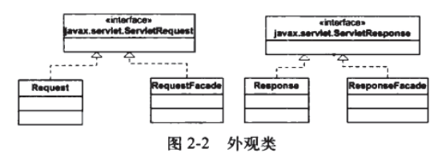

本章会通过两个应用程序示例展示简单的servlet容器

## javax.servlet.Servlet接口

该接口中定义了以下5个方法

```java
//servlet生命周期相关方法
public void init(ServletConfig config) throws ServletException
public void service(ServletRequest request, ServletResponse response) 
    throws ServletException, java.io.IOException
public void destroy()

public ServletConfig getServletConfig()

public java.lang.String getServletInfo()
```

- `init()`..程序员可以自定义初始化方法，一般情况下留空
- `service()`..第一个客户端请求到达时，servlet容器会调用相应的servlet的service方法，并把ServletRequest和ServletResponse作为参数传入。service()方法会被调用多次
- `destroy()`..servlet示例从服务中移除前会被调用，用于清理资源，如内存，句柄，线程等

## 应用程序1

一个功能齐全的servlet容器应该完成以下任务

- 当第一次调用servlet时，要载入servlet类，调用init方法（仅此一次）；

- 针对每个request请求，创建一个Request对象和一个Resposne对象；

- 调用相应的servlet的service方法，将Request对象和Response对象作为参数传入；

- 当关闭servlet时，调用destroy方法，并卸载该servlet类。

应用实例1不会完成上面所有任务，只会完成如下事情

-  等待HTTP请求；

- 创建Request和Response对象；

- 若请求的是一个静态资源，则调用StaticResourceProcessor对象的process方法，传入request和response对象；

- 若请求的是servlet，则载入相应的servlet类，调用service方法，传入request对象和response对象。


### HttpServer1类

既可以对静态资源请求，又能对servlet资源进行请求。

请求静态资源：

```
http://localhost:8080/staticResource
```

请求servlet资源：

```
http://localhost:8080/servlet/servletClass
```


```java
public class HttpServer1 {
	public static final String SHUTDOWN = "/shutdown";
	private boolean shutdown = false;

	public void await() {
		ServerSocket serverSocket = null;
		int port = 8080;
		try {
			serverSocket = new ServerSocket(port, 1, InetAddress.getByName("127.0.0.1"));
		} catch (IOException e) {
			e.printStackTrace();
			System.exit(1);
		}
		while (!shutdown) {
			Socket socket = null;
			InputStream inputStream = null;
			OutputStream outputStream = null;

			try {
				socket = serverSocket.accept();
				inputStream = socket.getInputStream();
				outputStream = socket.getOutputStream();

				Request request = new Request(inputStream);
				request.parse();
				Response response = new Response(outputStream);
				response.setRequest(request);

                //根据uri判断请求资源是静态还是servlet
				if (request.getUri().startsWith("/servlet/")) {
					ServletProcessor1 processor1 = new ServletProcessor1();
					processor1.process(request, response);
				} else {
					StaticResourceProcessor staticResourceProcessor = new StaticResourceProcessor();
					staticResourceProcessor.process(request, response);
				}

				shutdown = request.getUri().equals(SHUTDOWN);
			} catch (IOException e) {
				e.printStackTrace();
			} finally {
				try {
					inputStream.close();
					outputStream.close();
					socket.close();
				} catch (IOException e) {
					e.printStackTrace();
				}
			}
		}
	}

	public static void main(String[] args) {
		HttpServer1 httpServer1 = new HttpServer1();
		httpServer1.await();
	}
}
```

很多部分与第1章的应用程序相似。

### Request类

实现了`ServletRequest`接口，但处理方式和第1章的几乎完全相同。

```java
public class Request implements ServletRequest {
	private InputStream input;
	private String uri;

	public Request(InputStream input) {
		this.input = input;
	}

	public void parse() {
		StringBuilder request = new StringBuilder(2048);
		int i;
		byte[] buffer = new byte[2048];
		try {
			i = input.read(buffer);
		} catch (IOException e) {
			e.printStackTrace();
			i = -1;
		}

		for (int j = 0; j < i; j++) {
			request.append((char)buffer[j]);
		}
		System.out.print(request.toString());
		uri = parseUri(request.toString());
	}

	/**
	 * the request string is standard http format, like
	 * GET /index.html, then the second " " resource is requested.
	 * @param requestString
	 * @return
	 */
	public String parseUri(String requestString) {
		int index1, index2;
		index1 = requestString.indexOf(' ');
		if (index1 != -1) {
			index2 = requestString.indexOf(' ', index1 + 1);
			if (index2 > index1) {
				return requestString.substring(index1 + 1, index2);
			}
		}
		return null;
	}

	public String getUri() {
		return uri;
	}

	//..以下均为获取状态和参数等的getter的重载方法，均返回空值。代码省略
}
```

### Response类

这里直接保留了第1章发送静态资源的`sendStaticResource()`

```java
public class Response implements ServletResponse {
	private static final int BUFFER_SIZE = 1024;

	Request request;
	OutputStream outputStream;
	PrintWriter printWriter;

	public Response(OutputStream outputStream) {
		this.outputStream = outputStream;
	}

	public void setRequest(Request request) {
		this.request = request;
	}

	public void sendStaticResource() throws IOException {
		byte[] bytes = new byte[BUFFER_SIZE];
		FileInputStream fis = null;
		try {
			File file = new File(Constants.WEB_ROOT, request.getUri());
			if (file.exists()) {
                sendOKHeader();//写入状态码为200的响应报文头
				fis = new FileInputStream(file);
				int ch = fis.read(bytes, 0, BUFFER_SIZE);
				while (ch != -1) {
					outputStream.write(bytes, 0, ch);
					ch = fis.read(bytes, 0, BUFFER_SIZE);
				}
			} else {
				String errorMessage = "HTTP/1.1 404 File Not Found\r\n" + "Content-Type:text/html\r\n" + "Content-Length:23\r\n" + "\r\n" + "<h1>File Not Found</h1>";
				outputStream.write(errorMessage.getBytes());
			}
		} catch (Exception e) {
			System.out.println(e.toString());
		} finally {
			if (fis != null) {
				fis.close();
			}
		}
	}

	public void sendOKHeader() {
        String cacheHeader = "HTTP/1.1 200 OK\r\n\r\n";
        try {
            outputStream.write(cacheHeader.getBytes());
        } catch (IOException e) {
            e.printStackTrace();
        }
    }


	@Override
	public PrintWriter getWriter() throws IOException {
		printWriter = new PrintWriter(outputStream, true);//布尔值表示是否启用autoFlush
		return printWriter;
	}
	//..以下均为获取状态和参数等的getter的重载方法，均返回空值。代码省略
}
```

### StaticResourceProcessor类

直接调用response中定义的sendStaticResource()发送静态资源。

```java
public class StaticResourceProcessor {
	public void process(Request request, Response response) {
		try {
			response.sendStaticResource();
		} catch (IOException e) {
			e.printStackTrace();
		}
	}
}
```

### ServletProcessor1类

处理对servlet资源的HTTP请求

为了载入servlet类，需要创建一个类载入器，并且指明到哪里查找要载入的类。本节中会到Constant.WEB下找要载入的类,进行加载。加载完成后调用它的service()

```java
public class ServletProcessor1 {
	public void process(Request request, Response response) {
		String uri = request.getUri();//从request中取出uri：/servlet/servletName
		String servletName = uri.substring(uri.lastIndexOf("/") + 1);
		URLClassLoader loader = null;	//一个类载入器，用来载入servlet类

		try {
            //每个元素都指明了类载入器要到哪里查找类
			URL[] urls = new URL[1];
			URLStreamHandler streamHandler = null;
			//File classPath = new File(Constants.WEB_ROOT);
            final File classPath = new File(getClasspath());
            
			//查找servlet类的目录（仓库）
			String repository = (new URL("file", null, classPath.getCanonicalPath() + File.separator)).toString();
			urls[0] = new URL(null, repository, streamHandler);
            //构造servlet类载入器
			loader = new URLClassLoader(urls);
		} catch (IOException e) {
			e.printStackTrace();
		}

		Class<?> myClass = null;
		try {
			final String fullClassName = this.getClass().getPackage().getName() + "." + servletName;
			//载入servlet类
			myClass = loader.loadClass(fullClassName);
		} catch (ClassNotFoundException e) {
			e.printStackTrace();
		}

		Servlet servlet = null;
		try {
			servlet = (Servlet)myClass.newInstance();
            //调用servlet实例的service()
			servlet.service((ServletRequest)request, (ServletResponse)response);
		} catch (InstantiationException e) {
			e.printStackTrace();
		} catch (IllegalAccessException e) {
			e.printStackTrace();
		} catch (ServletException e) {
			e.printStackTrace();
		} catch (IOException e) {
			e.printStackTrace();
		}
	}

	private String getClasspath() {
		return this.getClass().getProtectionDomain().getCodeSource().getLocation().getPath();
	}
}
```

### 测试简单的servlet：PrimitiveServlet

编写一个简单的servlet

```java
public class PrimitiveServlet implements Servlet {
	@Override
	public void init(ServletConfig servletConfig) throws ServletException {
		System.out.println("primary servlet init!!!");
	}

	@Override
	public ServletConfig getServletConfig() {
		return null;
	}

	@Override
	public void service(ServletRequest servletRequest, ServletResponse servletResponse) throws ServletException, IOException {
		System.out.println("service method is invoked!!!");

		PrintWriter out = servletResponse.getWriter();
		out.println("Hello. Roses are red.");
		out.print("Violets are blue");
	}

	@Override
	public String getServletInfo() {
		return null;
	}

	@Override
	public void destroy() {
		System.out.println("primary servlet destroyed!");
	}
}
```

服务器启动后浏览器访问

```
http://localhost:8080/servlet/PrimitiveServlet
```

浏览器会输出

```
Hello. Roses are red.
```

## 应用程序2：对应用程序1的一些优化

程序1在调用目标servlet的service()时对request和Response进行了强转。

```java
try {
    servlet = (Servlet)myClass.newInstance();
    //调用servlet实例的service()
    servlet.service((ServletRequest)request, (ServletResponse)response);
}
```

本小节用外观模式来优化这一部分



简单说明一下就是，RequestFacade持有Request，调用servlet的service()时传递Facade类，而非request类。

```java
RequestFacade requestFacade = new RequestFacade(request);
ResponseFacade responseFacade = new ResponseFacade(response);
servlet.service((ServletRequest)requestFacade, (ServletResponse)responseFacade);
```

这么做的原因是Request，Response中包含sendStaticResource()等servlet无需去调用的方法，传递Facade类使servlet对这些方法不可见。

## 参考

http://sishuok.com/forum/blogPost/list/4067.html

https://blog.csdn.net/qq_33983617/article/details/81836539

源代码：https://github.com/serivires/how-tomcat-works/