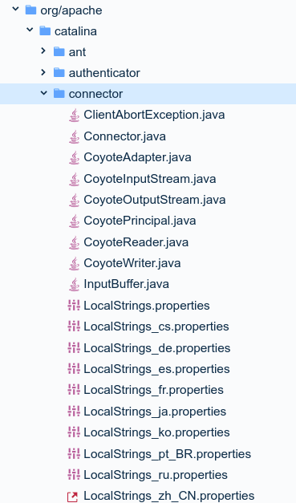
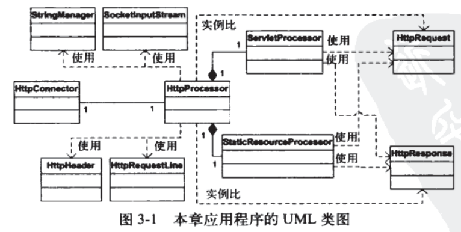

上一章中的HttpServer其实就是类似catalina中连接器。它把请求封装为request和response对象传递给servlet容器（ServletProcessor），servlet容器找到合适的servlet（PrimitiveServlet）,向他的`service()`方法传递request和response。

看示例之前，先了解一下catalina的StringManager类。

## StringManager类

指`org.apach.catalina.util.StringManager`,用来处理不同模块内错误信息的国际化操作。

- tomcat将错误信息写在一个properties文件中，每个包中都包含该包可能抛出的异常信息的多语言properties文件。

如下图是`org.apache.catalina.connector`包



- 每个properties文件都由一个单例的org.apache.catalina.util.StringManager实例来处理。

- 当包内的某个类要查找错误信息时，会先获取对应的StringManager实例。

- StringManager用键值对管理

  ```java
  private static Hashtable managers = new Hashtable();   
  public synchronized static StringManager   
      getManager(String packageName) {   
     StringManager mgr = (StringManager)managers.get(packageName);    if (mgr == null) {   
       mgr = new StringManager(packageName);   
       managers.put(packageName, mgr);   
     }   
     return mgr;   
  }  
  ------
  StringManager sm = StringManager.getManager("ex03.pyrmont.connector.http");  
  ```

- 调用StringManager的`getString(String key)`获取系统语言对应的异常字符串。

## 应用程序

本章的应用程序包括3个模块。

- 启动模块
  - BootStrap类，启动应用程序

- 连接器模块
  - 连接器及其支持类（HttpConnector和HttpProcessor）
  - 表示http请求的类（HttpRequest）及其支持类
  - 表示http响应的类（HttpResponse）及其支持类
  - 外观装饰类（HttpRequestFacade和HttpResponseFacade
  - 常量类
- 核心模块
  - ServletProcessor类
  - StaticResourceProcessor类



- 上章HttpServer负责等待http请求，并创建request和response对象。本章中，等待http请求的工作由HttpConnector完成，创建request和response对象的工作由HttpProcessor完成。
- 连接器需要解析HTTP报文中的头信息并填充HttpRequest

### 启动应用程序

BootStrap类负责启动

```java
public final class Bootstrap {
  public static void main(String[] args) {
    HttpConnector connector = new HttpConnector();
    connector.start();
  }
}
```

### HttpConnector类

其实就是把HttpServer的工作拆分成了两个部分而已

```java
public class HttpConnector implements Runnable {

  boolean stopped;
  private String scheme = "http";

  public String getScheme() {
    return scheme;
  }

  public void run() {
    ServerSocket serverSocket = null;
    int port = 8080;
    try {
      serverSocket =  new ServerSocket(port, 1, InetAddress.getByName("127.0.0.1"));
    }
    catch (IOException e) {
      e.printStackTrace();
      System.exit(1);
    }
    while (!stopped) {
      // Accept the next incoming connection from the server socket
      Socket socket = null;
      try {
        socket = serverSocket.accept();
      }
      catch (Exception e) {
        continue;
      }
      // 为每一个请求创建一个HttpProcessor实例
      HttpProcessor processor = new HttpProcessor(this);
      //调用它的process方法
      processor.process(socket);
    }
  }

  public void start() {
    Thread thread = new Thread(this);
    thread.start();
  }
}
```

下面是HttpProcessor的process()方法部分:

```java
public void process(Socket socket) {
    SocketInputStream input = null;
    OutputStream output = null;
    try {
        //获取套接字的输入流和输出流
        input = new SocketInputStream(socket.getInputStream(), 2048);
        output = socket.getOutputStream();

        //构建request和response
        // create HttpRequest object and parse
        request = new HttpRequest(input);

        // create HttpResponse object
        response = new HttpResponse(output);
        response.setRequest(request);

        response.setHeader("Server", "Pyrmont Servlet Container");
		
        //解析请求
        parseRequest(input, output);
        parseHeaders(input);
		
        //根据uri判断用哪个processor处理response和request
        if (request.getRequestURI().startsWith("/servlet/")) {
            ServletProcessor processor = new ServletProcessor();
            processor.process(request, response);
        }
        else {
            StaticResourceProcessor processor = new StaticResourceProcessor();
            processor.process(request, response);
        }

        // 关闭套接字
        socket.close();
        // no shutdown for this application
    }
    catch (Exception e) {
        e.printStackTrace();
    }
}

```

### 创建Httprequest对象

HttpRequest和它的外观类：


HttpRequest里面包括了许多填充报文请求参数的方法，如：addHeader(),addCookie()。它们会被HttpProcessor类的parseHeaders()调用。而真正使用时才会调用parseParameters()解析请求参数。

HttpProcessor创建HttpRequest对象的过程可以分为5个步骤：

#### 1.读取套接字的输入流

HttpProcessor中创建的的套接字的输入流input是**SocketInputStream**类型，它继承了InputStream，提供了readRequestLine(),readHeader()等用于读取报文的方法。

#### 2.解析请求行

HttpProcessor调用parseRequest()解析请求行，即http请求的第一行。如：

```
GET /myApp/ModernServlet?userName=tarzan&password=pwd HTTP/1.1
```

此时，uri是：

```
/myApp/ModernServlet
```

查询字符串是：

```
userName=tarzan&password=pwd
```

parseRequest()会对这一行进行解析，并把它填充到HttpRequest中，下面是parseRequest()：

```java
  private void parseRequest(SocketInputStream input, OutputStream output)
    throws IOException, ServletException {

    // 让input解析请求行部分，并放入HttpRequestLine实例
    input.readRequestLine(requestLine);
    //拿到请求行中的请求方法，URI和协议版本
    String method =
      new String(requestLine.method, 0, requestLine.methodEnd);
    String uri = null;
    String protocol = new String(requestLine.protocol, 0, requestLine.protocolEnd);
    if (method.length() < 1) {
      throw new ServletException("Missing HTTP request method");
    }
    else if (requestLine.uriEnd < 1) {
      throw new ServletException("Missing HTTP request URI");
    }
      
    // 是否有查询字符串，也就是parameter
    int question = requestLine.indexOf("?");
    if (question >= 0) {
        //保存查询字符串
      request.setQueryString(new String(requestLine.uri, question + 1,
        requestLine.uriEnd - question - 1));
      uri = new String(requestLine.uri, 0, question);
    }
    else {
      request.setQueryString(null);
      uri = new String(requestLine.uri, 0, requestLine.uriEnd);
    }


    // uri通常是相对路径，如果是绝对路径进行特殊处理。...没懂
    if (!uri.startsWith("/")) {
      int pos = uri.indexOf("://");
      // Parsing out protocol and host name
      if (pos != -1) {
        pos = uri.indexOf('/', pos + 3);
        if (pos == -1) {
          uri = "";
        }
        else {
          uri = uri.substring(pos);
        }
      }
    }

    // 如果包含jsessionid，需要把它填充到HttpRequest中
    String match = ";jsessionid=";
    int semicolon = uri.indexOf(match);
    if (semicolon >= 0) {
      String rest = uri.substring(semicolon + match.length());
      int semicolon2 = rest.indexOf(';');
      if (semicolon2 >= 0) {
        request.setRequestedSessionId(rest.substring(0, semicolon2));
        rest = rest.substring(semicolon2);
      }
      else {
        request.setRequestedSessionId(rest);
        rest = "";
      }
      request.setRequestedSessionURL(true);
      uri = uri.substring(0, semicolon) + rest;
    }
    else {
      request.setRequestedSessionId(null);
      request.setRequestedSessionURL(false);
    }

    // 对uri进行修正，如“\”替换成“/”
    String normalizedUri = normalize(uri);

    // 填充httpRequet
    ((HttpRequest) request).setMethod(method);
    request.setProtocol(protocol);
    if (normalizedUri != null) {
      ((HttpRequest) request).setRequestURI(normalizedUri);
    }
    else {
      ((HttpRequest) request).setRequestURI(uri);
    }

    if (normalizedUri == null) {
      throw new ServletException("Invalid URI: " + uri + "'");
    }
  }
```

#### 3.解析请求头

HttpProcessor调用parseRequest()解析请求头，它会从从input不断读取头信息直到读完。

```java
private void parseHeaders(SocketInputStream input)
    throws IOException, ServletException {
    while (true) {
        HttpHeader header = new HttpHeader();;

        // 从input不断读取头信息直到读完
        input.readHeader(header);
        //是否已经从流中读取了所有头信息
        if (header.nameEnd == 0) {
            if (header.valueEnd == 0) {
                return;
            }
            else {
                throw new ServletException
                    (sm.getString("httpProcessor.parseHeaders.colon"));
            }
        }

        //获取读取到的头信息的名称和值
        String name = new String(header.name, 0, header.nameEnd);
        String value = new String(header.value, 0, header.valueEnd);
        //填充到request对象的hashMap中
        request.addHeader(name, value);
        //为某些特定的头信息进行特殊的填充        
        if (name.equals("cookie")) {
            // cookies包含的是Cookie的集合。通过org.apache.catalina.util.RequestUtil类进行解析
            Cookie cookies[] = RequestUtil.parseCookieHeader(value);
            for (int i = 0; i < cookies.length; i++) {
                if (cookies[i].getName().equals("jsessionid")) {
                    // Override anything requested in the URL
                    if (!request.isRequestedSessionIdFromCookie()) {
                        // Accept only the first session id cookie
                        request.setRequestedSessionId(cookies[i].getValue());
                        request.setRequestedSessionCookie(true);
                        request.setRequestedSessionURL(false);
                    }
                }
                request.addCookie(cookies[i]);
            }
        }
        else if (name.equals("content-length")) {
            int n = -1;
            try {
                n = Integer.parseInt(value);
            }
            catch (Exception e) {
                throw new ServletException(sm.getString("httpProcessor.parseHeaders.contentLength"));
            }
            request.setContentLength(n);
        }
        else if (name.equals("content-type")) {
            request.setContentType(value);
        }
    } //end while
}

```

#### 4.解析cookie

cookie需要进行特殊的处理，Cookie请求头的例子，包含两个Cookie：

```
Cookie: userName=budi; password=pwd;  
```

Cookie的解析是通过org.apache.catalina.util.RequestUtil类的parseCookieHeader方法完成的

#### 5.获取参数

在HttpServletRequest的getParameter、getParameterMap、getParameterNames或getParameterValues方法首次被调用时户才会通过parseParameter()方法进行解析。

参数可能存在与url（查询字符串）中或请求体中。比如GET方法url就包含参数，而POST方法往往请求体中也会包含。总之我们需要把这些参数都放入一个特殊的HashMap，ParameterMap中。

下面是用于解析参数的parseParameter()方法，位于HttpRequest：

```java
  protected void parseParameters() {
    if (parsed)//已经解析过一次了
      return;
    ParameterMap results = parameters;//存放参数的map
    if (results == null)
      results = new ParameterMap();
    results.setLocked(false);//打开锁，使它可写
    String encoding = getCharacterEncoding();
    if (encoding == null)
      encoding = "ISO-8859-1";

    // 获取查询字符串
    String queryString = getQueryString();
    try {
       //通过org.apache.catalina.util.RequestUtil进行解析
      RequestUtil.parseParameters(results, queryString, encoding);
    }
    catch (UnsupportedEncodingException e) {
      ;
    }

    
    String contentType = getContentType();
    if (contentType == null)
      contentType = "";
    int semicolon = contentType.indexOf(';');
    if (semicolon >= 0) {
      contentType = contentType.substring(0, semicolon).trim();
    }
    else {
      contentType = contentType.trim();
    }
     // 解析请求报文本体的参数
     //当方法为POST并且content-length > 0 并且content-type是application/x-www-form-urlencoded的时候，报文本体会包含参数
    if ("POST".equals(getMethod()) && (getContentLength() > 0)
      && "application/x-www-form-urlencoded".equals(contentType)) {
      try {
        int max = getContentLength();
        int len = 0;
        byte buf[] = new byte[getContentLength()];
        ServletInputStream is = getInputStream();
        while (len < max) {
          int next = is.read(buf, len, max - len);
          if (next < 0 ) {
            break;
          }
          len += next;
        }
        is.close();
        if (len < max) {
          throw new RuntimeException("Content length mismatch");
        }
        //通要调用RequestUtil进行解析
        RequestUtil.parseParameters(results, buf, encoding);
      }
      catch (UnsupportedEncodingException ue) {
        ;
      }
      catch (IOException e) {
        throw new RuntimeException("Content read fail");
      }
    }

    // 锁定ParameterMap
    results.setLocked(true);
    parsed = true;
    parameters = results;
  }
```

### 创建HttpResponse对象


在servlet中，可以使用PrintWriter对象向输出流中写字符。可以使用任意编码格式，但在发送的时候，实际上都是字节流。

如何创建PrintWriter对象？传入一个outputStream实例创建，PrintWriter的print()和println()会被转化成字节流，输出到客户端

```java
// HttpResponse中定义的getWriter()
public PrintWriter getWriter() throws IOException {   
    //ResponseStream作为PrintWriter的输出对象
     ResponseStream newStream = new ResponseStream(this);   
     newStream.setCommit(false);   
    //OutputStreamWriter会把字符串换成字节数组
     OutputStreamWriter osr =   
       new OutputStreamWriter(newStream, getCharacterEncoding());   
     writer = new ResponseWriter(osr);   
     return writer;   
   }  
```


## 参考

http://sishuok.com/forum/blogPost/list/4076.html

源代码：https://github.com/serivires/how-tomcat-works/