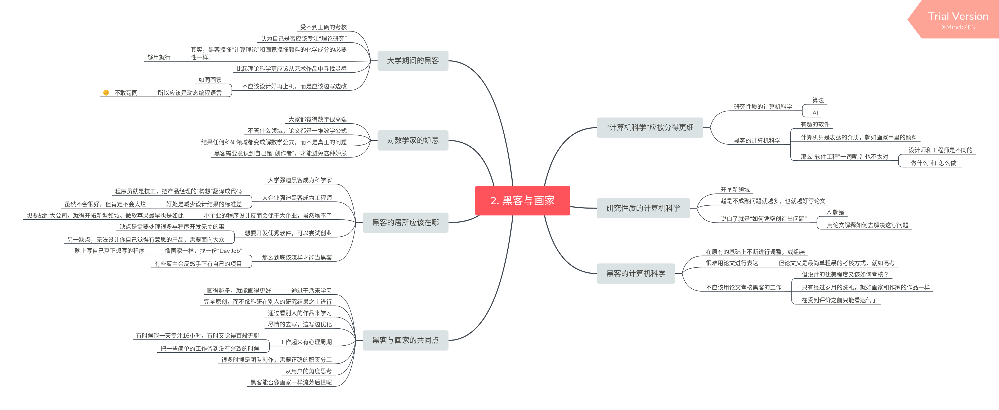
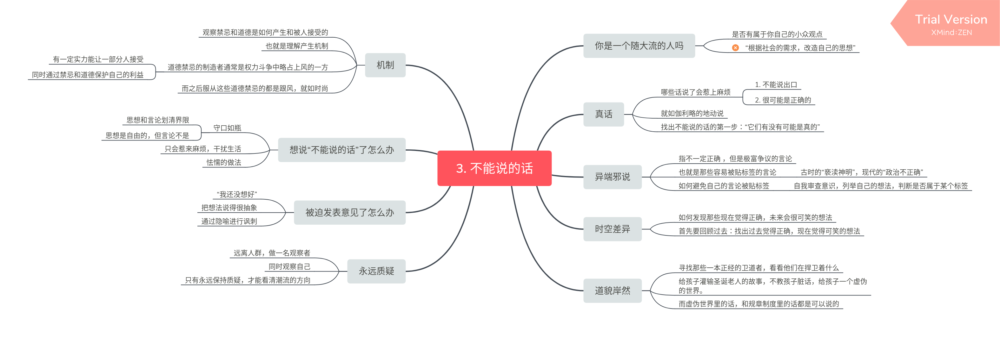
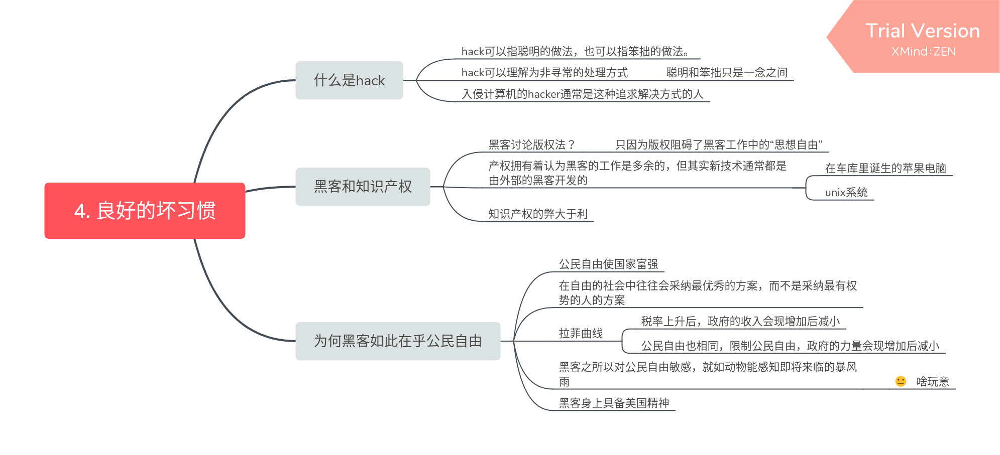

## 第二章

黑客（指热爱编程的人）如同画家，编写代码就如艺术创作。但又不同于画家，画家的工作就是进行创作，这一点所有人都很清楚，但黑客常常会被他人误解，甚至黑客自己有时也会误解自己的工作和定位。就如大学期间，由于黑客的领域并不像科研一样容易写论文，不容易受到评价。其实黑客完全不需要去在意这些，因为他们做的根本与学术论文无关，只是恰好和科研领域都被分到了“计算机科学”的分类里，黑客需要看清这一点。

如果黑客想进行创作工作只能用自己的空闲时间去做，因为对于企业而言代码并非创作，而是生产产品的手段。

## 第三章

只有永远保持质疑，才能看清潮流的方向

## 第四章

后面好扯，不敢苟同。

