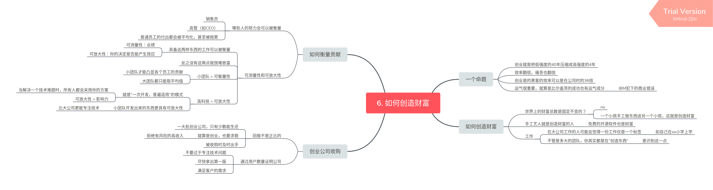

## 第二章

黑客（指热爱编程的人）如同画家，编写代码就如艺术创作。但又不同于画家，画家的工作就是进行创作，这一点所有人都很清楚，但黑客常常会被他人误解，甚至黑客自己有时也会误解自己的工作和定位。就如大学期间，由于黑客的领域并不像科研一样容易写论文，不容易受到评价。其实黑客完全不需要去在意这些，因为他们做的根本与学术论文无关，只是恰好和科研领域都被分到了“计算机科学”的分类里，黑客需要看清这一点。

如果黑客想进行创作工作只能用自己的空闲时间去做，因为对于企业而言代码并非创作，而是生产产品的手段。

## 第三章

只有永远保持质疑，才能看清潮流的方向

## 第四章

后面好扯，不敢苟同。

## 第五章

前半段讲web应用优于传统桌面应用的地方。可能当时web应用还比较少吧，加上我自己本来就是写web应用的，看起来有点废言。

后半段讲述IT创业公司的运营方式，其他公司对技术型创业公司的看法，还是比较有意思的。

## 第六章

聊创业。怎样能让自己的贡献被衡量，怎样才能创造财富。自己创业，或加入创业公司，只有小团队才能展示自己。

## 第七章

为什么大家总是对有钱人抱有偏见，贫富分化真的是不好的吗。技术加剧贫富分化，但技术又减小穷人和富人的差距。也许等贫富分化消失那天大多数人才会明白它的重要性。

